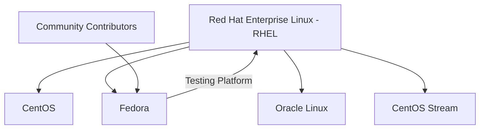
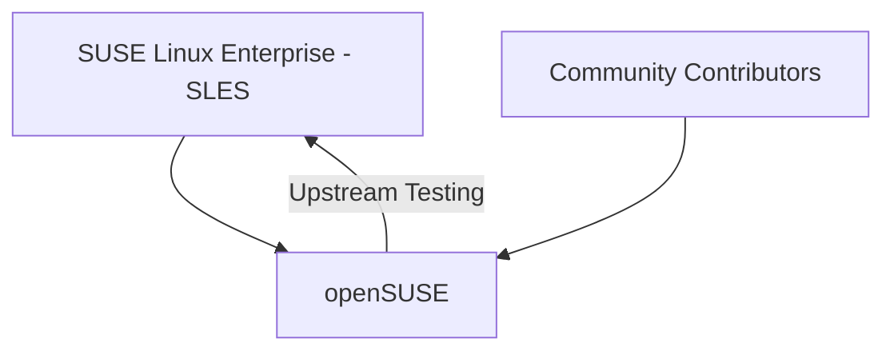
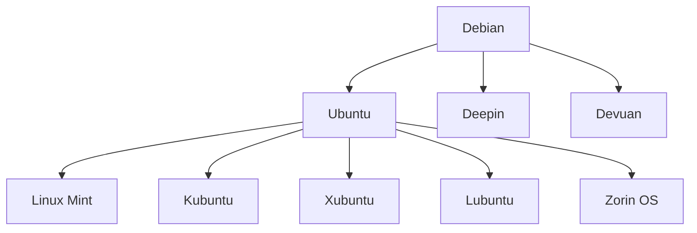

# Linux Distribution Families: A Complete Tutorial Guide

## Introduction

Welcome to this comprehensive tutorial on Linux distribution families! This guide will help you understand the major Linux distributions and their relationships, so you can choose the right one for your needs.

---

## What is a Linux Distribution?

A **Linux distribution** (often called "distro") is a complete operating system built around the Linux kernel. Think of it as a "flavor" of Linux that includes:

- The Linux kernel (the core)
- System software and utilities
- Application software
- A package manager (for installing software)
- A desktop environment (graphical interface)

### Why Are There So Many Distributions?

Linux is open-source, which means anyone can modify and distribute it. This freedom has led to hundreds of different distributions, each designed for specific purposes:

- **General use**: Ubuntu, Linux Mint
- **Enterprise servers**: Red Hat Enterprise Linux, SUSE Linux Enterprise
- **Security testing**: Kali Linux
- **Education**: Raspberry Pi OS
- **Minimalist systems**: Arch Linux

---

## The Three Major Linux Distribution Families

In this course, we focus on the **three major distribution families**:

| Family | Key Distributions | Package Manager |
|--------|------------------|-----------------|
| **Red Hat** | RHEL, CentOS, Fedora | YUM/DNF (RPM-based) |
| **SUSE** | SLES, openSUSE | Zypper (RPM-based) |
| **Debian** | Debian, Ubuntu, Linux Mint | APT (DPKG-based) |

---

## 1. The Red Hat Family

### Overview

The Red Hat family is one of the most popular Linux families, especially in enterprise environments. It's known for its stability, security, and commercial support.

### Family Tree



### Key Distributions in the Red Hat Family

#### **Red Hat Enterprise Linux (RHEL)**
- **Purpose**: Commercial enterprise server OS
- **Support**: Paid support from Red Hat
- **Stability**: Extremely stable, thoroughly tested
- **Use Cases**: Large corporations, government, financial institutions

#### **CentOS (Community ENTerprise Operating System)**
- **Purpose**: Free, community-supported clone of RHEL
- **Compatibility**: Virtually identical to RHEL
- **Support**: Community support only
- **Status**: CentOS 8 has no more updates; replaced by CentOS Stream

#### **CentOS Stream**
- **Purpose**: Rolling-release distribution that sits between Fedora and RHEL
- **Role**: Upstream development platform for future RHEL releases
- **Features**: More frequent updates than CentOS

#### **Fedora**
- **Purpose**: Community-driven, cutting-edge distribution
- **Relationship**: Serves as a testing platform for RHEL
- **Software**: Contains significantly more software than RHEL
- **Community**: Diverse contributors, many not affiliated with Red Hat

#### **Oracle Linux**
- **Purpose**: Free enterprise distribution from Oracle
- **Compatibility**: Mostly a copy of RHEL with some changes
- **Features**: Optimized for Oracle products

### Hardware Platform Support

The Red Hat family supports multiple hardware platforms:
- Intel x86
- ARM
- Itanium
- Power PC
- IBM System Z

### Package Management in Red Hat Family

Red Hat family distributions use **RPM-based package managers**:

| Package Manager | Description |
|----------------|-------------|
| **YUM** (Yellowdog Updater Modified) | Older package manager |
| **DNF** (Dandified YUM) | Modern replacement for YUM |
| **RPM** (Red Hat Package Manager) | Low-level package tool |

#### Basic DNF Commands

```bash
# Syntax: dnf [options] [command] [package]
# Install a package
sudo dnf install nginx

# Update all packages
sudo dnf update

# Remove a package
sudo dnf remove nginx

# Search for a package
dnf search webserver

# List installed packages
dnf list installed
```

---

## 2. The SUSE Family

### Overview

SUSE is another major Linux family, particularly popular in Europe and in the retail sector. It follows a similar model to Red Hat with both enterprise and community versions.

### Family Tree



### Key Distributions in the SUSE Family

#### **SUSE Linux Enterprise Server (SLES)**
- **Purpose**: Commercial enterprise server OS
- **Support**: Paid support from SUSE
- **Target**: Enterprise environments
- **Sectors**: Retail, banking, healthcare

#### **openSUSE**
- **Purpose**: Free, community-driven distribution
- **Relationship**: Upstream for SLES (similar to Fedora/RHEL relationship)
- **Features**: Extremely similar to SLES
- **Cost**: Free for end users

### Key Features of SUSE Family

- **YaST** (Yet Another Setup Tool): Comprehensive system administration tool
- **ZYpp** package management system
- Strong focus on system administration and configuration

### Package Management in SUSE Family

SUSE uses the **RPM-based Zypper** package manager.

#### Basic Zypper Commands

```bash
# Syntax: zypper [global-options] command [options] [arguments]
# Install a package
sudo zypper install nginx

# Update all packages
sudo zypper update

# Remove a package
sudo zypper remove nginx

# Search for a package
zypper search webserver

# List installed packages
zypper packages --installed-only
```

### YaST: SUSE's Administration Tool

YaST is a powerful system administration tool unique to the SUSE family. It provides:

- **System configuration**: Network, firewall, hardware
- **Package management**: Installing and updating software
- **User management**: Creating and managing users
- **Security settings**: Configuring security policies

**Key Benefits of YaST:**
- Graphical and command-line interface options
- Centralized management
- Time-saving automation

---

## 3. The Debian Family

### Overview

The Debian family is the largest and most diverse Linux family. It's known for its:

- **Stability**: Thorough testing before releases
- **Package repository**: Largest software repository of any Linux distribution
- **Open-source philosophy**: Entirely community-driven, no corporate ownership

### Family Tree



### Key Distributions in the Debian Family

#### **Debian**
- **Purpose**: Pure open-source community project
- **Ownership**: No corporation owns it
- **Focus**: Stability and free software
- **Repository**: Largest and most complete software repository
- **Use Cases**: Both servers and desktop computers

#### **Ubuntu**
- **Purpose**: Easy-to-use, user-friendly Linux distribution
- **Relationship**: Built on Debian's stable branch
- **Focus**: Balance between stability and ease of use
- **LTS (Long-Term Support)**: 5 years of support for enterprise users
- **Use Cases**: Desktop users, cloud deployments, servers

#### **Linux Mint**
- **Purpose**: Desktop-focused, user-friendly distribution
- **Relationship**: Built on Ubuntu
- **Focus**: Elegant desktop experience, ease of use
- **Features**: Comes with multimedia codecs pre-installed

### Package Management in Debian Family

Debian family uses **DPKG-based APT (Advanced Package Tool)** package manager.

#### Basic APT Commands

```bash
# Syntax: apt [options] command [package]
# Update package list
sudo apt update

# Upgrade all packages
sudo apt upgrade

# Install a package
sudo apt install nginx

# Remove a package
sudo apt remove nginx

# Search for a package
apt search webserver

# List installed packages
apt list --installed

# Show package information
apt show nginx
```

#### Understanding APT Commands

| Command | Description | Example |
|---------|-------------|---------|
| `apt update` | Refreshes package index | `sudo apt update` |
| `apt upgrade` | Upgrades installed packages | `sudo apt upgrade` |
| `apt install` | Installs new packages | `sudo apt install vim` |
| `apt remove` | Removes packages | `sudo apt remove vim` |
| `apt purge` | Removes packages and config files | `sudo apt purge vim` |
| `apt autoremove` | Removes unnecessary dependencies | `sudo apt autoremove` |

### Ubuntu LTS: The Reference Distribution

For this course, we use **Ubuntu LTS (Long-Term Support)** as our reference Debian family distribution because:

1. **Stability**: LTS versions receive 5 years of security updates
2. **Ease of use**: User-friendly interface and installation
3. **Large repository**: Access to Debian's vast software collection
4. **Community support**: Extensive documentation and active forums
5. **Cloud ready**: Widely used in cloud deployments

**Ubuntu LTS Versions (even-year releases in April):**
- 20.04 LTS (Focal Fossa) - Support until 2025
- 22.04 LTS (Jammy Jellyfish) - Support until 2027
- 24.04 LTS (Noble Numbat) - Support until 2029

---

## Comparison of Distribution Families

| Feature | Red Hat | SUSE | Debian |
|---------|---------|------|--------|
| **Package Format** | RPM | RPM | DEB |
| **Package Manager** | YUM/DNF | Zypper | APT |
| **Enterprise Version** | RHEL | SLES | Ubuntu Pro |
| **Community Version** | Fedora/CentOS | openSUSE | Debian/Ubuntu |
| **Primary Sectors** | Enterprise, Government | Retail, Enterprise | Cloud, Desktop, Server |
| **Corporate Owner** | Red Hat (IBM) | SUSE | Canonical (Ubuntu) |
| **Update Model** | Point releases | Point/rolling | Point releases |
| **Ease of Use** | Moderate | Moderate | High (Ubuntu) |

---

## How to Choose a Distribution

### For Beginners
✅ **Ubuntu** - Best documentation, largest community
✅ **Linux Mint** - Familiar interface, easy to use

### For Enterprise Environments
✅ **RHEL** - Commercial support, certified applications
✅ **SLES** - Commercial support, SAP integration
✅ **Ubuntu Pro** - Commercial support, enterprise features

### For Servers
✅ **Debian** - Rock-solid stability
✅ **Ubuntu Server** - Balance of features and ease
✅ **CentOS Stream** - Free enterprise-like environment

### For Developers
✅ **Fedora** - Latest software, good for development
✅ **Ubuntu** - Wide package availability, good tools
✅ **openSUSE Tumbleweed** - Rolling releases

---

## Practical Exercise: Installing a Package Across Families

Here's a comparison of how to install the Apache web server on each family:

### Red Hat Family (CentOS/Fedora)
```bash
# Install Apache
sudo dnf install httpd

# Start Apache
sudo systemctl start httpd

# Enable on boot
sudo systemctl enable httpd
```

### SUSE Family (openSUSE)
```bash
# Install Apache
sudo zypper install apache2

# Start Apache
sudo systemctl start apache2

# Enable on boot
sudo systemctl enable apache2
```

### Debian Family (Ubuntu)
```bash
# Install Apache
sudo apt update
sudo apt install apache2

# Start Apache
sudo systemctl start apache2

# Enable on boot
sudo systemctl enable apache2
```

---

## Key Takeaways

1. **Three Major Families**: Red Hat, SUSE, and Debian are the primary Linux distribution families

2. **Package Managers**: Each family has its own package management system:
   - Red Hat: DNF/YUM (RPM-based)
   - SUSE: Zypper (RPM-based)
   - Debian: APT (DEB-based)

3. **Enterprise vs Community**: Each family has both commercial and free community versions

4. **Upstream Relationships**:
   - Fedora → RHEL
   - openSUSE → SLES
   - Ubuntu → Linux Mint (and others)
   - Debian → Ubuntu (and many others)

5. **Use Cases**:
   - **RHEL**: Enterprise, government
   - **SLES**: Retail, SAP environments
   - **Debian**: Servers, stability-focused
   - **Ubuntu**: Desktops, cloud, general purpose

6. **Course Focus**: We'll work with representatives from all three families:
   - **Red Hat**: CentOS Stream
   - **SUSE**: openSUSE
   - **Debian**: Ubuntu LTS

---

## Additional Resources

### Official Documentation
- **Red Hat**: https://access.redhat.com/documentation
- **SUSE**: https://documentation.suse.com
- **Debian**: https://www.debian.org/doc
- **Ubuntu**: https://ubuntu.com/docs

### Community Forums
- **Red Hat**: https://www.reddit.com/r/redhat
- **SUSE**: https://forums.opensuse.org
- **Ubuntu**: https://ubuntuforums.org
- **Linux Mint**: https://forums.linuxmint.com

---

## Quick Reference Card

| Task | Red Hat (DNF) | SUSE (Zypper) | Debian (APT) |
|------|---------------|---------------|--------------|
| Update repo | `dnf check-update` | `zypper refresh` | `apt update` |
| Install pkg | `dnf install pkg` | `zypper install pkg` | `apt install pkg` |
| Remove pkg | `dnf remove pkg` | `zypper remove pkg` | `apt remove pkg` |
| Search pkg | `dnf search term` | `zypper search term` | `apt search term` |
| Upgrade all | `dnf upgrade` | `zypper update` | `apt upgrade` |
| List installed | `dnf list installed` | `zypper packages` | `apt list --installed` |

---

## Conclusion

Understanding Linux distribution families is essential for any Linux professional. Each family has its own philosophy, tools, and strengths. By familiarizing yourself with all three major families, you'll be prepared to work in any Linux environment, whether it's a corporate data center running RHEL, a retail system running SLES, or a development workstation running Ubuntu.

In this course, you'll gain hands-on experience with:
- **CentOS Stream** (Red Hat family)
- **openSUSE** (SUSE family)
- **Ubuntu LTS** (Debian family)

This practical experience will give you the flexibility to adapt to any Linux distribution you encounter in the real world.

---

**Next Steps**: Install at least one Linux distribution from each family to start exploring their differences and similarities firsthand!