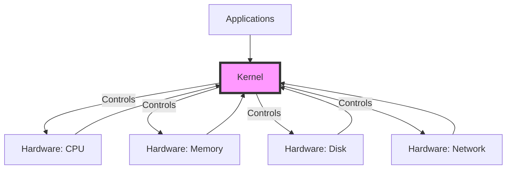
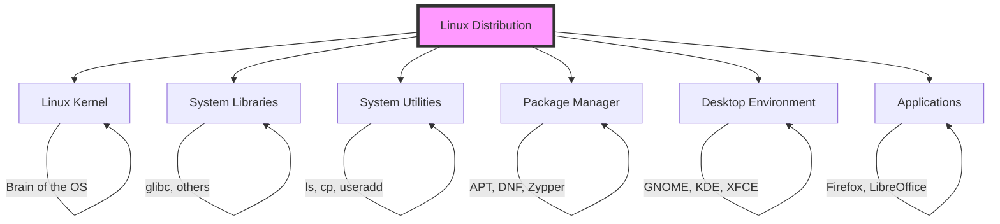

# Linux Philosophy and Concepts: A Complete Tutorial Guide

## Introduction

Welcome to this comprehensive tutorial on Linux philosophy and core concepts! This guide will help you understand the fundamental building blocks of Linux systems and the terminology used throughout the Linux community.

Before diving into Linux, it's important to understand that **Linux is best learned by doing**. Throughout this tutorial, we encourage you to try out the commands and concepts on your own Linux system.

---

## Preparing Your Linux Environment

### How to Get Linux

Before you start learning Linux, you need access to a Linux system. There are several ways to get Linux:

| Method | Description | Best For |
|--------|-------------|----------|
| **Native Installation** | Linux installed directly on your hardware | Full performance, daily use |
| **Dual Boot** | Linux alongside another OS (like Windows) | Using both systems regularly |
| **Virtual Machine** | Linux running inside another OS | Testing, learning, safe environment |
| **Live USB/CD** | Linux running from removable media | Testing without installing |
| **Cloud Instance** | Linux in the cloud (AWS, Azure, etc.) | Remote access, server learning |

### Recommended Setup for This Course

For this course, we recommend:
1. A Linux system you can use throughout the course
2. Either a native installation or a virtual machine
3. Administrative (root) access when needed

---

## Essential Linux Terminology

Let's start with the most important terms you'll encounter in the Linux world. Understanding these is crucial for following any Linux discussion.

### 1. The Kernel

**What is the Kernel?**

The kernel is the **brain** of the Linux operating system. It is the core component that:

- Controls all hardware (CPU, memory, disk drives, network cards)
- Manages system resources
- Handles communication between hardware and software
- Schedules processes and manages memory



**Key Facts About the Linux Kernel:**
- Developed by Linus Torvalds and thousands of contributors
- Available at **kernel.org** (all versions, past and present)
- Open-source (anyone can view, modify, and distribute)
- Different distributions may use different kernel versions

**Kernel Version Example:**
- RHEL 8 uses kernel 4.18 (stable, not the newest)
- Other distributions may use more recent kernels
- Even older kernels can include recent improvements (backported)

### 2. Distribution (Distro)

**What is a Distribution?**

A **distribution** (or "distro") is a complete operating system that combines:

- The **Linux kernel**
- **System utilities** (file management, user management)
- **Software package management** tools
- **Applications** (web browser, office suite, etc.)
- **Desktop environment** (graphical interface)

**Common Distributions:**

| Distribution | Family | Best For |
|--------------|--------|----------|
| Red Hat Enterprise Linux (RHEL) | Red Hat | Enterprise, commercial support |
| Fedora | Red Hat | Developers, latest software |
| CentOS Stream | Red Hat | Free enterprise-like environment |
| Ubuntu | Debian | Beginners, desktop, cloud |
| Debian | Debian | Stability, servers |
| openSUSE | SUSE | Enterprise and desktop |
| Gentoo | Independent | Advanced users, customization |

### 3. Boot Loader

**What is a Boot Loader?**

A **boot loader** is a program that starts (boots) the operating system when you turn on your computer. It's the first software that runs.

**Popular Boot Loaders:**
- **GRUB** (GRand Unified Bootloader) - Most common
- **ISOLINUX** - Used for booting from CD/DVD

**How Boot Loaders Work:**
1. Computer starts (BIOS/UEFI runs)
2. Boot loader loads from disk
3. Boot loader presents boot options
4. User selects an OS
5. Boot loader loads the kernel
6. Kernel takes over

### 4. Services (Daemons)

**What is a Service?**

A **service** (also called a **daemon**) is a program that runs in the background, performing tasks without direct user interaction.

**Common Services:**

| Service Name | Purpose |
|--------------|---------|
| **httpd** | Web server (Apache) |
| **nfsd** | Network File System |
| **ntpd** | Network Time Protocol |
| **ftpd** | FTP server |
| **named** | DNS server |
| **sshd** | Secure Shell server |

**Example: Checking Service Status**
```bash
# Check if Apache web server is running
systemctl status httpd

# Start a service
sudo systemctl start httpd

# Enable service to start at boot
sudo systemctl enable httpd
```

### 5. File Systems

**What is a File System?**

A **file system** is a method for storing, organizing, and managing files on a storage device. It determines how data is stored and retrieved.

**Common Linux File Systems:**

| File System | Features | Best For |
|-------------|----------|----------|
| **ext4** | Journaling, stable, fast | General purpose (default for many distros) |
| **ext3** | Journaling, older | Legacy systems |
| **XFS** | High performance, large files | Enterprise, large storage |
| **Btrfs** | Advanced features, snapshots | Modern systems, advanced users |
| **FAT** | Compatibility | USB drives, Windows sharing |

**Key File System Concepts:**
- **Journaling**: Tracks changes before writing (prevents corruption)
- **Mounting**: Attaching a file system to the directory tree
- **Inodes**: Data structures storing file metadata (not file names)

**Check File System Usage:**
```bash
# Check disk space usage
df -h

# Check file system type
df -T

# Check disk usage by directory
du -sh /home
```

### 6. X Window System (X11)

**What is the X Window System?**

The X Window System (often called "X11" or just "X") provides the **standard toolkit and protocol** for building graphical user interfaces on Linux.

**Key Points:**
- Provides the foundation for all graphical Linux desktops
- Handles display, keyboard, and mouse input
- Works on nearly all Linux systems
- Client-server architecture (applications can run remotely)

### 7. Desktop Environment

**What is a Desktop Environment?**

A **desktop environment** is the complete graphical user interface that sits on top of the X Window System. It provides:

- Windows management
- Icons and panels
- File manager
- Application launchers
- Settings and preferences

**Popular Desktop Environments:**

| Desktop Environment | Features | Best For |
|---------------------|----------|----------|
| **GNOME** | Modern, clean interface | General users |
| **KDE** | Feature-rich, customizable | Power users |
| **XFCE** | Lightweight, fast | Older hardware |
| **Fluxbox** | Minimal, efficient | Very old hardware |
| **Cinnamon** | Traditional, comfortable | Linux Mint users |

**How They Fit Together:**
```
Applications (Firefox, LibreOffice, etc.)
        ↓
Desktop Environment (GNOME, KDE, etc.)
        ↓
X Window System (X11)
        ↓
Linux Kernel
        ↓
Hardware
```

### 8. Command Line and Shell

**What is the Command Line?**

The **command line** (or "terminal") is a text-based interface for interacting with the operating system by typing commands.

**What is the Shell?**

The **shell** is the command-line interpreter that:
- Reads and interprets your commands
- Instructs the operating system to perform tasks
- Provides scripting capabilities

**Popular Shells:**

| Shell | Features | Default For |
|-------|----------|-------------|
| **bash** (Bourne Again SHell) | Most common, feature-rich | Most distributions |
| **tcsh** | C-shell variant | Some older systems |
| **zsh** (Z Shell) | Advanced features, customization | Popular with power users |
| **fish** | User-friendly, auto-suggestions | Beginners |

**Basic Shell Commands:**
```bash
# Show current shell
echo $SHELL

# Change shell (example)
chsh -s /bin/zsh

# Basic command structure
command [options] [arguments]

# Example: list files with details
ls -la /home
```

---

## Linux Philosophy: Key Principles

### 1. Files as Objects

Linux treats **everything as a file**:
- Regular files (documents, images)
- Directories (folders)
- Devices (hardware)
- Processes (running programs)
- Network connections

This philosophy makes Linux very consistent and powerful.

### 2. Multitasking

Linux is a **multitasking** operating system, meaning:
- Multiple programs can run simultaneously
- The CPU time is shared between processes
- Background tasks run smoothly

### 3. Multi-User

Linux is a **multi-user** system:
- Multiple users can use the system simultaneously
- Each user has their own files and settings
- Users have different permission levels
- The system keeps users isolated and secure

### 4. Built-in Networking

Linux has **built-in networking capabilities**:
- TCP/IP stack included
- Supports all major networking protocols
- Can serve as router, firewall, server

### 5. Daemons (Background Services)

Linux runs many **background services (daemons)**:
- Handle system tasks automatically
- Run without user intervention
- Start at boot time

---

## Essential Linux Tools

Distributions include several essential tools:

### Compilers
- **GCC** (GNU Compiler Collection): C and C++ compiler
- **G++**: C++ compiler

### Debuggers
- **GDB** (GNU Debugger): For debugging programs

### System Libraries
- **glibc**: Core system libraries
- Applications need these libraries to run

### Graphics Tools
- Low-level graphics interfaces (X11)
- High-level desktop environments (GNOME, KDE, etc.)

### Package Management Systems

| Distribution Family | Package Manager | Package Format |
|--------------------|-----------------|----------------|
| Red Hat | DNF/YUM | RPM (.rpm) |
| SUSE | Zypper | RPM (.rpm) |
| Debian | APT | DEB (.deb) |

---

## Using Documentation: The Man Pages

One of the most important resources in Linux is the **man pages** (manual pages). They contain documentation for almost every command, utility, and configuration file.

### How to Use Man Pages

```bash
# Syntax: man [section] topic
# Example: Get help on the ls command
man ls

# Example: Get help on the passwd command
man passwd

# Search for a topic
man -k keyword

# Example: Search for networking commands
man -k network
```

**Why Man Pages Are Important:**
- Already on your system (no internet needed)
- Complete and accurate documentation
- Covers commands, system calls, file formats
- The primary source of Linux knowledge

**Man Page Sections:**

| Section | Content |
|---------|---------|
| 1 | User commands |
| 2 | System calls |
| 3 | Library functions |
| 4 | Device files |
| 5 | File formats |
| 6 | Games |
| 7 | Miscellaneous |
| 8 | System administration |

---

## Common Linux Shorthand: "Foo"

The Linux community often uses the placeholder **"foo"** to represent:

- A file name
- A program name
- Any variable content that the user must choose

**Examples in Documentation:**
- `cp foo bar` → Copy file "foo" to file "bar"
- `rm foo` → Remove file "foo"
- `service foo start` → Start service "foo"

**Note:** You should replace "foo" with the actual name of your file or program.

---

## How Distributions Differ

### Kernel Version

Different distributions use different kernel versions:
- RHEL 8: Kernel 4.18 (stable, enterprise-tested)
- Fedora: Latest kernel (cutting-edge)
- Ubuntu: Balanced, tested kernels

**Important:** Even older kernels may include recent improvements through "backporting."

### Default Software

Different distributions include different default applications:
- Package managers
- Desktop environments
- System administration tools

### Support Models

| Distribution | Support Type | Cost |
|--------------|--------------|------|
| RHEL | Commercial, long-term | Paid |
| Ubuntu | Commercial/Community | Free/Paid |
| SLES | Commercial | Paid |
| CentOS Stream | Community | Free |
| Debian | Community | Free |
| Fedora | Community | Free |

### Binary Compatibility

Some distributions are **binary compatible**:
- CentOS is binary compatible with RHEL
- Software packages often work across compatible distributions

---

## Common Distribution Use Cases

### Enterprise Organizations
**Preferred Distributions:**
- Red Hat Enterprise Linux (RHEL)
- SUSE Linux Enterprise (SLES)
- Ubuntu Pro

**Why:**
- Commercial support
- Hardware and software certification
- Long-term stability
- Security updates

### Educational and Development
**Preferred Distributions:**
- Ubuntu
- Fedora
- CentOS Stream

**Why:**
- Free to use
- Good documentation
- Active communities
- Wide software availability

### Scientific Research
**Preferred Distributions:**
- Scientific Linux
- Ubuntu
- Debian

**Why:**
- Compatible with scientific software
- Mathematical packages available
- Community support

---

## Key Concepts Summary

### Components of a Linux Distribution



### Core Linux Concepts

| Term | Description |
|------|-------------|
| **Kernel** | Core of the OS, controls hardware |
| **Distribution** | Complete OS with kernel + software |
| **Boot Loader** | Starts the OS (GRUB, ISOLINUX) |
| **Service/Daemon** | Background process (httpd, sshd) |
| **File System** | Data organization method (ext4, XFS) |
| **X Window System** | GUI foundation (X11) |
| **Desktop Environment** | Complete GUI (GNOME, KDE) |
| **Shell** | Command interpreter (bash, zsh) |

---

## Practical Exercises

### Exercise 1: Check Your Linux System

```bash
# Check kernel version
uname -r

# Check distribution information
cat /etc/os-release

# Check system resources
free -h
df -h
```

### Exercise 2: Explore Man Pages

```bash
# View man page for the ls command
man ls

# Search for man pages about networking
man -k network

# View the intro page for Linux
man intro
```

### Exercise 3: Check Running Services

```bash
# List all running services
systemctl list-units --type=service

# Check status of a specific service
systemctl status sshd
```

### Exercise 4: Explore the File System

```bash
# View disk usage with file system types
df -Th

# Explore the root directory
ls -la /

# Check the current directory
pwd
```

---

## Additional Resources

### Official Documentation
- **Kernel.org**: https://www.kernel.org
- **The Linux Documentation Project**: https://www.tldp.org
- **Distribution-specific docs**: Ubuntu, RHEL, Debian documentation

### Learning Resources
- **Linux Journey**: https://linuxjourney.com
- **Linux Foundation Training**: https://training.linuxfoundation.org

### Community Help
- **Stack Overflow**: Linux tag
- **Reddit**: r/linux, r/linux4noobs
- **Distribution forums**: Ubuntu Forums, Fedora Forum

---

## Final Thoughts

Understanding Linux philosophy and core concepts is essential for:
1. Effective system administration
2. Troubleshooting problems
3. Choosing the right distribution
4. Understanding documentation
5. Working in Linux environments

**Remember:**
- Linux is learned by doing
- The man pages are your friend
- Everything is a file
- Services run in the background
- Different distributions serve different purposes

---

## Quick Reference Card

| Concept | Key Point | Example |
|---------|-----------|---------|
| Kernel | Core of the OS | Linux 4.18 |
| Distribution | Complete OS | Ubuntu, RHEL |
| Boot Loader | Starts the OS | GRUB |
| Service | Background process | httpd |
| File System | Data storage method | ext4, XFS |
| X Window | GUI foundation | X11 |
| Desktop | Complete GUI | GNOME |
| Shell | Command interpreter | bash |

**The most important lesson: Start using Linux and you'll learn it quickly!**