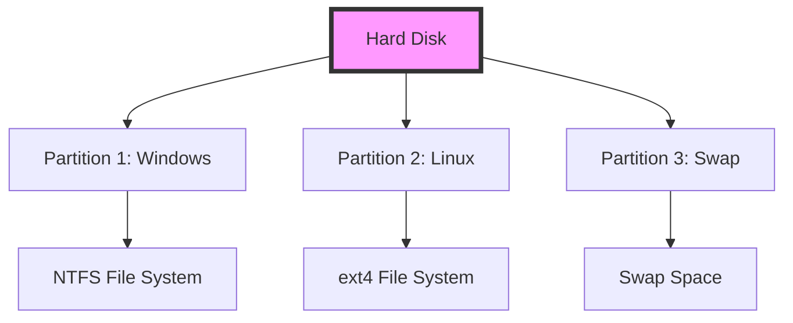
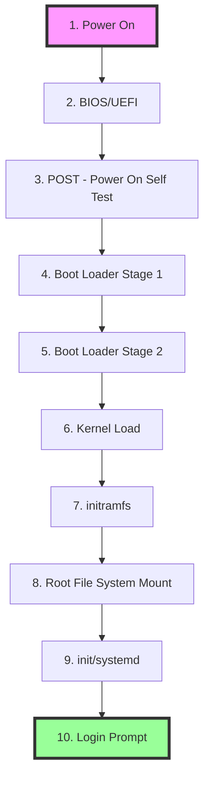

# Linux Basics and System Startup: A Complete Tutorial Guide

## Introduction

Welcome to this comprehensive tutorial on Linux basics and system startup! This guide will help you understand:

- What file systems are and how they work
- The difference between partitions and file systems
- The complete Linux boot process
- How to install Linux on your computer

Understanding these concepts is essential for any Linux user or administrator. While the boot process can be technical, having this knowledge will help you troubleshoot problems and optimize your system.

---

## Part 1: Understanding File Systems and Partitions

### What is a File System?

Think of a file system like the **shelves in a refrigerator**:

- Different shelves organize food by type, size, and purpose
- The file system organizes data by type, size, and purpose
- It provides a way to store, find, and organize files on a hard disk

A **file system** is a method for storing and organizing arbitrary collections of data in a human-usable form.

### Types of File Systems Supported by Linux

| Type | Examples | Purpose |
|------|----------|---------|
| **Conventional Disk File Systems** | ext4, XFS, FAT | Standard hard drives |
| **Flash Storage File Systems** | JFFS2, UBIFS | USB drives, SSDs |
| **Database File Systems** | ReiserFS, Btrfs | Large databases |
| **Special Purpose File Systems** | proc, sysfs | Virtual system information |

### Common Linux File Systems

| File System | Features | Best For |
|-------------|----------|----------|
| **ext4** | Journaling, stable, fast | General purpose (default) |
| **XFS** | High performance, large files | Enterprise, large storage |
| **Btrfs** | Advanced features, snapshots | Modern systems |
| **FAT** | Compatibility with Windows | USB drives |
| **ext3** | Older journaling system | Legacy systems |

### What is a Partition?

A **partition** is a physically contiguous section of a disk (or what appears to be one).

**Think of it like this:**
- A partition is a **container** (like a room in a house)
- A file system is the **organization method** (like furniture arrangement)
- The file system resides inside the partition

**Key Points:**
- One partition typically contains one file system
- A file system can span more than one partition (using advanced techniques)
- Partitions help organize and separate data

### Partition vs File System: Comparison



### Why Use Multiple Partitions?

| Benefit | Explanation |
|---------|-------------|
| **Data Protection** | If one partition fails, others survive |
| **Organization** | Separate system files from user data |
| **Performance** | Different partitions can use different file systems |
| **Security** | Can mount partitions with different permissions |
| **Multi-boot** | Multiple operating systems on one disk |

### Linux vs Windows File System Layout

| Feature | Linux | Windows |
|---------|-------|---------|
| **Path Separator** | Forward slash (/) | Backslash (\) |
| **Drive Letters** | None (everything under root) | Yes (C:, D:, etc.) |
| **Case Sensitivity** | Yes (BOOT ≠ boot) | No (BOOT = boot) |
| **Root Directory** | / | C:\ |
| **Removable Media** | Mounted at /media/ or /run/media/ | Assigned drive letters |

---

## Part 2: The Linux File System Hierarchy Standard (FHS)

Linux systems store files according to a **standard layout** called the **File System Hierarchy Standard (FHS)**.

This standard ensures that users and administrators can move between distributions without having to relearn the system organization.

### Major Directories in Linux

```mermaid
graph TD
    A[/ Root Directory] --> B[/bin - Essential user commands]
    A --> C[/boot - Boot loader files]
    A --> D[/dev - Device files]
    A --> E[/etc - System configuration]
    A --> F[/home - User home directories]
    A --> G[/lib - Shared libraries]
    A --> H[/media - Removable media mount points]
    A --> I[/mnt - Temporary mount points]
    A --> J[/opt - Optional add-on software]
    A --> K[/proc - Process information]
    A --> L[/root - Root user home]
    A --> M[/run - Runtime data]
    A --> N[/sbin - System administration commands]
    A --> O[/srv - Service data]
    A --> P[/sys - System information]
    A --> Q[/tmp - Temporary files]
    A --> R[/usr - User utilities and applications]
    A --> S[/var - Variable data]
```

### Directory Descriptions

| Directory | Purpose | Content |
|-----------|---------|---------|
| **/** | Root directory | Top of the file system hierarchy |
| **/bin** | Essential user commands | ls, cp, mv, etc. |
| **/boot** | Boot loader files | Kernel images, GRUB files |
| **/dev** | Device files | Hardware device interfaces |
| **/etc** | System configuration | Configuration files |
| **/home** | User directories | Personal files for users |
| **/lib** | Shared libraries | System and application libraries |
| **/media** | Removable media | Mount points for USB, CD/DVD |
| **/mnt** | Temporary mounts | Manual mount points |
| **/opt** | Optional software | Third-party applications |
| **/proc** | Process info | Running process information |
| **/root** | Root home | Home directory for root user |
| **/run** | Runtime data | Temporary runtime files |
| **/sbin** | System admin | Administrative commands |
| **/srv** | Service data | Data for system services |
| **/sys** | System info | Kernel and device information |
| **/tmp** | Temporary files | Temporary storage |
| **/usr** | User utilities | Applications and libraries |
| **/var** | Variable data | Logs, spools, temporary files |

### Understanding Mount Points

**Mounting** is the process of making a file system available at a specific directory.

**Example:**
- A USB drive is plugged in
- Linux automatically mounts it at `/run/media/username/`
- The entire USB content becomes accessible under that directory

**Path Example:**
```
/run/media/student/FEDORA/readme.txt
```
- `/run/media/` - Mount point directory
- `student/` - User's home
- `FEDORA/` - USB drive label
- `readme.txt` - File on the USB

### The /usr Directory

Many distributions distinguish between:
- **Core utilities** (needed for system operation)
- **Other programs** (placed under `/usr/` or `/usr/local/`)

**/usr contains:**
- `/usr/bin/` - Most user commands
- `/usr/lib/` - Libraries
- `/usr/local/` - Locally installed software
- `/usr/share/` - Shared data (documentation, icons)

---

## Part 3: The Linux Boot Process

### Overview of the Boot Process

The boot process is the procedure for initializing the system. It includes everything that happens from when the computer is first switched on until the user interface is fully operational.

**Understanding the boot process helps with:**
- Troubleshooting startup problems
- Tailoring computer performance
- Understanding system initialization

### Step-by-Step Boot Process



### Detailed Boot Process Steps

#### Step 1: BIOS/UEFI Initialization

When the computer is powered on:

1. **BIOS** (Basic Input/Output System) or **UEFI** (Unified Extensible Firmware Interface) starts
2. Initializes hardware (screen, keyboard, memory)
3. Performs **POST** (Power On Self Test)
4. BIOS is stored on a ROM chip on the motherboard
5. Loads date/time and peripheral information from CMOS

**BIOS vs UEFI:**

| Feature | BIOS (Legacy) | UEFI (Modern) |
|---------|---------------|---------------|
| **Storage** | 512 bytes (MBR) | Larger, more flexible |
| **Partition** | MBR (Master Boot Record) | GPT (GUID Partition Table) |
| **Boot Device** | First sector of disk | EFI System Partition |
| **Limitations** | 2TB disk limit | No practical limit |
| **Security** | Minimal | Secure Boot support |

#### Step 2: Boot Loader

The boot loader is stored on the hard disk:
- **BIOS/MBR systems**: First sector of hard disk (512 bytes)
- **UEFI systems**: EFI System Partition

**Popular Boot Loaders:**

| Boot Loader | Purpose |
|-------------|---------|
| **GRUB** (GRand Unified Bootloader) | Most common, supports multiple OS |
| **ISOLINUX** | Booting from removable media |
| **U-Boot** | Embedded systems and appliances |

**Two Stages of Boot Loader (BIOS/MBR):**

```
Stage 1 (MBR - 512 bytes)
    ↓
Finds bootable partition
    ↓
Stage 2 (GRUB - /boot/grub)
    ↓
Displays boot menu
    ↓
Loads kernel
```

**Boot Loader Functions:**
1. Presents a user interface for choosing OS
2. Loads the kernel image into memory
3. Loads the initial RAM disk (initramfs)

#### Step 3: Kernel Loading

Once the boot loader finds the kernel:

1. **Kernel is loaded into RAM**
2. **Kernel uncompresses itself** (kernels are compressed)
3. **Kernel checks system hardware**
4. **Kernel initializes hardware device drivers**
5. **Kernel loads built-in drivers**
6. **Kernel configures memory and CPU**

**What the Kernel Initializes:**
- All processors
- I/O subsystems
- Storage devices
- Network interfaces
- Other hardware

#### Step 4: initramfs (Initial RAM File System)

**What is initramfs?**
- A temporary, memory-based file system
- Contains programs and binaries needed to mount the real root file system
- Provides kernel functionality for needed file systems
- Contains device drivers for mass storage controllers

**Why initramfs is Needed:**
- The root file system may be on a disk that needs special drivers
- The kernel needs these drivers to access the disk
- initramfs provides these drivers temporarily

**The udev Facility:**
- **udev** (user device) figures out which devices are present
- Locates device drivers they need
- Loads the appropriate drivers

#### Step 5: Root File System Mount

1. **Root file system is found** (searched for)
2. **File system is checked** for errors
3. **File system is mounted**
   - The mount program makes the file system ready for use
   - Associates it with a point in the file system hierarchy
4. **initramfs is cleared** from RAM
5. **init program** from root file system is executed

#### Step 6: init/systemd Starts

**Traditional System V init:**
- Sequential process
- Passes through run levels
- Individual services start/stop at each run level
- Older method (1980s Unix)

**Modern systemd:**
- Aggressive parallelization
- Faster startup
- Replaces shell scripts with configuration files
- Adopted by all major distributions

**Traditional Run Levels vs systemd Targets:**

| System V Run Level | systemd Target | Purpose |
|-------------------|----------------|---------|
| 0 | poweroff.target | Shut down |
| 1 | rescue.target | Single-user mode |
| 3 | multi-user.target | Multi-user, no GUI |
| 5 | graphical.target | Multi-user with GUI |
| 6 | reboot.target | Reboot |

**Systemd Commands:**
```bash
# Check current default target
systemctl get-default

# Change default target
sudo systemctl set-default graphical.target

# Check service status
systemctl status httpd

# Start service
sudo systemctl start httpd

# Enable service at boot
sudo systemctl enable httpd
```

#### Step 7: Login Prompt

The final steps:
1. **Text mode login prompts** appear
   - Username and password required
   - Command shell is provided
2. **Graphical login interface** (if configured)
   - GUI greeter screen
   - Desktop environment starts

**Default Shell:**
- Most Linux systems use **bash** (Bourne Again SHell)
- Other advanced shells available (zsh, fish)

**Shell Interaction:**
```
[user@host ~]$ ls -la
total 48
drwx------. 7 user user 4096 Jan 15 10:00 .
drwxr-xr-x. 3 root root 4096 Jan 15 09:00 ..
-rw-r--r--. 1 user user 220 Jan 15 10:00 .bash_logout
[user@host ~]$ 
```
- `$` - Regular user prompt
- `#` - Root user prompt
- User types command, presses Enter
- Command executes, new prompt appears

### Boot Process Flow Summary

```
Power On
    ↓
BIOS/UEFI Initializes Hardware
    ↓
POST (Power On Self Test)
    ↓
Boot Loader (GRUB)
    ↓
Kernel Loaded into RAM
    ↓
Kernel Initializes Hardware
    ↓
initramfs Loaded
    ↓
Root File System Mounted
    ↓
init/systemd Starts
    ↓
Services and Processes Start
    ↓
Login Prompt Displayed
    ↓
User Logs In
    ↓
Shell or Desktop Starts
```

---

## Part 4: Choosing and Installing Linux

### Factors to Consider When Choosing a Distribution

Before deciding on a distribution, consider these questions:

| Consideration | Questions to Ask |
|---------------|------------------|
| **Function** | What is the main purpose of the system? |
| **Packages** | What software is needed? (web server, word processing) |
| **Disk Space** | How much is required? How much is available? |
| **Update Frequency** | How often are packages updated? |
| **Support Cycle** | How long is the release supported? (LTS vs regular) |
| **Kernel Customization** | Do you need vendor or third-party kernels? |
| **Hardware** | What architecture? (x86, ARM, PPC) |
| **Stability** | Need long-term stability or cutting-edge features? |

### Common Installation Methods

| Method | Description | Safety Level |
|--------|-------------|--------------|
| **Clean Install** | Erases everything, installs Linux | Replaces all data |
| **Dual Boot** | Linux alongside other OS | More complex, requires partitioning |
| **Virtual Machine** | Linux inside another OS | Very safe, can't damage host |
| **Live USB/CD** | Runs from removable media | No changes to hard disk |

### Installation Types

**Standalone (Pure Linux):**
- Linux is the only operating system
- Uses entire hard disk
- Simplest installation
- Best for dedicated Linux systems

**Dual Boot:**
- Multiple operating systems
- Partition disk between systems
- Choose OS at boot time
- Requires careful planning

**Virtual Machine:**
- Linux runs inside another OS
- Uses a hypervisor (VMware, VirtualBox)
- Very safe for learning
- Easy to create snapshots

### Automatic Installation Options

| Distribution | Automation File | Description |
|--------------|-----------------|-------------|
| **Red Hat/CentOS** | Kickstart | Red Hat's automated installation |
| **SUSE/openSUSE** | AutoYAST | SUSE's automated installation |
| **Debian/Ubuntu** | Preseed | Debian's automated installation |

---

## Part 5: Installation Demonstrations

### Installing Ubuntu (Easy Path)

**Key Features of Ubuntu Installation:**
- Very user-friendly
- Minimal choices needed
- Intelligent defaults
- Works well in virtual machines

**Installation Steps:**

1. **Start the installer**
   - Boot from Ubuntu installation media

2. **Virtual Machine Setup** (if using VM)
   - Allocate disk space
   - Set memory size (recommended: 4GB)
   - Set processor count

3. **Installation Process**
   - Ubuntu makes most decisions automatically
   - Username and password are requested
   - No complex partitioning choices

4. **After Installation**
   - System reboots automatically
   - Login screen appears
   - Desktop environment loads

**Ubuntu Installation Quick View:**
```bash
# After installation, check file system
df -Th
```
Output shows:
- Main partition: ext4 file system
- 30GB total space
- ~5.3GB used
- Swap file (not partition) created

### Installing CentOS (More Choices)

**Key Features of CentOS Installation:**
- More configuration choices
- Manual partitioning available
- Root and user accounts separate
- More flexible installation

**Installation Steps:**

1. **Language Selection**
   - Choose language and keyboard layout

2. **Network Configuration**
   - Enable network interface
   - DHCP automatic configuration
   - Enable Network Time Protocol

3. **Software Selection**
   - Choose installation type:
     - Workstation (with GUI)
     - Server (no GUI)
     - Minimal (bare minimum)

4. **Partitioning**
   - Choose automatic or custom
   - Custom option allows:
     - Separate partitions
     - File system selection
     - Mount point specification

5. **User Setup**
   - Root password
   - Regular user account

**CentOS Partitioning Example:**
```bash
# Partition layout:
# / (root): 29GB, ext4 file system
# swap: 3GB
```

### Installing openSUSE (Mid-Level Complexity)

**Key Features of openSUSE Installation:**
- Good balance of choices
- Partition-based proposal
- Desktop environment selection
- Separate root and user passwords

**Installation Steps:**

1. **Language Selection**
   - Choose language

2. **Partitioning**
   - Edit proposed settings
   - Choose ext4 for root partition
   - Simple layout: root + swap

3. **Time Zone**
   - Set region and city
   - Enable automatic time setting

4. **Desktop Selection**
   - GNOME (most common)
   - KDE (feature-rich)
   - Text mode (no GUI)
   - Custom (advanced)

5. **User Setup**
   - Full name
   - Username
   - Password
   - Root password

---

## Part 6: Installation Best Practices

### Partition Layout Strategies

**Simple Layout (Default):**
```
/ (root): All remaining space
swap: Memory size (or 2-4GB)
```

**Recommended Layout:**
```
/ (root): 20-30GB
/home: Rest of disk
swap: Memory size
```

**Advanced Layout:**
```
/ (root): 20-30GB
/boot: 1GB
/home: Rest of disk
/var: 10-20GB
/tmp: 5GB
swap: Memory size
```

### Security Considerations During Installation

| Security Feature | Description | Distribution |
|------------------|-------------|--------------|
| **SE Linux** | Security framework (enforcing) | Red Hat/CentOS/Fedora |
| **AppArmor** | Security framework | Ubuntu/SUSE |
| **Root Password** | Required for administrative access | All |
| **User Account** | Standard non-privileged user | All |

### Post-Installation Tasks

1. **Update System**
   ```bash
   # Ubuntu/Debian
   sudo apt update
   sudo apt upgrade
   
   # Red Hat/CentOS
   sudo dnf update
   
   # openSUSE
   sudo zypper update
   ```

2. **Install Additional Software**
   - Use package manager
   - Install needed applications

3. **Configure System**
   - Desktop preferences
   - Network settings
   - Security settings

4. **Create Backup**
   - Important files
   - Configuration files

---

## Key Concepts Summary

### Boot Process Keywords

| Term | Description |
|------|-------------|
| **BIOS** | Basic Input/Output System |
| **POST** | Power On Self Test |
| **MBR** | Master Boot Record (512 bytes) |
| **UEFI** | Unified Extensible Firmware Interface |
| **GRUB** | GRand Unified Bootloader |
| **Kernel** | Core of the operating system |
| **initramfs** | Initial RAM file system |
| **init** | First process to run |
| **systemd** | Modern init system |
| **Service** | Background process (daemon) |

### File System Keywords

| Term | Description |
|------|-------------|
| **Partition** | Logical section of a disk |
| **File System** | Method of storing files |
| **Mount** | Making a file system available |
| **Mount Point** | Directory where file system is attached |
| **Root Directory** | Top of file system hierarchy (/) |
| **FHS** | Filesystem Hierarchy Standard |

---

## Practice Exercises

### Exercise 1: Explore Your File System

```bash
# View disk partitions and file systems
df -Th

# List all partitions
sudo fdisk -l

# Explore root directory
ls -la /

# Check mounted file systems
mount
```

### Exercise 2: Check Your Boot Process

```bash
# View boot messages
dmesg | less

# Check kernel version
uname -r

# View current systemd target
systemctl get-default

# Check boot time
systemd-analyze
```

### Exercise 3: Explore Important Directories

```bash
# Check /etc contents
ls -la /etc

# Check /usr/bin contents
ls -la /usr/bin | head -20

# View temporary files
ls -la /tmp

# Check variable data
ls -la /var/log
```

### Exercise 4: Check Init System

```bash
# Check if using systemd
ps -p 1

# List services
systemctl list-units --type=service

# Check service status
systemctl status sshd
```

---

## Troubleshooting Common Boot Issues

### Problem: System Won't Boot

| Issue | Possible Cause | Solution |
|-------|---------------|----------|
| No boot device found | BIOS settings incorrect | Check boot order |
| Kernel panic | Driver issue, memory problem | Boot with older kernel |
| Filesystem errors | Improper shutdown, disk issues | Run fsck from recovery mode |
| GRUB menu missing | Boot loader corrupted | Use rescue disk to reinstall GRUB |
| Service won't start | Configuration error | Check logs, fix config |

### Recovery Methods

**Method 1: Rescue Mode**
- Boot from installation media
- Select "Rescue" or "Troubleshooting"
- Repair the system

**Method 2: Single User Mode**
- Add `single` or `1` to kernel boot line
- Boot into single-user mode
- Fix the issue

**Method 3: GRUB Recovery**
```
# At grub prompt
ls                    # List available drives
set root=(hd0,msdos1) # Set root partition
linux /vmlinuz root=/dev/sda1
initrd /initramfs.img
boot
```

---

## Quick Reference Card

### Boot Process Summary
```
1. Power On
2. BIOS/UEFI → POST
3. Boot Loader (GRUB) → Stage 1, Stage 2
4. Kernel Load → Uncompress, Initialize Hardware
5. initramfs → Load Drivers
6. Mount Root File System
7. init/systemd → Start Services
8. Login Prompt → User Logs In
```

### Common Commands
| Command | Purpose |
|---------|---------|
| `df -Th` | View file systems and disk usage |
| `mount` | List mounted file systems |
| `systemctl` | Manage services |
| `dmesg` | View kernel messages |
| `uname -r` | Check kernel version |

---

## Final Thoughts

Understanding Linux basics and the boot process is essential for:
- Installing Linux successfully
- Troubleshooting boot problems
- Understanding how the system works
- Making informed choices about distributions
- Managing partitions and file systems

**Remember:**
- Plan your installation before starting
- Back up important data first
- The boot process follows a logical sequence
- Different distributions may vary slightly
- Practice makes perfect!

---

## Additional Resources

- **GRUB Documentation**: https://www.gnu.org/software/grub/
- **Linux Filesystem Hierarchy**: https://www.pathname.com/fhs/
- **Distribution Installation Guides**:
  - Ubuntu: https://ubuntu.com/tutorials
  - CentOS: https://docs.centos.org
  - openSUSE: https://doc.opensuse.org