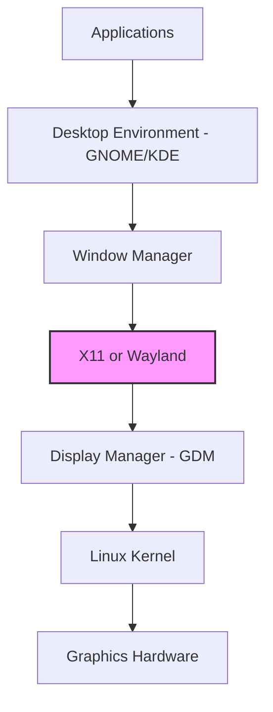
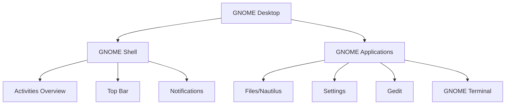

# Linux Graphical Interface: A Complete Tutorial Guide

## Introduction

Welcome to this comprehensive tutorial on the Linux graphical interface! This guide will teach you how to:

- Manage graphical interface sessions
- Perform basic operations using the GUI
- Customize your graphical desktop
- Navigate between CLI and GUI effectively

While the command line is powerful, the graphical interface makes Linux accessible to all users. Today's Linux desktops are modern, user-friendly, and comparable to other operating systems.

---

## Part 1: GUI vs CLI - When to Use Each

### Command Line Interface (CLI)

**Advantages:**
- More efficient for repetitive tasks
- Better for automation (scripts)
- Works the same on all distributions
- More control over system operations
- Less resource intensive

**Challenges:**
- Must remember commands and syntax
- Steeper learning curve
- Less intuitive for beginners

### Graphical User Interface (GUI)

**Advantages:**
- Quick and easy for most tasks
- Visually intuitive
- No need to remember commands
- Great for browsing and media consumption

**Challenges:**
- Can be resource heavy
- Tasks that require memorization of menu paths
- May vary between distributions
- Automation is more difficult

### Best of Both Worlds

Most Linux users use **both** interfaces:
- **GUI**: Web browsing, document editing, file management
- **CLI**: System administration, scripting, troubleshooting

---

## Part 2: The Linux Graphics Stack

### Understanding X Window System (X11)

The **X Window System** (often called "X11" or just "X") is the foundation of graphical interfaces on Linux.

**What X Provides:**
- Toolkit and protocol for building GUIs
- Handles display, keyboard, and mouse input
- Client-server architecture

**History:**
- Dates back to the mid-1980s
- Shows some deficiencies on modern systems (security, etc.)
- Has been stretched beyond its original purpose

### The New Way: Wayland

**Wayland** is gradually superseding X11:

| Feature | X11 | Wayland |
|---------|-----|---------|
| **Age** | Mid-1980s (old) | Modern (new) |
| **Architecture** | Client-server | Direct composition |
| **Security** | Known issues | Better security |
| **Performance** | Good | Better |
| **Compatibility** | Universal | Growing |
| **Default In** | Older distributions | Fedora, RHEL 8+ |

**Important:** To the user, Wayland looks just like X11. The differences are "under the hood."

### The Graphics Stack Flow



### Key Components

#### 1. Display Manager
- Keeps track of displays
- Loads the X server
- Handles graphical logins
- Starts the desktop environment

**Common Display Managers:**
- **GDM** (GNOME Display Manager) - For GNOME
- **SDDM** - For KDE
- **LightDM** - Lightweight alternative

#### 2. Desktop Environment
- Session manager (starts and maintains components)
- Window manager (controls placement of windows)
- Utilities and applications
- Provides seamless user experience

#### 3. X Server (or Wayland Compositor)
- Provides graphical services to applications
- Applications are called "X clients"
- Handles drawing on the screen

---

## Part 3: Desktop Environments

### GNOME - The Most Popular

**GNOME** (GNU Network Object Model Environment) is the default desktop for most major distributions.

**Distributions using GNOME:**
- Red Hat Enterprise Linux
- Fedora
- CentOS
- SUSE Linux Enterprise
- Ubuntu (default in recent versions)
- Debian

**Key Features:**
- Menu-based navigation
- Easy transition for Windows users
- Clean, modern interface
- Extensible with extensions

**GNOME Components:**


### KDE Plasma - The Powerful Alternative

**KDE Plasma** is another major desktop environment:
- Often used with SUSE/openSUSE
- Feature-rich
- Highly customizable
- Windows-like interface available

### Other Desktop Environments

| Desktop | Characteristics | Best For |
|---------|----------------|----------|
| **GNOME** | Clean, modern, default | Most users |
| **KDE Plasma** | Feature-rich, customizable | Power users |
| **XFCE** | Lightweight, fast | Older hardware |
| **Cinnamon** | Traditional layout | Linux Mint users |
| **MATE** | GNOME 2 classic | Legacy users |

---

## Part 4: Login and Logout

### The Login Process

When a system with a graphical interface boots:

1. Display Manager starts (GDM, SDDM, etc.)
2. Login screen appears
3. User selects their account
4. User enters password
5. Desktop environment starts

### Demonstration: Logging In

**Step-by-step:**

1. **Power on the system** - Boot process completes
2. **Login screen appears** - Shows available users
3. **Select a user** - Click on your username
4. **Enter password** - Type your password
5. **Choose desktop** (optional) - Click gear icon for options
6. **Press Enter** - Desktop environment loads

**Desktop Selection Options:**
- **GNOME** (default)
- **GNOME Classic** (traditional layout)
- **GNOME on Xorg** (use X11 instead of Wayland)
- **Other installed environments**

### Switching Users

Linux is a **multi-user** system:
- Multiple users can be logged in simultaneously
- Users can take turns using the machine
- Sessions remain active when switching

**Switch User vs Log Out:**

| Action | Effect | When to Use |
|--------|--------|-------------|
| **Switch User** | Locks current session, keeps apps running | Temporary breaks |
| **Log Out** | Closes all applications, ends session | Finished using system |

### Logging Out

**Steps:**
1. Click your name in the upper-right corner
2. Select "Log Out"
3. Confirm the action
4. Return to login screen

**Important:** Logging out kills all processes in your current X session.

---

## Part 5: Customizing Your Desktop

### Changing Desktop Background (Wallpaper)

**Steps to change wallpaper:**

1. Right-click on the desktop
2. Select "Change Background"
3. Choose from available wallpapers
4. Or click "Add Picture" for custom image
5. Select the image
6. Click "Select"

**Customization Options:**
- **Wallpapers**: Default system wallpapers
- **Custom Images**: Your own pictures
- **Solid Colors**: No image, just color
- **Slideshow**: Rotating wallpapers

### Changing Desktop Theme

The **theme** defines:
- Application appearance
- Window decorations
- Button styles
- Scroll bars and widgets

**GNOME Themes:**
- **Adwaita** (default)
- Various dark/light variants
- Custom themes (third-party)

### Using GNOME Tweaks

**What is GNOME Tweaks?**
A utility that exposes advanced settings not available in the default Settings app.

**Why GNOME Tweaks is Needed:**
- Default Settings app is limited
- Many useful options hidden
- Quest for simplicity = hidden power features

**Available in GNOME Tweaks:**

| Setting Category | Examples |
|------------------|----------|
| **Appearance** | Themes, icons, cursor |
| **Extensions** | GNOME Shell extensions |
| **Fonts** | Font selection, scaling |
| **Keyboard & Mouse** | Key mapping, click behavior |
| **Startup Applications** | Auto-start programs |
| **Top Bar** | Clock format, date |
| **Windows** | Window behavior, title bar actions |

**Launching GNOME Tweaks:**
- Press **Alt+F2**
- Type `gnome-tweaks`
- Press Enter

**Example Key Remapping:**
- Remap **Caps Lock** to **Control**
- Saves users (especially Emacs users) from "pinky strain"

### Installing GNOME Extensions

**Extensions** add new features to GNOME:

1. Open GNOME Tweaks
2. Click "Extensions" tab
3. Browse available extensions
4. Install from extensions.gnome.org

**Popular Extensions:**
- **Dash to Dock** - Customizable dock
- **GSConnect** - Android integration
- **System Monitor** - CPU/memory in top bar
- **Weather** - Weather forecast

---

## Part 6: Locking and Suspending

### Locking Your Screen

**Why Lock Your Screen?**
- Prevents unauthorized access
- Keeps your sessions running
- Quick to resume

**Locking Methods:**

| Method | How To |
|--------|--------|
| **Menu** | Click name → Lock |
| **Keyboard** | Super+L or Super+Esc |
| **Inactivity** | Automatic after set time |

**What Happens When Locked:**
- Screen dims or shows lock screen
- Applications continue running
- System is still active
- Password required to unlock

### Suspending (Sleep Mode)

**What is Suspend?**
- Saves system state to RAM
- Turns off most hardware
- Uses very little power
- Resumes quickly

**Suspend vs Shutdown:**

| Feature | Suspend | Shutdown |
|---------|---------|----------|
| **Power Usage** | Very low | Off |
| **Resume Time** | Seconds | 30+ seconds |
| **State** | Preserved | Fresh start |
| **When to Use** | Short breaks | Finished for the day |

**Note:** Modern Linux distributions boot so fast that suspend may save only minor time.

---

## Part 7: File Management with Nautilus

### What is Nautilus?

**Nautilus** (also called "Files") is the default file manager for GNOME.

**Features:**
- Navigate file system
- Open files and applications
- Manage files and directories
- Access network locations

### Opening Nautilus

**Ways to Open:**
1. Click the Files icon (file cabinet)
2. Click Activities → Files
3. Press **Super+E** (on some distributions)

**Default View:**
- Opens your home directory
- Left panel has shortcuts:
  - Home
  - Desktop
  - Documents
  - Downloads
  - Music
  - Pictures
  - Videos
  - Trash

### Home Directory Structure

Every user has a home directory: `/home/username`

**Default Directories Created:**
```
/home/student/
├── Desktop/
├── Documents/
├── Downloads/
├── Music/
├── Pictures/
├── Public/
├── Templates/
├── Videos/
└── .config/      (hidden)
```

### Viewing Files and Directories

**View Options:**

| View | Shortcut | Description |
|------|----------|-------------|
| **Icons** | Ctrl+1 | Large icons with names |
| **List** | Ctrl+2 | Detailed list with columns |
| **Compact** | - | Smaller icons, compact |

**Sorting Options:**
- By Name
- By Size
- By Type
- By Modification Date

**To Show Hidden Files:**
- **Ctrl+H** - Toggle hidden files
- Or View → Show Hidden Files

**Hidden files:**
- Start with a dot (`.bashrc`, `.config`)
- Configuration files
- Not shown by default

### Creating Files and Directories

**Create New Folder:**
1. Right-click in empty space
2. Select "New Folder"
3. Enter name
4. Press Enter

**Create New Document:**
1. Right-click in empty space
2. Select "New Document"
3. Choose file type
4. Enter name

### Opening Files

**Ways to Open:**
- **Double-click** - Opens with default application
- **Right-click** → "Open With" - Choose application
- **Drag and drop** - Open in an application

### File Operations

**Common Operations:**

| Operation | Method |
|-----------|--------|
| **Copy** | Ctrl+C, then Ctrl+V |
| **Cut** | Ctrl+X, then Ctrl+V |
| **Move** | Drag and drop |
| **Rename** | Right-click → Rename, or F2 |
| **Delete** | Right-click → Move to Trash, or Delete key |

### The Trash (Recycle Bin)

- Deleted files move to Trash
- Located at `~/.local/share/Trash/`
- Not immediately deleted
- Can be restored if needed

**Empty Trash:**
- Right-click Trash in left panel
- Select "Empty Trash"

**Permanent Delete:**
- Select file → **Shift+Delete**
- Skips Trash entirely

### Searching for Files

**How to Search:**
1. Click the search icon (magnifying glass)
2. Type search term
3. Results appear automatically

**Refine Search:**
- Filter by **Type** (Documents, Images, etc.)
- Filter by **Modified Date**
- Filter by **File Size**

**Search Scope:**
- Searches from current directory
- Recursively searches subdirectories
- Searches file names (not content by default)

---

## Part 8: Launching Applications

### Where to Find Applications

**In GNOME:**
- **Activities** (top-left corner)
- **Applications menu** (grid icon)
- **Dash** (favorites on left)

**In Different Environments:**

| Desktop | Application Launcher |
|---------|---------------------|
| **GNOME** | Activities → Show Applications |
| **KDE** | Start menu (bottom-left) |
| **XFCE** | Application menu (top-left) |
| **Cinnamon** | Menu (bottom-left) |

### Launching an Application

**Method 1 - Activities Overview:**
1. Click "Activities" in top-left
2. Type application name
3. Click the application icon

**Method 2 - Applications Menu:**
1. Click the grid icon (show applications)
2. Browse or search categories
3. Click the application

**Method 3 - Keyboard Shortcut:**
- Press **Super** (Windows key)
- Start typing application name
- Press Enter to launch

### Default Applications

**Common Default Applications:**

| Task | Default Application |
|------|---------------------|
| **Web Browser** | Firefox |
| **File Manager** | Nautilus (Files) |
| **Text Editor** | Gedit (GNOME) |
| **Email** | Evolution |
| **Image Viewer** | GNOME Image Viewer |
| **Video Player** | Totem (Videos) |
| **Music Player** | Rhythmbox |
| **Office Suite** | LibreOffice |

### Available Applications

**Linux comes with many applications:**

| Category | Examples |
|----------|----------|
| **Internet** | Firefox, Chromium, Thunderbird |
| **Office** | LibreOffice (Writer, Calc, Impress) |
| **Graphics** | GIMP, Inkscape, Shotwell |
| **Media** | VLC, Rhythmbox, Audacity |
| **Development** | Gedit, Vim, Emacs, IDE |
| **Utilities** | Calculator, Screenshot, Disks |
| **System** | Terminal, System Monitor, Settings |

### Installing More Applications

**Using Software Center (GUI):**
1. Open Software Center
2. Browse categories
3. Click "Install" on desired app

**Using Package Manager (GUI):**
- **Ubuntu**: Ubuntu Software Center
- **Fedora**: GNOME Software
- **openSUSE**: YaST Software Management

---

## Part 9: Setting Default Applications

### Why Set Default Applications?

When you click a file, the system needs to know:
- Which application to use for each file type
- Your preferred browser, email client, etc.

### How to Set Default Applications

**Method 1 - Settings Menu:**

1. Click your name in upper-right
2. Click Settings (gear icon)
3. Scroll to bottom
4. Click "Details" or "Default Applications"
5. Choose apps for each category

**Available Categories:**
- **Web** - Browser choice
- **Mail** - Email client
- **Calendar** - Calendar app
- **Music** - Music player
- **Video** - Video player
- **Photos** - Image viewer

**Example:** Changing default browser
```
Settings → Details → Default Applications
Web: Choose Firefox, Chrome, or Opera
```

**Method 2 - File Properties:**
1. Right-click a file
2. Select "Properties"
3. Go to "Open With" tab
4. Choose application
5. Click "Set as default"

### Changing File Association

**Specific file type:**
1. Right-click .html file
2. Properties → Open With
3. Choose browser
4. Set as default

---

## Part 10: System Shutdown and Restart

### Shutting Down from GUI

**Steps:**
1. Click your name or power icon in upper-right
2. Select "Power Off" or "Shutdown"
3. Confirm the action
4. System powers off

### Restarting the System

**Steps:**
1. Click power icon
2. Select "Restart"
3. Confirm

### When is a Restart Required?

| Situation | Need Restart? |
|-----------|---------------|
| **Normal usage** | No |
| **Kernel update** | Yes |
| **System updates** | Often yes |
| **Application install** | Usually no |
| **Configuration changes** | Service restart only |

**Note:** Some major system updates (especially kernel updates) require a restart.

### Shutdown Confirmation

- Shutdown, reboot, and logout ask for confirmation
- **60-second timer** - system will shut down automatically
- Applications may lose unsaved data
- **Always save your work** before shutdown!

### Power Off Options

**Available Options:**
1. **Power Off** - Complete shutdown
2. **Restart** - Shutdown and restart
3. **Cancel** - Abort shutdown

---

## Part 11: Distribution Similarities

### The Evolution of Linux Desktops

Modern Linux distributions using GNOME look remarkably similar:

**What's the same across distributions:**
- Login screens (GDM)
- Activities overview
- Top panel layout
- Settings interface
- File manager (Nautilus)
- Application launching method

**What's different:**
- Default wallpaper
- Icon theme
- Some applications
- Left sidebar (Ubuntu style)

### Demonstration: Booting Different Distributions

**Booting multiple distributions:**
1. **CentOS Stream** - Boots to GDM login
2. **Ubuntu** - GDM with Ubuntu theme
3. **openSUSE** - GDM with openSUSE theme

All three arrive at similar-looking desktops:
- Activities in top-left
- Clock in top-center
- System menu in top-right
- Applications grid available

### The GNOME Experience

**Common GNOME Elements:**
```
┌─────────────────────────────────────────────────┐
│ Activities | [Clock] | [Volume] [Net] [User]    │ ← Top Bar
├─────────────────────────────────────────────────┤
│                                                 │
│   [Favorites] [Applications]                    │ ← Dash
│                                                 │
│   [Window 1]     [Window 2]                    │ ← Workspace
│                                                 │
│   [Workspace Switcher]                          │
└─────────────────────────────────────────────────┘
```

---

## Quick Reference: GNOME Keyboard Shortcuts

| Shortcut | Action |
|----------|--------|
| **Super** | Open Activities |
| **Super + A** | Show Applications |
| **Super + L** | Lock Screen |
| **Super + D** | Show Desktop |
| **Super + Tab** | Switch Windows |
| **Super + 1-9** | Launch/Cycle favorites |
| **Alt + F2** | Run command |
| **Alt + Tab** | Switch applications |
| **Ctrl + Alt + Del** | System menu |
| **Ctrl + Alt + Arrow** | Switch workspaces |
| **Ctrl + Q** | Close application |
| **Ctrl + H** | Show hidden files |

---

## Key Concepts Summary

### Graphics Stack Components

| Component | Role |
|-----------|------|
| **Display Manager** | Login, start X server |
| **X Server/Wayland** | Display services |
| **Desktop Environment** | Complete GUI experience |
| **Window Manager** | Window placement and controls |
| **Session Manager** | Manage graphical session |

### Common Terms

| Term | Description |
|------|-------------|
| **GNOME** | Popular desktop environment |
| **GDM** | GNOME Display Manager |
| **Wayland** | Modern display protocol |
| **X11** | Traditional display protocol |
| **Nautilus** | GNOME file manager |
| **Gedit** | GNOME text editor |
| **Tweaks** | Advanced settings tool |

### Desktop Operations

| Operation | How To |
|-----------|--------|
| **Login** | Select user, enter password |
| **Lock Screen** | Super+L or menu |
| **Log Out** | Top-right → Log Out |
| **Switch User** | Top-right → Switch User |
| **Shutdown** | Top-right → Power Off |
| **Suspend** | Top-right → Power → Suspend |

---

## Practical Exercises

### Exercise 1: Explore the Desktop

1. Log into your system
2. Click "Activities" in top-left
3. Open the "Settings" application
4. Explore the different settings categories
5. Check the "About" section to see your system info

### Exercise 2: Customize Your Desktop

1. Right-click on desktop → Change Background
2. Try different wallpapers
3. If available, install GNOME Tweaks
4. Open GNOME Tweaks and explore settings
5. Change the theme or font settings

### Exercise 3: File Management Practice

1. Open Nautilus (Files)
2. Navigate to your home directory
3. Create a new folder called "Linux-Training"
4. Create a new text document in the folder
5. Rename the document to "notes.txt"
6. Copy the document to your Desktop
7. Move the original to Trash
8. View hidden files (Ctrl+H)

### Exercise 4: Work with Multiple Users

1. Log in as your user
2. Open some applications
3. Switch to another user (if available)
4. Log in as the other user
5. Switch back to your user
6. Verify your applications are still open

### Exercise 5: Try Different Views

1. Open Nautilus
2. Switch between Icon and List views
3. Sort files by different criteria
4. Search for a file by name
5. Empty the Trash (carefully!)

### Exercise 6: Launch Applications

1. Open Activities
2. Type "terminal" and launch Terminal
3. Open "Settings" application
4. Open "Firefox" web browser
5. Close each application properly
6. Try using Super+1-9 to launch favorites

---

## Troubleshooting Common GUI Issues

### Problem: Applications Won't Open

**Possible Causes:**
- Missing dependencies
- Permission issues
- Corrupted user settings

**Solutions:**
1. Check system logs: `journalctl -xe`
2. Launch from terminal to see errors
3. Reset GNOME settings: `dconf reset -f /org/gnome/`
4. Reinstall problematic applications

### Problem: Desktop Looks Wrong

**Possible Causes:**
- Theme conflicts
- Extension issues
- Display settings

**Solutions:**
1. Disable all extensions
2. Reset to default theme
3. Check display resolution settings
4. Restart GNOME Shell (Alt+F2 → r)

### Problem: Can't Login

**Possible Causes:**
- Wrong password
- Display manager issues
- Home directory problems

**Solutions:**
1. Verify Caps Lock
2. Check on-screen keyboard (accessibility)
3. Try switching to terminal (Ctrl+Alt+F3)
4. Check system logs

### Problem: Files Not Displaying

**Possible Causes:**
- View settings
- Hidden files
- Mount issues

**Solutions:**
1. Show hidden files (Ctrl+H)
2. Check view filters
3. Verify permissions
4. Check mount status

---

## Additional Resources

### Official Documentation
- **GNOME Help**: https://help.gnome.org
- **KDE Documentation**: https://docs.kde.org
- **Ubuntu Desktop Guide**: https://help.ubuntu.com

### Customization Resources
- **GNOME Extensions**: https://extensions.gnome.org
- **GNOME Look**: https://gnome-look.org
- **Ubuntu Touch**: https://ubuntu-touch.io

### Learning More
- **Keyboard Shortcuts**: System Settings → Keyboard
- **GNOME Tweaks**: Install for advanced settings
- **Community Forums**: Ubuntu, Fedora, openSUSE forums

---

## Final Thoughts

Understanding the Linux graphical interface is essential for:

1. **Daily Use** - Most tasks done in GUI
2. **System Administration** - Manage via GUI tools
3. **User Support** - Help others use Linux
4. **Customization** - Make Linux look and feel how you want

**Key Takeaways:**
- The graphics stack has multiple layers
- GNOME is the most common desktop
- Customization is easy with the right tools
- Distribution differences are becoming minimal
- Both GUI and CLI have their place

**Remember:**
- Save your work before logging out
- Lock screen when away from computer
- Explore customization options
- Both GUI and CLI are valuable tools
- Modern Linux desktops are user-friendly

---

## Quick Reference Card

### GNOME Desktop Layout
```
Top Bar: Activities | Clock | System Menu
Dash:   Favorite applications on left
Workspace: Main desktop area
Notifications: Pop-up from bottom
```

### Common Actions
```
Log In: Click user → Enter password
Lock: Super+L
Log Out: Top-right → Log Out
Shutdown: Top-right → Power Off
Switch User: Top-right → Switch User
```

### File Operations
```
Copy: Ctrl+C
Paste: Ctrl+V
Rename: F2
Delete: Delete (to trash)
Permanent: Shift+Delete
Hidden files: Ctrl+H
```

### Applications
```
Launcher: Super (then type name)
Terminal: Super → type "terminal"
Settings: Super → type "settings"
Files: Super → type "files"
```

---

*This concludes the Graphical Interface tutorial. Practice these skills to become comfortable with the Linux desktop environment!*