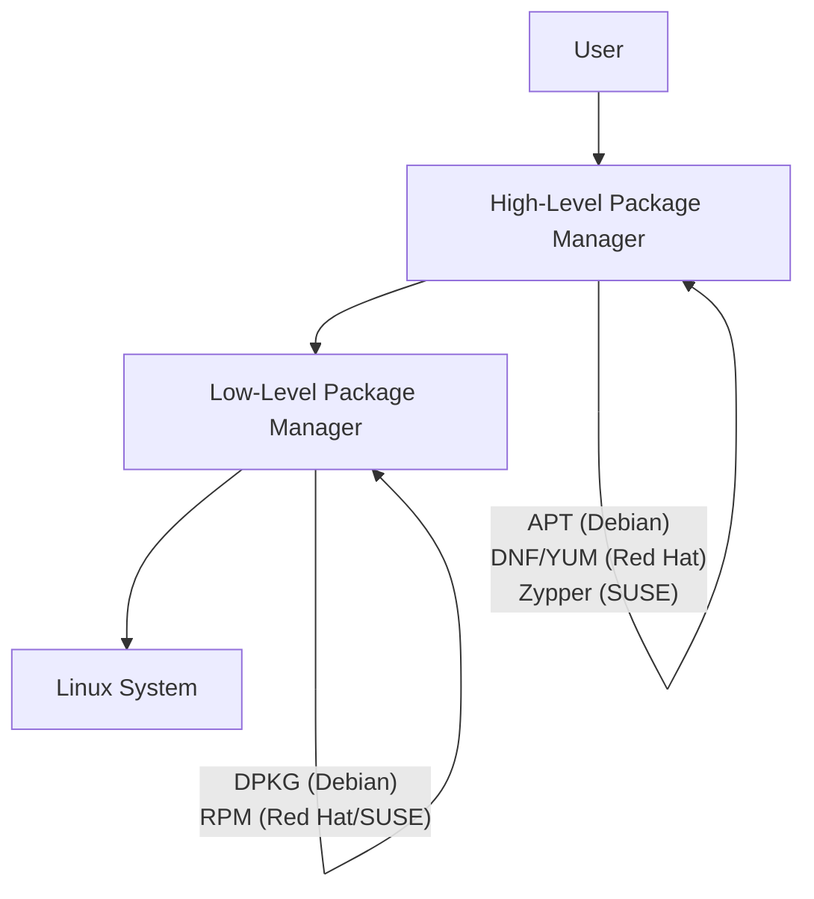

# System Configuration from the Graphical Interface: A Complete Tutorial Guide

## Introduction

Welcome to this comprehensive tutorial on configuring Linux systems using the graphical interface! This guide will teach you how to:

- Apply system display settings
- Configure date and time settings
- Manage network connections using Network Manager
- Install and update software from the GUI

While we'll cover command-line methods later, the graphical interface provides an intuitive way to handle these essential system administration tasks.

---

## Part 1: The System Settings Panel

### Accessing System Settings

The **System Settings** panel is your central location for most configuration options.

**How to Access Settings:**

| Method | Steps |
|--------|-------|
| **Top-Right Menu** | Click your name/gear icon → Settings |
| **Activities** | Click Activities → Type "Settings" |
| **Applications Menu** | Click Show Applications → Settings |

**Note:** The exact appearance varies between distributions, but the functionality is similar.

### Settings Categories

**Common Settings Categories:**

| Category | What You Can Configure |
|----------|----------------------|
| **Wi-Fi** | Wireless network connections |
| **Network** | Wired network settings |
| **Bluetooth** | Bluetooth device connections |
| **Sound** | Audio input/output |
| **Power** | Power management, battery |
| **Displays** | Screen resolution, multiple monitors |
| **Keyboard** | Keyboard layout, shortcuts |
| **Mouse & Touchpad** | Mouse settings |
| **Printers** | Printer configuration |
| **Date & Time** | Time zone, automatic time |
| **Users** | User accounts, passwords |
| **Details/About** | System information |

### Finding Hidden Settings

**Important:** Many personalized configuration settings do NOT appear in the default Settings menu.

**Use GNOME Tweaks for Advanced Settings:**
1. Press **Alt+F2**
2. Type `gnome-tweaks`
3. Press Enter

**What GNOME Tweaks Provides:**

| Setting Category | Examples |
|------------------|----------|
| **Appearance** | Themes, icons, cursor |
| **Extensions** | GNOME Shell extensions |
| **Fonts** | Font selection, scaling |
| **Keyboard & Mouse** | Key mapping, click behavior |
| **Startup Applications** | Auto-start programs |
| **Top Bar** | Clock format, date display |
| **Windows** | Window behavior, title bar actions |

**GNOME Extensions App:**
- Recent GNOME versions moved extension configuration to a separate app
- Launch `gnome-extensions-app`
- Manage installed extensions

---

## Part 2: Display Configuration

### Understanding Display Settings

The **Displays** panel lets you configure:
- Screen resolution
- Multiple monitor setup
- Screen layout
- Mirroring options

### Configuring Display Resolution

**Steps:**
1. Open Settings → Displays (or Devices → Displays)
2. Click the Resolution drop-down
3. Select desired resolution
4. Click **Apply**
5. Confirm the new resolution works

**Important:** If the selected resolution fails, the system will revert automatically after a short timeout.

### Multiple Monitor Configuration

**When Multiple Monitors Are Connected:**

| Option | Description |
|--------|-------------|
| **Mirrored Mode** | Same display on all monitors |
| **Joined Mode** | One big screen spanning all monitors |
| **Custom Layout** | Arrange monitors left/right/up/down |

**Configuring Multiple Monitors:**
1. Click on a monitor image
2. Configure resolution for that monitor
3. Drag monitors to arrange layout
4. Click Apply

**Common Monitor Layouts:**
```
[Monitor 1] [Monitor 2] [Monitor 3]  ← Side by side
Or
[Monitor 1] (primary)   [Monitor 2] (extended)
```

### Proprietary Graphics Drivers

**When Using NVIDIA or AMD Drivers:**
- May have a separate configuration program
- May provide more options
- May require root/admin access
- **Recommendation:** Use the Displays panel when possible

### X Server Configuration File

**Location:** `/etc/X11/xorg.conf`
- Usually not present on modern systems
- Only needed for unusual graphic drivers
- **Advanced users only!**

### Display Configuration Across Distributions

**Ubuntu:**
```
Settings → Displays (direct access)
```

**CentOS/RHEL:**
```
Settings → Devices → Displays
```

**openSUSE:**
```
Settings → Devices → Displays
```

**All distributions look very similar!**

---

## Part 3: Date and Time Configuration

### Understanding Time in Linux

**Linux Uses UTC (Coordinated Universal Time) Internally:**
- Similar to GMT (Greenwich Mean Time)
- More accurate than GMT
- Displayed time is adjusted for time zone

### Configuring Date and Time

**Access Date & Time Settings:**

**Method 1 - Top Panel:**
1. Click the time displayed on the top panel
2. Select "Date & Time Settings"

**Method 2 - Settings Menu:**
1. Open Settings
2. Click "Date & Time" or "Details" → "Date & Time"

**Options Available:**

| Setting | Description |
|---------|-------------|
| **Automatic Date & Time** | Use NTP servers |
| **Time Zone** | Select your region/city |
| **24-hour Clock** | Toggle between 12/24 hour format |

### Network Time Protocol (NTP)

**What is NTP?**
The most popular and reliable protocol for setting local time via internet servers.

**How NTP Works:**
1. System contacts NTP servers
2. Gets accurate current time
3. Synchronizes system clock
4. Keeps time accurate

**NTP Benefits:**
- Automatic time updates
- No manual adjustment needed
- Accurate time for logs and applications

**Common NTP Servers:**
- `0.pool.ntp.org`
- `1.pool.ntp.org`
- Distribution-specific servers

**NTP Setup:**
- Most distributions have working NTP setup by default
- Typically just toggle "Automatic Date & Time" on/off

---

## Part 4: Network Configuration

### Introduction to Network Manager

**What is Network Manager?**
A tool that makes network configuration easier and more uniform across distributions.

**Network Manager Can Handle:**
- Wired networks
- Wireless (Wi-Fi) networks
- Mobile broadband connections
- VPN connections
- Passwords and security

### Wired Network Configuration

**Wired Connections Are Usually Automatic:**
1. Hardware interface detected
2. Signal presence detected
3. DHCP automatically sets network settings

**Manual Wired Configuration (When Needed):**

| Setting | Description |
|---------|-------------|
| **Address** | Static IP address |
| **Netmask** | Subnet mask |
| **Gateway** | Router address |
| **DNS Server** | Name resolution server |
| **Routes** | Custom routing |

**Accessing Wired Settings:**
```
Top-Right → Settings → Network → Wired Settings
```

**Configure Wired Connection:**
1. Click gear icon (settings) next to connection
2. Go to "Identity" tab
3. Configure settings
4. Click Apply

### Wireless (Wi-Fi) Configuration

**View Available Wireless Networks:**
```
Top-Right → Click Wi-Fi icon → Select Network
```

**Connect to Wi-Fi:**
1. Click Wi-Fi icon in top-right
2. Select desired network
3. Enter password (if secured)
4. Password is saved for future connections

**Wireless Network Settings:**

| Setting | Description |
|---------|-------------|
| **SSID** | Network name |
| **Security** | WPA/WPA2/WEP (encryption type) |
| **Password** | Network key |
| **Connect Automatically** | Auto-connect when in range |

**Configure Wi-Fi Details:**
1. Click Settings next to connection
2. Configure:
   - Automatic connection
   - All users can use
   - Security settings
   - IPv4/IPv6 settings

### Mobile Broadband

**Setup Process:**
1. Network Manager launches a wizard
2. Enter connection details
3. Configure automatically when attached

**Supported Technologies:**
- GSM/3G/4G/LTE
- CDMA
- Various mobile carriers

### VPN Configuration

**Network Manager Supports VPN:**

| VPN Technology | Description |
|----------------|-------------|
| **IPsec** | Internet Protocol Security |
| **Cisco OpenConnect** | Cisco compatible |
| **Microsoft PPTP** | Point-to-Point Tunneling |
| **OpenVPN** | Open source VPN |

**Installing VPN Support:**
- VPN support may be a separate package
- Install if your preferred VPN is not supported

**Configuring VPN:**
1. Settings → Network → VPN
2. Click "+" to add connection
3. Choose VPN type
4. Enter connection details
5. Save configuration

### Network Interface Names

**Modern vs Older Naming:**

| System | Interface Naming |
|--------|------------------|
| **Older Systems** | eth0, eth1 (Ethernet) |
| **Modern Systems** | Complex names (based on hardware) |

**Example Modern Interface Names:**
- `enp0s3` (Ethernet)
- `wlp2s0` (Wireless)
- `enp0s31f6` (Ethernet)

### Demonstration: Configuring Network

**Wired Connection Settings in CentOS:**

1. Click top-right corner
2. Scroll to wired connection
3. Click "Wired Settings"
4. Enter root password
5. View connection details:
   - Interface name
   - Speed (e.g., 1000 Mbps)
   - MAC address

**Configure IP Settings:**
- **Automatic (DHCP)** - Default
- **Manual** - Set static IP, netmask, gateway, DNS

---

## Part 5: Software Package Management

### Understanding Package Management

**What is a Package?**
A package is a collection of files that provides one piece of the system:
- Linux kernel
- Applications (Firefox, LibreOffice)
- Libraries
- Utilities

**Package Dependencies:**
- Packages often depend on other packages
- Example: Email client may need SSL/TLS encryption package
- Package manager handles these dependencies automatically

### Package Management Levels



### Two Major Package Systems

| Feature | Debian Family | Red Hat/SUSE Family |
|---------|---------------|---------------------|
| **Low-Level Tool** | dpkg | RPM |
| **High-Level Tool** | APT | DNF/YUM (Red Hat), Zypper (SUSE) |
| **Package Format** | .deb | .rpm |
| **Dependency Resolution** | Yes | Yes |
| **Repository Support** | Yes | Yes |

### Debian Family Package Management

**Low-Level Tool: dpkg**
- Installs, removes, builds packages
- Does NOT automatically handle dependencies

**High-Level Tool: APT (Advanced Package Tool)**
- Downloads packages from internet
- Manages dependencies
- Handles package groups

**Graphical Interfaces for Debian:**

| Tool | Description |
|------|-------------|
| **Ubuntu Software Center** | Modern, app-store style |
| **GNOME Software** | Simple, user-friendly |
| **Synaptic** | Advanced, detailed |
| **Software Updater** | Update management |

### Red Hat Family Package Management

**Low-Level Tool: RPM**
- Developed by Red Hat
- Used by RHEL, CentOS, Fedora, SUSE

**High-Level Tools:**

| Tool | Distribution | Description |
|------|--------------|-------------|
| **DNF** | Fedora, RHEL 8+ | Modern replacement for YUM |
| **YUM** | RHEL 7, CentOS 7 | Older tool (backward compatible) |
| **Zypper** | SUSE/openSUSE | SUSE package manager |

### SUSE Family: YaST Software Manager

**YaST (Yet Another Setup Tool):**
- System administration tool
- Includes software management
- RPM-based

**Accessing YaST:**
1. Click Activities
2. Type "YaST"
3. Click YaST icon
4. Select "Software Management"

**YaST Features:**
- Browse by RPM groups
- Search packages
- Install/remove packages
- Dependency handling

### Using GNOME Software (Ubuntu/Fedora)

**GNOME Software - Modern Interface:**

**Features:**
- App-store style interface
- Explore by category
- Search for applications
- Install/remove with one click

**Using GNOME Software:**

1. **Open GNOME Software**
   - Applications → System Tools → Software

2. **Browse Applications**
   - Explore categories
   - View featured apps

3. **Search**
   - Click search icon
   - Type application name
   - View results

4. **Install**
   - Click application
   - Click "Install"
   - Enter password
   - Installation begins

5. **Remove**
   - Click installed application
   - Click "Remove"
   - Enter password
   - Application removed

6. **Updates**
   - Check "Updates" tab
   - Install available updates
   - Keep system secure

### Using Synaptic Package Manager (Ubuntu)

**Synaptic - Advanced Interface:**

**Features:**
- Detailed package view
- Advanced search options
- Fine-grained control
- Shows dependencies

**Using Synaptic:**

1. **Open Synaptic**
   - Applications → System Tools → Synaptic
   - Enter password

2. **Search**
   - Click Search icon
   - Type package name
   - View results

3. **Package Status**
   - **Green** = Installed
   - **White** = Available
   - **Checkbox** = Mark for action

4. **Install**
   - Click checkbox
   - Select "Mark for Installation"
   - Check dependencies
   - Click "Apply"

5. **Remove**
   - Click checkbox
   - Select "Mark for Removal"
   - Click "Apply"

### Using YaST Software Manager (openSUSE)

**YaST Package Management:**

**Accessing YaST:**
1. Activities → Type "YaST"
2. Enter root password
3. Software → Software Management

**Package Views:**
- **RPM Groups** - Categorized by RPM groups
- **Package Groups** - More intuitive grouping
- **Search** - Find specific packages

**Installing Packages:**
1. Search or browse for package
2. Check mark appears on installed packages
3. Click package to select for installation
4. Dependencies automatically handled
5. Click "Accept"

**Removing Packages:**
1. Search for installed package
2. Click until "X" appears (removal)
3. Dependencies checked
4. Click "Accept"

---

## Part 6: Installation Demonstrations

### Demonstration: GNOME Software (Ubuntu)

**Example: Searching and Installing Packages**

1. **Open GNOME Software**
   ```
   Applications → System Tools → Software
   ```

2. **Search for Terminal**
   ```
   Click search icon → Type "terminal"
   Shows:
   - GNOME Terminal (installed)
   - Other terminal options
   ```

3. **Install Package (Cheese Webcam)**
   ```
   Search for "cheese"
   If installed: Click "Remove"
   If not installed: Click "Install"
   Enter password
   ```

4. **Updates**
   ```
   Check "Updates" tab
   See available updates
   Install all updates
   ```

### Demonstration: Synaptic (Ubuntu)

**Example: Advanced Package Management**

1. **Open Synaptic**
   ```
   Applications → System Tools → Synaptic
   Enter password
   ```

2. **Search for Package**
   ```
   Click Search → Type "terminal"
   Shows all packages containing "terminal"
   ```

3. **Install Package**
   ```
   Right-click on QT Terminal
   Select "Mark for Installation"
   Shows dependencies that will be installed
   Click "Apply"
   ```

4. **Remove Package**
   ```
   Select installed package
   Right-click → "Mark for Removal"
   Click "Apply"
   ```

### Demonstration: YaST (openSUSE)

**Example: Package Installation/Removal**

1. **Open YaST**
   ```
   Activities → Type "YaST"
   Enter root password
   ```

2. **Software Management**
   ```
   Click "Software Management"
   System builds package database
   ```

3. **Search for Package**
   ```
   Click "Search" → Type "gplot"
   Shows:
   - Installed packages (check mark)
   - Available packages
   ```

4. **Install Package**
   ```
   Click package → Check mark appears
   Dependencies automatically included
   Click "Accept" → Install
   ```

5. **Remove Package**
   ```
   Search again
   Click installed package
   X appears (removal)
   Click "Accept" → Remove
   ```

---

## Part 7: Important Configuration Concepts

### UTC and Time Zone

**Understanding UTC:**
- Linux uses UTC internally
- Displayed time adjusted for time zone
- UTC = GMT (more accurate)

**Time Zone Settings:**
- Select region (e.g., America)
- Select city (e.g., Chicago)
- System calculates offset

### MAC Address

**What is MAC Address?**
- Media Access Control address
- Unique hexadecimal number
- Identifies network card
- Can be changed (if hardware supports)

### DHCP vs Static IP

| Setting | DHCP | Static IP |
|---------|------|-----------|
| **Configuration** | Automatic | Manual |
| **IP Address** | Assigned by router | User specified |
| **Usage** | Most home/small networks | Servers, special networks |
| **Ease** | Easy | Requires knowledge |

### DNS Configuration

**DNS (Domain Name System):**
- Translates domain names to IP addresses
- Example: google.com → 142.250.80.46
- Can be set automatically or manually

---

## Quick Reference: GUI Configuration Tools

### Settings Access Methods

| Distribution | Settings Location |
|--------------|-------------------|
| **Ubuntu** | Top-Right → Settings |
| **CentOS/RHEL** | Top-Right → Settings → Devices |
| **openSUSE** | Top-Right → Settings → Devices |

### Configuration Tools

| Tool | Purpose | Distribution |
|------|---------|--------------|
| **System Settings** | Basic configuration | All |
| **GNOME Tweaks** | Advanced desktop settings | GNOME |
| **GNOME Extensions** | Extension management | GNOME |
| **Network Manager** | Network configuration | All |
| **YaST** | System administration | SUSE/openSUSE |
| **GNOME Software** | Package management | Ubuntu, Fedora |
| **Synaptic** | Advanced package management | Debian-based |
| **Software Center** | Package management | Various |

### Package Manager Comparison

| Task | Debian (GUI) | Red Hat (GUI) | SUSE (GUI) |
|------|--------------|---------------|------------|
| **Low-Level** | dpkg | rpm | rpm |
| **High-Level** | APT | DNF/YUM | Zypper |
| **Graphical Tool** | GNOME Software, Synaptic | GNOME Software | YaST |
| **Search** | Yes | Yes | Yes |
| **Dependencies** | Automatic | Automatic | Automatic |

---

## Practical Exercises

### Exercise 1: Explore System Settings

1. Open System Settings
2. Browse each category
3. Check "Details" or "About" for system info
4. Explore "Users" settings
5. Check "Power" settings

### Exercise 2: Configure Display

1. Open Settings → Displays
2. Note current resolution
3. Try different resolution
4. Apply and confirm
5. Revert to original

### Exercise 3: Configure Date and Time

1. Open Settings → Date & Time
2. Enable automatic time
3. Set correct time zone
4. Try 24-hour format
5. Add a world clock

### Exercise 4: Network Configuration

1. Check your Wi-Fi connection
2. View available networks
3. Check wired connection settings
4. View network details (IP address)
5. Try connecting to a different network

### Exercise 5: Software Management

**Using GNOME Software:**
1. Open GNOME Software
2. Browse categories
3. Search for an application
4. Install a small application
5. Remove the application

**Using YaST (openSUSE):**
1. Open YaST
2. Software Management
3. Search for package
4. Install package
5. Remove package

### Exercise 6: Advanced Settings

1. Install GNOME Tweaks
   ```bash
   # Ubuntu
   sudo apt install gnome-tweaks
   
   # Fedora
   sudo dnf install gnome-tweaks
   ```
2. Open GNOME Tweaks
3. Explore Appearance settings
4. Explore Font settings
5. Change theme (if available)

---

## Troubleshooting Common Issues

### Problem: Can't Find Settings

**Solutions:**
1. Use Activities overview
2. Type "Settings"
3. Click the gear icon in top-right
4. Check Applications menu
5. Different distributions organize differently

### Problem: Display Resolution Wrong

**Solutions:**
1. Open Settings → Displays
2. Change to correct resolution
3. If black screen, wait for revert (15 seconds)
4. Check graphics drivers
5. Update system

### Problem: Wi-Fi Not Working

**Solutions:**
1. Check Wi-Fi is enabled
2. Check hardware switch
3. Enter correct password
4. Check network visibility
5. Update network drivers

### Problem: Can't Install Software

**Solutions:**
1. Check internet connection
2. Check repository settings
3. Enter correct password
4. Check disk space
5. Update package lists
6. Check for package conflicts

### Problem: Time Wrong

**Solutions:**
1. Enable automatic time
2. Check time zone setting
3. Check NTP service
4. Check internet connection
5. Set time manually

---

## Key Concepts Summary

### System Settings

| Concept | Description |
|---------|-------------|
| **Settings Panel** | Central configuration hub |
| **GNOME Tweaks** | Advanced settings tool |
| **Extensions** | GNOME add-ons |
| **Displays** | Screen configuration |
| **Date & Time** | Time zone, NTP |

### Network Configuration

| Concept | Description |
|---------|-------------|
| **Network Manager** | Network configuration tool |
| **DHCP** | Automatic IP assignment |
| **Static IP** | Manual IP configuration |
| **Wi-Fi** | Wireless networking |
| **VPN** | Virtual Private Network |

### Package Management

| Concept | Description |
|---------|-------------|
| **Package** | Single software component |
| **Dependency** | Required other packages |
| **dpkg** | Debian low-level tool |
| **RPM** | Red Hat low-level tool |
| **APT** | Debian high-level tool |
| **DNF/YUM** | Red Hat high-level tool |
| **Zypper** | SUSE high-level tool |

---

## Additional Resources

### Official Documentation
- **GNOME Help**: https://help.gnome.org
- **Network Manager**: https://networkmanager.dev
- **APT Documentation**: https://wiki.debian.org/Apt
- **RPM Documentation**: https://rpm.org

### Distribution-Specific
- **Ubuntu Help**: https://help.ubuntu.com
- **Fedora Docs**: https://docs.fedoraproject.org
- **openSUSE Docs**: https://doc.opensuse.org

### Learning More
- **Linux Foundation Courses**
- **Distribution Forums**
- **YouTube Tutorials**

---

## Final Thoughts

Configuring Linux from the graphical interface is intuitive and accessible. Key takeaways:

1. **Settings are organized by category**
2. **GNOME Tweaks provides advanced options**
3. **Network Manager handles most connections**
4. **Package managers are distribution-specific**
5. **Graphical tools are easier for beginners**
6. **Command-line tools offer more control**

**Remember:**
- Changes take effect immediately
- Some changes require root/admin password
- Always save work before major changes
- Updates keep your system secure
- Both GUI and CLI methods are valid

---

## Quick Reference Card

### Settings Categories
```
Wi-Fi        → Wireless networks
Network      → Wired networks
Displays     → Resolution, monitors
Date & Time  → Time zone, NTP
Users        → User accounts
Details      → System information
```

### Package Managers
```
Debian/Ubuntu: dpkg (low), APT (high)
Red Hat:      rpm (low), DNF/YUM (high)
SUSE:         rpm (low), Zypper (high)
```

### Network Terms
```
DHCP  → Automatic IP
Static → Manual IP
DNS   → Name resolution
MAC   → Hardware address
VPN   → Secure tunnel
```

---

*This completes the System Configuration from Graphical Interface tutorial. Practice these skills to become comfortable managing your Linux system through the GUI!*