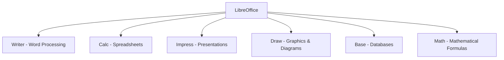
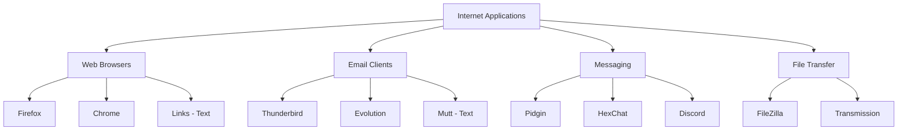
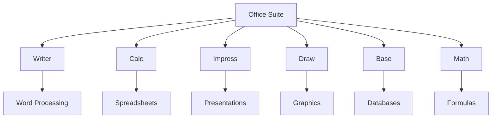
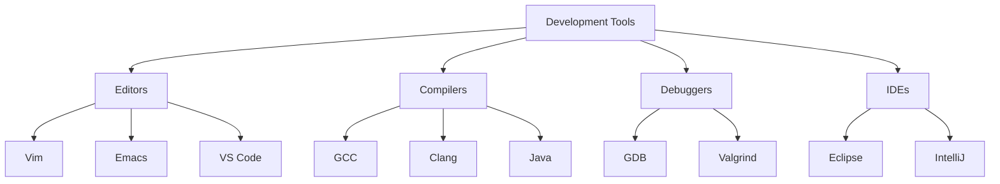
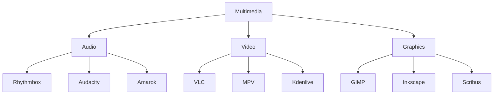

# Common Linux Applications: A Complete Tutorial Guide

## Introduction

Welcome to this comprehensive tutorial on common Linux applications! This guide will help you become familiar with the wide range of applications available on Linux systems, including:

- Internet applications (browsers, email)
- Office productivity suites
- Developer tools
- Multimedia applications
- Graphics editors

Linux comes with thousands of applications, most of them free and open-source. This tutorial covers the most essential ones you'll use every day.

---

## Part 1: Internet Applications

### Overview of Internet Applications

The internet is a global network that allows users to:
- Search for information
- Communicate through email
- Shop online
- Stream media
- Chat and video conference

Linux offers a complete set of internet applications to handle all these tasks.

### Web Browsers

Linux offers a wide variety of web browsers, both graphical and text-based.

#### Graphical Web Browsers

| Browser | Description | Features |
|---------|-------------|----------|
| **Firefox** | Most popular default browser | Fast, secure, extensions |
| **Google Chrome** | Full-featured browser | Sync, extensions |
| **Chromium** | Open-source Chrome base | Same as Chrome, no Google services |
| **Epiphany (Web)** | GNOME's default browser | Simple, integrated with GNOME |
| **Opera** | Feature-rich browser | Built-in VPN, ad blocker |

#### Text-Based Web Browsers

| Browser | Description | Use Case |
|---------|-------------|----------|
| **Links** | Text-mode browser | Lightweight browsing |
| **Lynx** | Classic text browser | Terminal-only systems |
| **w3m** | Advanced text browser | Supports tables, frames |
| **ELinks** | Enhanced Links | More features than Links |

#### Installing Browsers

```bash
# Ubuntu/Debian
sudo apt install firefox
sudo apt install chromium-browser

# Red Hat/Fedora
sudo dnf install firefox
sudo dnf install chromium

# openSUSE
sudo zypper install firefox
sudo zypper install chromium
```

### Email Applications

Email applications allow sending, receiving, and reading messages over the internet.

#### Graphical Email Clients

| Client | Description | Features |
|--------|-------------|----------|
| **Thunderbird** | Mozilla's email client | Email, calendar, chat |
| **Evolution** | GNOME's email client | Email, calendar, contacts |
| **Claws Mail** | Lightweight email client | Fast, customizable |
| **Geary** | Simple email client | GNOME integration |

#### Text-Based Email Clients

| Client | Description | Use Case |
|--------|-------------|----------|
| **Mutt** | Powerful text-based email | Terminal lovers |
| **Mail** | Simple text-based mail | System notifications |
| **Alpine** | User-friendly text email | Simpler than Mutt |

#### Email Protocols

| Protocol | Description | Usage |
|----------|-------------|-------|
| **IMAP** | Internet Message Access Protocol | Keep emails on server |
| **POP3** | Post Office Protocol | Download emails to local machine |
| **SMTP** | Simple Mail Transfer Protocol | Send emails |

#### Installing Email Clients

```bash
# Install Thunderbird
sudo apt install thunderbird     # Debian/Ubuntu
sudo dnf install thunderbird     # Fedora
sudo zypper install thunderbird  # openSUSE

# Install Evolution
sudo apt install evolution       # Debian/Ubuntu
sudo dnf install evolution       # Fedora
```

#### Using Web-Based Email

Many users simply use their browser to access email:

| Service | URL | Features |
|---------|-----|----------|
| **Gmail** | mail.google.com | Google's email service |
| **Outlook** | outlook.live.com | Microsoft's email |
| **Yahoo** | mail.yahoo.com | Yahoo's email service |

### Other Internet Applications

| Application | Purpose | Description |
|-------------|---------|-------------|
| **FileZilla** | FTP client | Transfer files via FTP |
| **Pidgin** | Instant messaging | Multi-protocol chat |
| **HexChat** | IRC client | Internet Relay Chat |
| **Transmission** | BitTorrent client | Download via torrent |
| **qBittorrent** | BitTorrent client | Alternative to Transmission |
| **Discord** | Voice/Text chat | Gaming community chat |
| **Slack** | Team communication | Business messaging |

---

## Part 2: Office Productivity Suites

### Introduction to Office Suites

Office suites are collections of closely coupled programs used to create and edit different types of files:
- Text documents
- Spreadsheets
- Presentations
- Graphical objects

### LibreOffice: The Most Popular Office Suite

**LibreOffice** started in 2010 and evolved from OpenOffice. It is:
- Open-source
- Free to use
- Mature and stable
- Actively developed
- Widely used

**Availability:**
- Comes with most Linux distributions by default
- Available for installation on all distributions

### LibreOffice Components



#### 1. Writer (Word Processing)

**Purpose:** Create and edit text documents

**Features:**
- Full-featured word processor
- Styles and formatting
- Tables and images
- Spell checking
- Mail merge
- PDF export

**File Formats Supported:**
- Native: `.odt` (OpenDocument Text)
- Microsoft: `.doc`, `.docx`
- Rich Text: `.rtf`
- Plain text: `.txt`
- HTML: `.html`

**Common Uses:**
- Letters and memos
- Reports and documents
- Books and manuscripts
- Resumes and CVs

#### 2. Calc (Spreadsheets)

**Purpose:** Create and edit spreadsheets

**Features:**
- Advanced formulas and functions
- Charts and graphs
- Pivot tables
- Data analysis tools
- Macro support

**File Formats Supported:**
- Native: `.ods` (OpenDocument Spreadsheet)
- Microsoft: `.xls`, `.xlsx`
- CSV: `.csv`
- HTML: `.html`

**Common Uses:**
- Financial calculations
- Budgets and accounting
- Data analysis
- Charts and graphs
- Project planning

#### 3. Impress (Presentations)

**Purpose:** Create and deliver presentations

**Features:**
- Slide layouts
- Animations and transitions
- Presenter view
- Templates
- Speaker notes

**File Formats Supported:**
- Native: `.odp` (OpenDocument Presentation)
- Microsoft: `.ppt`, `.pptx`
- PDF export

**Common Uses:**
- Business presentations
- Educational slideshows
- Project proposals
- Training materials

#### 4. Draw (Graphics and Diagrams)

**Purpose:** Create and edit graphics and diagrams

**Features:**
- Vector graphics editing
- Flowcharts and diagrams
- Technical drawings
- Object manipulation

**File Formats Supported:**
- Native: `.odg` (OpenDocument Graphics)
- Various image formats

**Common Uses:**
- Flowcharts
- Organizational charts
- Technical illustrations
- Posters and flyers

#### 5. Base (Databases)

**Purpose:** Create and manage databases

**Features:**
- Table creation
- Query design
- Form creation
- Report generation

#### 6. Math (Mathematical Formulas)

**Purpose:** Create mathematical formulas

**Features:**
- Formula editor
- Mathematical symbols
- Integration with Writer

### Installing LibreOffice

```bash
# Ubuntu/Debian
sudo apt install libreoffice

# Fedora
sudo dnf install libreoffice

# openSUSE
sudo zypper install libreoffice
```

### Other Office Suites

| Suite | Description | Features |
|-------|-------------|----------|
| **Apache OpenOffice** | Older open-source suite | Similar to LibreOffice |
| **WPS Office** | Commercial/Free | High Microsoft compatibility |
| **OnlyOffice** | Modern open-source suite | Collaborative features |
| **Calligra** | KDE office suite | KDE integration |

### Web-Based Office Suites

| Service | Description | Features |
|---------|-------------|----------|
| **Google Docs** | Free web-based suite | Collaboration, auto-save |
| **Microsoft Office 365** | Commercial web suite | Full MS Office compatibility |
| **Zoho Office** | Free web-based suite | Business-oriented |

---

## Part 3: Developer Tools

### Overview

Linux comes with a complete set of applications and tools needed for:
- Developing user applications
- System software development
- Kernel development
- Maintaining existing code

### Text Editors for Developers

#### Vim (Vi Improved)

**Description:** Advanced text editor with extensive features

**Key Features:**
- Modal editing (command/insert modes)
- Extensive plugin ecosystem
- Syntax highlighting
- Multiple language support
- Highly customizable

**Starting Vim:**
```bash
vim filename.txt
```

**Basic Vim Commands:**
| Command | Action |
|---------|--------|
| `i` | Enter insert mode |
| `Esc` | Exit insert mode |
| `:w` | Save file |
| `:q` | Quit |
| `:wq` | Save and quit |
| `:q!` | Quit without saving |
| `/word` | Search for "word" |
| `dd` | Delete line |
| `yy` | Copy line |
| `p` | Paste |

#### Emacs

**Description:** Powerful, extensible editor with integrated environment

**Key Features:**
- Built-in Lisp interpreter
- Extensible in Lisp
- Integrated terminal
- Built-in file manager
- Extensive package system

**Starting Emacs:**
```bash
emacs filename.txt
```

**Basic Emacs Commands (keyboard shortcuts):**
| Command | Action |
|---------|--------|
| `C-x C-f` | Open file |
| `C-x C-s` | Save file |
| `C-x C-c` | Quit |
| `C-g` | Cancel command |
| `C-s` | Search forward |
| `C-r` | Search backward |
| `C-k` | Delete line |

#### Comparison of Editors

| Feature | Vim | Emacs | VS Code |
|---------|-----|-------|---------|
| **Learning Curve** | Steep | Steep | Moderate |
| **Customization** | High | Very high | High |
| **Built-in Features** | Good | Excellent | Good |
| **Extensions** | Good | Excellent | Excellent |
| **GUI** | Optional | Good | Great |
| **Terminal Usage** | Excellent | Good | No |

### Compilers

Linux distributions include compilers for many programming languages.

#### GCC (GNU Compiler Collection)

**Description:** The most important and widely used compiler on Linux

**Supported Languages:**
- C
- C++
- Objective-C
- Fortran
- Java
- Go
- Ada

**Installing GCC:**
```bash
# Ubuntu/Debian
sudo apt install gcc g++

# Fedora
sudo dnf install gcc gcc-c++

# openSUSE
sudo zypper install gcc gcc-c++
```

**Basic Usage:**
```bash
# Compile C program
gcc program.c -o program

# Compile C++ program
g++ program.cpp -o program

# Compile with debugging symbols
gcc program.c -g -o program

# Compile with optimization
gcc program.c -O2 -o program
```

**Example:**
```bash
# Create a C program file
echo '#include <stdio.h>
int main() {
    printf("Hello, World!\n");
    return 0;
}' > hello.c

# Compile it
gcc hello.c -o hello

# Run it
./hello
```

#### Other Compilers

| Compiler | Languages | Description |
|----------|-----------|-------------|
| **Clang** | C, C++ | LLVM-based, faster compilation |
| **golang** | Go | Google's Go language |
| **rustc** | Rust | Mozilla's Rust language |
| **javac** | Java | Java compiler |
| **python3** | Python | Python interpreter |

**Installing Other Compilers:**
```bash
# Install Go
sudo apt install golang-go

# Install Rust
sudo apt install rustc

# Install Java
sudo apt install default-jdk

# Install Python
sudo apt install python3
```

### Debuggers

#### GDB (GNU Debugger)

**Description:** The most important debugger on Linux

**Key Features:**
- C and C++ debugging
- Breakpoint setting
- Variable inspection
- Stack tracing
- Core dump analysis

**Basic GDB Commands:**

| Command | Action |
|---------|--------|
| `gdb program` | Start debugging |
| `run` | Run the program |
| `break main` | Set breakpoint at main |
| `step` | Step into function |
| `next` | Step over function |
| `print var` | Print variable value |
| `list` | Display source code |
| `quit` | Exit GDB |

**Installing GDB:**
```bash
sudo apt install gdb      # Debian/Ubuntu
sudo dnf install gdb      # Fedora
sudo zypper install gdb   # openSUSE
```

**Example Debugging Session:**
```bash
# Compile with debug symbols
gcc program.c -g -o program

# Run GDB
gdb program

# In GDB:
(gdb) break main          # Set breakpoint
(gdb) run                 # Start program
(gdb) next                # Step through
(gdb) print variable      # Check values
(gdb) continue            # Continue execution
(gdb) quit                # Exit
```

### Integrated Development Environments (IDEs)

| IDE | Languages | Description |
|-----|-----------|-------------|
| **Visual Studio Code** | Many | Popular, extensible code editor |
| **Eclipse** | Java, C++, others | Full-featured IDE |
| **IntelliJ IDEA** | Java, Kotlin | Advanced Java IDE |
| **PyCharm** | Python | Best Python IDE |
| **Qt Creator** | C++ | Great for Qt applications |
| **Geany** | Many | Lightweight IDE |

**Installing VS Code:**
```bash
# Ubuntu/Debian
sudo snap install --classic code

# Fedora
sudo dnf install code

# Or download from website
```

### Other Development Tools

| Tool | Purpose | Description |
|------|---------|-------------|
| **Git** | Version control | Track code changes |
| **Make** | Build automation | Compile programs |
| **CMake** | Build automation | Cross-platform builds |
| **Valgrind** | Memory debugging | Find memory leaks |
| **Gprof** | Profiling | Performance analysis |
| **Doxygen** | Documentation | Generate documentation |

---

## Part 4: Multimedia Applications

### Audio Applications

#### Sound Players

| Player | Description | Features |
|--------|-------------|----------|
| **Rhythmbox** | GNOME's default music player | Music library, podcasts |
| **Amarok** | KDE's music player | Advanced library management |
| **Audacity** | Audio editor | Recording, editing |
| **VLC** | Universal player | Plays almost everything |
| **Spotify** | Streaming service | Music streaming |

**Installing Audio Applications:**
```bash
# Rhythmbox
sudo apt install rhythmbox

# Audacity
sudo apt install audacity

# VLC
sudo apt install vlc

# Amarok
sudo apt install amarok
```

#### Audio File Formats Supported

| Format | Description | Use Case |
|--------|-------------|----------|
| **MP3** | Compressed audio | Music files |
| **FLAC** | Lossless compressed | High-quality audio |
| **OGG** | Open-source compressed | Web audio |
| **WAV** | Uncompressed audio | Studio-quality |
| **AAC** | Advanced audio codec | Streaming |

### Video Applications

#### Movie Players

| Player | Description | Features |
|--------|-------------|----------|
| **VLC** | Universal media player | Plays everything |
| **MPV Player** | Modern video player | Minimal, high performance |
| **Totem** | GNOME's video player | Simple, integrated |
| **SMPlayer** | Advanced player | MPlayer front-end |

**Installing Video Applications:**
```bash
# VLC
sudo apt install vlc

# MPV
sudo apt install mpv

# Totem (GNOME Videos)
sudo apt install totem
```

#### Movie Editors

| Editor | Description | Features |
|--------|-------------|----------|
| **Blender** | 3D modeling and video editing | Full-featured video editor |
| **Kdenlive** | Video editing | Professional features |
| **OpenShot** | Video editing | User-friendly |
| **CinePaint** | Film editing | Professional film editing |
| **FFmpeg** | Command-line video processing | Convert, process videos |

**Installing Video Editors:**
```bash
# OpenShot
sudo apt install openshot

# Kdenlive
sudo apt install kdenlive

# Blender
sudo apt install blender
```

### Streaming Services

Linux can access popular streaming services through web browsers:

| Service | Type | Access Method |
|---------|------|---------------|
| **Spotify** | Music streaming | Web browser or app |
| **Pandora** | Music streaming | Web browser |
| **Netflix** | Video streaming | Web browser |
| **YouTube** | Video sharing | Web browser |
| **Amazon Prime** | Video streaming | Web browser |

---

## Part 5: Graphics Applications

### GIMP (GNU Image Manipulation Program)

**Description:** A feature-rich image retouching and editing tool, similar to Adobe Photoshop

**Key Features:**
- Handles any image format
- Advanced retouching tools
- Special-purpose plugins and filters
- Layers, channels, and histograms
- Extensive documentation

**What GIMP Can Do:**
- Photo retouching
- Image composition
- Drawing and painting
- Animation
- Web graphics
- Photo enhancement

**Installing GIMP:**
```bash
# Ubuntu/Debian
sudo apt install gimp

# Fedora
sudo dnf install gimp

# openSUSE
sudo zypper install gimp
```

**GIMP Interface Overview:**
```
┌─────────────────────────────────────────────────┐
│ [Menu Bar]                                      │
│ Tools | Filters | Window | Help                 │
├──────────────┬──────────────────┬───────────────┤
│ Toolbox      │ Image Window     │ Layers/Docks │
│ ┌──────────┐ │ ┌──────────────┐ │ ┌─────────┐ │
│ │ Selection │ │ │              │ │ │ Layers  │ │
│ │ Paint     │ │ │  Image       │ │ │ Channels│ │
│ │ Transform │ │ │              │ │ │ Paths   │ │
│ │ Other     │ │ │              │ │ └─────────┘ │
│ └──────────┘ │ └──────────────┘ │               │
├──────────────┴──────────────────┴───────────────┤
│ [Status Bar]                                     │
└─────────────────────────────────────────────────┘
```

### Other Graphics Utilities

| Utility | Purpose | Description |
|---------|---------|-------------|
| **Inkscape** | Vector graphics | Like Adobe Illustrator |
| **EOG (Eye of GNOME)** | Image viewer | Fast image viewing |
| **Shotwell** | Photo manager | Organize, view photos |
| **DigiKam** | Photo manager | Advanced photo management |
| **Gwenview** | Image viewer | KDE image viewer |
| **Darktable** | Photography | RAW photo development |
| **Scribus** | Desktop publishing | Like Adobe InDesign |
| **XFCE Image Viewer** | Image viewer | Lightweight |

**Installing Graphics Utilities:**
```bash
# Inkscape
sudo apt install inkscape

# Shotwell
sudo apt install shotwell

# EOG
sudo apt install eog

# Darktable
sudo apt install darktable
```

### Image File Formats

| Format | Description | Use Case |
|--------|-------------|----------|
| **JPEG** | Compressed image | Photos, web |
| **PNG** | Lossless compressed | Graphics, web |
| **GIF** | Animated images | Web animations |
| **TIFF** | High quality | Professional photography |
| **SVG** | Vector graphics | Scalable graphics |
| **RAW** | Unprocessed | Professional photography |

### Screenshot Tools

| Tool | Description | Features |
|------|-------------|----------|
| **GNOME Screenshot** | Built-in tool | Screen capture |
| **Flameshot** | Advanced screenshot | Annotation |
| **Shutter** | Feature-rich | Editing, upload |
| **Spectacle** | KDE screenshot | Various capture modes |

---

## Part 6: Application Categories Summary

### Internet Applications



### Office Applications



### Development Applications



### Multimedia Applications



---

## Part 7: Installing Applications

### Using Package Managers

**Debian/Ubuntu (APT):**
```bash
# Search for application
apt search application-name

# View details
apt show application-name

# Install
sudo apt install application-name

# Remove
sudo apt remove application-name
```

**Fedora/RHEL (DNF):**
```bash
# Search
dnf search application-name

# Install
sudo dnf install application-name

# Remove
sudo dnf remove application-name
```

**openSUSE (Zypper):**
```bash
# Search
zypper search application-name

# Install
sudo zypper install application-name

# Remove
sudo zypper remove application-name
```

### Using Software Centers

**GNOME Software:**
1. Open GNOME Software
2. Browse or search
3. Click "Install"
4. Enter password

**Ubuntu Software Center:**
1. Open Ubuntu Software
2. Browse categories
3. Click "Install"

### Using Snap Packages

```bash
# Search for snap
snap find application

# Install snap
sudo snap install application

# List installed snaps
snap list
```

### Using Flatpak

```bash
# Install Flatpak
sudo apt install flatpak

# Add Flathub repository
flatpak remote-add flathub https://flathub.org/repo/flathub.flatpakrepo

# Install application
flatpak install flathub application-name

# Run application
flatpak run application-name
```

---

## Practical Exercises

### Exercise 1: Internet Applications

1. Install Firefox (if not already installed)
2. Browse to your favorite website
3. Install Thunderbird email client
4. Configure your email account
5. Explore the settings menu

### Exercise 2: Office Applications

1. Open LibreOffice Writer
2. Create a new document
3. Write a short essay
4. Save it as .odt format
5. Export as PDF
6. Open LibreOffice Calc
7. Create a simple budget spreadsheet

### Exercise 3: Developer Tools

1. Install GCC compiler
2. Create a simple Hello World program
3. Compile it with GCC
4. Run the program
5. Install Vim editor
6. Edit a file with Vim
7. Practice basic Vim commands

### Exercise 4: Multimedia Applications

1. Install VLC media player
2. Play a video file
3. Install Rhythmbox
4. Import some music
5. Install GIMP
6. Open an image and try a filter

### Exercise 5: Graphics Applications

1. Install GIMP
2. Open a photo
3. Apply a filter (e.g., blur or sharpen)
4. Save the edited image
5. Install Inkscape
6. Create a simple vector graphic
7. Save as SVG format

---

## Quick Reference

### Common Applications Quick Reference

| Category | Application | Purpose |
|----------|-------------|---------|
| **Web** | Firefox, Chrome | Web browsing |
| **Email** | Thunderbird, Evolution | Email client |
| **Office** | LibreOffice Writer | Word processing |
| **Office** | LibreOffice Calc | Spreadsheets |
| **Development** | Vim, Emacs | Text editors |
| **Development** | GCC, G++ | Compilers |
| **Audio** | Rhythmbox, VLC | Music player |
| **Video** | VLC, MPV | Video player |
| **Graphics** | GIMP | Image editing |
| **Graphics** | Inkscape | Vector graphics |
| **Screenshot** | GNOME Screenshot | Screen capture |

### Installation Commands

| Distribution | Search | Install | Remove |
|--------------|--------|---------|--------|
| Ubuntu/Debian | `apt search` | `sudo apt install` | `sudo apt remove` |
| Fedora/RHEL | `dnf search` | `sudo dnf install` | `sudo dnf remove` |
| openSUSE | `zypper search` | `sudo zypper install` | `sudo zypper remove` |

---

## Key Concepts Summary

### Internet Applications
- **Browsers**: Firefox, Chrome, text-based browsers
- **Email**: Thunderbird, Evolution, web-based
- **Messaging**: Pidgin, HexChat, Discord
- **File Transfer**: FileZilla, Transmission

### Office Suite
- **LibreOffice**: Most common open-source suite
- **Writer**: Word processing
- **Calc**: Spreadsheets
- **Impress**: Presentations
- **Draw**: Graphics and diagrams

### Development Tools
- **Editors**: Vim, Emacs, VS Code
- **Compilers**: GCC, Clang, others
- **Debuggers**: GDB, Valgrind
- **IDEs**: Eclipse, IntelliJ, PyCharm

### Multimedia
- **Audio**: Rhythmbox, Audacity, Amarok
- **Video**: VLC, MPV, Kdenlive
- **Graphics**: GIMP, Inkscape, Shotwell

---

## Additional Resources

### Official Documentation
- **LibreOffice**: https://www.libreoffice.org
- **GIMP**: https://www.gimp.org
- **GCC**: https://gcc.gnu.org
- **VLC**: https://www.videolan.org

### Learning Resources
- **GIMP Tutorials**: https://www.gimp.org/tutorials
- **LibreOffice Help**: https://help.libreoffice.org
- **Vim Tutor**: Run `vimtutor` in terminal
- **Emacs Tutorial**: Emacs help system

### Community Resources
- **Ubuntu Forums**: Ubuntu users
- **Fedora Forum**: Fedora users
- **openSUSE Forum**: openSUSE users
- **Reddit**: r/linux, r/learnlinux

---

## Final Thoughts

Linux offers a wealth of applications for every need:

1. **All essential applications are available for free**
2. **Large selection of alternatives for each task**
3. **Development tools are industry-standard**
4. **Multimedia support is comprehensive**
5. **Applications integrate well with the system**

**Key Takeaways:**
- Most distributions come with essential applications pre-installed
- Additional applications are easy to install
- LibreOffice is the standard office suite
- GCC and GDB are essential development tools
- GIMP is the Photoshop alternative
- VLC is the universal media player

**Remember:**
- Explore the Software Center for more applications
- Try different applications to find your favorites
- Most applications are available for all distributions
- Community support is excellent for all major applications

---

*This completes the Common Applications tutorial. You should now be familiar with the most important applications available on Linux systems!*