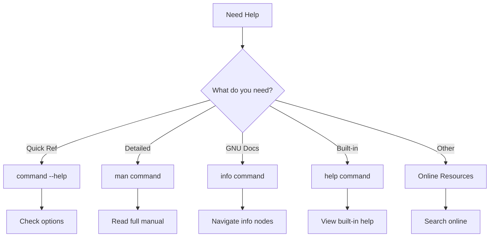

# Finding Linux Documentation: A Complete Tutorial Guide

## Introduction

Welcome to this comprehensive tutorial on finding Linux documentation! Whether you are a beginner or an experienced user, you will not always know or remember the proper use of various Linux programs and utilities.

This guide will teach you how to use different sources of documentation:

- **Man pages** (manual pages)
- **Info system**
- **Help command** and **--help option**
- **Other documentation sources**

Linux-based systems draw from a large variety of sources, and there are numerous reservoirs of documentation and ways of getting help.

---

## Part 1: The Man Pages

### What are Man Pages?

**Man pages** (short for manual pages) are the most often used source of Linux documentation.

**Key Characteristics:**
- Present on ALL Linux distributions
- Always at your fingertips
- First introduced in early Unix versions (1970s)
- "man" is just an abbreviation for "manual"

**What Man Pages Cover:**
- Programs and utilities
- Configuration files
- System calls
- Library routines
- The Linux kernel

### Basic Man Page Usage

**Syntax:**
```bash
man [options] [section] topic
```

**Basic Example:**
```bash
# View documentation for the ls command
man ls
```

**How It Works:**
1. The `man` program searches for the topic
2. Formats the information for display
3. Pipes output through a pager (like `less`)
4. Shows one page at a time

### Man Page Sections

Man pages are organized into sections (chapters):

| Section | Content | Example |
|---------|---------|---------|
| **1** | User commands | `man ls` |
| **2** | System calls | `man socket` |
| **3** | Library functions | `man printf` |
| **4** | Special files (devices) | `man null` |
| **5** | File formats and conventions | `man passwd` |
| **6** | Games | `man fortune` |
| **7** | Miscellaneous | `man socket` |
| **8** | System administration | `man iptables` |

### Viewing Specific Sections

A topic may appear in multiple sections.

```bash
# View section 7 (miscellaneous) of socket
man 7 socket

# View all sections containing a topic
man -a socket
# Press Space to scroll through each section
# Press q to quit a section
# Press Ctrl+D to skip to next section
```

### Finding Man Pages

#### man -f (Whatis) - Find by Name

**Purpose:** List all man pages with the exact topic name

**Syntax:**
```bash
man -f topic
# OR
whatis topic
```

**Example:**
```bash
$ man -f socket
socket (2) - create an endpoint for communication
socket (7) - Linux socket interface
socket (3p) - create an endpoint for communication

# Same as whatis socket
$ whatis socket
socket (2) - create an endpoint for communication
socket (7) - Linux socket interface
socket (3p) - create an endpoint for communication
```

#### man -k (Apropos) - Search by Description

**Purpose:** Search for topics that contain a keyword in their description

**Syntax:**
```bash
man -k keyword
# OR
apropos keyword
```

**Example:**
```bash
# Find all man pages about sockets
man -k socket

# Find all man pages about networking
apropos network
```

### Comparing man -f and man -k

| Feature | man -f (whatis) | man -k (apropos) |
|---------|-----------------|------------------|
| **Search** | Exact topic name | Keyword anywhere |
| **Result** | Only exact matches | All containing keyword |
| **Purpose** | Find specific topic | Discover related topics |

### Navigation in Man Pages

**Keyboard Shortcuts:**

| Key | Action |
|-----|--------|
| **Space** | Next page |
| **Enter** | Next line |
| **b** | Previous page |
| **g** | Go to top |
| **G** | Go to bottom |
| **/string** | Search forward |
| **?string** | Search backward |
| **n** | Next search match |
| **N** | Previous search match |
| **q** | Quit |

### Structure of a Man Page

```
LS(1)                    User Commands                    LS(1)

NAME
       ls - list directory contents

SYNOPSIS
       ls [OPTION]... [FILE]...

DESCRIPTION
       List  information  about  the FILEs (the current
       directory by default). Sort entries alphabetically
       ...

OPTIONS
       -a, --all
              do not ignore entries starting with .

       -l     use a long listing format

AUTHOR
       Written by Richard M. Stallman and David MacKenzie.

SEE ALSO
       dir(1), dircolors(1), lsattr(1), stat(1)
```

**Common Man Page Sections:**

| Section | Description |
|---------|-------------|
| **NAME** | Command name and brief description |
| **SYNOPSIS** | How to use the command |
| **DESCRIPTION** | Detailed explanation |
| **OPTIONS** | Available options and arguments |
| **EXAMPLES** | Usage examples |
| **FILES** | Related files |
| **SEE ALSO** | Related commands |

---

## Part 2: The Info System

### What is the Info System?

The **Info system** was created by the GNU project as its standard documentation format.

**Key Characteristics:**
- GNU's preferred alternative to man pages
- Supports linked subsections (hyperlinks)
- More free-form than man pages
- Predates the World Wide Web
- Topics are connected using links

### Starting Info

```bash
# Display info index (all available topics)
info

# Display info for a specific topic
info topic_name

# Example
info make
```

### Info Navigation

**Basic Navigation Keys:**

| Key | Action |
|-----|--------|
| **Arrow Keys** | Move around |
| **Space** | Next page |
| **Enter** | Follow link |
| **n** | Next node |
| **p** | Previous node |
| **u** | Up one level |
| **l** | Last visited node |
| **h** | Help |
| **q** | Quit |

**Searching in Info:**
| Key | Action |
|-----|--------|
| **/** | Search forward |
| **?** | Search backward |
| **s** | Search through all nodes |

### Understanding Info Nodes

In Info, a **node** is a topic or section.

**Node Structure:**
```
┌─────────────────────────────────────┐
│ Node: Top                          │ ← Root node
│ Menu:                             │
│   • Introduction                   │
│   • Basic Concepts                │
│   • Advanced Topics               │
└─────────────────────────────────────┘
         │
         ▼
┌─────────────────────────────────────┐
│ Node: Introduction                 │
│ Text about introduction...         │
│ Next: Basic Concepts               │ ← Links
│ Prev: Top                          │
└─────────────────────────────────────┘
```

### Finding Information in Info

**Using the Search Function:**
1. Press `/` to start search
2. Type your search term
3. Press Enter
4. Press `n` for next match
5. Press `N` for previous match

**Menu Items in Info:**
- **Menu items** are identified by `*`
- **Named items** have `::` at the end
- Items can refer to other nodes or files

### Info Example Session

```bash
$ info make
```
```
File: make.info,  Node: Top,  Next: Overview,  Prev: (dir),  Up: (dir)

GNU Make
********

This file documents the GNU Make utility...

* Menu:

* Overview::                    Overview of make
* Introduction::                An introduction to make
* Simple Makefile::             A simple makefile
* How Make Works::              How make processes a makefile
* Variables::                   Variables make
* Conditionals::                Conditionals and loops
* Functions::                   Functions for transforming text
* Commands::                    Command execution
...
```

---

## Part 3: The Help Command

### Built-in Shell Commands

Some commands are built into the shell (bash) rather than being separate programs.

**Examples of Built-in Commands:**
- `cd` (change directory)
- `echo` (display text)
- `exit` (exit shell)
- `alias` (create aliases)
- `history` (command history)

**Why Built-in Commands Exist:**
- Faster execution
- Uses fewer resources
- Integrated with shell features

### Using the Help Command

**Purpose:** Display help for built-in commands

**Syntax:**
```bash
help [builtin_command]
```

**Examples:**
```bash
# Get help for cd
help cd

# Get help for echo
help echo

# Get help for exit
help exit
```

**Output Example:**
```bash
$ help cd
cd: cd [-L|[-P [-e]] [-@]] [dir]
    Change the shell working directory.

    Change the current directory to DIR.  The default DIR is the value
    of the HOME shell variable.
    ...
```

### Listing All Built-in Commands

```bash
# List all built-in commands
help

# Get more detailed help
help -m
```

---

## Part 4: The --help Option

### What is --help?

Most commands support the `--help` option to display a quick reference.

**Key Characteristics:**
- Available for most standalone programs
- Displays summary of usage
- Faster than man pages
- Good for quick reference

**Syntax:**
```bash
command --help
# OR
command -h
```

### Examples

```bash
# Get help for ls
ls --help

# Get help for grep
grep --help

# Get help for find
find --help

# Get help for man itself
man --help
```

### What --help Typically Shows

```
Usage: ls [OPTION]... [FILE]...
List information about the FILEs (the current directory by default).
Sort entries alphabetically if none of -cftuvSUX nor --sort is specified.

Mandatory arguments to long options are mandatory for short options too.
  -a, --all                  do not ignore entries starting with .
  -A, --almost-all           do not list implied . and ..
      --author               with -l, print the author of each file
  -b, --escape               print C-style escapes for nongraphic characters
      --block-size=SIZE      scale sizes by SIZE before printing them
  -B, --ignore-backups       do not list implied entries ending with ~
  -c                         with -lt: sort by, and show, ctime (time of last
                               modification of file status information);
                               with -l: show ctime and sort by name;
                               otherwise: sort by ctime, newest first
  -C                         list entries by columns
      --color[=WHEN]         colorize the output; WHEN can be 'never', 'auto',
                               or 'always' (the default)
  -d, --directory            list directories themselves, not their contents
  ...
```

### --help vs Man Pages

| Aspect | --help | Man Pages |
|--------|--------|-----------|
| **Speed** | Very fast | Slower |
| **Detail** | Brief summary | In-depth |
| **Format** | Simple text | Formatted with sections |
| **Availability** | Most commands | All commands |
| **Use Case** | Quick reference | Detailed study |

---

## Part 5: Other Documentation Sources

### Desktop Help System

Most Linux distributions include a desktop help system:

**GNOME Help:**
- Click "Activities" → "Help"
- Searchable interface
- Covers GNOME desktop and applications

**KDE Help:**
- Click "System Menu" → "Help"
- Comprehensive KDE documentation
- Application-specific help

### Package Documentation

**Documentation Installed with Packages:**

| Location | Content |
|----------|---------|
| `/usr/share/doc/` | Package documentation |
| `/usr/share/man/` | Man pages |
| `/usr/share/info/` | Info pages |

**Exploring Package Documentation:**
```bash
# List documentation for installed packages
ls /usr/share/doc/

# View README file for a package
less /usr/share/doc/package_name/README

# View changelog
less /usr/share/doc/package_name/changelog
```

### Online Resources

**Distribution-Specific:**

| Distribution | Online Documentation |
|--------------|---------------------|
| **Ubuntu** | https://help.ubuntu.com |
| **Red Hat** | https://access.redhat.com/documentation |
| **Fedora** | https://docs.fedoraproject.org |
| **openSUSE** | https://doc.opensuse.org |
| **Debian** | https://www.debian.org/doc |

**General Linux Resources:**

| Resource | Description | URL |
|----------|-------------|-----|
| **TLDP** | Linux Documentation Project | https://www.tldp.org |
| **Arch Wiki** | Excellent general resource | https://wiki.archlinux.org |
| **Stack Overflow** | Q&A for programmers | https://stackoverflow.com |
| **Unix Stack Exchange** | Q&A for Linux/Unix | https://unix.stackexchange.com |

### The GNU Handbook

The GNU project provides comprehensive documentation for its tools.

**Accessing GNU Documentation:**
```bash
# View GNU coreutils documentation
info coreutils

# View GNU make documentation
info make

# View GNU grep documentation
info grep
```

### Linux Kernel Documentation

The kernel itself comes with extensive documentation:

```bash
# View kernel documentation index
less /usr/share/doc/linux-doc/

# Or online
# https://www.kernel.org/doc/html/latest/
```

---

## Part 6: Quick Reference - Documentation Commands

### Summary of Documentation Commands

| Command | Purpose | When to Use |
|---------|---------|-------------|
| `man topic` | Full manual page | Detailed information |
| `man -f topic` | List exact matches | Find specific topic |
| `man -k keyword` | Search descriptions | Find related topics |
| `info topic` | GNU documentation | GNU tools documentation |
| `help builtin` | Shell builtins | Built-in commands |
| `command --help` | Quick reference | Brief command summary |

### Finding Documentation Flowchart



---

## Part 7: Man Page Anatomy - Deep Dive

### Understanding the SYNOPSIS

The synopsis shows how to use the command:

**Conventions:**
| Symbol | Meaning |
|--------|---------|
| `[ ]` | Optional item |
| `< >` | Required argument |
| `{ }` | Choose one |
| `|` | OR (mutually exclusive) |
| `...` | Repeatable |

**Examples:**
```bash
# Simple: optional options, required filename
cp [OPTION]... SOURCE DEST

# Complex: choose one of several options
grep [OPTIONS] [-e PATTERN] [FILE]...

# Real example: ls
ls [OPTION]... [FILE]...
# Means: ls can have any number of options and any number of files
```

### Man Page Types

| Type | Description | Example |
|------|-------------|---------|
| **User Commands** | Regular user commands | `man ls` |
| **System Calls** | Kernel interfaces | `man 2 socket` |
| **Library Calls** | C library functions | `man 3 printf` |
| **Device Files** | Special files | `man 4 null` |
| **File Formats** | Configuration files | `man 5 passwd` |
| **Games** | Games and demos | `man 6 fortune` |
| **Miscellaneous** | Various topics | `man 7 socket` |
| **Admin Commands** | System management | `man 8 iptables` |

---

## Practical Exercises

### Exercise 1: Using Man Pages

```bash
# 1. View documentation for ls
man ls

# 2. Find all pages about "passwd"
man -f passwd

# 3. View the system call version (section 2)
man 2 passwd

# 4. View the file format version (section 5)
man 5 passwd

# 5. Search for topics about networking
man -k network

# 6. Practice navigation (space, q, /search, etc.)
man bash
```

### Exercise 2: Using Info

```bash
# 1. Start info and browse
info

# 2. View info for make
info make

# 3. Practice navigation
# Use: n, p, u, l (to navigate)
# Use: /search (to find text)

# 4. View help within info
# Press h for help

# 5. View info for grep
info grep
```

### Exercise 3: Using Help Options

```bash
# 1. View quick help for ls
ls --help

# 2. View quick help for grep
grep --help

# 3. View help for built-in commands
help cd
help echo
help alias

# 4. Compare --help with man
# Which is faster? Which has more detail?
```

### Exercise 4: Exploring Documentation

```bash
# 1. List documentation directories
ls /usr/share/doc/

# 2. View a README file
ls /usr/share/doc/  # Find a package
less /usr/share/doc/package/README

# 3. Search for documentation files
find /usr/share/doc -name "README*"

# 4. View kernel documentation (if installed)
ls /usr/share/doc/linux-doc/
```

### Exercise 5: Online Resources

1. Visit: https://help.ubuntu.com
2. Search for "command line" documentation
3. Explore the Arch Wiki: https://wiki.archlinux.org
4. Check TLDP: https://www.tldp.org

---

## Troubleshooting Documentation Issues

### Problem: "No manual entry for ..."

**Solution:**
```bash
# The command might not exist
which command_name

# Try searching for it
man -k command_name

# Install package with documentation
sudo apt install command_name-doc  # Debian/Ubuntu
sudo dnf install command_name-doc  # Fedora/RHEL
```

### Problem: Man page too long/overwhelming

**Solution:**
```bash
# Use less navigation
man command
# Press g to go to top
# Press /pattern to search
# Press n for next match

# Use --help first for overview
command --help
```

### Problem: Can't find what you're looking for

**Solution:**
```bash
# Search all man pages
man -k keyword

# Use Google/online resources
# Include "Linux" or distribution name in search

# Check distribution documentation
```

---

## Key Concepts Summary

### Documentation Sources

| Source | Best For | Command |
|--------|----------|---------|
| **Man Pages** | Detailed command info | `man topic` |
| **Info** | GNU documentation | `info topic` |
| **--help** | Quick reference | `command --help` |
| **Help** | Built-in commands | `help command` |
| **Package Docs** | Package details | `/usr/share/doc/` |
| **Online** | Current information | Google/Forums |

### Man Page Sections

| Section | Content |
|---------|---------|
| **1** | User commands |
| **2** | System calls |
| **3** | Library functions |
| **4** | Device files |
| **5** | File formats |
| **6** | Games |
| **7** | Miscellaneous |
| **8** | Administration |

### Documentation Commands

```bash
# Most frequently used
man topic        # Full documentation
topic --help     # Quick reference
info topic       # GNU documentation
whatis topic     # One-line description
apropos keyword  # Search descriptions
```

---

## Quick Reference Card

### Man Pages
```
man topic        → View manual
man -f topic     → List exact matches (whatis)
man -k keyword   → Search descriptions (apropos)
man -a topic     → Show all sections
man 7 topic      → View section 7
```

### Info
```
info             → Start info browser
info topic       → View info on topic
```

### Navigation
```
Space/Enter      → Next page
b                → Previous page
g/G              → Top/Bottom
/string          → Search
n/N              → Next/Previous match
q                → Quit
```

### Help Options
```
command --help   → Quick reference
command -h       → Same as --help
help command     → Built-in commands
```

---

## Additional Resources

### Essential Documentation

1. **Man pages are your primary resource**
2. **The Info system for GNU tools**
3. **Distribution-specific documentation**
4. **Online communities and forums**

### Must-Read Man Pages

```bash
# For beginners
man intro      # Introduction to Linux
man bash       # Bash shell documentation
man ls         # Basic file listing
man cd         # Change directory (built-in)

# For system administrators
man systemctl  # Systemd control
man iptables   # Firewall
man ssh        # Secure shell
man sudo       # Admin privileges

# For developers
man gcc        # Compiler
man make       # Build automation
man git        # Version control
```

### Online Resources

| Resource | Description |
|----------|-------------|
| **TLDP** | https://www.tldp.org |
| **Arch Wiki** | https://wiki.archlinux.org |
| **Ubuntu Help** | https://help.ubuntu.com |
| **Red Hat Docs** | https://access.redhat.com/documentation |
| **Stack Overflow** | https://stackoverflow.com |
| **Unix SE** | https://unix.stackexchange.com |

---

## Final Thoughts

**Key Takeaways:**

1. **Man pages are always available** - No internet needed
2. **Multiple sources exist** - Man, Info, --help, online
3. **Practice navigation** - Learn keyboard shortcuts
4. **Search is your friend** - Use apropos/keyword search
5. **Different formats serve different purposes**

**Remember:**
- `man` for detailed information
- `--help` for quick reference
- `info` for GNU documentation
- `help` for built-in commands
- Online resources for current topics

**Golden Rule:**
> When in doubt, check the documentation first. The answer is usually in the man page!

---

*This completes the Finding Linux Documentation tutorial. You should now be able to effectively find and use documentation for any Linux command or topic!*