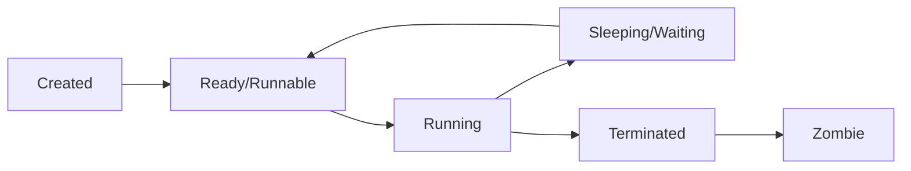

# Processes: A Complete Tutorial Guide

## Introduction

Welcome to this comprehensive tutorial on Linux processes! This guide will teach you how to:

- Describe what a process is and distinguish between types of processes
- Enumerate process attributes
- Manage processes using `ps` and `top`
- Understand load averages and other process metrics
- Manipulate processes (background/foreground)
- Schedule processes using `at`, `cron`, and `sleep`

Understanding processes is fundamental to system administration. A process is simply an instance of one or more related tasks executing on your computer.

---

## Part 1: What is a Process?

### Understanding Processes

A **process** is an instance of one or more related tasks (threads) executing on your computer.

**Key Concepts:**
- **A process is NOT the same as a program or command**
- A single command may start several processes simultaneously
- Some processes are independent; others are related
- Failure of one process may or may not affect others

### What Processes Use

Processes use many system resources:
- Memory (RAM)
- CPU cycles
- Peripheral devices (network cards, hard drives, printers, displays)

### The Kernel's Role

The kernel is responsible for:
- Allocating proper shares of resources to each process
- Ensuring optimized system utilization
- Scheduling processes on the CPU

### Process States



#### Process State Descriptions

| State | Description | Example |
|-------|-------------|---------|
| **Running** | Currently executing or waiting for CPU time | Active command |
| **Sleeping** | Waiting for something to happen | Waiting for user input |
| **Stopped** | Suspended (usually by signal) | Paused with Ctrl+Z |
| **Zombie** | Process completed, parent hasn't acknowledged | Orphaned process |

**What is a Zombie Process?**
- A child process that has completed
- Parent process hasn't "asked" about its state
- Shows up in process lists but isn't actually running
- Not alive but still in the system

### Process Types

| Type | Description | Example |
|------|-------------|---------|
| **Interactive** | Started by and attached to a terminal | Shell, text editors |
| **Batch** | Non-interactive, scheduled | Cron jobs, scripts |
| **Daemon** | Background services started at boot | httpd, sshd, systemd |
| **Kernel Thread** | Kernel-managed tasks | Scheduler, I/O |
| **User Process** | Started by users | Applications, commands |

### Process Attributes

| Attribute | Description |
|-----------|-------------|
| **PID** | Process ID (unique identifier) |
| **PPID** | Parent Process ID |
| **UID** | User ID (owner) |
| **GID** | Group ID |
| **Nice Value** | Priority setting |
| **State** | Running, sleeping, zombie, etc. |

---

## Part 2: Process IDs (PIDs)

### Understanding PIDs

The operating system keeps track of processes by assigning each a unique **Process ID (PID)**.

**PID Characteristics:**
- Unique identifier for each process
- Used to track process state, CPU usage, memory use
- New PIDs are usually assigned in ascending order
- PID 1 denotes the init process (or systemd)

### PID Types

| PID Type | Description |
|----------|-------------|
| **PID** | Process ID (the main identifier) |
| **PPID** | Parent Process ID (who started it) |
| **PGID** | Process Group ID (group of related processes) |
| **SID** | Session ID (terminal session) |
| **TID** | Thread ID (for multi-threaded processes) |

### Finding PIDs

```bash
# Display current shell's PID
echo $$

# Display parent process PID
echo $PPID

# Find PID of a process
pidof process_name

# Example
pidof bash
```

---

## Part 3: Process Priority and Nice Values

### What is Nice Value?

The **nice value** (or niceness) determines a process's priority:
- **Lower nice value = Higher priority**
- **Higher nice value = Lower priority**

**Priority Scale:**
```
-20 (Highest priority) ... 0 (Default) ... +19 (Lowest priority)
```

**Important:** This seems backwards! Lower number = higher priority.

### Why "Nice"?

The term comes from early Unix:
- A process with a high nice value is "being nice" to other processes
- It lets others go first

### Setting Priority with renice

**Syntax:**
```bash
renice [priority] [-p] PID
# OR
renice [priority] -u username
```

**Examples:**
```bash
# Lower priority (increase nice value)
renice +5 3077

# Raise priority (decrease nice value) - root only
sudo renice -5 3077

# Change priority for all user's processes
renice +10 -u student
```

**Important:** Only root can decrease the nice value (raise priority).

### Viewing Priority

**With ps:**
```bash
# View priority and nice values
ps -l

# Output shows:
# PRI - Priority (internal kernel value)
# NI  - Nice value
```

**With top:**
```bash
# Press 'r' to renice a process
# Then enter PID and new nice value
```

### Setting Priority When Starting a Process

```bash
# Start a process with a specific priority
nice -n 10 long_running_command

# Start with higher priority (root only)
sudo nice -n -10 important_command
```

---

## Part 4: Load Average

### What is Load Average?

The **load average** is the average of the load number for a given period of time.

**What Load Average Considers:**
- Processes actively running on a CPU
- Runnable processes waiting for CPU
- Sleeping processes waiting for resources

### Viewing Load Average

```bash
# Display load average
uptime

# Display load average
w

# Display load average (top shows it)
top
```

### Understanding Load Average Numbers

Load average is displayed as three numbers:
```
0.45  0.17  0.12
  │     │     │
  │     │     └── 15-minute average
  │     └── 5-minute average
  └── 1-minute average
```

### Interpreting Load Average

**For a Single-CPU System:**

| Load Average | Meaning |
|--------------|---------|
| **0.00 - 0.70** | Normal, system idle |
| **0.70 - 1.00** | Getting busy |
| **1.00** | 100% utilization |
| **> 1.00** | Overloaded (processes waiting) |

**For Multi-CPU Systems:**
Divide the load average by the number of CPUs.

**Example (4 CPUs):**
- Load average of 4.0 = 100% utilization
- Load average of 2.0 = 50% utilization
- Load average of 6.0 = 150% utilization (overloaded)

### When to Be Concerned

- **Short-term spikes** are usually not a problem
- **Sustained high load** may indicate issues
- Check 5-minute and 15-minute averages for trends

---

## Part 5: Background and Foreground Jobs

### Understanding Jobs

A **job** is a command launched from a terminal window.

| Job Type | Description |
|----------|-------------|
| **Foreground** | Runs directly from shell, blocks other jobs |
| **Background** | Runs detached from shell, allows other commands |

### Running Jobs in the Background

**Method 1 - Start in Background:**
```bash
# Use ampersand at the end
long_running_command &
```

**Method 2 - Suspend and Move to Background:**
```bash
# Start foreground job
long_running_command

# Suspend with Ctrl+Z
# Then move to background
bg
```

### Managing Jobs

```bash
# List background jobs
jobs

# List with PIDs
jobs -l

# Bring job to foreground
fg %job_number

# Send job to background
bg %job_number

# Kill a background job
kill %job_number
```

### Job Example

```bash
# Start a background job
$ sleep 1000 &
[1] 12345

# List jobs
$ jobs
[1]+  Running                 sleep 1000 &

# Bring to foreground
$ fg %1
sleep 1000

# Suspend (Ctrl+Z) and background again
^Z
[1]+  Stopped                 sleep 1000
$ bg %1
[1]+ sleep 1000 &
```

---

## Part 6: The ps Command

### What is ps?

**ps** (process status) displays information about currently running processes.

### Basic ps Usage

```bash
# Processes in current shell
ps

# Detailed output
ps -f

# All processes on system
ps -e

# All processes in full format
ps -ef

# All processes (BSD style)
ps aux

# Tree view
ps aux --forest
```

### Common ps Options

**System V Style (with -):**

| Option | Description |
|--------|-------------|
| `-e` | All processes |
| `-f` | Full format |
| `-l` | Long format |
| `-u user` | Processes for specific user |
| `-o` | Custom output format |

**BSD Style (without -):**

| Option | Description |
|--------|-------------|
| `a` | All processes with tty |
| `u` | User-oriented format |
| `x` | Processes without tty |
| `w` | Wide output |

### ps Output Fields

| Field | Description |
|-------|-------------|
| **PID** | Process ID |
| **PPID** | Parent Process ID |
| **USER** | Process owner |
| **%CPU** | CPU usage percentage |
| **%MEM** | Memory usage percentage |
| **VSZ** | Virtual memory size |
| **RSS** | Resident set size (physical memory) |
| **TTY** | Terminal |
| **STAT** | Process state |
| **START** | Start time |
| **TIME** | CPU time used |
| **COMMAND** | Command name |

### Understanding STAT (State) Codes

| Code | State |
|------|-------|
| **R** | Running or runnable |
| **S** | Sleeping (waiting for event) |
| **D** | Uninterruptible sleep (I/O) |
| **T** | Stopped (by signal) |
| **Z** | Zombie (defunct) |
| **X** | Dead (should not be seen) |

**Additional Characters:**
- `+` = Foreground process
- `s` = Session leader
- `<` = High priority
- `N` = Low priority
- `l` = Multi-threaded

### Customizing ps Output

```bash
# Custom columns
ps -eo pid,ppid,user,cmd

# Sort by memory usage
ps aux --sort=-%mem

# Sort by CPU usage
ps aux --sort=-%cpu

# Show only specific user
ps -u username

# Tree view
ps -ef --forest
```

### Process Relationships (Tree View)

```bash
# Show process tree
pstree

# Show tree with PIDs
pstree -p

# Show tree for specific process
pstree -p 1234
```

---

## Part 7: The top Command

### What is top?

**top** provides real-time, interactive monitoring of system processes.

### Starting top

```bash
# Basic
top

# Show only specific user's processes
top -u username

# Show a specific PID
top -p PID
```

### Understanding top Display

**Summary Area (First 5 Lines):**

| Line | Information |
|------|-------------|
| **1** | System time, uptime, users, load average |
| **2** | Total processes, running, sleeping, stopped, zombie |
| **3** | CPU usage: user, system, nice, idle, wait, hi, si, st |
| **4** | Physical memory: total, free, used, buff/cache |
| **5** | Swap memory: total, free, used, available |

**Process List:**
| Column | Description |
|--------|-------------|
| **PID** | Process ID |
| **USER** | Owner |
| **PR** | Priority |
| **NI** | Nice value |
| **VIRT** | Virtual memory |
| **RES** | Resident memory |
| **SHR** | Shared memory |
| **S** | State |
| **%CPU** | CPU usage |
| **%MEM** | Memory usage |
| **TIME+** | CPU time |
| **COMMAND** | Command |

### Interactive Commands in top

**Sorting:**
| Key | Action |
|-----|--------|
| **P** | Sort by CPU usage (default) |
| **M** | Sort by memory usage |
| **N** | Sort by PID |
| **T** | Sort by time |

**Process Control:**
| Key | Action |
|-----|--------|
| **r** | Renice a process |
| **k** | Kill a process |
| **n** | Change number of processes shown |

**Display:**
| Key | Action |
|-----|--------|
| **1** | Show individual CPUs |
| **h** | Show help |
| **q** | Quit top |

### Alternative Tools

```bash
# htop - Better visual interface
htop

# atop - Advanced monitoring
atop

# glances - System monitoring
glances
```

---

## Part 8: Killing Processes

### The kill Command

**Purpose:** Send signals to processes (usually to terminate them)

**Syntax:**
```bash
kill [options] PID
```

### Common Signals

| Signal | Number | Meaning |
|--------|--------|---------|
| **SIGTERM** | 15 | Terminate gracefully (default) |
| **SIGKILL** | 9 | Force terminate |
| **SIGSTOP** | 19 | Stop (suspend) process |
| **SIGCONT** | 18 | Continue stopped process |
| **SIGHUP** | 1 | Hang up (reload config) |

### Using kill

```bash
# Terminate gracefully
kill PID

# Force terminate
kill -9 PID
# OR
kill -SIGKILL PID

# Stop (suspend) process
kill -STOP PID

# Continue process
kill -CONT PID

# Send HUP signal (reload configuration)
kill -HUP PID
```

### killall - Kill by Name

```bash
# Kill all processes with a given name
killall process_name

# Force kill
killall -9 process_name
```

### pkill - Kill by Pattern

```bash
# Kill processes matching pattern
pkill pattern

# Kill with full command name
pkill -f full_command

# Kill processes of specific user
pkill -u username
```

### Important Notes

- You can only kill processes you own (unless root)
- Use SIGTERM first (graceful shutdown)
- Use SIGKILL only as last resort
- Killing important system processes may crash the system

---

## Part 9: Process Scheduling

### sleep - Pause Execution

**Purpose:** Delay execution for a specified time

**Syntax:**
```bash
sleep NUMBER[SUFFIX]
```

**Suffixes:**
| Suffix | Unit |
|--------|------|
| `s` | Seconds (default) |
| `m` | Minutes |
| `h` | Hours |
| `d` | Days |

**Examples:**
```bash
# Sleep for 5 seconds
sleep 5

# Sleep for 2 minutes
sleep 2m

# Sleep for 1 hour
sleep 1h

# Sleep for 3 days
sleep 3d
```

### at - Schedule One-Time Tasks

**Purpose:** Execute commands at a specified time (once)

**Syntax:**
```bash
at [time]
```

**Time Formats:**
| Format | Example | Description |
|--------|---------|-------------|
| **HH:MM** | `at 14:30` | Today at 2:30 PM |
| **HH:MM MM/DD/YY** | `at 14:30 12/25/24` | Specific date |
| **now + N minutes** | `at now + 30 minutes` | In 30 minutes |
| **noon, midnight** | `at noon` | At 12:00 |

**Examples:**
```bash
# Schedule backup at 2:30 AM
at 02:30
at> tar -czf backup.tar.gz /home
at> exit
# Press Ctrl+D to save

# Run script at midnight
at midnight -f /path/to/script.sh

# List scheduled jobs
atq

# Remove job
atrm job_number
```

### cron - Schedule Recurring Tasks

**Purpose:** Schedule jobs to run regularly

**Crontab File Format:**
Each line has six fields:
```
* * * * * command_to_execute
│ │ │ │ │
│ │ │ │ └── Day of week (0-7, 0 or 7 = Sunday)
│ │ │ └── Month (1-12)
│ │ └── Day of month (1-31)
│ └── Hour (0-23)
└── Minute (0-59)
```

**Special Characters:**
| Character | Meaning |
|-----------|---------|
| `*` | Any value |
| `,` | List of values |
| `-` | Range of values |
| `/` | Step values |
| `*/15` | Every 15 minutes |

**Editing Crontab:**
```bash
# Edit current user's crontab
crontab -e

# View current user's crontab
crontab -l

# Edit root's crontab
sudo crontab -e

# Remove crontab
crontab -r
```

**Cron Examples:**
```bash
# Run at 2:30 AM every day
30 2 * * * /path/to/backup.sh

# Run every 15 minutes
*/15 * * * * /path/to/check.sh

# Run at midnight on the 1st of each month
0 0 1 * * /path/to/monthly.sh

# Run at 9 AM on weekdays
0 9 * * 1-5 /path/to/weekday.sh

# Run every Sunday at 3 AM
0 3 * * 0 /path/to/sunday.sh
```

### anacron - Cron for Systems Not Always On

**Purpose:** Run jobs that might be missed if system is off

**System-wide cron:**
- `/etc/crontab` - System crontab
- `/etc/cron.d/` - Additional cron files
- `/etc/cron.hourly/` - Hourly scripts
- `/etc/cron.daily/` - Daily scripts
- `/etc/cron.weekly/` - Weekly scripts
- `/etc/cron.monthly/` - Monthly scripts

---

## Part 10: Process Monitoring with GNOME System Monitor

### Graphical Process Monitoring

**Access:**
- Applications → System Tools → System Monitor
- OR: `gnome-system-monitor`

**Tabs:**

| Tab | Information |
|-----|-------------|
| **Processes** | Running processes, sortable columns |
| **Resources** | CPU, memory, network graphs |
| **File Systems** | Disk usage and mounts |

**Features:**
- Sort by CPU/memory
- Kill processes (right-click)
- Change priority
- View resource usage graphs

---

## Practical Exercises

### Exercise 1: Viewing Processes

```bash
# View processes in current shell
ps

# View all processes on system
ps -ef | less

# View your processes with BSD style
ps aux | grep $USER

# View process tree
ps -ef --forest
```

### Exercise 2: Managing Process Priority

```bash
# Start a CPU-intensive task
dd if=/dev/zero of=/dev/null &

# Check its nice value
ps -l

# Lower its priority
renice +10 PID

# Try to raise priority (will fail if not root)
renice -10 PID

# As root, raise priority
sudo renice -10 PID
```

### Exercise 3: Using top

```bash
# Start top
top

# Practice:
# Press '1' to see individual CPUs
# Press 'M' to sort by memory
# Press 'r' to renice a process
# Press 'k' to kill a process
# Press 'q' to quit
```

### Exercise 4: Background Jobs

```bash
# Start a long-running command in background
sleep 1000 &

# View jobs
jobs

# Suspend the job
fg %1
# Then press Ctrl+Z

# Background it again
bg %1
```

### Exercise 5: Scheduling Tasks

```bash
# One-time task with at
at now + 2 minutes
at> echo "Hello" > ~/hello.txt
at> exit
# Press Ctrl+D

# Check scheduled jobs
atq

# Add cron job
crontab -e
# Add line: 0 9 * * * echo "Daily message" >> ~/daily.txt
# Save and exit

# View cron jobs
crontab -l
```

---

## Key Concepts Summary

### Process Basics

| Concept | Description |
|---------|-------------|
| **Process** | Running instance of a program |
| **PID** | Unique process identifier |
| **PPID** | Parent process ID |
| **Daemon** | Background service |
| **Zombie** | Dead process not cleaned up |

### Process Commands

| Command | Purpose |
|---------|---------|
| `ps` | View process information |
| `top` | Interactive process monitor |
| `kill` | Terminate processes |
| `jobs` | List background jobs |
| `fg` | Bring to foreground |
| `bg` | Send to background |

### Scheduling Commands

| Command | Purpose |
|---------|---------|
| `sleep` | Pause for a time |
| `at` | Schedule one-time tasks |
| `cron` | Schedule recurring tasks |
| `crontab` | Manage cron jobs |

### Priority Commands

| Command | Purpose |
|---------|---------|
| `nice` | Start process with priority |
| `renice` | Change process priority |

---

## Quick Reference Card

### Process States
```
R = Running
S = Sleeping
D = Uninterruptible sleep
T = Stopped
Z = Zombie
```

### ps Quick Reference
```bash
ps          # Current shell processes
ps -f       # Full format
ps -ef      # All processes, full format
ps aux      # All processes, BSD style
ps -u user  # User's processes
ps -ef --forest  # Tree view
```

### top Quick Reference
```
P = Sort by CPU
M = Sort by memory
N = Sort by PID
r = Renice process
k = Kill process
1 = Individual CPUs
q = Quit
```

### Scheduling Examples
```bash
# Run at 2:30 AM daily
30 2 * * * /script.sh

# Run every 15 minutes
*/15 * * * * /script.sh

# Run on the 1st of month
0 0 1 * * /script.sh

# Run weekdays at 9 AM
0 9 * * 1-5 /script.sh
```

### Killing Processes
```bash
kill PID          # Graceful termination
kill -9 PID       # Force termination
killall process   # Kill by name
pkill pattern     # Kill by pattern
```

---

## Additional Resources

### Manual Pages
```bash
man ps          # Process status
man top         # Interactive monitor
man kill        # Terminate processes
man at          # Schedule tasks
man crontab     # Cron configuration
man nice        # Set priority
```

### Online Resources
- **Process Management**: https://www.tldp.org/LDP/intro-linux/html/sect_04_01.html
- **Cron Guide**: https://crontab.guru

---

## Final Thoughts

**Key Takeaways:**

1. **Processes are running instances of programs**
2. **Each process has a unique PID**
3. **Priority can be adjusted with nice values**
4. **Load average indicates system utilization**
5. **Background jobs allow multitasking**
6. **Cron and at are powerful scheduling tools**

**Remember:**
- `ps` for static view, `top` for dynamic view
- Use `kill -15` before `kill -9`
- Monitor load averages for system health
- Schedule recurring tasks with cron
- Background processes with `&`

---

*This completes the Processes tutorial. You should now understand how to manage processes effectively in Linux!*