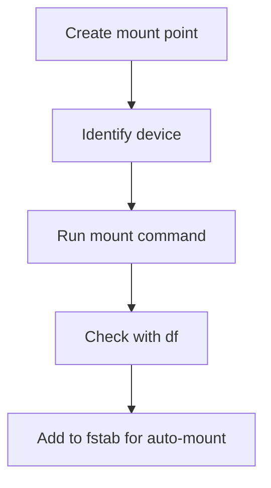

# File Operations: A Complete Tutorial Guide

## Introduction

Welcome to this comprehensive tutorial on Linux file operations! This guide will teach you how to:

- Explore the file system and its hierarchy
- Explain the file system architecture
- Compare files and identify different file types
- Backup and compress data in Linux

In Linux and all Unix-like operating systems, **"everything is a file"** — or at least it's treated as such. This means whether you are dealing with normal data files, documents, or devices like sound cards and printers, you interact with them through the same kind of input/output operations.

---

## Part 1: The Linux File System Hierarchy

### The File System Tree

The file system in Linux is structured like a tree:

```mermaid
graph TD
    A[/ Root Directory] --> B[/bin]
    A --> C[/boot]
    A --> D[/dev]
    A --> E[/etc]
    A --> F[/home]
    A --> G[/lib]
    A --> H[/media]
    A --> I[/mnt]
    A --> J[/proc]
    A --> K[/root]
    A --> L[/sbin]
    A --> M[/srv]
    A --> N[/sys]
    A --> O[/tmp]
    A --> P[/usr]
    A --> Q[/var]
```

**Key Points:**
- The tree is usually portrayed as inverted (root at top)
- The root directory is denoted by a `/` (forward slash)
- The root directory is NOT the same as the root user
- Paths are separated by forward slashes: `/usr/bin/ls`

### Supported File System Types

Linux supports many file system types:

| File System | Description | Use Case |
|-------------|-------------|----------|
| **ext3** | Journaling file system | Older Linux systems |
| **ext4** | Modern journaling file system | Default for most distributions |
| **XFS** | High performance | Enterprise, large files |
| **Btrfs** | Advanced features, snapshots | Modern systems |
| **squashfs** | Compressed read-only | Live CDs, containers |
| **FAT** | Windows compatibility | USB drives |
| **NTFS** | Windows file system | Windows partitions |

### The FHS (Filesystem Hierarchy Standard)

The FHS provides a standard directory structure for Linux systems.

**Purpose:**
- Ensures consistency across distributions
- Makes system administration easier
- Helps developers create portable applications

---

## Part 2: Major Directories Explained

### / (Root Directory)

The **root directory** is the top of the file system hierarchy.

**Important:** The root directory (`/`) is different from the root user's home directory (`/root`).

### /home - User Home Directories

**Purpose:** Contains personal directories for all regular users.

**Structure:**
```bash
/home/
├── student/
│   ├── Desktop/
│   ├── Documents/
│   └── Downloads/
├── alice/
└── bob/
```

**Best Practices:**
- Often mounted on a separate partition
- Can be exported via NFS for network access
- Each user has their own subdirectory
- User-specific configuration files are stored here (hidden files starting with `.`)

### /bin and /sbin - Essential Binaries

| Directory | Purpose | Examples |
|-----------|---------|----------|
| **/bin** | Essential user commands | `ls`, `cp`, `mv`, `cat`, `ps` |
| **/sbin** | System administration commands | `fdisk`, `iptables`, `shutdown` |

**Note:** On modern systems, these may be symbolic links to `/usr/bin` and `/usr/sbin`.

### /usr - User Utilities and Applications

**Purpose:** Non-essential programs and scripts (theoretically not needed for booting).

**Subdirectories:**

| Directory | Contents |
|-----------|----------|
| **/usr/bin** | Most user commands |
| **/usr/sbin** | System administration commands |
| **/usr/lib** | Libraries |
| **/usr/share** | Architecture-independent data |
| **/usr/local** | Locally installed software |
| **/usr/include** | Header files for development |
| **/usr/src** | Source code |

### /etc - System Configuration

**Purpose:** Home for system configuration files.

**Key Configuration Files:**

| File | Purpose |
|------|---------|
| **/etc/passwd** | User account information |
| **/etc/shadow** | Encrypted passwords |
| **/etc/group** | Group definitions |
| **/etc/fstab** | File system mount configuration |
| **/etc/resolv.conf** | DNS configuration |
| **/etc/hostname** | System hostname |
| **/etc/hosts** | Static hostname mapping |
| **/etc/ssh/** | SSH configuration |

**Note:** Only the super user can modify files in `/etc`.

### /var - Variable Data

**Purpose:** Files that change in size and content as the system runs.

**Key Subdirectories:**

| Directory | Contents |
|-----------|----------|
| **/var/log** | System log files |
| **/var/spool** | Print queues, mail spools |
| **/var/tmp** | Temporary files (persists across reboots) |
| **/var/lib** | Package database files |
| **/var/www** | Web server files |
| **/var/ftp** | FTP service files |

**Why Separate:**
- Prevents log files from filling up root partition
- Can be mounted on its own file system
- Contains variable-size data

### /boot - Boot Files

**Purpose:** Contains files needed to boot the system.

**Key Files:**

| File | Purpose |
|------|---------|
| **vmlinuz** | Compressed Linux kernel |
| **initramfs** | Initial RAM file system |
| **System.map** | Kernel symbol table (debugging) |
| **config** | Kernel configuration |
| **grub/** or **grub2/** | GRUB boot loader files |

**Example:**
```bash
/boot/
├── vmlinuz-5.4.0-26-generic
├── initrd.img-5.4.0-26-generic
├── System.map-5.4.0-26-generic
├── config-5.4.0-26-generic
└── grub/
    └── grub.cfg
```

### /lib - Shared Libraries

**Purpose:** Contains common code shared by applications.

**Location:**
- `/lib` - Essential libraries for `/bin` and `/sbin`
- `/usr/lib` - Libraries for `/usr/bin` and `/usr/sbin`
- `/lib64` - 64-bit libraries (on 64-bit systems)

**Library Types:**
- **Static libraries** - `.a` extension (included in program)
- **Shared libraries** - `.so` extension (loaded at runtime)

**Kernel Modules:**
- Located in `/lib/modules/kernel-version/`
- Can be loaded/unloaded without restarting the system

### /proc - Process Information (Pseudo File System)

**Purpose:** Virtual file system containing kernel data structures.

**Characteristics:**
- Exists only in memory
- No permanent presence on disk
- Shows constantly changing kernel data

**Key Entries:**

| Entry | Contents |
|-------|----------|
| **/proc/cpuinfo** | CPU information |
| **/proc/meminfo** | Memory information |
| **/proc/uptime** | System uptime |
| **/proc/version** | Kernel version |
| **/proc/[PID]** | Process-specific information |
| **/proc/filesystems** | Supported file systems |

**Viewing /proc:**
```bash
# View CPU information
cat /proc/cpuinfo

# View memory information
cat /proc/meminfo

# View process information (PID 1)
cat /proc/1/status
```

### /dev - Device Files

**Purpose:** Contains device nodes for hardware and software devices.

**Key Device Files:**

| Device | Purpose |
|--------|---------|
| **/dev/sda** | First hard disk |
| **/dev/sda1** | First partition on first disk |
| **/dev/lp0** | First parallel printer |
| **/dev/null** | Discard all data |
| **/dev/zero** | Provide null bytes |
| **/dev/random** | Random number generator |
| **/dev/tty** | Current terminal |

**Note:** Created dynamically by udev when devices are detected.

### /mnt - Mount Directory

**Purpose:** Temporary mount point for file systems.

**Use Cases:**
- Mounting temporary partitions
- Network file systems
- Loopback file systems (files pretending to be partitions)

### /media - Removable Media

**Purpose:** Mount point for removable media.

**Location:**
- **Modern systems**: `/run/media/username/`
- **Older systems**: `/media/`

**Example:**
```bash
/run/media/student/FEDORA/readme.txt
```

### /tmp - Temporary Files

**Purpose:** Temporary files created by programs.

**Characteristics:**
- Usually cleared on reboot
- Accessible to all users
- Files may be deleted periodically

### /root - Root User Home

**Purpose:** Home directory for the root (super) user.

**Note:** NOT the same as the root directory (`/`).

---

## Part 3: Mounting File Systems

### What is Mounting?

**Mounting** is the process of attaching a file system to the file system tree at a specific directory (mount point).

### The mount Command

**Syntax:**
```bash
mount [options] device mount_point
```

**Examples:**
```bash
# Mount a partition
sudo mount /dev/sda5 /home

# Mount all file systems in /etc/fstab
sudo mount -a

# Mount with specific file system type
sudo mount -t ext4 /dev/sdb1 /mnt/data

# View all mounted file systems
mount
```

### The umount Command

**Purpose:** Unmount a file system.

**Syntax:**
```bash
umount mount_point
# OR
umount device
```

**Examples:**
```bash
# Unmount by mount point
sudo umount /home

# Unmount by device
sudo umount /dev/sda5
```

**Note:** The command is `umount` (not `unmount`)!

### /etc/fstab - File System Table

**Purpose:** Configuration file for automatic mounting at boot.

**Format:**
```
device    mount_point    fstype    options    dump    pass
```

**Example:**
```bash
# /etc/fstab
/dev/sda1    /           ext4    defaults    0    1
/dev/sda2    /home       ext4    defaults    0    2
/dev/sda3    swap        swap    defaults    0    0
UUID=1234    /mnt/data   ext4    defaults    0    0
```

**Column Descriptions:**

| Column | Description |
|--------|-------------|
| **device** | Partition or UUID |
| **mount_point** | Where to mount |
| **fstype** | File system type |
| **options** | Mount options |
| **dump** | Backup frequency (0 or 1) |
| **pass** | fsck order (0 = skip) |

### df - Disk Free

**Purpose:** Display information about mounted file systems.

**Syntax:**
```bash
df [options]
```

**Common Options:**

| Option | Description |
|--------|-------------|
| `-h` | Human-readable sizes |
| `-T` | Show file system type |
| `-i` | Show inode information |

**Examples:**
```bash
# Show all mounted file systems
df

# Human-readable with file system types
df -Th

# Show inode usage
df -i
```

**Sample Output:**
```bash
$ df -Th
Filesystem     Type      Size  Used Avail Use% Mounted on
/dev/sda1      ext4       20G   8.0G   11G  43% /
/dev/sda2      ext4       50G   5.2G   42G  11% /home
tmpfs          tmpfs     1.9G   8.0M  1.9G   1% /run
```

---

## Part 4: Comparing Files

### diff - Compare Files

**Purpose:** Compare files line by line.

**Syntax:**
```bash
diff [options] file1 file2
```

**Common Options:**

| Option | Description |
|--------|-------------|
| `-u` | Unified format (with context) |
| `-c` | Context format |
| `-i` | Ignore case differences |
| `-w` | Ignore whitespace |
| `-B` | Ignore blank lines |
| `-q` | Report only if files differ |

**Examples:**
```bash
# Compare two files
diff file1.txt file2.txt

# Unified format (good for patches)
diff -u old_file new_file

# Ignore whitespace
diff -w file1.txt file2.txt

# Compare directories
diff -r dir1/ dir2/
```

**diff Output Interpretation:**

| Symbol | Meaning |
|--------|---------|
| `<` | Line from first file |
| `>` | Line from second file |
| `-` | Line removed |
| `+` | Line added |
| `!` | Line changed |

### diff3 - Compare Three Files

**Purpose:** Compare three files, using one as the common ancestor.

**Syntax:**
```bash
diff3 file_common file1 file2
```

**Use Case:** When two people have modified the same file independently.

### cmp - Compare Binary Files

**Purpose:** Compare two files byte by byte.

**Syntax:**
```bash
cmp [options] file1 file2
```

**Examples:**
```bash
# Compare binary files
cmp image1.jpg image2.jpg

# Show byte position of first difference
cmp -b file1 file2
```

### patch - Apply Patch Files

**Purpose:** Apply differences (patches) to files.

**Creating a Patch:**
```bash
# Create patch file
diff -u old_file new_file > patch_file.patch
diff -urN old_dir/ new_dir/ > patch_dir.patch
```

**Applying a Patch:**
```bash
# Apply patch to a file
patch < patch_file.patch

# Apply patch to a directory
patch -p1 < patch_dir.patch
```

**Common Options:**

| Option | Description |
|--------|-------------|
| `-pN` | Strip N leading path components |
| `-R` | Reverse the patch |
| `--dry-run` | Test without applying |

---

## Part 5: File Types and Identification

### The file Command

**Purpose:** Determine the type of a file.

**Syntax:**
```bash
file [options] filename
```

**Why Use `file`?**
- Linux doesn't rely on file extensions
- Contents determine the file type
- Files may have misleading names

**Examples:**
```bash
# Determine file type
file file.txt
# Output: file.txt: ASCII text

file script.sh
# Output: script.sh: Bourne-Again shell script

file program
# Output: program: ELF 64-bit LSB executable

file image.jpg
# Output: image.jpg: JPEG image data

# Show all file types in a directory
file *
```

**Common File Types Detected:**

| Output | Description |
|--------|-------------|
| **ASCII text** | Plain text file |
| **Bourne-Again shell script** | Bash script |
| **ELF executable** | Binary executable |
| **JPEG image data** | Image file |
| **gzip compressed data** | Compressed file |
| **directory** | Directory |

---

## Part 6: Backing Up Data

### Simple Backup with cp

**Purpose:** Copy files and directories.

**Examples:**
```bash
# Copy a file
cp important.txt backup.txt

# Copy directory recursively
cp -r project/ project_backup/

# Copy with preservation of attributes
cp -a project/ project_backup/

# Interactive (ask before overwrite)
cp -i file.txt backup.txt
```

### Advanced Backup with rsync

**Purpose:** Efficient file synchronization and backup.

**Key Features:**
- Only copies changed files
- Can copy over network
- Efficient (only copies differences)
- Preserves permissions, timestamps

**Syntax:**
```bash
rsync [options] source destination
```

**Common Options:**

| Option | Description |
|--------|-------------|
| `-a` | Archive mode (preserve everything) |
| `-r` | Recursive |
| `-v` | Verbose |
| `-z` | Compress data |
| `-P` | Show progress |
| `--delete` | Delete files in destination not in source |
| `--dry-run` | Test without actually copying |
| `-e ssh` | Use SSH for remote transfer |

**Examples:**
```bash
# Local backup
rsync -av /home/student/ /backup/student/

# Backup with compression and progress
rsync -avzP /home/student/ /backup/student/

# Remote backup (push)
rsync -avz /home/student/ user@remote:/backup/

# Remote backup (pull)
rsync -avz user@remote:/data/ /local/data/

# Delete files that are no longer in source
rsync -av --delete /source/ /destination/

# Test first (dry run)
rsync -av --dry-run /source/ /destination/
```

### Rsync vs cp Comparison

| Feature | cp | rsync |
|---------|-----|-------|
| **Efficiency** | Copies everything | Only changes |
| **Network Transfer** | No | Yes |
| **Resume Capable** | No | Yes |
| **Preserve Attributes** | With `-a` | With `-a` |
| **Delete Option** | No | Yes |
| **Dry Run** | No | Yes |

**Important:** Always test with `--dry-run` first!

---

## Part 7: Compressing Files

### Common Compression Tools

| Tool | Extension | Compression | Best For |
|------|-----------|-------------|----------|
| **gzip** | .gz | Good | General use |
| **bzip2** | .bz2 | Better (slower) | Better compression |
| **xz** | .xz | Best (slowest) | Maximum compression |
| **zip** | .zip | Good | Windows compatibility |

### gzip - GNU Zip

**Purpose:** Compress or decompress files.

**Syntax:**
```bash
gzip [options] filename
```

**Common Options:**

| Option | Description |
|--------|-------------|
| `-d` | Decompress |
| `-k` | Keep original file |
| `-v` | Verbose |
| `-r` | Recursive |

**Examples:**
```bash
# Compress a file
gzip file.txt
# Creates: file.txt.gz

# Keep original file
gzip -k file.txt

# Decompress
gzip -d file.txt.gz

# View compressed file
zcat file.txt.gz
```

### gunzip - Decompress gzip Files

**Purpose:** Decompress files compressed with gzip.

**Syntax:**
```bash
gunzip filename.gz
```

**Example:**
```bash
gunzip file.txt.gz
```

### bzip2 - Better Compression

**Purpose:** Compress files with better compression ratio.

**Examples:**
```bash
# Compress (better than gzip)
bzip2 file.txt
# Creates: file.txt.bz2

# Decompress
bunzip2 file.txt.bz2

# Keep original
bzip2 -k file.txt
```

### xz - Highest Compression

**Purpose:** Compress with highest compression ratio.

**Examples:**
```bash
# Compress (best compression)
xz file.txt
# Creates: file.txt.xz

# Decompress
unxz file.txt.xz

# Keep original
xz -k file.txt
```

### zip - ZIP Format

**Purpose:** Create ZIP archives (Windows compatible).

**Syntax:**
```bash
zip [options] archive_name files
```

**Examples:**
```bash
# Create ZIP archive
zip archive.zip file1 file2 file3

# Include directories
zip -r archive.zip directory/

# Unzip
unzip archive.zip
```

### Comparison of Compression Tools

| Tool | Compression Speed | Decompression Speed | Compression Ratio |
|------|-------------------|--------------------|-------------------|
| **gzip** | Fast | Fast | Good |
| **bzip2** | Slow | Medium | Better |
| **xz** | Very Slow | Medium | Best |

**Recommendation:**
- **gzip**: General use, fast
- **bzip2**: Better compression, acceptable speed
- **xz**: Maximum compression, slow

---

## Part 8: Practical Exercises

### Exercise 1: Explore the File System

```bash
# 1. Navigate to root
cd /

# 2. List important directories
ls -la /bin
ls -la /etc
ls -la /home

# 3. Check mounted file systems
df -Th

# 4. View /proc information
cat /proc/cpuinfo
cat /proc/meminfo

# 5. Explore boot directory
ls -la /boot
```

### Exercise 2: Mount a File System

```bash
# 1. Check current mounts
mount

# 2. View /etc/fstab
cat /etc/fstab

# 3. Mount a partition (example)
sudo mount /dev/sdb1 /mnt/backup

# 4. Verify mount
df -Th | grep backup

# 5. Unmount
sudo umount /mnt/backup
```

### Exercise 3: Compare Files

```bash
# 1. Create two files
echo "Hello World" > file1.txt
echo "Hello Linux" > file2.txt

# 2. Compare them
diff file1.txt file2.txt

# 3. Create a patch
diff -u file1.txt file2.txt > patch.txt

# 4. View patch
cat patch.txt

# 5. Apply patch
patch file1.txt < patch.txt
```

### Exercise 4: Backup with rsync

```bash
# 1. Create a test directory
mkdir -p test_dir/subdir
touch test_dir/file1 test_dir/file2 test_dir/subdir/file3

# 2. Test backup (dry run)
rsync -av --dry-run test_dir/ backup_dir/

# 3. Perform actual backup
rsync -av test_dir/ backup_dir/

# 4. Verify
ls -la backup_dir/

# 5. Add a file and sync again
touch test_dir/file4
rsync -av test_dir/ backup_dir/
```

### Exercise 5: Compress and Decompress

```bash
# 1. Create a file
echo "This is a test file" > test.txt

# 2. Compress with gzip
gzip -k test.txt

# 3. Compress with bzip2
bzip2 -k test.txt

# 4. Compress with xz
xz -k test.txt

# 5. View sizes
ls -lh test.txt*

# 6. Decompress
gunzip test.txt.gz
bunzip2 test.txt.bz2
unxz test.txt.xz
```

---

## Key Concepts Summary

### File System Hierarchy

| Directory | Purpose |
|-----------|---------|
| `/` | Root directory |
| `/home` | User home directories |
| `/etc` | System configuration |
| `/var` | Variable data (logs) |
| `/boot` | Boot files |
| `/tmp` | Temporary files |
| `/proc` | Process information (virtual) |
| `/dev` | Device files |
| `/usr` | User utilities |
| `/lib` | Shared libraries |

### File Operations

| Command | Purpose |
|---------|---------|
| `mount` | Attach file system |
| `umount` | Detach file system |
| `df` | Disk space usage |
| `diff` | Compare files |
| `patch` | Apply changes |
| `file` | Determine file type |
| `rsync` | Efficient backup |
| `gzip` | Compress files |

### Mount Operations Flow



---

## Quick Reference Card

### Mount Commands
```
mount -a                 → Mount all in fstab
mount /dev/sda1 /mnt    → Mount partition
umount /mnt             → Unmount
df -Th                  → Show mounted filesystems
```

### File Comparison
```
diff file1 file2        → Show differences
diff -u old new        → Unified diff
patch < patch          → Apply patch
file filename          → Determine type
```

### Backup Commands
```
cp -a source dest       → Copy preserving attributes
rsync -av source dest   → Efficient sync
rsync -avzP source dest → With compression and progress
rsync --dry-run         → Test first
```

### Compression Commands
```
gzip -k file           → Compress (keep original)
gunzip file.gz         → Decompress
bzip2 -k file         → Better compression
xz -k file            → Best compression
```

---

## Additional Resources

### Documentation
```bash
man 8 mount      # Mount command
man 8 umount     # Unmount command
man 5 fstab      # fstab file format
man 1 diff       # File comparison
man 1 rsync      # Backup tool
man 1 gzip       # Compression
```

### Online Resources
- **Linux Filesystem Hierarchy**: https://www.pathname.com/fhs/
- **rsync Documentation**: https://rsync.samba.org/
- **GNU Coreutils**: https://www.gnu.org/software/coreutils/

---

## Final Thoughts

**Key Takeaways:**

1. **Everything is a file** - Devices, processes, and data all use the same interface
2. **FHS provides consistency** - Standard directory structure across distributions
3. **Mounting is essential** - File systems must be attached to the tree
4. **File types are determined by content** - Not by extension
5. **rsync is powerful** - Efficient backup and synchronization tool
6. **Compression saves space** - Various tools for different needs

**Remember:**
- Always test rsync with `--dry-run` first
- Use `df -h` to check disk space
- Check `/etc/fstab` for auto-mount configuration
- `file` command helps identify unknown files

---

*This completes the File Operations tutorial. You should now understand the Linux file system hierarchy and be able to perform essential file operations!*