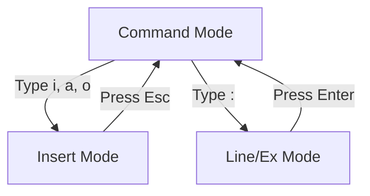

# Text Editors: A Complete Tutorial Guide

## Introduction

Welcome to this comprehensive tutorial on Linux text editors! This guide will teach you how to:

- Create and edit files using various Linux text editors
- Use **Nano** (simple text-based editor)
- Use **gedit** (simple graphical editor)
- Use **Vi/Vim** (advanced editor, text-based and graphical)
- Use **Emacs** (advanced editor, text-based and graphical)

At some point, you will need to manually edit text files. You might be:
- Writing a script for bash or other command interpreters
- Altering a system or application configuration file
- Developing source code for programming languages
- Composing offline email

**Important:** Word processors (like LibreOffice Writer) are NOT text editors. They add invisible formatting that will make configuration files unusable. You need a **plain text editor**.

---

## Part 1: Creating Files Without an Editor

Sometimes you don't need a full editor. Here are quick ways to create files from the command line.

### Method 1: Using echo

```bash
# Create a new file (single > overwrites)
echo "Line 1" > file.txt

# Append to file (>> appends)
echo "Line 2" >> file.txt
echo "Line 3" >> file.txt
```

### Method 2: Using cat with Redirection

```bash
# Create file with multiple lines
cat > file.txt << EOF
Line 1
Line 2
Line 3
EOF

# Or type directly (Ctrl+D to finish)
cat > file.txt
Line 1
Line 2
Line 3
^D
```

### Method 3: Using printf

```bash
# Create with formatted text
printf "Line 1\nLine 2\nLine 3\n" > file.txt
```

---

## Part 2: Nano - Simple Text Editor

### What is Nano?

**Nano** is a simple, easy-to-use text-based editor. It's perfect for beginners and quick edits.

**Key Features:**
- No learning curve
- On-screen prompts at the bottom
- Available on all distributions
- Good for quick configuration edits

### Starting Nano

```bash
# Open existing file
nano filename.txt

# Create new file
nano newfile.txt
```

### Nano Interface

```
GNU nano 4.8                    filename.txt
This is the content of the file.


^G Get Help   ^O Write Out   ^R Read File   ^Y Prev Page
^X Exit       ^J Justify     ^W Where Is    ^V Next Page
```

**Bottom Line Shows:**
- **^** means the Ctrl key
- Available commands at all times

### Essential Nano Commands

| Command | Action |
|---------|--------|
| `Ctrl+G` | Display help |
| `Ctrl+X` | Exit editor |
| `Ctrl+O` | Write (save) file |
| `Ctrl+R` | Insert file contents |
| `Ctrl+C` | Show cursor position |
| `Ctrl+W` | Search for text |
| `Ctrl+K` | Cut line |
| `Ctrl+U` | Paste (uncut) |
| `Ctrl+_` | Go to line number |

### Common Nano Workflow

```bash
# 1. Open file
nano myfile.txt

# 2. Type your content (just start typing)

# 3. Save: Ctrl+O
#    Press Enter to confirm filename

# 4. Exit: Ctrl+X
```

### Nano Example Session

```bash
# Start nano with a new file
$ nano hello.txt

# Type some content
Hello, World!
This is my first nano file.

# Save: Ctrl+O
# Exit: Ctrl+X
```

---

## Part 3: gedit - Simple Graphical Editor

### What is gedit?

**gedit** is the default graphical text editor for GNOME desktop environment.

**Key Features:**
- Very easy to use
- Similar to Notepad in Windows
- Syntax highlighting for programming
- Plugins for extended functionality
- Auto-save and session management

### Starting gedit

```bash
# Open existing file
gedit filename.txt

# Create new file
gedit newfile.txt

# Open multiple files
gedit file1.txt file2.txt
```

**From GUI:**
- Applications → Accessories → Text Editor
- Or click the text editor icon

### gedit Interface

```
┌─────────────────────────────────────────────────┐
│ [Menu Bar] File | Edit | View | Search | Tools  │
├─────────────────────────────────────────────────┤
│ [Toolbar] Open | Save | Print | Undo | Redo     │
├─────────────────────────────────────────────────┤
│                                                 │
│  This is the content of the file.              │
│  Line numbers are shown on the side.           │
│                                                 │
│                                                 │
├──────────────────────────────────────────────────┤
│ [Status Bar] Line: 1  Col: 1  [Tab: 4 spaces]  │
└─────────────────────────────────────────────────┘
```

### Common gedit Features

| Feature | Description |
|---------|-------------|
| **Syntax Highlighting** | Color-coded for programming languages |
| **Line Numbers** | Shows line numbers on the side |
| **Search/Replace** | Find and replace text |
| **Plugins** | Extend functionality |
| **Spell Check** | Check spelling (if installed) |
| **Auto-indent** | Automatic indentation for code |

### gedit Plugins

**Enabled by default:**
- File Browser Panel
- Spell Checker
- External Tools

**Available to install:**
- Code Comment
- Snippets
- Terminal
- Color Picker

### gedit Example Session

```bash
# Start gedit
$ gedit script.sh

# Type a bash script
#!/bin/bash
echo "Hello, World!"

# Save: Ctrl+S
# Exit: Ctrl+Q
```

---

## Part 4: Vi/Vim - Advanced Editor

### What is Vi/Vim?

**Vi** (Visual editor) is a powerful, modal editor available on ALL Linux systems. **Vim** (Vi Improved) is the modern version.

**Key Characteristics:**
- Available on virtually every Linux/Unix system
- Modal (different modes for different tasks)
- Very efficient once learned
- Steep learning curve
- Can work without a GUI
- Graphical versions available (gvim)

### Vi/Vim Modes

Vi has **three modes**. This is the most important concept to understand!



| Mode | Purpose | How to Enter |
|------|---------|--------------|
| **Command Mode** | Navigate, delete, copy, paste | **Esc** (default) |
| **Insert Mode** | Type/edit text | **i**, **a**, **o** |
| **Line Mode** | Save, quit, search, replace | **:** |

**Critical:** Always know which mode you're in. The same key does different things in different modes!

### Starting Vi/Vim

```bash
# Open file with vi
vi filename.txt

# Open file with vim
vim filename.txt

# Open graphical vim
gvim filename.txt

# Start vim tutorial
vimtutor
```

### Essential Vi Commands

#### Exiting and Saving

| Command | Action |
|---------|--------|
| `:w` | Save file |
| `:wq` | Save and quit |
| `:x` | Save and quit (if changes) |
| `:q` | Quit (no changes) |
| `:q!` | Quit without saving |
| `:w newname` | Save as newname |

#### Inserting Text

| Command | Action |
|---------|--------|
| `i` | Insert before cursor |
| `I` | Insert at beginning of line |
| `a` | Append after cursor |
| `A` | Append at end of line |
| `o` | Open new line below |
| `O` | Open new line above |
| `r` | Replace single character |
| `R` | Replace mode (overwrite) |

#### Cursor Movement

| Command | Action |
|---------|--------|
| `h` | Left |
| `j` | Down |
| `k` | Up |
| `l` | Right |
| `w` | Next word |
| `b` | Previous word |
| `0` | Beginning of line |
| `$` | End of line |
| `gg` | Top of file |
| `G` | Bottom of file |
| `:n` | Line number n |
| `Ctrl+f` | Page down |
| `Ctrl+b` | Page up |

#### Deleting Text

| Command | Action |
|---------|--------|
| `x` | Delete character |
| `dw` | Delete word |
| `dd` | Delete line |
| `d$` | Delete to end of line |
| `d0` | Delete to beginning of line |
| `dG` | Delete to end of file |
| `dgg` | Delete to beginning of file |

#### Copying and Pasting

| Command | Action |
|---------|--------|
| `yw` | Yank (copy) word |
| `yy` | Yank (copy) line |
| `p` | Paste after cursor |
| `P` | Paste before cursor |
| `"+y` | Copy to system clipboard |
| `"+p` | Paste from system clipboard |

#### Undo and Redo

| Command | Action |
|---------|--------|
| `u` | Undo |
| `Ctrl+r` | Redo |

#### Searching

| Command | Action |
|---------|--------|
| `/pattern` | Search forward |
| `?pattern` | Search backward |
| `n` | Next match |
| `N` | Previous match |
| `:noh` | Clear search highlight |

#### Replacing Text

| Command | Action |
|---------|--------|
| `:%s/old/new/g` | Replace all occurrences |
| `:%s/old/new/gc` | Replace with confirmation |
| `:s/old/new/` | Replace current line |
| `:n,ms/old/new/g` | Replace lines n to m |

### Vi Example Session

```bash
# 1. Open file
$ vi hello.txt

# 2. Enter insert mode
Press i

# 3. Type content
Hello, World!
This is my vi file.

# 4. Exit insert mode
Press Esc

# 5. Save and quit
:wq

# 6. Open again
$ vi hello.txt

# 7. Search for "World"
/World

# 8. Delete line
dd

# 9. Save and quit
:wq
```

### Vimtutor - Learn Vi

```bash
# Start the vi tutorial
vimtutor

# This takes about 30 minutes
# It teaches basic vi commands
# Do it!
```

### Graphical Vim (gvim)

```bash
# Start graphical vim
gvim filename.txt

# Features:
# - Menus and toolbars
# - Mouse support
# - Syntax highlighting
# - Color schemes
# - Same commands as vim
```

---

## Part 5: Emacs - Advanced Editor

### What is Emacs?

**Emacs** is a powerful, extensible editor that's a popular alternative to Vi.

**Key Characteristics:**
- Available on all Linux systems
- **No modes** (unlike Vi)
- Highly customizable (Lisp)
- Can do email, debugging, etc.
- Steep learning curve
- Both GUI and text versions

### Starting Emacs

```bash
# Text mode
emacs -nw filename.txt

# Graphical mode
emacs filename.txt

# Start emacs tutorial
emacs
# Then: Ctrl+h t
```

### Emacs Interface

**Graphical Emacs:**
```
┌─────────────────────────────────────────────────┐
│ [Menu Bar] File | Edit | Options | Buffers ...  │
├─────────────────────────────────────────────────┤
│ [Toolbar]                                      │
├─────────────────────────────────────────────────┤
│                                                 │
│ This is the content of the file.               │
│                                                 │
│                                                 │
├─────────────────────────────────────────────────┤
│ [Status Bar] - Emacs: file.txt    (Text) ---- │
└─────────────────────────────────────────────────┘
```

### Essential Emacs Commands

**Key Notation:**
- `C-` means Ctrl key (e.g., `C-x` = Ctrl+X)
- `M-` means Meta/Alt key (e.g., `M-x` = Alt+X)
- `C-x C-f` means Ctrl+X followed by Ctrl+F

#### Exiting and Saving

| Command | Action |
|---------|--------|
| `C-x C-s` | Save file |
| `C-x C-w` | Save as (write) |
| `C-x C-c` | Quit Emacs |
| `C-x C-f` | Open file |

#### Cursor Movement

| Command | Action |
|---------|--------|
| `C-f` | Forward character |
| `C-b` | Backward character |
| `C-n` | Next line |
| `C-p` | Previous line |
| `C-a` | Beginning of line |
| `C-e` | End of line |
| `M-f` | Forward word |
| `M-b` | Backward word |
| `M-<` | Beginning of file |
| `M->` | End of file |
| `C-v` | Page down |
| `M-v` | Page up |
| `M-g g` | Go to line number |

#### Editing Commands

| Command | Action |
|---------|--------|
| `C-d` | Delete character |
| `M-d` | Delete word |
| `C-k` | Kill (cut) line |
| `C-w` | Kill region |
| `C-y` | Yank (paste) |
| `C-@` | Set mark (start region) |
| `C-x h` | Select all |
| `C-/` | Undo |

#### Searching

| Command | Action |
|---------|--------|
| `C-s` | Search forward |
| `C-r` | Search backward |
| `M-%%` | Query replace |
| `M-%` | Replace |

#### Multiple Buffers/Windows

| Command | Action |
|---------|--------|
| `C-x 2` | Split window vertically |
| `C-x 3` | Split window horizontally |
| `C-x o` | Switch to other window |
| `C-x 1` | Delete other windows |
| `C-x b` | Switch buffer |
| `C-x k` | Kill buffer |

#### Help System

| Command | Action |
|---------|--------|
| `C-h t` | Tutorial |
| `C-h f` | Describe function |
| `C-h k` | Describe key |
| `C-h a` | Command apropos |
| `C-h i` | Info system |

### Emacs Example Session

```bash
# 1. Start emacs
$ emacs hello.txt

# 2. Type content (just start typing)
Hello, World!
This is my emacs file.
Line three.

# 3. Save
C-x C-s

# 4. Search for "World"
C-s World

# 5. Move to end of line
C-e

# 6. Open new file in another window
C-x 2
C-x C-f newfile.txt

# 7. Switch between windows
C-x o

# 8. Save all and quit
C-x C-c
```

### Emacs Tutorial

```bash
# Start emacs
emacs

# Then press:
C-h t

# This launches the interactive tutorial
# Takes about 30-45 minutes
# Well worth it!
```

---

## Part 6: Editor Comparison

### Quick Comparison Table

| Feature | Nano | gedit | Vi/Vim | Emacs |
|---------|------|-------|--------|-------|
| **Learning Curve** | Easy | Easy | Steep | Steep |
| **Modes** | No | No | Yes | No |
| **GUI Available** | No | Yes | Yes | Yes |
| **Text Mode** | Yes | No | Yes | Yes |
| **Syntax Highlighting** | No | Yes | Yes | Yes |
| **Available Everywhere** | Yes | No | Yes | Yes |
| **Plugins/Extensions** | No | Yes | Yes | Yes |

### When to Use Each Editor

| Editor | Best For |
|--------|----------|
| **Nano** | Quick config edits, beginners |
| **gedit** | GUI users, simple editing |
| **Vi/Vim** | Power users, minimal systems, remote work |
| **Emacs** | Power users, extensibility, multiple tasks |

### Which Editor Should You Learn?

**Beginners should start with:**
1. **Nano** - Quick and easy
2. **gedit** - GUI simplicity

**Then learn one advanced editor:**
- **Vi/Vim** - Universal, always available
- **Emacs** - Highly customizable, powerful

---

## Part 7: Command Line File Editing Without Editing

### Using sed for Non-Interactive Editing

```bash
# Replace text in file (sed)
sed -i 's/old/new/g' file.txt

# Delete lines containing pattern
sed -i '/pattern/d' file.txt

# Insert at beginning
sed -i '1i\Text to insert' file.txt
```

### Using awk for Text Processing

```bash
# Print specific columns
awk '{print $1, $3}' file.txt

# Print lines matching pattern
awk '/pattern/ {print}' file.txt
```

---

## Practical Exercises

### Exercise 1: Using Nano

```bash
# 1. Create a new file
nano testfile.txt

# 2. Type some content
# 3. Save (Ctrl+O)
# 4. Exit (Ctrl+X)

# 5. View the file
cat testfile.txt
```

### Exercise 2: Using gedit

```bash
# 1. Open gedit
gedit script.sh

# 2. Type a bash script
#!/bin/bash
echo "Hello from gedit"

# 3. Save (Ctrl+S)
# 4. Make it executable
chmod +x script.sh

# 5. Run it
./script.sh
```

### Exercise 3: Vi/Vim Basics

```bash
# 1. Start vimtutor
vimtutor

# 2. Follow the first 3 lessons

# 3. Create a file
vim practice.txt

# 4. Practice:
# - Insert text (i)
# - Save (:w)
# - Quit (:q)
# - Search (/word)
# - Delete line (dd)
# - Undo (u)
```

### Exercise 4: Emacs Basics

```bash
# 1. Start emacs
emacs -nw practice.txt

# 2. Type some text

# 3. Practice:
# - Save (C-x C-s)
# - Search (C-s word)
# - Move to end (C-e)
# - Move to beginning (C-a)
# - Delete line (C-k)
# - Undo (C-/)

# 4. Quit (C-x C-c)
```

### Exercise 5: Editor Challenge

```bash
# Create a file with this content:
# (Use any editor)
# 
# Name: John Doe
# Email: john@example.com
# Department: IT
# 
# 1. Change the name
# 2. Add a phone line
# 3. Delete the email line
# 4. Save the changes
```

---

## Quick Reference Card

### Nano Quick Reference
```
Ctrl+O  → Save
Ctrl+X  → Exit
Ctrl+G  → Help
Ctrl+W  → Search
Ctrl+K  → Cut line
Ctrl+U  → Paste
```

### Vi/Vim Quick Reference
```
i       → Insert mode
Esc     → Command mode
:w      → Save
:q      → Quit
:q!     → Quit without save
:wq     → Save and quit
dd      → Delete line
yy      → Copy line
p       → Paste
/word   → Search
u       → Undo
```

### Emacs Quick Reference
```
C-x C-s → Save
C-x C-c → Quit
C-x C-f → Open file
C-s     → Search
C-k     → Cut line
C-y     → Paste
C-/     → Undo
```

---

## Final Thoughts

**Key Takeaways:**

1. **Text editors are essential** for system administration
2. **Nano is easiest** for beginners
3. **Vi/Vim is universal** - learn at least basics
4. **Emacs is powerful** - great for developers
5. **Each editor has its place**

**Recommendation:**
1. Start with **Nano** for quick edits
2. Learn **gedit** for GUI editing
3. Learn **Vi/Vim** basics (it's everywhere!)
4. Explore **Emacs** if you need power and extensibility

**Remember:**
- Different editors for different tasks
- The best editor is the one you know well
- Practice to become proficient

---

## Additional Resources

### Learning Vi/Vim
- `vimtutor` - Built-in tutorial
- https://vim.fandom.com - Vim wiki
- https://vim-adventures.com - Interactive game

### Learning Emacs
- `C-h t` - Built-in tutorial
- https://www.gnu.org/software/emacs/ - Official site
- https://emacs.sexy - Community resources

### General
- `man nano` - Nano manual
- `man vim` - Vim manual
- `man emacs` - Emacs manual

---

*This completes the Text Editors tutorial. Practice with different editors to find which one works best for you!*