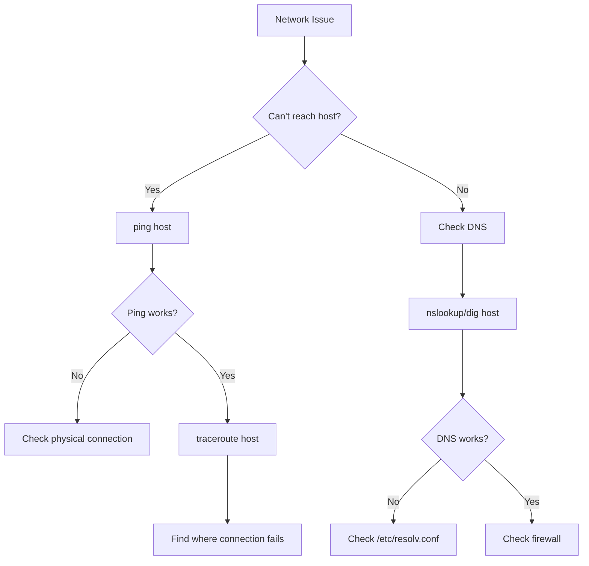

# Network Operations: A Complete Tutorial Guide

## Introduction

Welcome to this comprehensive tutorial on Linux network operations! This guide will teach you how to:

- Explain basic networking concepts including types of networks and addressing
- Configure network interfaces
- Use basic networking utilities like `ping`, `traceroute`, and `ip`
- Use graphical and text-based browsers
- Transfer files using `ftp`, `scp`, `curl`, and `wget`
- Use secure shell (SSH) for remote access

A **network** is a group of computers and computing devices connected together through communication channels such as cables or wireless media.

---

## Part 1: Networking Basics

### What is a Network?

A network allows connected devices to:
- Communicate with each other
- Share devices (printers, scanners, servers)
- Share and manage information
- Access resources across computers

**Types of Networks:**

| Type | Description | Example |
|------|-------------|---------|
| **LAN** | Local Area Network | Home/Office network |
| **WAN** | Wide Area Network | Internet |
| **MAN** | Metropolitan Area Network | City-wide network |

### Internet Protocol (IP) Addresses

Every device on a network must have a **unique IP address** for routing packets of information.

**What is an IP Address?**
- A logical network address
- Essential for routing packets
- Can be static (manual) or dynamic (DHCP)

### IP Address Versions

| Version | Bits | Address Count | Status |
|---------|------|---------------|--------|
| **IPv4** | 32 bits | ~4.3 billion | Most common |
| **IPv6** | 128 bits | 3.4×10³⁸ | Newer, more addresses |

### IPv4 Address Structure

An IPv4 address is divided into **four octets** (8-bit sections):

```
Example: 192.168.1.100
          │   │   │   │
          └───┴───┴───┴─── Octets (8-bit each)
```

### IPv4 Address Classes

| Class | First Octet | Net ID | Host ID | Max Hosts |
|-------|-------------|--------|---------|-----------|
| **A** | 1-126 | First octet | Last 3 octets | ~16.7 million |
| **B** | 128-191 | First 2 octets | Last 2 octets | ~65,000 |
| **C** | 192-223 | First 3 octets | Last octet | 254 |
| **D** | 224-239 | Multicast | - | - |
| **E** | 240-255 | Experimental | - | - |

### Network Address Translation (NAT)

**NAT** enables sharing one IP address among many computers:
- Used in home and organizational networks
- Router has one external IP address
- Each device gets a local internal address

### Dynamic Host Configuration Protocol (DHCP)

**DHCP** automatically assigns IP addresses:
- Dynamic (can change)
- Reduces manual configuration
- Most common in home/small networks

### Domain Name System (DNS)

**DNS** converts IP addresses to human-readable hostnames:

```
104.244.42.65  →  www.example.com  (easier to remember!)
```

**DNS Resolution Order:**
1. `/etc/hosts` (local file)
2. DNS server (network)

### Important Network Files

```bash
# Hostname configuration
cat /etc/hostname

# Local hostname resolution
cat /etc/hosts

# DNS resolution (older systems)
cat /etc/resolv.conf

# DNS resolution (modern systems)
cat /etc/systemd/resolved.conf
```

### Common Hosts File Entries

```bash
# /etc/hosts
127.0.0.1       localhost
192.168.1.10    webserver
192.168.1.20    database
::1             localhost ipv6
```

---

## Part 2: Network Configuration Commands

### ip - Modern Network Configuration

**Purpose:** View and configure network interfaces (modern)

**Syntax:**
```bash
ip [options] object command
```

**Common Objects:**

| Object | Purpose |
|--------|---------|
| `addr` | IP addresses |
| `link` | Network interfaces |
| `route` | Routing tables |
| `neigh` | ARP cache |

**Examples:**
```bash
# Show all IP addresses
ip addr show

# Show in brief format
ip -br addr show

# Show specific interface
ip addr show eth0

# Show routing table
ip route show

# Bring interface up/down
sudo ip link set eth0 up
sudo ip link set eth0 down

# Add IP address
sudo ip addr add 192.168.1.100/24 dev eth0
```

### ifconfig - Legacy Network Configuration

**Purpose:** View and configure network interfaces (older)

**Syntax:**
```bash
ifconfig [interface] [options]
```

**Examples:**
```bash
# Show all interfaces
ifconfig -a

# Show specific interface
ifconfig eth0

# Configure interface
sudo ifconfig eth0 192.168.1.100 netmask 255.255.255.0

# Bring up/down
sudo ifconfig eth0 up
sudo ifconfig eth0 down
```

**Note:** Some distributions no longer include `ifconfig` by default. Install with:
```bash
sudo apt install net-tools     # Debian/Ubuntu
sudo dnf install net-tools     # Fedora/RHEL
```

### route - Routing Table Management

**Purpose:** View and modify routing tables

**Examples:**
```bash
# View routing table
route -n

# Add default gateway
sudo route add default gw 192.168.1.1

# Add static route
sudo route add -net 10.0.0.0 netmask 255.0.0.0 gw 192.168.1.1

# Delete route
sudo route del default gw 192.168.1.1
```

---

## Part 3: Network Testing and Troubleshooting

### ping - Test Network Connectivity

**Purpose:** Check if remote host is alive and responding

**Syntax:**
```bash
ping [options] hostname/IP
```

**Common Options:**

| Option | Description |
|--------|-------------|
| `-c N` | Send N packets |
| `-i N` | Interval between packets |
| `-s N` | Packet size |

**Examples:**
```bash
# Continuous ping (Ctrl+C to stop)
ping google.com

# Send 4 packets only
ping -c 4 google.com

# Ping specific IP
ping 8.8.8.8

# Ping with 100 byte packets
ping -s 100 8.8.8.8
```

### traceroute - Trace Network Path

**Purpose:** Inspect route packets take to reach destination

**Syntax:**
```bash
traceroute [options] hostname/IP
```

**Examples:**
```bash
# Trace route to google.com
traceroute google.com

# Trace with numeric IPs only
traceroute -n google.com

# Trace with specific max hops
traceroute -m 30 google.com
```

### netstat - Network Statistics

**Purpose:** Display network connections and routing tables

**Syntax:**
```bash
netstat [options]
```

**Common Options:**

| Option | Description |
|--------|-------------|
| `-r` | Routing table |
| `-t` | TCP connections |
| `-u` | UDP connections |
| `-l` | Listening ports |
| `-p` | Program name |
| `-n` | Numeric addresses |

**Examples:**
```bash
# Show routing table
netstat -r

# Show all listening ports
netstat -lntp

# Show all connections
netstat -tunap

# Show interface statistics
netstat -i
```

### ss - Socket Statistics (Modern netstat)

**Purpose:** Display socket information (replacement for netstat)

**Examples:**
```bash
# Show all listening ports
ss -lntp

# Show all TCP connections
ss -tunap

# Show all UDP connections
ss -u

# Show listening ports with program names
ss -lntp | grep LISTEN
```

### ethtool - Query Network Interface

**Purpose:** Display and change network interface settings

**Syntax:**
```bash
ethtool [options] interface
```

**Examples:**
```bash
# Show interface details
sudo ethtool eth0

# Show speed and duplex
sudo ethtool eth0 | grep -E "Speed|Duplex"

# Change speed/duplex
sudo ethtool -s eth0 speed 100 duplex full
```

### nmap - Network Scanning

**Purpose:** Scan networks for open ports and hosts

**Installation:**
```bash
sudo apt install nmap     # Debian/Ubuntu
sudo dnf install nmap     # Fedora/RHEL
```

**Examples:**
```bash
# Scan local network for open ports
sudo nmap 192.168.1.0/24

# Scan specific host
nmap 192.168.1.10

# Scan for specific ports
nmap -p 22,80,443 192.168.1.10

# Quick scan
nmap -F 192.168.1.10
```

### Hostname Commands

```bash
# Show current hostname
hostname

# Show fully qualified domain name
hostname -f

# Show IP address for hostname
host google.com

# Nslookup (older)
nslookup google.com

# Dig (detailed)
dig google.com
```

---

## Part 4: Web Browsers

### Graphical Browsers

| Browser | Description | Installation |
|---------|-------------|--------------|
| **Firefox** | Default on most distributions | `sudo apt install firefox` |
| **Google Chrome** | Popular browser | Download from website |
| **Chromium** | Open-source Chrome | `sudo apt install chromium-browser` |
| **Epiphany** | GNOME's browser | `sudo apt install epiphany-browser` |
| **Opera** | Feature-rich browser | Download from website |

### Text-Based Browsers

| Browser | Description | Installation |
|---------|-------------|--------------|
| **links** | Simple text browser | `sudo apt install links` |
| **lynx** | Classic text browser | `sudo apt install lynx` |
| **w3m** | Advanced text browser | `sudo apt install w3m` |
| **elinks** | Enhanced links | `sudo apt install elinks` |

**Examples:**
```bash
# Browse with links
links https://www.example.com

# Browse with lynx
lynx https://www.example.com

# Browse with w3m
w3m https://www.example.com
```

---

## Part 5: File Transfer Utilities

### wget - Download Files

**Purpose:** Download files from the web (command line)

**Syntax:**
```bash
wget [options] URL
```

**Common Options:**

| Option | Description |
|--------|-------------|
| `-O` | Output filename |
| `-c` | Resume download |
| `-q` | Quiet mode |
| `-r` | Recursive download |
| `-np` | No parent directories |

**Examples:**
```bash
# Download a file
wget https://example.com/file.zip

# Download with custom name
wget -O myfile.zip https://example.com/file.zip

# Resume interrupted download
wget -c https://example.com/largefile.iso

# Download entire website (recursive)
wget -r https://example.com

# Download with authentication
wget --user=user --password=pass https://example.com
```

### curl - Transfer Data

**Purpose:** Transfer data from/to a server (more flexible than wget)

**Syntax:**
```bash
curl [options] URL
```

**Common Options:**

| Option | Description |
|--------|-------------|
| `-o` | Output to file |
| `-L` | Follow redirects |
| `-I` | Show headers only |
| `-s` | Silent mode |
| `-X` | HTTP method |

**Examples:**
```bash
# View webpage source
curl https://example.com

# Download file
curl -o file.zip https://example.com/file.zip

# Follow redirects
curl -L https://example.com

# Show only headers
curl -I https://example.com

# POST data
curl -X POST -d "data=value" https://api.example.com

# Download with authentication
curl -u user:pass https://example.com
```

### FTP - File Transfer Protocol

**Purpose:** Transfer files using FTP

**Syntax:**
```bash
ftp [options] hostname
```

**Basic FTP Commands:**

| Command | Purpose |
|---------|---------|
| `open host` | Connect to host |
| `user user pass` | Login |
| `ls` | List files |
| `cd dir` | Change directory |
| `get file` | Download file |
| `put file` | Upload file |
| `mget` | Download multiple |
| `binary` | Binary mode |
| `quit` | Exit |

**Example:**
```bash
# Start FTP session
ftp ftp.example.com

# Inside FTP
ftp> ls
ftp> cd documents
ftp> get file.txt
ftp> quit
```

### sftp - Secure FTP

**Purpose:** Secure file transfer using SSH

**Syntax:**
```bash
sftp [options] user@host
```

**Features:**
- Uses SSH encryption
- Same commands as FTP
- More secure than FTP

**Examples:**
```bash
# Connect to remote
sftp user@remote-host

# Copy file from remote
sftp user@remote-host:/remote/file /local/

# List remote directory
sftp user@remote-host ls /remote/path
```

### scp - Secure Copy

**Purpose:** Securely copy files between hosts (uses SSH)

**Syntax:**
```bash
scp [options] source destination
```

**Common Options:**

| Option | Description |
|--------|-------------|
| `-r` | Recursive (copy directories) |
| `-P` | Port number |
| `-i` | Identity file |

**Examples:**
```bash
# Copy local file to remote
scp file.txt user@host:/path/

# Copy remote file to local
scp user@host:/remote/file /local/

# Copy directory recursively
scp -r /local/dir user@host:/remote/

# Copy with specific port
scp -P 2222 file.txt user@host:/path/

# Copy to home directory
scp file.txt user@host:
```

---

## Part 6: Secure Shell (SSH)

### What is SSH?

**SSH** (Secure Shell) is a cryptographic network protocol for secure data communication, remote services, and other secure services.

**Key Uses:**
- Remote system administration
- Secure file transfers
- Tunneling/port forwarding
- Command execution

### Basic SSH Connection

**Syntax:**
```bash
ssh [options] user@host
ssh [options] host
```

**Examples:**
```bash
# Connect with same username
ssh remote-host

# Connect with specific user
ssh user@remote-host

# Connect with port
ssh -p 2222 user@remote-host

# Run command remotely
ssh user@remote-host "ls -la"

# Run command with sudo
ssh user@remote-host "sudo systemctl restart nginx"
```

### SSH Authentication Methods

**1. Password Authentication:**
```bash
ssh user@host
# Enter password when prompted
```

**2. Key-Based Authentication (More Secure):**
```bash
# Generate key pair
ssh-keygen -t rsa -b 4096

# Copy public key to server
ssh-copy-id user@host

# Now connect without password
ssh user@host
```

### SSH Configuration

**Client Configuration:** `~/.ssh/config`

```bash
# Example config
Host myserver
    HostName 192.168.1.10
    User admin
    Port 2222
    IdentityFile ~/.ssh/id_rsa

# Then connect with just:
ssh myserver
```

### SSH Tunneling

```bash
# Local port forwarding
ssh -L 8080:localhost:80 user@host

# Remote port forwarding
ssh -R 8080:localhost:80 user@host

# SOCKS proxy
ssh -D 1080 user@host
```

---

## Part 7: Web Services and APIs

### Checking Web Services

```bash
# Check if web server is running
curl -I http://localhost

# Check with HTTP status
curl -s -o /dev/null -w "%{http_code}" http://localhost

# Download and check
wget -q --spider http://localhost
echo $?  # 0 = success
```

### API Testing with curl

```bash
# GET request
curl https://api.example.com/users

# GET with headers
curl -H "Authorization: Bearer token" https://api.example.com/users

# POST with JSON
curl -X POST -H "Content-Type: application/json" \
     -d '{"name": "John", "email": "john@example.com"}' \
     https://api.example.com/users

# PUT request
curl -X PUT -H "Content-Type: application/json" \
     -d '{"name": "Jane"}' \
     https://api.example.com/users/1

# DELETE request
curl -X DELETE https://api.example.com/users/1
```

---

## Part 8: Network Troubleshooting Workflow

### Common Network Issues and Commands



### Troubleshooting Commands

```bash
# 1. Check physical connectivity
ping -c 4 gateway-ip

# 2. Check DNS resolution
nslookup example.com

# 3. Trace the route
traceroute -n example.com

# 4. Check listening services
ss -lntp

# 5. Check network interfaces
ip addr show

# 6. Check routing
ip route show

# 7. Check firewall
sudo iptables -L

# 8. Test specific port
nc -zv host port
telnet host port
```

---

## Practical Exercises

### Exercise 1: Network Discovery

```bash
# 1. Find your IP address
ip addr show

# 2. Find your default gateway
ip route show | grep default

# 3. Find DNS servers
cat /etc/resolv.conf

# 4. Ping your gateway
ping -c 4 $(ip route show | grep default | awk '{print $3}')

# 5. Check internet connectivity
ping -c 4 8.8.8.8
```

### Exercise 2: DNS Testing

```bash
# 1. Resolve a hostname
host google.com

# 2. Get detailed DNS info
dig google.com

# 3. Test DNS with specific server
dig @8.8.8.8 google.com

# 4. Add to local hosts file
echo "192.168.1.100 myserver" | sudo tee -a /etc/hosts

# 5. Test the new hostname
ping -c 2 myserver
```

### Exercise 3: File Transfer

```bash
# 1. Download a file with wget
wget https://www.example.com/file.zip

# 2. Download with curl
curl -o file.zip https://www.example.com/file.zip

# 3. Copy to remote (scp)
scp file.zip user@host:/tmp/

# 4. Get remote file
scp user@host:/remote/file ./

# 5. Download with authentication
wget --user=user --password=pass https://example.com/protected/
```

### Exercise 4: Remote Access (SSH)

```bash
# 1. Connect to remote
ssh user@host

# 2. Run remote command
ssh user@host "df -h"

# 3. Generate SSH key
ssh-keygen -t rsa

# 4. Copy key to remote
ssh-copy-id user@host

# 5. Now connect without password
ssh user@host
```

### Exercise 5: Web Testing

```bash
# 1. Check website headers
curl -I https://www.example.com

# 2. Download website recursively
wget -r -np https://www.example.com/docs/

# 3. Test API endpoint
curl https://api.github.com/users

# 4. Check web server status
curl -s -o /dev/null -w "%{http_code}\n" http://localhost
```

---

## Quick Reference Card

### Essential Network Commands

```bash
ip addr show           # Show IP addresses
ip route show          # Show routing table
ping host              # Test connectivity
traceroute host        # Trace network path
ss -lntp               # Show listening ports
nslookup host          # DNS lookup
dig host               # Detailed DNS
```

### File Transfer

```bash
wget URL               # Download file
curl -o file URL       # Download with curl
scp file user@host:    # Copy to remote
scp user@host:file .   # Copy from remote
sftp user@host         # Secure FTP
```

### Remote Access

```bash
ssh user@host          # SSH login
ssh user@host cmd      # Run command remotely
ssh-keygen -t rsa      # Generate SSH key
ssh-copy-id user@host  # Copy SSH key
```

### Browser Commands

```bash
links URL              # Text browser
lynx URL               # Text browser
w3m URL                # Text browser
```

---

## Key Concepts Summary

### Network Addresses

| Type | Description | Example |
|------|-------------|---------|
| **IPv4** | 32-bit address | 192.168.1.100 |
| **IPv6** | 128-bit address | 2001:db8::1 |
| **MAC** | Hardware address | 00:11:22:AA:BB:CC |
| **Hostname** | Human-readable | example.com |

### Network Tools

| Tool | Purpose |
|------|---------|
| `ping` | Test connectivity |
| `traceroute` | Trace network path |
| `ip` | Configure interfaces |
| `ss` | Show socket stats |
| `nslookup` | DNS queries |
| `wget` | Download files |
| `curl` | Transfer data |
| `ssh` | Remote access |
| `scp` | Secure copy |

### Common Protocols

| Protocol | Port | Purpose |
|----------|------|---------|
| **SSH** | 22 | Secure shell |
| **HTTP** | 80 | Web traffic |
| **HTTPS** | 443 | Secure web |
| **FTP** | 21 | File transfer |
| **DNS** | 53 | Name resolution |
| **DHCP** | 67/68 | IP assignment |

---

## Additional Resources

### Manual Pages
```bash
man ip
man ping
man ssh
man scp
man wget
man curl
man netstat
man ss
```

### Online Resources
- **Linux Networking**: https://www.tldp.org/LDP/nag2/
- **SSH Documentation**: https://www.openssh.com/
- **Curl Documentation**: https://curl.se/docs/

---

## Final Thoughts

**Key Takeaways:**

1. **IP addresses** are essential for network communication
2. **DNS** translates names to IP addresses
3. **DHCP** simplifies IP address management
4. **ping** is the first troubleshooting step
5. **SSH** provides secure remote access
6. **wget** and **curl** handle downloads
7. **scp** and **sftp** transfer files securely

**Remember:**
- Always secure SSH with keys, not passwords
- Use `ping` to test basic connectivity
- Use `traceroute` to find where connections fail
- Use `ss` instead of `netstat` on modern systems
- Test network with both names and IP addresses

---

*This completes the Network Operations tutorial. You should now have a good working knowledge of Linux networking from both graphical and command line perspectives!*