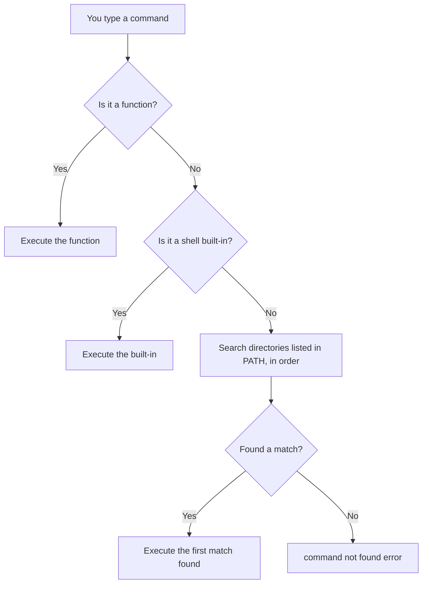
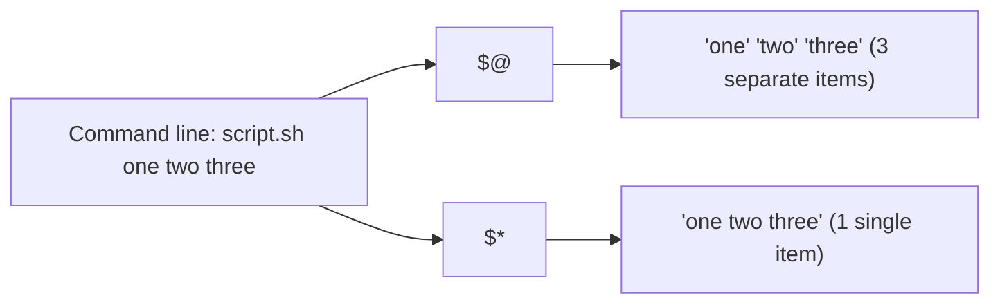

# Positional Parameters and the `for` Loop in Bash

## Goal of This Lesson

In this lesson, we will learn about **positional parameters** and the **`for` loop**. We will build a script that reads usernames typed on the command line and generates a password for each one.

---

## 1. Parameter vs Argument

Before going further, it is important to understand two terms that are often confused:

- **Parameter** — a variable that is used inside the shell script.
- **Argument** — the actual data passed into the shell script from the command line.

In simple words: an **argument** you type on the command line becomes the value stored inside a **parameter** in the script.

---

## 2. What Are Positional Parameters

Positional parameters are special variables that hold the values typed on the command line when a script is executed.

| Parameter | Meaning |
|---|---|
| `$0` | The name (or path) of the script itself |
| `$1` | The first argument passed to the script |
| `$2` | The second argument passed to the script |
| `$3` | The third argument passed to the script |
| ... | and so on |

### Example Script

```bash
#!/bin/bash
# This script demonstrates positional parameters

echo $0
```

Run it:

```bash
chmod 755 luser-demo06.sh
./luser-demo06.sh
```

Output:

```
./luser-demo06.sh
```

`$0` shows exactly how the script was called on the command line.

### Different Ways of Calling a Script Change `$0`

```bash
./luser-demo06.sh          # $0 becomes: ./luser-demo06.sh
/vagrant/luser-demo06.sh   # $0 becomes: /vagrant/luser-demo06.sh
```

Whatever you type to call the script is exactly what gets stored in `$0`.

---

## 3. A Detour: Understanding the `PATH` Variable

To fully understand why `$0` behaves differently, we need to understand the **command search path**, stored in the environment variable `PATH`.

### What `PATH` Does

`PATH` is a colon-separated list of directories where the shell looks for commands.

### How Bash Decides What to Run



Built-in commands you have already used include `echo`, `read`, `type`, and `help`.

### Checking Your `PATH`

```bash
echo $PATH
```

Example output:

```
/usr/local/bin:/usr/bin:/usr/local/sbin:...
```

Bash checks these directories **in order**, left to right, and runs the first matching command it finds.

> **Note:** `PATH` is not guaranteed to be the same for every user or system. You can also change `PATH` inside your own scripts.

---

## 4. The `which` Command

### Syntax

```bash
which [OPTION] COMMAND
```

| Option | Meaning |
|---|---|
| `-a` | Show **all** matching executables found in `PATH`, not just the first one |

### Example

```bash
which head
```

Output:

```
/usr/bin/head
```

This tells you which program will actually run when you type `head`.

### Demonstration: Command Name Conflicts

If you create your own script named `head` and place it earlier in the `PATH` (for example, in `/usr/local/bin`), it will run **instead of** the real `head` command, because Bash uses the **first match** it finds.

```bash
sudo vim /usr/local/bin/head
```

```bash
#!/bin/bash
echo "hello from my head"
```

```bash
chmod 755 /usr/local/bin/head
which head
```

Output:

```
/usr/local/bin/head
```

Using `which -a head` shows **both** matching locations:

```
/usr/local/bin/head
/usr/bin/head
```

### Overriding by Using the Full Path

To bypass whatever is found first in `PATH`, simply give the full path to the command you want:

```bash
/usr/bin/head -n1 /etc/passwd
```

### Cleaning Up

```bash
sudo rm /usr/local/bin/head
```

---

## 5. The Bash Hash Table Quirk

Bash remembers the location of a command after finding it once, using an internal **hash table**. This saves time by not searching `PATH` every time.

### Checking What Bash Has Remembered

```bash
type head
```

Output (before deleting our fake `head`):

```
head is hashed (/usr/local/bin/head)
```

### The Problem

If you delete a command after Bash has already "hashed" its location, Bash may still try to run it from the old (now missing) path:

```bash
head
```

Output:

```
bash: /usr/local/bin/head: No such file or directory
```

### The Fix: `hash -r`

#### Syntax

```bash
hash [-r]
```

| Option | Meaning |
|---|---|
| `-r` | Forget all remembered (hashed) command locations |

```bash
hash -r
type head
```

Now Bash searches `PATH` again and finds the correct location.

```bash
help hash
```

> **Note:** This issue is rare in real use, because commands don't usually appear and disappear during a single shell session or script execution. Still, it is good to know about.

---

## 6. Back to Positional Parameters: `$0` and `PATH`

### Proving the Script Is Not in `PATH`

```bash
which luser-demo06
```

If not found, it lists the `PATH` directories it searched, but shows nothing found.

### Placing the Script Into `PATH`

```bash
sudo cp luser-demo06.sh /usr/local/bin
```

Now run it without specifying a path:

```bash
luser-demo06.sh
```

`$0` now shows the **full path**:

```
/usr/local/bin/luser-demo06.sh
```

### Summary: What Gets Stored in `$0`

| How the script is called | Value stored in `$0` |
|---|---|
| `./luser-demo06.sh` | `./luser-demo06.sh` |
| `/vagrant/luser-demo06.sh` | `/vagrant/luser-demo06.sh` |
| `luser-demo06.sh` (found via `PATH`) | Full path where it was found, e.g. `/usr/local/bin/luser-demo06.sh` |

### Cleanup

```bash
sudo rm /usr/local/bin/luser-demo06.sh
```

---

## 7. Splitting a Path: `basename` and `dirname`

### `basename`

#### Syntax

```bash
basename PATH
```

Strips the directory part and (optionally) a suffix from a file path, leaving only the file name.

```bash
basename /vagrant/luser-demo06.sh
```

Output:

```
luser-demo06.sh
```

> `basename` does not check if the file actually exists — it just processes the text of the path.

```bash
basename /not/here
```

Output:

```
here
```

Even though `/not/here` does not exist, `basename` still returns `here`.

### `dirname`

#### Syntax

```bash
dirname PATH
```

Strips the last component (the file name) from a path, leaving only the directory part.

```bash
dirname /vagrant/luser-demo06.sh
```

Output:

```
/vagrant
```

```bash
dirname /this/is/not/here
```

Output:

```
/this/is/not
```

Again, `dirname` does not check whether the path exists.

### Using Them in a Script

You can use **command substitution** (`$(command)`) to insert the output of a command directly, without saving it to a variable first:

```bash
#!/bin/bash
# This script demonstrates positional parameters

echo "You executed this command: $0"
echo "You used $(dirname $0) as the path to the $(basename $0) script"
```

Run it two different ways:

```bash
./luser-demo06.sh
```

```
You executed this command: ./luser-demo06.sh
You used . as the path to the luser-demo06.sh script
```

```bash
/vagrant/luser-demo06.sh
```

```
You executed this command: /vagrant/luser-demo06.sh
You used /vagrant as the path to the luser-demo06.sh script
```

> Command substitution (`$(...)`) can either be assigned to a variable, or used directly inside another command like `echo`. Both styles are valid — using a variable can make code easier to read, but it is a matter of style.

---

## 8. Counting Arguments: `$#`

### What It Means

`$#` expands to the number of positional parameters (arguments) passed to the script.

```bash
echo "You supplied ${#} arguments on the command line"
```

> The curly braces `{}` are optional. `$#` and `${#}` both work. Using braces just makes the variable boundary clearer, especially in more complex expressions.

### Testing It

```bash
./luser-demo06.sh
```

```
You supplied 0 arguments on the command line
```

```bash
./luser-demo06.sh hello
```

```
You supplied 1 arguments on the command line
```

```bash
./luser-demo06.sh one two three
```

```
You supplied 3 arguments on the command line
```

### Quoting Groups Arguments Together

If you wrap multiple words in quotation marks, they are treated as **one single argument**:

```bash
./luser-demo06.sh "A B C" D
```

```
You supplied 2 arguments on the command line
```

```bash
./luser-demo06.sh one "this is two" three
```

```
You supplied 3 arguments on the command line
```

Here, `"this is two"` is treated as a single argument because it is enclosed in quotes, even though it contains spaces.

---

## 9. Validating Input With `if`

We want to make sure the user supplies **at least one username** on the command line. If not, we should show a usage message and stop the script.

### Syntax Reminder

```bash
if [[ CONDITION ]]; then
    COMMANDS
fi
```

Useful test option:

| Option | Meaning |
|---|---|
| `-lt` | Less than |

You can check all test options with:

```bash
help test
```

### Example: Usage Check

```bash
if [[ "${#}" -lt 1 ]]; then
    echo "Usage: $0 USERNAME [USERNAME2 ...]"
    exit 1
fi
```

**How this works:**

- `${#}` is the number of arguments supplied.
- If it is less than `1` (meaning zero arguments were given), a usage message is shown.
- `$0` is used instead of typing the script name manually — it automatically shows exactly how the user called the script.
- `exit 1` stops the script with a non-zero exit status, which means "failure."

> **Style note:** You could also write `if [[ "${#}" -eq 0 ]]` (equal to zero) instead of `-lt 1` (less than one). Both work the same way in this case, since arguments can never be negative. Choose whichever is clearer to you.

### Testing the Check

```bash
./luser-demo06.sh
```

```
Usage: ./luser-demo06.sh USERNAME [USERNAME2 ...]
```

Check the exit status:

```bash
echo $?
```

```
1
```

Now supply arguments so the check passes:

```bash
./luser-demo06.sh alice
```

```
You supplied 1 arguments on the command line
```

---

## 10. The `for` Loop

### Checking That `for` Is a Shell Keyword

```bash
type -a for
```

```
for is a shell keyword
```

### Getting Help

```bash
help for | head -n10
```

### Syntax

```bash
for NAME in WORDS; do
    COMMANDS
done
```

- `NAME` is a variable name.
- `WORDS` is a list of items.
- For **each item** in the list, `NAME` is set to that item, then `COMMANDS` runs. This repeats until every item in the list has been used.

### Basic Example (Run Directly at the Command Line)

```bash
for x in Frank Claire Doug; do
  echo hi $x
done
```

Output:

```
hi Frank
hi Claire
hi Doug
```

**How it works, step by step:**

1. `x` is set to `Frank` → `echo hi Frank` runs.
2. `x` is set to `Claire` → `echo hi Claire` runs.
3. `x` is set to `Doug` → `echo hi Doug` runs.

> You can also write this on a single line using semicolons (`;`) as command separators, since that is what the shell converts multi-line loops into internally. However, spreading it across multiple lines is easier to read.

---

## 11. `$@` and `$*` — All the Arguments

Looking at the help for `for`, it says:

> If `words` is not present, `$@` is assumed.

This means a `for` loop without an explicit list automatically loops over all the arguments given to the script.

### What `$@` and `$*` Mean

| Symbol | Meaning |
|---|---|
| `$@` | Expands to all positional parameters, starting from `$1` |
| `$*` | Also expands to all positional parameters, starting from `$1` |

**The difference only shows up when quoted:**

| Form | Behavior |
|---|---|
| `"$@"` | Each parameter is treated as a **separate word** (separate argument) |
| `"$*"` | All parameters are joined into **one single word/string** |



Because we want to process each username **separately**, we must use `"$@"`, not `"$*"`.

---

## 12. Putting It All Together: Generating Passwords for Multiple Users

```bash
#!/bin/bash
# This script generates a random password for each username supplied

echo "You executed this command: $0"
echo "You used $(dirname $0) as the path to the $(basename $0) script"
echo "You supplied ${#} arguments on the command line"

if [[ "${#}" -lt 1 ]]; then
    echo "Usage: $0 USERNAME [USERNAME2 ...]"
    exit 1
fi

for user_name in "$@"; do
    password=$(date +%s%N | sha256sum | head -c32)
    echo "$user_name : $password"
done
```

### How It Works

1. `$0`, `$#` are displayed for information.
2. The script checks that at least one argument was supplied; otherwise it shows a usage message and exits.
3. `for user_name in "$@"` loops through **every** username passed on the command line, no matter how many there are.
4. For each username, a random password is generated using `date`, `sha256sum`, and `head` (the same technique from generating random passwords).
5. The username and its password are printed together.

### Testing With Multiple Users

```bash
./luser-demo06.sh alice bob carol
```

```
alice : 7e4a9f1c...
bob : 2b8c5d0a...
carol : 9f3e6b7d...
```

The loop ran once for each username, generating a unique password each time — no matter how many usernames are supplied (one, two, ten, or more).

### Proving the Difference: `$@` vs `$*`

If you change `"$@"` to `"$*"` in the loop:

```bash
for user_name in "$*"; do
```

And run:

```bash
./luser-demo06.sh alice bob carol
```

Output:

```
alice bob carol : 7e4a9f1c...
```

Now the loop runs **only once**, because `"$*"` combined all three usernames into a single string. This is why `"$@"` is the correct choice when looping through arguments one at a time.

---

## Anti-Patterns to Avoid

- **Don't** use `"$*"` when you want to loop through arguments individually — it merges everything into one string.
- **Don't** hardcode `$1`, `$2`, `$3`, etc. when you don't know how many arguments the user will supply — use `"$@"` in a `for` loop instead.
- **Don't** assume a command's location never changes — Bash may still use a "hashed" (remembered) path even after a file has been deleted or moved. Use `hash -r` if a command wrongly reports "not found."
- **Don't** rely on `basename` or `dirname` to validate that a file or path actually exists — they only process the text of the path, without checking the filesystem.

---

## Quick Reference Table

| Item | Meaning |
|---|---|
| `$0` | Script name, exactly as typed (or full path, if found via `PATH`) |
| `$1`, `$2`, `$3` ... | First, second, third argument, and so on |
| `$#` or `${#}` | Number of arguments supplied |
| `$@` | All arguments; when quoted (`"$@"`), each is a separate word |
| `$*` | All arguments; when quoted (`"$*"`), combined into one word |
| `PATH` | Colon-separated list of directories Bash searches for commands |
| `which COMMAND` | Shows which executable will run for a given command |
| `which -a COMMAND` | Shows **all** matching executables in `PATH` |
| `hash -r` | Clears Bash's remembered (hashed) command locations |
| `basename PATH` | Returns just the file name portion of a path |
| `dirname PATH` | Returns just the directory portion of a path |
| `for NAME in WORDS; do ... done` | Loops through each item in a list |

---

## Practice Questions

**Q1: What does `$0` contain?**
A: The name (or path) of the script itself, exactly as it was typed to run the script.

**Q2: What is the difference between a parameter and an argument?**
A: A parameter is a variable used inside a script. An argument is the actual data supplied on the command line, which becomes the value of a parameter.

**Q3: What does the `PATH` variable do?**
A: It stores a colon-separated list of directories that Bash searches through, in order, to find and execute commands that are not functions or built-ins.

**Q4: What does `which -a head` do differently from `which head`?**
A: `which head` shows only the first matching executable found in `PATH`. `which -a head` shows **all** matching executables found in every directory of `PATH`.

**Q5: Why might Bash report "No such file or directory" for a command that seems to be reinstalled elsewhere?**
A: Because Bash remembers (hashes) the location of a command after finding it once. If the command is moved or deleted, Bash may still try the old, now-invalid, path until you run `hash -r`.

**Q6: What does `basename /vagrant/script.sh` return?**
A: `script.sh` — just the file name, without the directory path.

**Q7: What does `dirname /vagrant/script.sh` return?**
A: `/vagrant` — just the directory portion of the path.

**Q8: What does `$#` represent?**
A: The number of positional parameters (arguments) supplied to the script.

**Q9: What is the key difference between `"$@"` and `"$*"`?**
A: When quoted, `"$@"` treats each argument as a separate word, while `"$*"` combines all arguments into a single word/string.

**Q10: Why is `"$@"` preferred over `"$*"` inside a `for` loop that processes each argument separately?**
A: Because `"$@"` keeps each argument distinct, so the loop runs once per argument. `"$*"` merges everything into one string, causing the loop to run only once for all arguments combined.