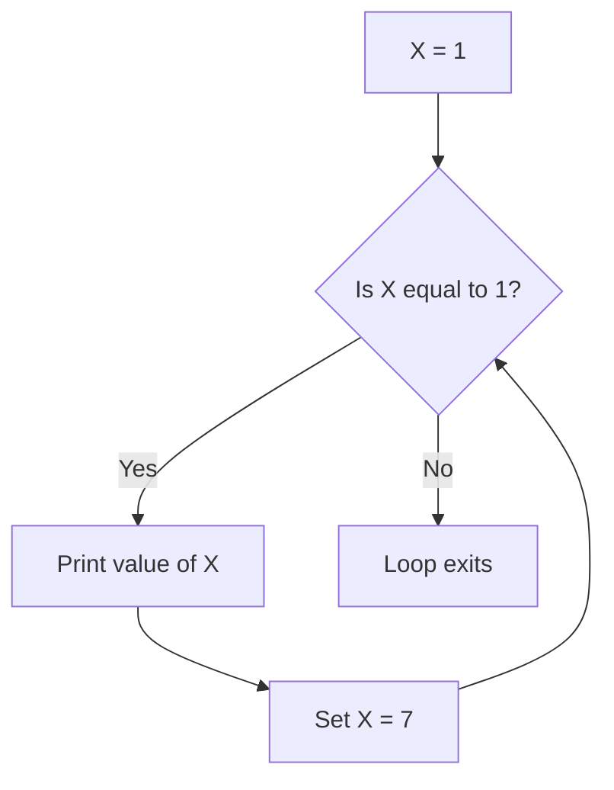

# Positional Parameters, `while` Loop, and `shift` in Bash

## Goal of This Lesson

In this lesson, we continue exploring positional parameters. We will use `$1`, `$2`, `$3` directly, and learn how to build a **`while` loop**. We will also learn about the `true`, `sleep`, and `shift` commands, and finally combine them to loop through all command-line arguments.

---

## 1. Using Positional Parameters Directly

Recall from earlier: `$0` is the script name, `$1` is the first argument, `$2` is the second argument, and so on.

### Example Script

```bash
#!/bin/bash
# Demonstrate the use of shift and while loops

echo $1
echo $2
echo $3
echo
```

Give the script execute permission before running it for the first time:

```bash
chmod 755 luser-demo07.sh
```

### Testing With Different Numbers of Arguments

**No arguments:**

```bash
./luser-demo07.sh
```

Output:

```


```

`$1`, `$2`, and `$3` are all blank, because no values were supplied.

**One argument:**

```bash
./luser-demo07.sh apple
```

Output:

```
apple


```

**Three arguments:**

```bash
./luser-demo07.sh apple bread candy
```

Output:

```
apple
bread
candy
```

Now `$1` is `apple`, `$2` is `bread`, and `$3` is `candy`.

**Four arguments:**

```bash
./luser-demo07.sh apple bread candy dumplings
```

The fourth word (`dumplings`) is stored in `$4`, but our script never reads `$4`, so it is simply ignored.

**The Problem:** We cannot know in advance how many arguments a user will supply. Reading `$1`, `$2`, `$3` one by one does not scale. This is exactly why loops (like `for` and `while`) are used to process command-line arguments.

---

## 2. The `while` Loop

### Checking the Command Type

```bash
type -a while
```

Output:

```
while is a shell keyword
```

### Getting Help

```bash
help while
```

### Syntax

```bash
while COMMANDS; do
    COMMANDS
done
```

**How it works:** The loop keeps executing the commands inside `do ... done` **as long as** the condition being tested has an exit status of zero (true).

You can think of it as:

```
while (condition is TRUE) do
    ... run these commands ...
```

> **Important:** Inside the loop, you must change the thing being tested. Otherwise, the condition will always stay true, and you will end up in an **infinite loop**.

### Example: Basic `while` Loop

```bash
X=1
while [[ $X -eq 1 ]]; do
  echo "this is the value of X"
  echo $X
  X=7
done
```

**How this runs:**



1. `X` starts as `1`.
2. The condition `$X -eq 1` is checked → true.
3. The commands run, printing the value of `X`.
4. `X` is changed to `7`.
5. The loop checks the condition again → `X` is now `7`, so `$X -eq 1` is false.
6. The loop stops.

> This particular loop is not very useful in real life, but it clearly shows how a `while` loop depends on a changing condition to eventually stop.

If the condition is **never true** to begin with, the loop body never runs at all:

```bash
echo $X        # X is 7 from before
```

```bash
while [[ $X -eq 1 ]]; do
  echo "this is the value of X"
  echo $X
  X=7
done
```

Since `X` is already `7`, nothing happens — the loop body is skipped entirely.

---

## 3. The `true` Command

While experimenting with `while` loops, you will eventually create an infinite loop by accident — it happens to everyone. Let's create one **on purpose**, using the `true` command, so we can learn how to safely stop it.

### What Is `true`?

```bash
type -a true
```

Output shows it is both a **shell built-in** and a **program**.

```bash
help true
```

> Returns a successful result (exit status 0).

```bash
man true
```

> "Do nothing, successfully."

### Testing `true`

```bash
true
echo $?
```

Output:

```
0
```

No matter what you type after it, `true` always returns exit status `0`:

```bash
true blah
echo $?
```

```
0
```

---

## 4. The `sleep` Command

### Syntax

```bash
sleep NUMBER[SUFFIX]
```

`sleep` is a program (not a shell built-in) that pauses execution for a specified amount of time.

| Suffix | Meaning |
|---|---|
| `s` | Seconds (default if no suffix is given) |
| `m` | Minutes |
| `h` | Hours |
| `d` | Days |

### Examples

```bash
sleep 1        # pause for 1 second
sleep 1s       # same as above
sleep 0.5      # pause for half a second
```

Nothing is displayed — the shell just pauses, then returns to the prompt.

---

## 5. Building and Stopping an Infinite Loop

Since `true` always returns exit status `0`, using it as the condition in a `while` loop creates a loop that **never stops on its own**.

```bash
while true; do
  echo $RANDOM
  sleep 1
done
```

**What happens:**

1. `echo $RANDOM` prints a random number.
2. `sleep 1` pauses for one second.
3. The loop repeats — forever — because `true` is always true.

### Stopping the Loop: `Ctrl+C`

To break out of this (or any command running in the foreground), press:

```
Ctrl + C
```

This sends an **interrupt signal** to the running command, forcing it to stop. You will see `^C` printed on the screen, confirming the interrupt.

This also works for other long-running commands, such as:

```bash
sleep 600
```

If you don't want to wait 10 minutes, press `Ctrl+C` to cancel it immediately.

---

## 6. The `shift` Built-in

### Checking the Command Type

```bash
type -a shift
```

Output:

```
shift is a shell builtin
```

### Getting Help

```bash
help shift
```

> Renames positional parameters `$N+1`, `$N+2`, ... to `$1`, `$2`, ...

### Syntax

```bash
shift [N]
```

| Form | Meaning |
|---|---|
| `shift` | Same as `shift 1` — shifts everything down by one position |
| `shift 2` | Shifts everything down by two positions |
| `shift N` | Shifts everything down by N positions |

### What `shift` Actually Does

- It **removes** `$1` from the list of positional parameters.
- Every remaining parameter moves down by one position:
  - The old `$2` becomes the new `$1`
  - The old `$3` becomes the new `$2`
  - ...and so on.
- The special variable `$#` (number of parameters) is **reduced by one** each time `shift` runs.

### Visualizing `shift`

```
Before shift:   $1=apple   $2=bread   $3=candy      ($# = 3)
                    |
                  shift
                    v
After shift:    $1=bread   $2=candy                 ($# = 2)
                    |
                  shift
                    v
After shift:    $1=candy                             ($# = 1)
                    |
                  shift
                    v
After shift:    (nothing left)                       ($# = 0)
```

---

## 7. Combining `while` and `shift` to Loop Through All Arguments

Now let's use everything together to process **any number** of command-line arguments.

### Script

```bash
#!/bin/bash
# Demonstrate the use of shift and while loops

echo $1
echo $2
echo $3
echo

while [[ $# -gt 0 ]]; do
  echo "The number of parameters is $#"
  echo $1
  echo $2
  echo $3
  echo
  shift
done
```

### How It Works

1. `while [[ $# -gt 0 ]]` — keep looping **as long as there is at least one positional parameter left** (`$#` is greater than `0`).
2. Inside the loop, the current values of `$1`, `$2`, and `$3` are printed.
3. `shift` removes `$1` and shifts everything else down by one, which **also reduces `$#` by one**.
4. Because `shift` changes `$#` (the very thing being tested), the loop condition eventually becomes false, so the loop naturally ends — no infinite loop.

### Testing With No Arguments

```bash
./luser-demo07.sh
```

There are no positional parameters, so the `while` loop body never runs. Only the first four `echo` lines (all blank) are shown.

### Testing With One Argument

```bash
./luser-demo07.sh apple
```

- `$1` = `apple`
- The loop runs once (`$#` is `1`, which is greater than `0`).
- `shift` runs, removing `apple`. Now `$#` becomes `0`.
- The loop checks the condition again: `0 -gt 0` is false, so the loop stops.

### Testing With Two Arguments

```bash
./luser-demo07.sh apple bread
```

**First pass:** `$1=apple`, `$2=bread`, `$#=2` → prints values → `shift` runs → `bread` becomes the new `$1`, `$#` becomes `1`.

**Second pass:** `$1=bread`, `$#=1` → prints values → `shift` runs → `$#` becomes `0`.

**Loop check:** `0 -gt 0` is false → loop exits. The loop ran **2 times** total.

### Testing With Three Arguments

```bash
./luser-demo07.sh apple bread candy
```

| Pass | `$1` | `$2` | `$3` | `$#` before shift |
|---|---|---|---|---|
| 1 | apple | bread | candy | 3 |
| 2 | bread | candy | (empty) | 2 |
| 3 | candy | (empty) | (empty) | 1 |

After the third pass, `shift` runs again, `$#` becomes `0`, and the loop exits. The loop ran **3 times** — once for every argument supplied.

### Testing With Four Arguments

```bash
./luser-demo07.sh apple bread candy dumplings
```

Following the same pattern, the loop runs **4 times**, one for each argument, always shifting everything down by one position after each pass.

> **Key takeaway:** No matter how many arguments are supplied, this `while` + `shift` pattern processes every single one of them, one at a time.

---

## 8. When to Use `shift`

`shift` is especially useful in situations like:

- **Separating one required argument from the rest of the free-form data.**
  For example, when creating a user account:
  - `$1` — the username (a single required value)
  - After `shift`, everything remaining (`$1`, `$2`, `$3`, ...) becomes the **comment field**, which may contain multiple words like a full name and department.

- **Processing command-line options and flags**, such as:
  ```
  -a --verbose
  ```
  Each option can be checked and then "shifted away" so the script can move on to the next one.

These patterns come up often when scripts need to accept flexible, mixed types of command-line input.

---

## Anti-Patterns to Avoid

- **Don't** write a `while` loop without changing the condition being tested inside the loop — this causes an infinite loop.
- **Don't** panic if you accidentally create an infinite loop — press `Ctrl+C` to interrupt it safely.
- **Don't** try to read `$4`, `$5`, and so on manually when you don't know how many arguments will be supplied — use `while` with `shift`, or a `for` loop with `"$@"`, instead.
- **Don't** forget that `shift` changes `$#` — this is exactly what makes the `while [[ $# -gt 0 ]]` loop condition eventually become false.

---

## Quick Reference Table

| Command / Concept | Purpose |
|---|---|
| `$1`, `$2`, `$3` ... | Individual positional parameters (arguments) |
| `while COND; do ... done` | Repeats commands as long as `COND` is true (exit status 0) |
| `true` | Built-in and program that always returns exit status 0 |
| `sleep N[s\|m\|h\|d]` | Pauses execution for the given amount of time |
| `Ctrl+C` | Sends an interrupt signal to stop a running foreground command |
| `shift [N]` | Removes `$1` (or the first N parameters), shifts the rest down, and reduces `$#` |
| `$#` | Number of positional parameters currently remaining |

---

## Practice Questions

**Q1: What condition does a `while` loop keep checking before each pass?**
A: It checks whether the last command in its condition has an exit status of zero (true). If true, it runs the loop body; if false, it stops.

**Q2: Why must something change inside a `while` loop's body?**
A: So that the condition being tested eventually becomes false. Otherwise, the loop will run forever (an infinite loop).

**Q3: What does the `true` command do?**
A: It does nothing and always returns a successful exit status of 0.

**Q4: What is the difference between `sleep 1` and `sleep 1m`?**
A: `sleep 1` pauses for 1 second (seconds is the default), while `sleep 1m` pauses for 1 minute.

**Q5: How do you stop a command that is stuck in an infinite loop or running too long?**
A: Press `Ctrl+C` to send an interrupt signal and stop the foreground command.

**Q6: What does the `shift` command do to the positional parameters?**
A: It removes `$1` from the list, shifts every remaining parameter down by one position (so `$2` becomes `$1`, `$3` becomes `$2`, and so on), and reduces `$#` by one.

**Q7: What happens if you run `shift 2` instead of `shift`?**
A: It shifts the positional parameters down by two positions instead of one, and reduces `$#` by two.

**Q8: In the combined `while [[ $# -gt 0 ]]` and `shift` pattern, why doesn't the loop run forever?**
A: Because `shift` reduces `$#` by one on each pass. Eventually `$#` reaches `0`, making the condition `$# -gt 0` false, which stops the loop.

**Q9: Give one real-world scenario where `shift` is useful.**
A: When a script needs one required argument (like a username) followed by free-form data (like comments) — `shift` removes the username so the rest of the arguments can be treated as one group.

**Q10: If a script is run with 4 arguments, how many times will a `while [[ $# -gt 0 ]] ... shift` loop execute?**
A: 4 times — once for each argument, since `shift` removes one argument per pass until none remain.