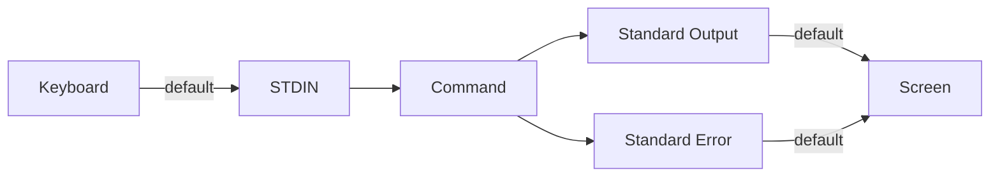

# Input and Output Redirection in Bash

## Goal of This Lesson

In this lesson, we will learn about the different types of input and output (I/O) in Bash, and how to redirect and control them.

---

## 1. The Three Types of I/O

Every command deals with three types of I/O by default:

| Type | Abbreviation | Default Source/Destination |
|---|---|---|
| Standard Input | STDIN | The keyboard |
| Standard Output | STDOUT | The screen |
| Standard Error | STDERR | The screen |

- **Standard input** is where a command reads data from. By default, this is the keyboard — for example, the `read` command collects standard input typed by a user.
- **Standard output** and **standard error** are both displayed on the screen by default.

You have already used **pipes** (`|`) to send the standard output of one command into another command as standard input — for example, to chain commands together while generating a random password. This lesson introduces other ways to control I/O, using **redirection**.



---

## 2. Redirecting Standard Output: `>`

### Syntax

```bash
COMMAND > FILE
```

The `>` symbol sends the standard output of `COMMAND` into `FILE`, instead of displaying it on the screen.

### Example

```bash
#!/bin/bash
# Demonstrate I/O redirection

FILE=/tmp/data

head -n1 /etc/passwd > $FILE
```

Run the script:

```bash
chmod 755 luser-demo08.sh
./luser-demo08.sh
```

**No output appears on the screen.** This is expected — the output of `head -n1 /etc/passwd` was redirected into the file instead of being shown.

Check the file's contents:

```bash
cat /tmp/data
```

Output:

```
root:x:0:0:root:root:/root:/bin/bash
```

This matches exactly what `head -n1 /etc/passwd` would print directly to the screen.

### Redirection Works With Any Command

Output redirection is **not tied to one specific command** — it works with any command that produces standard output.

```bash
id -un > id
cat id
```

```bash
echo "hello" > uid
cat uid
```

Both examples show the command's output landing inside the file, instead of on the screen.

### Redirection and File Permissions

Redirection still respects normal file permissions. If you don't have write permission in a directory, redirection will fail.

```bash
echo "hello" > /uid
```

Output:

```
bash: /uid: Permission denied
```

**Why this happens:**

```bash
ls -ld /
```

```
dr-xr-xr-x root root /
```

The root directory (`/`) has permissions `555` (read + execute only, for owner, group, and others). Since the current user (`vagrant`) is not `root` and is not in a group with write access, there is no write permission — so the redirection fails, exactly like trying to create a file there with an editor would fail.

> **Tip:** If you see a "Permission denied" error during redirection, take it at face value — it almost always means you simply don't have write access to that location.

---

## 3. Redirecting Standard Input: `<`

### Syntax

```bash
COMMAND < FILE
```

The `<` symbol feeds the contents of `FILE` into `COMMAND` as standard input.

### Example: Using `read` With Input Redirection

```bash
read LINE < $FILE
echo "The LINE variable contains: $LINE"
```

**How this works:**

- Normally, `read` waits for the user to type something at the keyboard and press Enter.
- With `< $FILE`, `read` instead reads its input from the file.
- `read` reads **one line** of input. A newline character marks the end of that line.
- Since our file (`/tmp/data`) has only one line, `LINE` receives the entire contents of that line.

### Full Script So Far

```bash
#!/bin/bash
# Demonstrate I/O redirection

FILE=/tmp/data

head -n1 /etc/passwd > $FILE

read LINE < $FILE
echo "The LINE variable contains: $LINE"
```

Run it:

```bash
./luser-demo08.sh
```

Output:

```
The LINE variable contains: root:x:0:0:root:root:/root:/bin/bash
```

**Step-by-step summary of what happened:**

1. Output redirection (`>`) sent the first line of `/etc/passwd` into `/tmp/data`.
2. Input redirection (`<`) fed that file into the `read` command, storing it in `LINE`.
3. `echo` displayed the `LINE` variable back to standard output (the screen).

### Another Example: Feeding a File Into `passwd`

Input redirection works with **any** command that accepts standard input — not just `read`.

```bash
echo secret > password
cat password
```

Output:

```
secret
```

Now use that file as input to change a user's password:

```bash
sudo passwd --stdin einstein < password
```

Output:

```
passwd: password changed for user einstein.
```

Verify it works:

```bash
su - einstein
```

Type `secret` when prompted — the password is accepted.

### Pipe vs Input Redirection — What's the Difference?

| Method | Symbol | Where the input comes from |
|---|---|---|
| Pipe | `\|` | The **standard output of another command** |
| Input redirection | `<` | The **contents of a file** |

Use a **pipe** when you want to feed the output of one command into another. Use **input redirection** when you want to feed the contents of a file into a command.

---

## 4. Overwriting vs Appending

### `>` Overwrites the File

Using a single `>` for redirection has an important behavior:

- If the target file **does not exist**, it is created.
- If the target file **already exists**, its entire contents are **replaced (overwritten)**.

### Example: Overwriting

```bash
echo new > password
cat password
```

Output:

```
new
```

The file's previous contents (`secret`) are completely gone, replaced by `new`.

### Demonstrating Overwrite in the Script

```bash
head -n3 /etc/passwd > $FILE
echo
cat $FILE
```

Even though `/tmp/data` already had one line in it from before, this command **replaces** the entire file with the first three lines of `/etc/passwd`. The file ends up with exactly 3 lines — not 4.

```bash
./luser-demo08.sh
```

Output confirms the file now shows only the 3 new lines, proving the previous content was overwritten, not added to.

### `>>` Appends Instead of Overwriting

### Syntax

```bash
COMMAND >> FILE
```

The two `>` symbols (with **no space** between them) **add** the command's output to the **end** of the file, keeping any existing content.

### Example: Appending

```bash
cat password
```

```
new
```

```bash
echo "another-line" >> password
cat password
```

Output:

```
new
another-line
```

Both the original line and the new line are present.

### Appending More Data

```bash
date +%s | sha256sum | head -c10 >> password
```

This appends a random 10-character value (generated from the current date, hashed, and trimmed) to the end of `password`. Note how **pipes** and **output redirection** can be combined on the same command line — commands are piped together first, and the final result is redirected into the file.

### Adding Append Redirection to the Script

```bash
echo $RANDOM >> $FILE
echo $RANDOM >> $FILE
echo
cat $FILE
```

Run the full script:

```bash
./luser-demo08.sh
```

**What happened, step by step:**

1. `/tmp/data` originally had 1 line (from `head -n1`).
2. It was **overwritten** with 3 lines (from `head -n3`).
3. Two more lines (random numbers) were **appended** using `>>`.
4. The file now has **5 lines** total: the 3 original lines, plus 2 appended random numbers.

---

## 5. Redirection Summary Diagram

```
COMMAND  >  FILE      -->  Overwrite FILE with COMMAND's output
COMMAND  >> FILE      -->  Append COMMAND's output to the end of FILE
COMMAND  <  FILE      -->  Feed FILE's contents into COMMAND as input
COMMAND1 |  COMMAND2  -->  Feed COMMAND1's output into COMMAND2 as input
```

---

## Anti-Patterns to Avoid

- **Don't** use a single `>` when you mean to add data to an existing file — it will **erase** the file's current contents.
- **Don't** put a space between the two `>` symbols when appending — `>>` must be written together, not `> >`.
- **Don't** assume a "Permission denied" error during redirection is a bug — check directory and file permissions first.
- **Don't** confuse a pipe (`|`) with input redirection (`<`) — a pipe connects two commands together, while `<` connects a file to a command.

---

## Quick Reference Table

| Symbol | Name | Behavior |
|---|---|---|
| `>` | Output redirection (overwrite) | Sends standard output to a file, replacing existing content |
| `>>` | Output redirection (append) | Sends standard output to a file, adding to existing content |
| `<` | Input redirection | Feeds a file's contents into a command as standard input |
| `\|` | Pipe | Feeds one command's standard output into another command's standard input |

---

## Practice Questions

**Q1: What are the three types of I/O in Bash?**
A: Standard input (STDIN), standard output (STDOUT), and standard error (STDERR).

**Q2: What is the default source of standard input, and the default destination of standard output and standard error?**
A: Standard input defaults to the keyboard. Standard output and standard error both default to the screen.

**Q3: What does the `>` symbol do?**
A: It redirects a command's standard output into a file, overwriting the file if it already exists (or creating it if it doesn't).

**Q4: What happens if you redirect output to a file you don't have write permission for?**
A: You get a "Permission denied" error, because redirection follows normal file permission rules.

**Q5: What is the difference between `>` and `>>`?**
A: `>` overwrites the file's existing content, while `>>` appends new content to the end of the file, keeping what was already there.

**Q6: What does `<` do?**
A: It redirects the contents of a file into a command as standard input.

**Q7: How is input redirection (`<`) different from a pipe (`|`)?**
A: A pipe takes the standard output of one command and feeds it as input into another command. Input redirection takes the contents of a file and feeds it into a command.

**Q8: Can output redirection be used with any command?**
A: Yes. Output redirection is not tied to a specific command — it works with any command that produces standard output, such as `head`, `id`, or `echo`.

**Q9: If a file already has 3 lines and you run `echo "new line" > file`, how many lines will the file have afterward?**
A: 1 line — the file's previous content is completely replaced (overwritten) by the new output.

**Q10: If a file already has 3 lines and you run `echo "new line" >> file`, how many lines will the file have afterward?**
A: 4 lines — the new content is appended after the existing 3 lines.