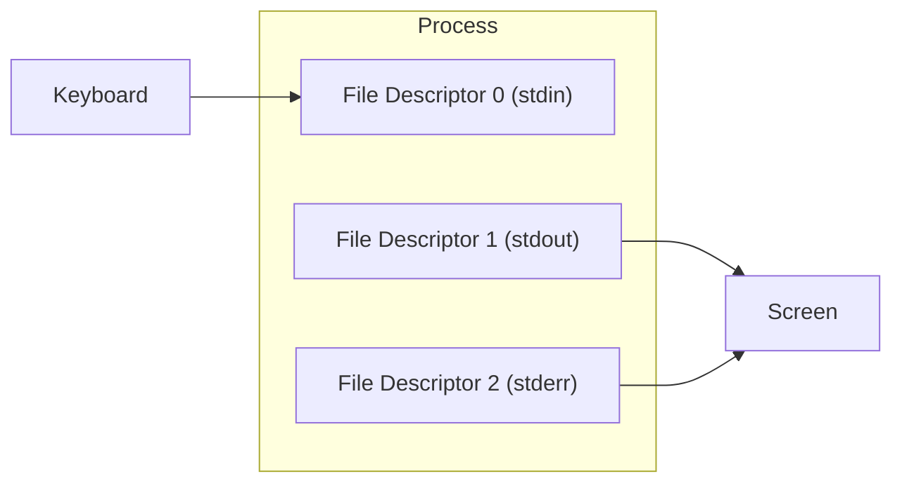

# File Descriptors and Redirecting Standard Error in Bash

## Goal of This Lesson

Before we can redirect standard error, we need to understand **file descriptors**. In this lesson, we will learn what file descriptors are, how to use them explicitly, how to redirect standard error, how to combine standard output and standard error, how pipes interact with standard error, and how to discard output using the null device.

---

## 1. What Is a File Descriptor

A **file descriptor** is simply a number that represents an open file.

- Humans find it easier to refer to files by **name**.
- Computers find it easier to refer to files by **number**.

Every new process starts with **three open file descriptors** by default:

| File Descriptor | Name | Default Source/Destination |
|---|---|---|
| `0` | Standard input (STDIN) | Keyboard |
| `1` | Standard output (STDOUT) | Screen |
| `2` | Standard error (STDERR) | Screen |

### "But My Keyboard and Screen Aren't Files!"

That is true in the everyday sense, but Linux treats almost everything as a file — including devices like keyboards and terminals. A more accurate way to describe a file descriptor is:

> A way for a program to interact with files, or with other resources that behave like files (keyboards, terminals, screens, and so on).

This "everything is a file" idea is what makes powerful things possible — like using a pipe (`|`) to take the standard output of one command (which would normally appear on the screen) and feed it as input into another command.



---

## 2. Explicit vs Implicit Redirection

So far, redirection has been done **implicitly** — without stating a file descriptor number. Bash assumes a default file descriptor depending on the redirection symbol used.

### Implicit Input Redirection

```bash
read x < /etc/centos-release
echo $x
```

### The Same Command, Written Explicitly

```bash
read x 0< /etc/centos-release
echo $x
```

Both commands do exactly the same thing, because file descriptor `0` (standard input) is **assumed** when you don't specify one before `<`.

> **Critical rule:** There must be **no space** between the file descriptor number and the redirection symbol.

### What Happens If You Add a Space by Mistake

```bash
read x 0 < /etc/centos-release
```

This is **wrong**. Because there is a space after `0`, Bash treats `0` as an **extra argument** to the `read` command instead of a file descriptor. This causes an error:

```
bash: read: `0': not a valid identifier
```

The correct form has **no space** between `0` and `<`:

```bash
read x 0< /etc/centos-release
```

### Explicit Output Redirection

```bash
echo $UID > UID
cat UID
```

Output:

```
1000
```

This is the implicit form. Since no file descriptor is given before `>`, file descriptor `1` (standard output) is assumed. It is exactly equivalent to:

```bash
echo $UID 1> UID
cat UID
```

### The Space Mistake, Again

```bash
echo $UID 1 > UID
cat UID
```

Output:

```
1000
1
```

Here, because there is a **space** between `1` and `>`, Bash treats `1` as a second argument to `echo`, not a file descriptor. So `echo` prints both `$UID` and the literal `1`, and **that combined output** gets redirected to the file.

> **Golden rule:** Never put a space between a file descriptor number and its redirection operator.

---

## 3. Standard Output vs Standard Error

By convention:

- **Normal program output** goes to standard output (`1`).
- **Error messages** go to standard error (`2`).

At the command line, you usually can't tell the difference, because both are displayed on the screen by default.

### Generating a Real Error

```bash
head -n1 /etc/passwd /etc/hosts
```

`head` accepts multiple files (its synopsis shows `FILE...`), so it labels each file's output as it goes.

Now use a file that doesn't exist:

```bash
head -n1 /etc/passwd /etc/hosts /fake_file
```

Output:

```
==> /etc/passwd <==
root:x:0:0:root:root:/root:/bin/bash

==> /etc/hosts <==
127.0.0.1 localhost
head: cannot open '/fake_file' for reading: No such file or directory
```

Even though it looks like one block of text, this output is actually a mix of **standard output** (the file contents) and **standard error** (the "cannot open" message).

### Redirecting Only Standard Output

```bash
head -n1 /etc/passwd /etc/hosts /fake_file > head.out
```

Since only standard output was redirected, the error message still appears on the screen, while the normal output is saved into `head.out`.

### Redirecting Only Standard Error

Use file descriptor `2` right before the redirection symbol, with **no space**:

```bash
head -n1 /etc/passwd /etc/hosts /fake_file 2> head.err
```

Now the normal output appears on the screen, while the error message is saved into `head.err`.

```bash
cat head.err
```

```
head: cannot open '/fake_file' for reading: No such file or directory
```

Clean up:

```bash
rm head.out head.err
```

### Redirecting Standard Output and Standard Error to Different Files

```bash
head -n1 /etc/passwd /etc/hosts /fake_file > head.out 2> head.err
```

Nothing is shown on the screen. Standard output goes into `head.out`, and standard error goes into `head.err`.

```bash
cat head.out
cat head.err
```

This is useful when you only care about error messages — you can redirect all errors into their own file for review.

### Appending Works the Same Way

Using `>>` (append) with a specific file descriptor still appends rather than overwriting:

```bash
head -n1 /etc/passwd /etc/hosts /fake_file 2>> head.err
```

Run this multiple times, and `head.err` will contain multiple repeated copies of the error message, one for each run.

---

## 4. Sending Standard Output and Standard Error to the Same Place

### Method 1: The Older Syntax — `2>&1`

```bash
head -n1 /etc/passwd /etc/hosts /fake_file > head.both 2>&1
```

```bash
cat head.both
```

Both the standard output and the error message appear together in `head.both`.

**Why this works:**

- `> head.both` sends standard output to the file `head.both`.
- `2>` means "redirect standard error."
- The `&` symbol means "what follows is a file descriptor number, not a file name." So `&1` means file descriptor `1` (standard output) — **not** a file literally named `1`.
- So `2>&1` means: "send standard error to wherever standard output is currently going."

Since standard output is already going to `head.both`, standard error follows it there too.

> **Order matters here**, and so does spacing: there must be **no space** between `2>` and `&1`. If you omit the `&`, Bash will treat `1` as a literal file name instead of a file descriptor.

Clean up:

```bash
rm head.both
```

### Method 2: The Newer, Simpler Syntax — `&>`

```bash
head -n1 /etc/passwd /etc/hosts /fake_file &> head.both
```

This is a shorter and easier way to send **both** standard output and standard error to the same file.

```bash
cat head.both
```

Both types of output appear in the file — same result as the older syntax, but much easier to read.

### Appending With the New Syntax

```bash
head -n1 /etc/passwd /etc/hosts /fake_file &>> head.both
```

Using `&>>` (no space) appends both standard output and standard error to the file, instead of overwriting it.

```bash
cat head.both
```

Running the command twice with `&>>` shows two full sections of output in the file, one for each run.

---

## 5. Pipes and Standard Error

### Pipes Only Carry Standard Output

Recall that a pipe (`|`) sends the **standard output** of one command into another command as input. **Standard error does not travel through a pipe.**

### Demonstration

```bash
head -n1 /etc/passwd /etc/hosts /fake_file
```

This produces 6 lines total (including headers, content, and blank lines) — you can count them: `/etc/passwd` section, its content, blank line, `/etc/hosts` section, its content, and the error message.

Now pipe it into `cat -n` (which numbers lines of standard input):

```bash
head -n1 /etc/passwd /etc/hosts /fake_file | cat -n
```

`cat` only numbers **5 lines** — the error message is missing from the numbered output, because it never passed through the pipe. Instead, it still appeared directly on the screen (unnumbered), since standard error bypasses the pipe entirely.

### Forcing Standard Error Through the Pipe

To send standard error through the pipe too, redirect it to standard output first (file descriptor `2` to file descriptor `1`):

```bash
head -n1 /etc/passwd /etc/hosts /fake_file 2>&1 | cat -n
```

Now `cat -n` counts **all 6 lines**, because standard error was merged into standard output before reaching the pipe.

### Shorthand: `|&`

```bash
head -n1 /etc/passwd /etc/hosts /fake_file |& cat -n
```

This combines standard output and standard error and pipes both into the next command — same result as `2>&1 |`, but shorter.

### The Reverse: Sending Only Standard Output Through, But as Standard Error

```bash
echo error | cat -n
```

Output:

```
1  error
```

Now compare with sending the `echo` output specifically to standard error before piping:

```bash
echo error 1>&2 | cat -n
```

Output:

```
error
```

No line number is added, because the text never actually reached `cat` through the pipe — it was redirected to standard error instead, which bypasses the pipe.

**Why would you want to do this?** To make your own scripts follow proper convention: **error messages should go to standard error, not standard output.** If you find yourself writing an `echo` right before an `exit` in a script, that is usually a strong sign that message should be sent to standard error.

### Sending a Script's Own Messages to Standard Error

```bash
echo "This is standard error" >&2
```

Test this by redirecting standard error to a file when running the script:

```bash
./luser-demo08.sh 2> ERR
cat ERR
```

The message shows up in `ERR`, confirming it was correctly sent to standard error.

---

## 6. The Null Device: `/dev/null`

### What It Is

The **null device**, located at `/dev/null`, is a special file that **discards** anything written to it. Some people call it the "bit bucket."

Use it when you want to **throw away** output — not show it on screen, and not save it to a file either.

### Discarding Only Standard Output

```bash
head -n1 /etc/passwd /etc/hosts /fake_file > /dev/null
```

Only the error message remains visible, since standard output was discarded.

### Discarding Only Standard Error

```bash
head -n1 /etc/passwd /etc/hosts /fake_file 2> /dev/null
```

Now no error message is shown — only the normal output remains.

### Discarding Both

```bash
head -n1 /etc/passwd /etc/hosts /fake_file &> /dev/null
```

Nothing is displayed at all — both standard output and standard error are thrown away.

### When Would You Want to Do This?

If your script runs a command and you don't want the person running the script to see its output, send it to `/dev/null`. You can still check whether the command succeeded or failed using its **exit status**, without needing to see any output.

```bash
head -n1 /fake_file &> /dev/null
echo $?
```

```
1
```

Exit status `1` means the command failed. Now try it with a file that exists:

```bash
head -n1 /etc/passwd &> /dev/null
echo $?
```

```
0
```

Exit status `0` means the command succeeded — all without displaying any output.

---

## 7. Putting It All Together in a Script

```bash
#!/bin/bash
# Demonstrate file descriptors and standard error redirection

FILE=/tmp/data
ERR=/tmp/data.err

# Explicit standard input redirection (file descriptor 0)
read LINE 0< $FILE
echo $LINE

# Explicit standard output redirection (file descriptor 1), overwrite
head -n3 /etc/passwd 1> $FILE

# Redirect standard error (file descriptor 2) to a file
head -n1 /fake_file 2> $ERR

# Redirect standard output and standard error to the same file
head -n1 /etc/passwd /fake_file &> $FILE

# Redirect standard output and standard error through a pipe
echo
head -n1 /etc/passwd /fake_file |& cat -n

# Send a script's own message to standard error
echo "This is standard error" >&2

# Discard standard output
head -n1 /etc/passwd > /dev/null

# Discard standard error
head -n1 /fake_file 2> /dev/null

# Discard both standard output and standard error
echo "Discarding all output now"
head -n1 /fake_file &> /dev/null

# Clean up temporary files, discarding any errors from rm
rm $FILE &> /dev/null
rm $ERR &> /dev/null
```

Run it:

```bash
chmod 755 luser-demo08.sh
./luser-demo08.sh
```

This script walks through each redirection technique one at a time, and finishes by cleaning up the temporary files it created — sending any errors from `rm` to `/dev/null`, since we don't care if those files were already missing.

---

## Anti-Patterns to Avoid

- **Don't** put a space between a file descriptor number and its redirection operator (e.g., `2 >` is wrong; `2>` is correct).
- **Don't** forget that pipes only carry standard output — if you need error messages to flow through a pipe too, redirect `2>&1` first, or use the `|&` shorthand.
- **Don't** write an `echo` message right before an `exit` in a script without considering whether it should go to standard error (`>&2`) instead of standard output.
- **Don't** confuse `2>&1` with `2>1` — omitting the `&` sends output to a literal file named `1`, not to standard output.
- **Don't** silently discard both standard output and standard error (`&> /dev/null`) unless you have another way (like checking `$?`) to confirm whether the command succeeded.

---

## Quick Reference Table

| Syntax | Meaning |
|---|---|
| `0` | File descriptor for standard input (STDIN) |
| `1` | File descriptor for standard output (STDOUT) |
| `2` | File descriptor for standard error (STDERR) |
| `COMMAND < FILE` or `COMMAND 0< FILE` | Redirect standard input from a file |
| `COMMAND > FILE` or `COMMAND 1> FILE` | Redirect standard output to a file (overwrite) |
| `COMMAND 2> FILE` | Redirect standard error to a file (overwrite) |
| `COMMAND >> FILE` | Append standard output to a file |
| `COMMAND 2>> FILE` | Append standard error to a file |
| `COMMAND > OUT 2> ERR` | Send standard output and standard error to two different files |
| `COMMAND 2>&1` | Redirect standard error to wherever standard output is going |
| `COMMAND &> FILE` | Redirect both standard output and standard error to one file (newer syntax) |
| `COMMAND &>> FILE` | Append both standard output and standard error to one file |
| `COMMAND1 \| COMMAND2` | Pipe only sends standard output to the next command |
| `COMMAND1 2>&1 \| COMMAND2` | Pipe sends both standard output and standard error |
| `COMMAND1 \|& COMMAND2` | Shorthand for piping both standard output and standard error |
| `/dev/null` | Special file that discards anything written to it |

---

## Practice Questions

**Q1: What is a file descriptor?**
A: A number that represents an open file (or file-like resource, such as a keyboard or screen) that a program uses to read from or write to.

**Q2: What are the three default file descriptors every process starts with?**
A: `0` for standard input, `1` for standard output, and `2` for standard error.

**Q3: Why must there be no space between a file descriptor number and its redirection operator?**
A: Because a space causes Bash to treat the number as a separate command argument instead of a file descriptor, leading to unexpected behavior or errors.

**Q4: How do you redirect only standard error to a file?**
A: Use `2>` before the file name, e.g., `command 2> errors.txt`.

**Q5: What is the difference between `2>&1` and `2>1`?**
A: `2>&1` redirects standard error to wherever standard output is currently going (a file descriptor). `2>1` (without the `&`) redirects standard error to a literal file named `1`.

**Q6: What is the shorthand syntax to send both standard output and standard error to the same file?**
A: `&>` for overwrite, or `&>>` for append.

**Q7: Does a pipe (`|`) carry standard error along with standard output?**
A: No. A pipe only carries standard output by default. To include standard error, use `2>&1 |` or the shorthand `|&`.

**Q8: What is `/dev/null` used for?**
A: It is a special file that discards anything written to it — useful when you want to hide a command's output completely, without saving it anywhere.

**Q9: If you discard both standard output and standard error with `&> /dev/null`, how can you still tell if the command succeeded?**
A: By checking the command's exit status using `$?` — `0` means success, and any non-zero value means failure.

**Q10: Why might a script send an `echo` message to standard error using `>&2` instead of leaving it as standard output?**
A: To follow the standard convention that error or warning messages should go to standard error, not standard output — especially useful right before an `exit` command in a script.