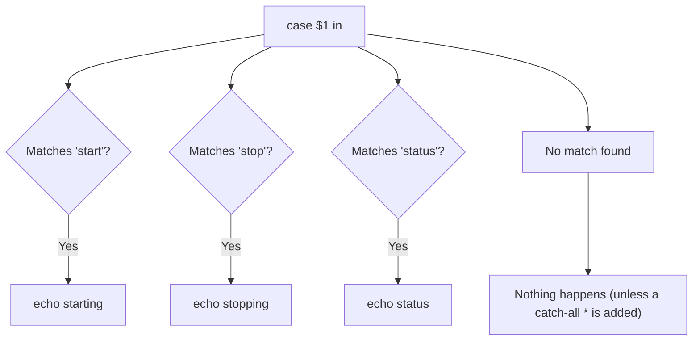

# The `case` Statement in Bash

## Goal of This Lesson

The `case` statement is the perfect way to make a decision based on the value of a variable, especially when you have a specific set of values to check against. In this lesson, we will first solve a problem using `if`/`elif`, then rewrite the same logic using `case`, and see why `case` is often the cleaner choice.

---

## 1. Checking the `case` Command

### Command Type

```bash
type -a case
```

Output:

```
case is a shell keyword
```

Since it's a shell built-in keyword, we can get help on it:

```bash
help case
```

The help output shows the syntax (though it is compressed onto one line and can be hard to read at first). This lesson will lay out that syntax clearly with examples.

**Core idea:** A `case` statement compares a value against a list of patterns. If the value matches a pattern, the commands under that pattern run. If nothing matches, nothing runs — unless you provide a catch-all pattern.

---

## 2. The Starting Point: Solving It With `if`/`elif`

Before using `case`, let's solve the problem using tools we already know — the `if` statement — so we can compare the two approaches.

> **Note:** This is not the ideal way to solve this particular problem, but it's shown here because: (1) it builds on what you already know, (2) you will see this pattern in other people's scripts, and (3) it gives a good comparison against the `case` statement, which is the better solution.

### Goal

If the first argument (`$1`) passed to the script is `start`, print `starting`.

### Basic Version

```bash
#!/bin/bash
# Demonstrate the case statement

if [[ $1 == start ]]; then
  echo starting
fi
```

```bash
chmod 755 luser-demo09.sh
./luser-demo09.sh start
```

Output:

```
starting
```

If you supply anything else, or nothing at all, nothing happens — which is expected, since we haven't coded for any other value yet.

```bash
./luser-demo09.sh anything
./luser-demo09.sh
```

Both produce no output.

### Adding More Conditions With `elif`

```bash
help if
```

`elif` is short for "else if," and lets you check additional conditions.

```bash
if [[ $1 == start ]]; then
  echo starting
elif [[ $1 == stop ]]; then
  echo stopping
fi
```

```bash
./luser-demo09.sh stop
```

Output:

```
stopping
```

**Reading the logic top to bottom:** "If `$1` equals `start`, do this. Otherwise, if `$1` equals `stop`, do that."

### Adding a Third Condition and a Catch-All `else`

```bash
if [[ $1 == start ]]; then
  echo starting
elif [[ $1 == stop ]]; then
  echo stopping
elif [[ $1 == status ]]; then
  echo status
else
  echo "$1 is not a valid option. Please supply a valid option." >&2
  exit 1
fi
```

**What the `else` block does:**

- Catches anything that didn't match `start`, `stop`, or `status`.
- Sends the error message to **standard error** (`>&2`), since it's an error condition.
- Exits with a **non-zero exit status** (`1`) to signal failure.

### Testing

```bash
./luser-demo09.sh status
```

```
status
```

```bash
./luser-demo09.sh restart
```

```
restart is not a valid option. Please supply a valid option.
```

```bash
echo $?
```

```
1
```

Running the script with no arguments produces the same error, since `$1` is empty and doesn't match any of the expected values.

> This `if`/`elif`/`else` approach works perfectly well. There is nothing wrong with it — it's just more repetitive than necessary when you're always comparing the **same variable** against different values.

---

## 3. Rewriting the Same Logic With `case`

### Syntax

```bash
case WORD in
  PATTERN1)
    COMMANDS
    ;;
  PATTERN2)
    COMMANDS
    ;;
  *)
    COMMANDS
    ;;
esac
```

- `case WORD in` — starts the statement and states the value being checked.
- `PATTERN)` — a pattern to compare `WORD` against, ending with a closing parenthesis.
- Commands under a pattern run if that pattern matches.
- `;;` — two semicolons end each pattern's block of commands.
- `esac` — ends the whole statement (it's just "case" spelled backwards).

### Building It Step by Step

**Step 1 — Just the `start` pattern:**

```bash
case $1 in
  start)
    echo starting
    ;;
esac
```

```bash
./luser-demo09.sh start
```

```
starting
```

**Step 2 — Add `stop` and `status`:**

```bash
case $1 in
  start)
    echo starting
    ;;
  stop)
    echo stopping
    ;;
  status)
    echo status
    ;;
esac
```

Notice the difference from the `if`/`elif` version: with `case`, you state the value being checked (`$1`) **only once**, at the top. With `if`/`elif`, you had to repeat `$1 ==` for every single condition.



### Testing

```bash
./luser-demo09.sh stop
```

```
stopping
```

```bash
./luser-demo09.sh status
```

```
status
```

---

## 4. Understanding Pattern Matching in `case`

To handle "anything else," we need to understand how `case` patterns work. Let's check the Bash man page.

```bash
man bash
```

Search for "case," then look at the referenced **Pattern Matching** section (under Pathname Expansion).

### Key Rules From the Man Page

- A `case` command expands the given word and tries to match it against each pattern, using the **same matching rules as pathname expansion**.
- Any normal character in a pattern matches only **itself**. For example, the pattern `start` only matches the exact text `start`.
- Special pattern characters:

| Character | Meaning |
|---|---|
| `*` | Matches any string, including an empty string (matches "anything") |
| `?` | Matches any single character |
| `[...]` | Matches any one character listed inside the brackets; you can also specify a range with a hyphen, e.g. `[a-z]` |

You've likely used `*` before, such as:

```bash
ls *.txt
```

This lists all files ending in `.txt`. The same wildcard idea applies inside a `case` pattern.

> For this lesson, we only need `*` (to catch "anything else"), but `?` and `[...]` are useful to know for more specific matching needs.

---

## 5. Adding a Catch-All Pattern

To handle any value that doesn't match `start`, `stop`, or `status`, add `*` as the **last** pattern:

```bash
case $1 in
  start)
    echo starting
    ;;
  stop)
    echo stopping
    ;;
  status)
    echo status
    ;;
  *)
    echo "Supply a valid option" >&2
    exit 1
    ;;
esac
```

> **Important:** `case` statements are checked from **top to bottom**. The first matching pattern's commands are run. Since `*` matches literally anything, it must be placed **last** — otherwise it would catch everything before the more specific patterns get a chance to match.

### Testing

```bash
./luser-demo09.sh start
```

```
starting
```

```bash
./luser-demo09.sh stop
```

```
stopping
```

```bash
./luser-demo09.sh status
```

```
status
```

```bash
./luser-demo09.sh restart
```

```
Supply a valid option
```

`restart` doesn't match any of the specific patterns, so it falls through to the `*` catch-all.

---

## 6. Matching Multiple Patterns for the Same Action

### Using the Pipe (`|`) as "OR"

Suppose you want both `status` and `state` to trigger the same action.

```bash
help case
```

The help text confirms that `|` can separate multiple patterns within one case block, acting like "or."

```bash
case $1 in
  start)
    echo starting
    ;;
  stop)
    echo stopping
    ;;
  status|state)
    echo status
    ;;
  *)
    echo "Supply a valid option" >&2
    exit 1
    ;;
esac
```

```bash
./luser-demo09.sh state
```

```
status
```

```bash
./luser-demo09.sh status
```

```
status
```

### Alternative: Using a Wildcard Instead

You could also write `STAT*` to match both `status` and `state`. However, this is **less precise** — it would also accidentally match unrelated words like `statue`, `stateless`, or `static`. Using `status|state` is more exact and safer.

### Adding More Patterns With Multiple Pipes

You can chain as many patterns as you like with `|`:

```bash
case $1 in
  start)
    echo starting
    ;;
  stop)
    echo stopping
    ;;
  status|state|--status|--state)
    echo status
    ;;
  *)
    echo "Supply a valid option" >&2
    exit 1
    ;;
esac
```

```bash
./luser-demo09.sh --state
```

```
status
```

```bash
./luser-demo09.sh --status
```

```
status
```

```bash
./luser-demo09.sh --unknown
```

```
Supply a valid option
```

---

## 7. Style and Spacing

There is no single "correct" way to indent a `case` statement — consistency and readability matter most.

**Common practice:**

- Indent each pattern by a consistent amount (2 spaces, 4 spaces, or a tab — pick one and stick with it).
- Indent the commands under each pattern one level further than the pattern itself.

### Compact Style for Single-Command Blocks

If a pattern only has **one command**, it's common to write the pattern, the command, and the closing `;;` all on the same line:

```bash
case $1 in
  start) echo starting ;;
  stop)  echo stopping ;;
  status|state|--status|--state) echo status ;;
  *)
    echo "Supply a valid option" >&2
    exit 1
    ;;
esac
```

> Leaving a space before the `;;` (as shown above) is not required by the syntax, but it makes the code a little easier to read.

The catch-all block (`*`), which has **multiple commands**, is kept on separate lines for clarity — combining multiple commands onto a single line requires a command separator, which is a topic for later.

### Testing the Reformatted Version

```bash
./luser-demo09.sh start
```

```
starting
```

```bash
./luser-demo09.sh stop
```

```
stopping
```

```bash
./luser-demo09.sh
```

```
Supply a valid option
```

Even with the more compact formatting, the logic works exactly the same.

---

## 8. Real-World Use Case: Init Scripts

The `case` statement pattern shown here is the foundation of most traditional Linux **init scripts** (service control scripts).

For example, on older Linux distributions:

```bash
/etc/init.d/sshd status
/etc/init.d/sshd stop
/etc/init.d/sshd start
```

Each of these commands is handled internally by a shell script that uses a `case` statement to decide what action to take, based on the argument supplied — exactly the pattern built in this lesson.

---

## 9. Beyond `$1`: Other Uses for `case`

A `case` statement doesn't have to check `$1`. It can check **any variable**, including one populated by user input via `read`. This makes `case` a great tool for building simple **menu systems**, where a user is prompted to choose an option, and their input is matched against a list of valid choices.

---

## Anti-Patterns to Avoid

- **Don't** repeat the same variable name over and over in a long `if`/`elif`/`elif` chain when you're always comparing it to different fixed values — use `case` instead.
- **Don't** place the `*` catch-all pattern anywhere except **last** — since `case` checks patterns top to bottom, an earlier `*` would swallow everything before more specific patterns get a chance.
- **Don't** use a broad wildcard (like `STAT*`) when an exact set of values (`status|state`) would be safer and more precise — wildcards can accidentally match unintended input.
- **Don't** forget the double semicolon (`;;`) at the end of each pattern's block — it's what tells Bash where that block ends.

---

## Quick Reference Table

| Syntax | Meaning |
|---|---|
| `case WORD in ... esac` | Starts and ends a case statement, checking `WORD` against patterns |
| `PATTERN)` | Defines a pattern to match against; ends with `)` |
| `;;` | Ends the command block for the current pattern |
| `*` | Wildcard pattern — matches anything, including nothing |
| `?` | Matches any single character |
| `[...]` | Matches any one character inside the brackets (supports ranges like `[a-z]`) |
| `PATTERN1\|PATTERN2` | Matches either `PATTERN1` or `PATTERN2` (acts like "or") |
| `esac` | Ends the case statement ("case" spelled backwards) |

---

## Practice Questions

**Q1: When is a `case` statement usually a better choice than a long `if`/`elif` chain?**
A: When you are repeatedly comparing the **same variable** against a specific set of fixed values — `case` avoids repeating the variable name for every condition.

**Q2: What symbol ends each pattern's command block in a `case` statement?**
A: Two semicolons (`;;`).

**Q3: What keyword ends the entire `case` statement?**
A: `esac` — "case" spelled backwards.

**Q4: What does the `*` pattern match?**
A: Any string, including an empty string — it acts as a catch-all for anything not matched by earlier patterns.

**Q5: Why must the `*` pattern be placed last in a case statement?**
A: Because `case` checks patterns from top to bottom, and `*` matches everything — placing it earlier would prevent any later, more specific patterns from ever being checked.

**Q6: How do you make one action respond to multiple different pattern values?**
A: Separate the patterns with a pipe symbol (`|`), for example `status|state)`.

**Q7: Why might `status|state` be preferred over the wildcard pattern `STAT*`?**
A: Because `status|state` matches only those exact words, while `STAT*` would also incorrectly match unrelated words like `statue` or `static`.

**Q8: What are the three special pattern characters mentioned for use in `case` patterns?**
A: `*` (matches anything), `?` (matches any single character), and `[...]` (matches any one character within the brackets, including ranges).

**Q9: What real-world Linux feature commonly uses the `case` statement pattern shown in this lesson?**
A: Traditional init scripts (e.g., `/etc/init.d/sshd start|stop|status`), which use `case` to decide what action to take based on a supplied argument.

**Q10: Does a `case` statement have to check `$1` specifically?**
A: No. It can check any variable, including one set by user input via `read` — useful for building simple menu systems.