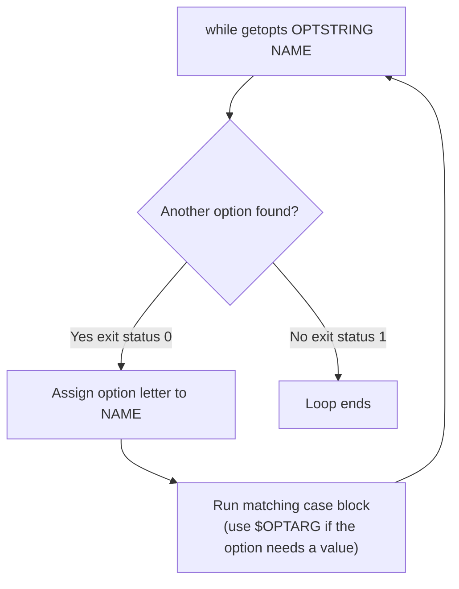

# Processing Command Line Options With `getopts`

## Goal of This Lesson

In this lesson, we will learn how to process command line **options** (like `-v`, `-l`, `-s`) using the shell built-in `getopts`. We will build a password-generating script that supports a verbose mode, a custom password length, and an option to append a special character.

---

## 1. Why Use `getopts`

If you want your shell scripts to behave like standard Linux commands, users should be able to pass **options** that change how the script behaves. For example:

- A **verbose** option, so the user sees detailed output.
- A **quiet** option, so the script works silently and only reports errors.

You've probably used `ls -l` before — the `-l` option changes `ls` to show a long listing format. `getopts` helps you build this same kind of behavior into your own scripts, following standard Linux conventions.

### Why Not Just Use `if` or `case`?

You could check for individual options like `-l` or `-a` using `if` or `case`. However, users expect to be able to **combine short options together** — for example, `-l -a` should behave exactly the same as `-la` or `-al`. Handling that combination logic manually with a simple `case` statement is tricky. `getopts` handles this — and several other option-parsing quirks — for you automatically.

---

## 2. `getopts` vs `getopt`

### Checking `getopts`

```bash
type -a getopts
```

Output:

```
getopts is a shell builtin
```

`getopts` (plural) is a **shell built-in**. Built-ins are recommended whenever possible because they make scripts more **portable** — you don't depend on an external program being installed.

### Checking `getopt`

```bash
type -a getopt
```

Output:

```
getopt is /usr/bin/getopt
```

`getopt` (singular) is a **separate executable program** on the filesystem. It is similar to `getopts`, but has its own limitations and quirks. If you come across `getopt` in an older script, refer to its man page (`man getopt`) to learn more. This lesson focuses on `getopts`, the shell built-in.

---

## 3. Understanding `getopts` Syntax

### Getting Help

```bash
help getopts | less
```

### Syntax

```bash
getopts OPTSTRING NAME [ARGS]
```

| Part | Meaning |
|---|---|
| `OPTSTRING` | A string listing which single-letter options your script accepts |
| `NAME` | A variable name that will be populated with the option currently being processed |
| `[ARGS]` | Optional — by default, `getopts` parses the script's positional parameters, but you can point it at something else |

### Key Rules

- Each character in `OPTSTRING` represents one valid option letter.
- To make an option **require an argument** (a mandatory value), follow that letter with a colon (`:`).
- `getopts` must be used inside a **`while` loop**. It returns exit status `0` each time it finds another option to process. Once there are no more options left, it returns `1`, which ends the loop.
- When an option requires an argument, `getopts` stores that argument's value in the special variable `OPTARG`.



---

## 4. Planning Our Script

We'll build a password generator with these options:

| Option | Meaning | Requires a value? |
|---|---|---|
| `-v` | Turn on verbose output | No |
| `-l` | Set password length | Yes (a number) |
| `-s` | Append a special character | No |

### Setting a Default Value

Since the user *may* specify a length, we start with a sensible default that gets overridden if `-l` is used:

```bash
#!/bin/bash
# Generate a random password, with options for length, special characters, and verbosity

LENGTH=48
```

---

## 5. Building the `while getopts` Loop

### Basic Structure

```bash
while getopts vl:s OPTION; do
  case "${OPTION}" in
    v)
      VERBOSE=true
      ;;
    l)
      LENGTH="${OPTARG}"
      ;;
    s)
      SPECIAL=true
      ;;
    ?)
      usage
      ;;
  esac
done
```

### Explaining Each Part

- **`vl:s`** — the optstring. This means:
  - `v` — a valid option, no argument required.
  - `l:` — a valid option, and the colon means it **requires** an argument.
  - `s` — a valid option, no argument required.
- **`OPTION`** — the variable name where `getopts` stores which option letter it just found.
- **`l)` pattern** — when `-l` is used, `getopts` places its value into `${OPTARG}`. We assign that to our `LENGTH` variable. So running the script with `-l 4` sets `OPTARG` to `4`, and then `LENGTH` becomes `4`.
- **`?)` pattern** — the catch-all pattern for anything not matched. Since `getopts` gives us **one single-character option at a time**, we use `?` (matching a single character) instead of `*` here.

### Testing the Basic Skeleton

```bash
chmod 755 luser-demo11.sh
./luser-demo11.sh -v
```

No visible output yet (we haven't added any actions), but this confirms the option was accepted without error.

```bash
./luser-demo11.sh -s
```

No output — expected, since we haven't coded any action for `-s` yet.

```bash
./luser-demo11.sh -l
```

Output:

```
./luser-demo11.sh: option requires an argument -- l
```

`getopts` automatically detects that `-l` needs a value and reports the error itself — no extra code required from us.

```bash
./luser-demo11.sh -x
```

Output:

```
./luser-demo11.sh: illegal option -- x
```

`getopts` also automatically rejects any option not listed in the optstring.

---

## 6. Creating a `usage` Function

Instead of just printing "invalid option" and exiting, it's more helpful to teach the user how to use the script — similar to what you see in man pages or `help` output.

Since a usage message can span several lines, it's cleaner to put it in its own function rather than inline in the `case` statement.

> **Reminder:** Functions should be defined near the **top** of the script, before they are used.

### The `usage` Function

```bash
# This function displays usage instructions and exits with a non-zero status
usage() {
  echo "Usage: ${0} [-h] [-v] [-s] [-l LENGTH]" >&2
  echo "Generates a random password."
  echo "  -h          Display this help message"
  echo "  -v          Enable verbose mode"
  echo "  -s          Append a special character to the password"
  echo "  -l LENGTH   Set the password length (default: 48)"
  exit 1
}
```

- Optional options are wrapped in `[ ]`, modeled after the style used in man pages and the `help` built-in.
- The function exits with a **non-zero exit status** (`1`), since reaching this function means the user supplied an invalid option.

### Updating the Catch-All Pattern

```bash
while getopts vl:s OPTION; do
  case "${OPTION}" in
    v)
      VERBOSE=true
      ;;
    l)
      LENGTH="${OPTARG}"
      ;;
    s)
      SPECIAL=true
      ;;
    ?)
      usage
      ;;
  esac
done
```

### Testing

```bash
./luser-demo11.sh -x
```

Output:

```
./luser-demo11.sh: illegal option -- x
Usage: ./luser-demo11.sh [-h] [-v] [-s] [-l LENGTH]
Generates a random password.
  -h          Display this help message
  -v          Enable verbose mode
  -s          Append a special character to the password
  -l LENGTH   Set the password length (default: 48)
```

**What happened:**

1. `getopts` itself printed the "illegal option" error.
2. Our catch-all `?)` pattern matched, calling `usage`.
3. `usage` printed the help text and exited.

```bash
echo $?
```

```
1
```

The exit status confirms the script ended with failure, exactly as designed inside `usage`.

---

## 7. Avoiding Repeated Verbose Checks: The `log` Function

If we want messages displayed only when `VERBOSE` is true, checking `if [[ "${VERBOSE}" == true ]]` every single time we want to print something would mean a lot of duplicated code. Following the DRY principle ("Don't Repeat Yourself"), let's move that check into a function.

```bash
# This function displays a message to standard output only if VERBOSE is true
log() {
  local MESSAGE="${@}"
  if [[ "${VERBOSE}" == true ]]; then
    echo "${MESSAGE}"
  fi
}
```

> **Naming note:** The name `log` isn't a perfect fit here, since this script doesn't actually write to a log file — it's just used for demonstration purposes. Other possible names could be `display`, `say`, or something like `send_to_stdout`. Use whatever name makes the most sense to you and your team.

### Using `log` Instead of `echo`

Replace direct `echo` calls used for status/progress messages with calls to `log`:

```bash
log "Verbose mode is on"
log "Generating a password"
```

### Testing

```bash
./luser-demo11.sh -v
```

Output:

```
Verbose mode is on
Generating a password
```

```bash
./luser-demo11.sh
```

No output — because `VERBOSE` was never set to `true`, so `log` silently does nothing. This confirms the `log` function is working correctly.

---

## 8. Generating the Password

Using the password generation technique from an earlier lesson:

```bash
PASSWORD=$(date +%s%N | sha256sum | head -c${LENGTH})
```

The key detail here is the use of the `${LENGTH}` variable — it defaults to `48`, but can be overridden by the user with `-l`.

### Optionally Appending a Special Character

```bash
if [[ "${SPECIAL}" == true ]]; then
  SPECIAL_CHARACTER=$(echo '!@#$%^&*()_+-=' | fold -w1 | shuf | head -c1)
  PASSWORD="${PASSWORD}${SPECIAL_CHARACTER}"
fi
```

### Displaying the Result

```bash
log "Selecting a random character"
log "All done"
echo "Your password is: ${PASSWORD}"
```

> **Why use `echo` directly here instead of `log`?** Because the final password should **always** be displayed, whether verbose mode is on or off. `log` would silently hide it when `VERBOSE` is false — which is not what we want for the actual result of the script.

---

## 9. Testing the Complete Script

### Default Length, No Options

```bash
./luser-demo11.sh
```

```
Your password is: 9f3e6b7d... (48 characters)
```

### With a Special Character

```bash
./luser-demo11.sh -s
```

```
Your password is: 9f3e6b7d...#  (48 characters + 1 special character)
```

### With Verbose Mode

```bash
./luser-demo11.sh -v -s
```

```
Verbose mode is on
Generating a password
Selecting a random character
All done
Your password is: 9f3e6b7d...#
```

### Combining Short Options

Because we used `getopts`, options can be combined in any order, just like standard Linux commands:

```bash
./luser-demo11.sh -vs
./luser-demo11.sh -sv
```

Both behave exactly the same as passing `-v -s` separately — this is exactly the convention-following behavior `getopts` gives us "for free."

### Custom Length

```bash
./luser-demo11.sh -l 8
```

```
Your password is: 9f3e6b7d (8 characters)
```

### Custom Length Plus Special Character

```bash
./luser-demo11.sh -l 8 -s
```

```
Your password is: 9f3e6b7d# (9 characters: 8 + 1 special character)
```

> **A note on precision:** Technically, the resulting password here is 9 characters (8 requested + 1 special character appended), not exactly 8. You could refine the script to trim one character from the base password before appending the special character, to hit the exact requested length. For most practical purposes, this "close enough" approach covers about 90% of the need without adding unnecessary complexity — but it's worth knowing about if exact lengths matter for your use case.

---

## Anti-Patterns to Avoid

- **Don't** manually parse combined short options (like `-la`) with `if`/`case` statements — this is exactly the kind of tricky, error-prone logic `getopts` was built to handle for you.
- **Don't** forget the colon (`:`) after an option letter in the optstring if that option requires a value — without it, `getopts` won't correctly capture the argument in `OPTARG`.
- **Don't** use `*` as the catch-all pattern in the `case` statement inside a `getopts` loop — use `?` instead, since `getopts` always hands you a single character at a time.
- **Don't** repeat a verbose-mode check before every message you want to conditionally print — wrap it in a function (like `log`) instead.
- **Don't** hide your script's actual result (like a generated password) behind a verbose-only function — use plain `echo` for output the user should always see.

---

## Quick Reference Table

| Syntax / Concept | Meaning |
|---|---|
| `getopts OPTSTRING NAME` | Parses the next command-line option into `NAME` |
| `l:` (colon after a letter) | Marks that option as requiring an argument |
| `${OPTARG}` | Holds the value passed to an option that requires an argument |
| `while getopts ...; do ... done` | Standard loop structure for processing all supplied options |
| `?)` in the case statement | Catch-all pattern for any invalid/unmatched option |
| Combined short options (`-vs`, `-sv`) | Automatically supported by `getopts`, no extra code needed |
| `getopts` (built-in) | Preferred — more portable |
| `getopt` (program) | Older, separate executable with its own quirks — see `man getopt` |

---

## Practice Questions

**Q1: Why is `getopts` generally preferred over manually parsing options with `if` or `case`?**
A: Because `getopts` automatically supports combining short options together (like `-la`), reports missing arguments and invalid options for you, and follows standard Linux conventions — logic that is otherwise tricky to build by hand.

**Q2: What is the difference between `getopts` and `getopt`?**
A: `getopts` is a shell built-in and more portable. `getopt` is a separate executable program with its own limitations and quirks, more commonly seen in older scripts.

**Q3: In the optstring `vl:s`, what does the colon after `l` mean?**
A: It means the `-l` option requires an argument (a value) to be supplied along with it.

**Q4: Where does `getopts` store the value of an option that requires an argument?**
A: In the special variable `OPTARG`.

**Q5: Why must `getopts` be used inside a `while` loop?**
A: Because it processes one option at a time, returning exit status `0` each time it finds another option, and `1` once there are none left — which is exactly the condition a `while` loop is designed to test.

**Q6: Why is `?` used as the catch-all pattern in the `case` statement instead of `*`?**
A: Because `getopts` always provides a single character at a time for unmatched/invalid options, so a single-character pattern like `?` is the appropriate match.

**Q7: What is the benefit of moving usage instructions into a separate `usage` function?**
A: It keeps the `case` statement shorter and easier to read, especially when the usage message spans multiple lines.

**Q8: Why was a `log` function created instead of repeating an `if [[ "${VERBOSE}" == true ]]` check before every message?**
A: To follow the DRY principle and avoid duplicating the same verbose-mode check throughout the script — the check is written once, inside the function.

**Q9: Why does the script use `echo` directly for the final password instead of the `log` function?**
A: Because the password should always be shown to the user, regardless of whether verbose mode is on. `log` only prints when `VERBOSE` is true, which would hide the result in non-verbose mode.

**Q10: If a script is run with `-vs`, will it behave the same as running it with `-v -s`?**
A: Yes. `getopts` supports combining short options together, so `-vs`, `-sv`, and `-v -s` all behave identically.