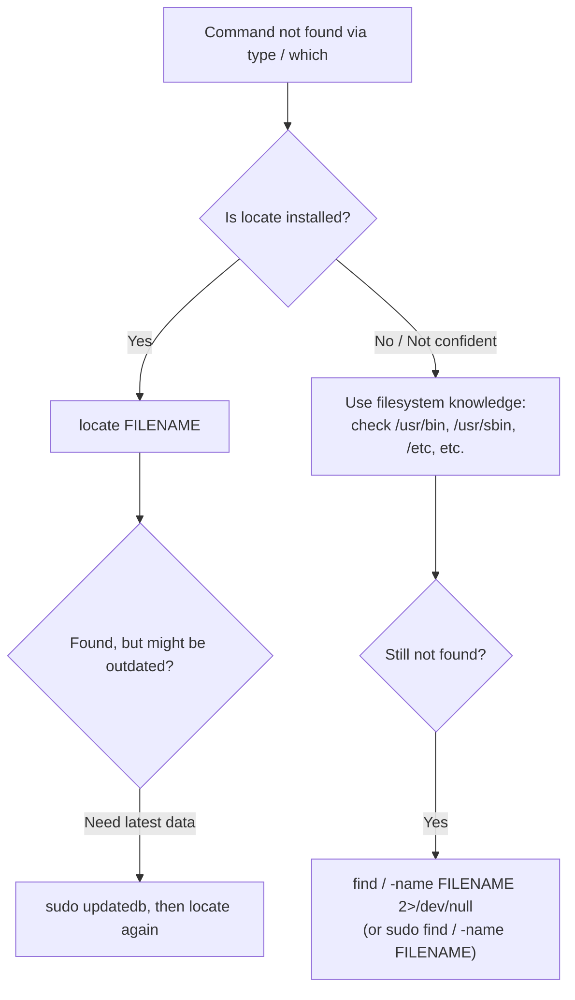

# Finding Commands on a Linux System: `locate` and `find`

## Goal of This Lesson

Before deleting users on a Linux system, we need the `userdel` command. But what happens when a command isn't found in your `PATH`? In this lesson, we'll learn how to track down commands and files using `locate` and `find`, and understand why `userdel` may seem "missing" even though it truly exists.

---

## 1. The Problem: `userdel` Not Found

The command used to delete a user is `userdel`. Let's check for it as a regular (non-root) user.

```bash
type -a userdel
```

Output:

```
bash: type: userdel: not found
```

```bash
which userdel
```

Output:

```
which: no userdel in (/usr/local/bin:/usr/bin:/usr/local/sbin:...)
```

`which` confirms that `userdel` is not located in any directory listed in our current `PATH`.

### Two Possibilities

1. `userdel` genuinely does not exist on this system.
2. `userdel` exists, but lives in a directory that is **not part of our current `PATH`**.

To figure out which is true, we need ways to search the filesystem directly, instead of relying only on `PATH`.

---

## 2. Finding Files With `locate`

### What `locate` Does

`locate` searches a **pre-built index (database)** of files on the system, rather than searching the live filesystem. This makes it **very fast**.

- The index is built by the `updatedb` command.
- `updatedb` is typically scheduled to run **once a day** (via a cron job).
- Because of this, `locate` results can be slightly **out of date** — it won't show files created very recently, until the index is refreshed.

### Syntax

```bash
locate [OPTION]... PATTERN
```

### Example

```bash
locate userdel
```

Output includes:

```
/usr/sbin/userdel
```

This confirms `userdel` really does exist — it just lives in `/usr/sbin`, a directory not included in our regular user's `PATH`.

### Proving `locate` Is Not Real-Time

Let's create a new file and immediately search for it:

```bash
touch userdel
```

> `touch` creates a file if it doesn't exist, or updates its timestamp if it does.

```bash
locate userdel
```

The newly created file (in the home directory) does **not** appear yet, because the index hasn't been refreshed.

### Refreshing the Index: `updatedb`

```bash
sudo updatedb
```

`updatedb` requires **root privileges**, because it scans the entire filesystem, including files a regular user wouldn't normally have permission to see.

```bash
locate userdel
```

Now the output includes:

```
/home/vagrant/userdel
```

The newly created file now appears, because the index was refreshed.

---

## 3. Narrowing Down `locate` Results With `grep`

`locate userdel` can return many unrelated matches. Since we're looking for an **executable**, we can narrow the search using a pipe into `grep`.

### Syntax

```bash
grep PATTERN
```

`grep` reads input, displays lines matching the given pattern, and discards everything else.

### Example

```bash
locate userdel | grep bin
```

This narrows the results down to just the entries containing "bin" in their path — making it much easier to spot the real executable:

```
/usr/sbin/userdel
```

---

## 4. `locate` and File Permissions

`locate` respects normal file permissions — it won't show you files you don't have permission to view.

### Example

```bash
locate .bashrc
```

As a regular user, this might only show:

```
/etc/skel/.bashrc
/home/vagrant/.bashrc
```

### Running `locate` With Root Privileges

```bash
sudo locate .bashrc
```

Now, additional results appear, including files in other users' home directories — because root can see everything.

### Why This Matters: Permission-Restricted Directories

```bash
ls -l /root/.bashrc
```

Output:

```
ls: cannot open directory '/root': Permission denied
```

Regular users cannot view the contents of `/root` by default.

```bash
sudo ls -l /root/.bashrc
```

With root privileges, the file becomes visible.

### Shell Tip: `sudo !!`

The `!!` (double exclamation mark, sometimes called "bang bang") represents the **most recently executed command**.

```bash
sudo !!
```

This re-runs your last command, but with `sudo` in front of it. Bash first displays the expanded command it's about to run, then shows its output:

```
sudo ls -l /root/.bashrc
```

...followed by the actual output. This is a quick way to re-run something with elevated privileges without retyping the whole command.

> **Takeaway:** Sometimes you need root privileges just to **find** a file, because your regular user account doesn't have permission to view the directory it's stored in.

---

## 5. Finding Files Without `locate`: Using Filesystem Knowledge

If `locate` isn't installed or configured, you can fall back on your knowledge of the **Linux filesystem hierarchy** to guess where a file might live.

- Configuration files → usually in `/etc`
- Executables (binaries) → usually in `bin` or `sbin` directories

### Checking Common Binary Directories

```bash
ls -l /bin
ls -l /sbin
```

On most modern Linux systems, `/bin` and `/sbin` are actually **symbolic links** pointing to `/usr/bin` and `/usr/sbin`. On some older Linux distributions or Unix systems, these may be genuinely separate directories with different contents — so it's worth checking both if you're unsure.

### Searching Directly

```bash
ls /usr/bin/userdel
```

```
ls: cannot access '/usr/bin/userdel': No such file or directory
```

> **Tip:** When you see "No such file or directory," believe it — it means exactly what it says. The file is not there.

```bash
ls /usr/sbin/userdel
```

```
/usr/sbin/userdel
```

Found it.

### A Faster Guess: `bin` vs `sbin`

- **`sbin`** directories hold **system administration** commands (typically only relevant to admins/root).
- **`bin`** directories hold **normal commands** meant for everyone (like `ls`).

Since `userdel` is a system administration task, checking `/usr/sbin` first would have been the faster guess.

---

## 6. Finding Files in Real Time: `find`

Unlike `locate`, the `find` command searches the **live filesystem** in real time. This makes it slower than `locate`, but always accurate and up to date.

### Syntax

```bash
find [PATH] [EXPRESSION]...
```

- `PATH` — where to start searching. If omitted, `find` searches the **current directory**.
- `EXPRESSION` — options, tests, and search patterns (like `-name`).

`find` searches **recursively** — it looks inside the given directory, all its subdirectories, and so on.

### Example: Listing Everything in a Directory

```bash
find /usr/bin
```

Without any filters, this lists every file (and subdirectory) under `/usr/bin`.

### Example: Searching by Name

```bash
find /usr/sbin/ -name userdel
```

| Option | Meaning |
|---|---|
| `-name PATTERN` | Matches files whose name matches `PATTERN` |

This returns:

```
/usr/sbin/userdel
```

### Searching the Entire Filesystem

If you have no idea where a file lives, you can search starting from the root (`/`):

```bash
find / -name userdel
```

> **Caution:** Searching the entire filesystem can be slow, especially on systems with a large number of files. Use this approach when narrower guesses don't pan out.

### Handling "Permission Denied" Errors

Searching from `/` as a regular user will likely generate many `Permission denied` messages for directories you can't access. These are standard error messages, sent to **standard error** (file descriptor `2`).

#### Discarding the Errors

```bash
find / -name userdel 2> /dev/null
```

This redirects standard error to `/dev/null` (the null device), discarding the "Permission denied" noise and leaving only the actual matches.

#### Or, Run as Root

If the file you're searching for lives somewhere your user account can't normally access, run the search with elevated privileges instead:

```bash
sudo find / -name userdel
```

This avoids the permission errors entirely, since root can access virtually the whole filesystem.

---

## 7. Summary Diagram: Choosing a Search Approach



---

## 8. Why `userdel` Wasn't Found Earlier

Even though `userdel` genuinely exists at `/usr/sbin/userdel`, our regular user's `PATH` didn't include `/usr/sbin`, so `type` and `which` reported it as "not found."

However, `/usr/sbin` **is** typically included in **root's** `PATH`. To confirm:

```bash
sudo su -
```

(On this practice system, the root password is also `vagrant`.)

```bash
type -a userdel
```

As root, `userdel` is now found, since `/usr/sbin` is part of root's search path.

```bash
exit
```

This returns you back to your regular user account.

---

## Anti-Patterns to Avoid

- **Don't** assume a command doesn't exist just because `type` or `which` can't find it — it might simply be outside your current `PATH`.
- **Don't** trust `locate` results as fully up to date — remember it relies on a periodically refreshed index (`updatedb`), typically run once a day.
- **Don't** ignore "Permission denied" messages from `find` as if something is broken — they usually just mean you lack access to certain directories, which is expected behavior for a regular user.
- **Don't** run `find /` searches routinely on production or very large systems without narrowing the path first — it can be slow and resource-intensive.

---

## Quick Reference Table

| Command | Purpose |
|---|---|
| `type -a COMMAND` | Checks if a command is a built-in, function, or program in `PATH` |
| `which COMMAND` | Shows the path to the executable that would run for a command, if in `PATH` |
| `locate PATTERN` | Fast search using a pre-built index (may be slightly outdated) |
| `sudo updatedb` | Refreshes the index used by `locate` (requires root) |
| `find PATH -name PATTERN` | Real-time recursive search of the filesystem starting at `PATH` |
| `find / -name PATTERN 2> /dev/null` | Searches the whole filesystem, discarding permission-denied errors |
| `sudo find / -name PATTERN` | Searches the whole filesystem with root privileges, avoiding permission errors |
| `!!` | Represents the most recently executed command |
| `sudo !!` | Re-runs the last command with root privileges |

---

## Practice Questions

**Q1: Why might `type` or `which` report that a command like `userdel` is "not found," even though it exists on the system?**
A: Because the command's directory (like `/usr/sbin`) may not be included in the current user's `PATH`, even though the file physically exists there.

**Q2: What is the key difference between `locate` and `find`?**
A: `locate` searches a pre-built index (fast, but can be outdated), while `find` searches the live filesystem in real time (slower, but always accurate).

**Q3: Why might a newly created file not show up immediately with `locate`?**
A: Because `locate`'s index is only refreshed when `updatedb` runs, which is typically scheduled once a day — not in real time.

**Q4: How do you manually refresh the `locate` index, and why does it need root privileges?**
A: Run `sudo updatedb`. It requires root because it scans the entire filesystem, including areas a regular user doesn't have permission to read.

**Q5: What does `sudo !!` do?**
A: It re-runs the most recently executed command, but with root (`sudo`) privileges.

**Q6: What is the general rule for where system administration commands (like `userdel`) versus everyday commands (like `ls`) are stored?**
A: System administration commands typically live in `sbin` directories, while commands meant for all users typically live in `bin` directories.

**Q7: What does the `find` command's `-name` option do?**
A: It filters results to only files whose name matches the given pattern.

**Q8: Why might a `find / -name FILENAME` search produce many "Permission denied" messages?**
A: Because searching from the root directory (`/`) as a regular user encounters directories the user doesn't have permission to read, and `find` reports each one as an error.

**Q9: How can you suppress "Permission denied" errors when using `find`?**
A: Redirect standard error to `/dev/null`, e.g., `find / -name FILENAME 2> /dev/null`.

**Q10: If a file exists but only in a directory a regular user cannot access, what are two ways to still find or view it?**
A: Run the search or view command with `sudo` (elevated privileges), or switch to the root user account entirely (e.g., `sudo su -`).