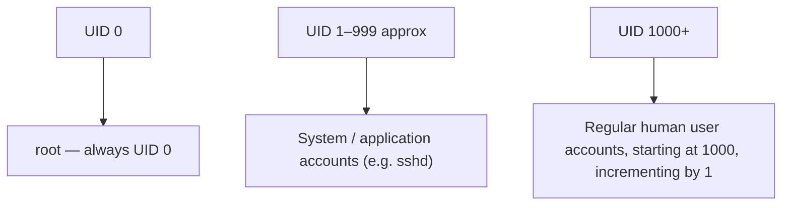

# Deleting Users With `userdel` and Understanding UIDs

## Goal of This Lesson

In this lesson, we will learn how to use the `userdel` command to remove user accounts, understand the difference between deleting an account with and without removing its home directory, and learn how Linux assigns User IDs (UIDs) to different types of accounts.

---

## 1. The `userdel` Command

Since `userdel` is a program on the filesystem, we can read its manual page to learn how to use it.

```bash
man userdel
```

**What it does:** `userdel` deletes a user account and related files.

### Syntax

```bash
userdel [OPTION]... LOGIN
```

### Key Options

| Option | Meaning |
|---|---|
| `-f`, `--force` | Force removal of the account, even if the user is currently logged in. Also forces removal of the user's home directory, even if it is shared with another user. **Use with caution.** |
| `-r`, `--remove` | Remove the user's home directory and mail spool, along with the user account itself. |

> **Note on `-f`:** Normal user accounts usually don't share home directories, but some application accounts might. Because `-f` can delete a shared home directory, the man page specifically warns to use this option carefully.

---

## 2. Checking Existing Users

Before deleting anything, let's see which user accounts currently exist:

```bash
tail /etc/passwd
```

Example output shows several accounts created during earlier exercises, such as `einstein`, `isaac`, `tedison`, `jlocke`, and so on.

---

## 3. Deleting a User Without Removing Their Home Directory

### Example: Deleting `einstein`

```bash
sudo userdel einstein
```

### Verifying the Account Is Gone

```bash
id einstein
```

Output:

```
id: 'einstein': no such user
```

The account itself is gone.

### Checking the Home Directory

```bash
ls -l /home/
```

The `einstein` directory is **still there**. This confirms that running `userdel` **without any options** removes the user account, but **leaves their files behind**.

> **Why this can be useful:** If you want to keep access to a user's files after removing their account (for example, to review or archive their data), running `userdel` without `-r` is exactly the behavior you want.

---

## 4. Numbers Instead of Usernames: Orphaned Files

Looking more closely at the leftover home directory:

```bash
ls -l /home/einstein
```

You'll notice the **owner and group columns show numbers** instead of a username, like `1001` instead of `einstein`.

**Why this happens:** Once the `einstein` account (which had UID `1001`) is deleted, there is no longer any account associated with that UID. The files still technically belong to UID `1001` — Linux just can't display a name for it anymore, since the account that number pointed to no longer exists.

> **Rule of thumb:** If you ever run `ls -l` and see a plain number where you'd normally expect a username or group name, it means that UID or GID no longer has a matching account — the account was deleted, or never existed in the first place.

---

## 5. Understanding User IDs (UIDs)

### Checking a UID

#### Syntax

```bash
id -u USERNAME
```

`-u` returns just the numeric user ID.

### Examples

```bash
id -u root
```

```
0
```

The `root` user **always** has UID `0`, on every standard Linux system.

```bash
id -u sshd
```

```
74
```

`sshd` is a **system account** (used to run the SSH service), and system accounts generally have low UID numbers.

```bash
id -u vagrant
```

```
1000
```

The `vagrant` user (a normal, regular user account) has UID `1000` — since it was the first regular user account created on this system.

```bash
id -u isaac
```

```
1002
```

### Spotting the Pattern

| Account Type | Typical UID Range |
|---|---|
| `root` | Always `0` |
| System / application accounts | Low numbers (well under 1000) |
| First regular user created | `1000` |
| Each additional regular user | `1001`, `1002`, `1003`, ... (incrementing by 1) |

`einstein` was the second regular account created, so it received UID `1001`. `isaac` was created after that, so it received UID `1002`, and so on.

---

## 6. Where This Behavior Comes From: `/etc/login.defs`

This UID numbering behavior is configured in the `login.defs` file.

```bash
less /etc/login.defs
```

Search for `UID_MIN` and `UID_MAX`:

```
UID_MIN                  1000
UID_MAX                 60000
```

These define the **minimum and maximum UID values** used for automatically assigning UIDs when `useradd` creates a new user. This is exactly why the first regular user gets UID `1000`, and each new one increments from there.

Just below these, you'll also find:

```
SYS_UID_MIN                201
SYS_UID_MAX                999
```

`SYS_UID_MAX` of `999` means any account with a UID of **999 or lower** is generally considered a **system account** (used for running services, not for a real human login).



### Why This Matters Before Deleting a User

> **Safety tip:** Before deleting an account, it's a good idea to check its UID first with `id -u USERNAME`. If the UID is **less than 1000**, be extra careful — it likely belongs to a system or service account that something on your server may depend on, rather than a normal human user account.

---

## 7. Deleting a User AND Their Home Directory: The `-r` Option

### Example: Deleting `isaac` With Home Directory Removal

```bash
sudo userdel -r isaac
```

### Verifying the Account Is Gone

```bash
id isaac
```

```
id: 'isaac': no such user
```

### Verifying the Home Directory Is Also Gone

```bash
ls -l /home/isaac
```

```
ls: cannot access '/home/isaac': No such file or directory
```

This confirms that the `-r` option removes **both** the user account **and** their home directory (including all the files within it) — unlike a plain `userdel`, which leaves the home directory behind.

---

## 8. Summary: `userdel` Behavior Comparison

| Command | Removes Account? | Removes Home Directory? |
|---|---|---|
| `userdel USERNAME` | Yes | No — files remain, now owned by a "ghost" UID |
| `userdel -r USERNAME` | Yes | Yes — account and all files are removed |
| `userdel -f USERNAME` | Yes (even if logged in) | Also forces removal of a shared home directory — use with caution |

---

## Anti-Patterns to Avoid

- **Don't** assume `userdel` (without options) removes a user's files — it only removes the account, leaving the home directory behind.
- **Don't** use `userdel -f` casually — it can forcibly remove a home directory even if it's shared with another account, which can unintentionally delete someone else's files too.
- **Don't** delete an account without first checking its UID with `id -u USERNAME` — a UID under 1000 often indicates a system or service account that other things may depend on.
- **Don't** be alarmed if `ls -l` shows a number instead of a username after deleting an account — this is expected behavior when files are left behind after `userdel` without `-r`.

---

## Quick Reference Table

| Command | Purpose |
|---|---|
| `man userdel` | View the manual page for `userdel` |
| `sudo userdel USERNAME` | Delete a user account, leaving their home directory intact |
| `sudo userdel -r USERNAME` | Delete a user account and remove their home directory |
| `sudo userdel -f USERNAME` | Force-delete a user account, even if logged in or home directory is shared |
| `id -u USERNAME` | Show a user's numeric UID |
| `/etc/login.defs` | Configuration file defining UID ranges (`UID_MIN`, `UID_MAX`, `SYS_UID_MIN`, `SYS_UID_MAX`) |

---

## Practice Questions

**Q1: What is the difference between `userdel USERNAME` and `userdel -r USERNAME`?**
A: `userdel USERNAME` removes only the account, leaving the home directory and its files behind. `userdel -r USERNAME` removes both the account and the home directory.

**Q2: Why might you choose to run `userdel` without the `-r` option?**
A: To preserve a user's files for later review or archiving, even after their account has been removed.

**Q3: Why does `ls -l` sometimes show a number instead of a username in the owner column?**
A: Because the file's owner UID no longer has a matching user account — often because that account was deleted without removing its files.

**Q4: What UID does the `root` account always have?**
A: `0`.

**Q5: What UID does the first regular user account created on a system typically receive?**
A: `1000`.

**Q6: What determines the UID range used for automatically assigning UIDs to new regular users?**
A: The `UID_MIN` and `UID_MAX` settings in `/etc/login.defs`.

**Q7: What UID range is generally considered to belong to system or application accounts?**
A: UIDs at or below `SYS_UID_MAX`, commonly `999` or lower (with `SYS_UID_MIN` typically around `201`).

**Q8: Why should you check a user's UID before deleting their account?**
A: Because a low UID (under 1000) may indicate a system or service account that something important on the server depends on, rather than a regular human user.

**Q9: What does the `-f` option to `userdel` do, and why is caution advised when using it?**
A: It forces account removal even if the user is logged in, and forces removal of the home directory even if shared with another account — which could unintentionally delete another user's shared files.

**Q10: How can you check whether a specific user's account still exists on the system?**
A: Run `id USERNAME`. If the account was deleted, it will report that no such user exists.