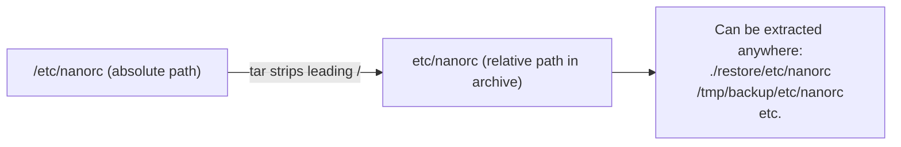

# Archiving Files With `tar`

## Goal of This Lesson

If you want to archive or back up a user's home directory (or any set of files) before deleting it, the `tar` command is the standard Linux tool for the job. In this lesson, we'll learn how to create, view, and extract archives, how to compress them, and some important safety behaviors to watch out for.

---

## 1. What Is `tar`

`tar` originally stood for **"tape archive"** — it was created to write files to tape storage. Today, it's used to bundle files into a single archive file on any storage device, not just tapes.

### Checking the Command

```bash
type -a tar
```

Output:

```
tar is /usr/bin/tar
```

`tar` is an executable program, so use the man page for details:

```bash
man tar
```

### Syntax

```bash
tar [OPTION]... -f ARCHIVE [FILE/DIRECTORY]...
```

### Core Options

| Option | Meaning |
|---|---|
| `-c` | **Create** a new archive |
| `-f FILE` | Specify the archive **file** name to use |
| `-t` | **List** (view) the contents of an archive |
| `-v` | **Verbose** — show files as they are processed |
| `-x` | **Extract** the contents of an archive |
| `-z` | **Compress/decompress** using gzip |

These three actions — create, list, extract — cover the core uses of `tar`.

---

## 2. Setting Up Sample Files

Let's create a folder with a few files to practice on:

```bash
mkdir catvideos
touch catvideos/admiral-catbar
touch catvideos/darthpaw
touch catvideos/luke-claw-walker
touch catvideos/obi-wan-catnobi
touch catvideos/padme-amikitty.mp4
```

```bash
ls catvideos/
```

These are just empty placeholder files, created with `touch`, for demonstration.

---

## 3. Creating an Archive

### Syntax

```bash
tar -c -f ARCHIVE_NAME.tar PATH
```

### Example

```bash
tar -c -f catvideos.tar catvideos
```

By convention, archive files often end in `.tar` — this isn't required, but it's good practice so the file type is clear at a glance.

```bash
ls
```

```
catvideos  catvideos.tar
```

The archive was successfully created.

---

## 4. Viewing the Contents of an Archive

### Syntax

```bash
tar -t -f ARCHIVE_NAME.tar
```

### Example

```bash
tar -t -f catvideos.tar
```

Output:

```
catvideos/
catvideos/admiral-catbar
catvideos/darthpaw
catvideos/luke-claw-walker
catvideos/obi-wan-catnobi
catvideos/padme-amikitty.mp4
```

This lets you inspect an archive's contents **without extracting it**.

---

## 5. Using Verbose Mode While Creating an Archive

By default, `tar -c` works silently. To see each file as it's added, use `-v`.

```bash
rm catvideos.tar
tar -cv -f catvideos.tar catvideos/
```

Output shows each file being added, in real time, as the archive is built. (Note: a trailing `/` on the directory path is optional — both `catvideos` and `catvideos/` work the same way.)

---

## 6. Extracting an Archive

### Syntax

```bash
tar -x -f ARCHIVE_NAME.tar
```

### Example

```bash
mkdir restore
cd restore
tar -x -f ../catvideos.tar
```

> `../` is a standard Linux relative path convention meaning "the parent directory of where I currently am" — this isn't specific to `tar`. You could also use a full path, such as `/home/vagrant/catvideos.tar`, if you prefer.

```bash
ls catvideos/
```

The extracted files match exactly what was in the original archive.

### Extracting With Verbose Mode

```bash
rm -rf catvideos
tar -xv -f ../catvideos.tar
```

Now you can see exactly what is being created and extracted, step by step — useful for confirming what an archive is doing to your filesystem.

```bash
cd ..
```

---

## 7. Compressing Archives

Archives are often compressed to save disk space.

### Method 1: Two Separate Steps

```bash
tar -c -f catvideos.tar catvideos
gzip catvideos.tar
```

`gzip` compresses the file and appends `.gz` to its name:

```
catvideos.tar.gz
```

> **Rule of thumb:** A file ending in `.tar.gz` is a compressed archive.

To reverse this and get the original `.tar` file back:

```bash
gunzip catvideos.tar.gz
```

### Method 2: Compress While Creating (Recommended)

Use the `-z` option to combine compression with archive creation in a single step.

```bash
tar -zcv -f catvideos.tar.gz catvideos
```

| Option | Meaning |
|---|---|
| `-z` | Compress/decompress with gzip |
| `-c` | Create an archive |
| `-v` | Verbose |
| `-f FILE` | Archive file name |

```bash
ls
```

```
catvideos.tar.gz
```

### Listing the Contents of a Compressed Archive

You also need `-z` to view contents without extracting:

```bash
tar -ztv -f catvideos.tar.gz
```

This shows the archive's contents directly, without decompressing it to disk first.

### Alternate Extension: `.tgz`

Some people use `.tgz` instead of `.tar.gz` — they mean exactly the same thing.

```bash
tar -zcv -f catvideos.tgz catvideos
```

### Restoring a Compressed Archive

```bash
cd restore
tar -zx -f /home/vagrant/catvideos.tgz
```

```bash
ls catvideos/
```

The files are extracted and decompressed in a single step.

---

## 8. Important Safety Warning: `tar` Overwrites Without Asking

Like most Linux commands, `tar` assumes you are a knowledgeable, responsible user — it does **not** ask for confirmation before overwriting files.

### Demonstration

Modify a file inside the extracted `catvideos` directory:

```bash
echo "some text" > catvideos/darthpaw
cat catvideos/darthpaw
```

```
some text
```

> **Shell tip:** `!$` refers to the **last argument of the previous command**. For example, after running `echo "some text" > catvideos/darthpaw`, typing `cat !$` would expand to `cat catvideos/darthpaw`. This is another example of a bash **event designator**, saving you from retyping long paths.

Now, extract the original archive again, on top of the modified file:

```bash
tar -zx -f /home/vagrant/catvideos.tgz
cat catvideos/darthpaw
```

Output: nothing (empty).

```bash
ls -l catvideos/darthpaw
```

```
-rw-r--r-- 1 vagrant vagrant 0 ... catvideos/darthpaw
```

The file is now `0` bytes — exactly what it was inside the original archive. `tar` silently **overwrote** the modified file with the archive's version, without any warning or confirmation prompt.

> **Lesson:** Always be careful and deliberate when extracting archives. `tar` will happily overwrite whatever is in its way.

---

## 9. `tar` and File Permissions

Like any other Linux command, `tar` respects file permissions:

- You **cannot** archive files you don't have permission to read.
- You **cannot** extract an archive into a location you don't have permission to write to.

If you need to guarantee access, use `sudo` or switch to the root user.

### Example: Backing Up `/etc`

The `/etc` directory contains most of the system's configuration files. Some of these require root privileges to read.

```bash
sudo tar -zc -f etc.tgz /etc
```

(The `-v` option was intentionally left off here to focus on a special message `tar` prints.)

**Special message from `tar`:**

```
tar: Removing leading '/' from member names
```

---

## 10. Why `tar` Removes the Leading Slash

Let's inspect the archive's contents:

```bash
tar -ztv -f etc.tgz
```

Notice the paths inside the archive look like:

```
etc/nanorc
```

...**not**:

```
/etc/nanorc
```

**Why this matters:**

- If the archive kept the absolute path (`/etc/nanorc`), extracting it would **always** write directly back to `/etc/nanorc`, potentially **overwriting your live configuration files** immediately.
- By stripping the leading `/`, the archive stores a **relative** path instead. This lets you extract the archive into **any directory you choose** — such as a separate "restore" or "comparison" folder — without automatically overwriting the originals.
- This is especially useful if your goal is to compare a backup against the current live files, rather than blindly restoring over them.



---

## 11. Old-Style ("Old Options") `tar` Syntax

You may encounter an older syntax style in scripts or documentation, sometimes referred to as **"old options."**

### Example

```bash
tar zcvf catvideos.tgz catvideos
```

Notice there is **no leading hyphen (`-`)** before `zcvf`.

### Rules for Old-Style Syntax

- All the option letters must be written together, with **no spaces** and **no dashes**.
- This clumped set of letters must be the **very first thing** after `tar` (and some whitespace) — it cannot appear anywhere else on the command line.
- Each letter corresponds exactly to its short-option equivalent (e.g., old-style `t` = `-t`).
- If any of the options require an argument (like `-f` needing a filename), those arguments must be supplied **in the same order** the corresponding letters appear.

### Why This Gets Confusing

If you try to rearrange things — for example:

```bash
tar F catvideos c v ...
```

`tar` will misinterpret `c` and `v` as **files to be added to the archive**, not as options — because outside of the very first clumped set, letters and words are treated as arguments and file names, not options.

### Recommendation

> **Just use dashes.** Instead of memorizing the strict ordering rules of old-style syntax, stick with standard modern syntax:

```bash
tar -f catvideos.tar -c -v catvideos
```

This is clearer, less error-prone, and works exactly the same as the old-style equivalent — without needing to worry about argument ordering.

---

## Anti-Patterns to Avoid

- **Don't** extract an archive over existing files without checking first — `tar` overwrites silently, with no confirmation prompt.
- **Don't** forget the `-z` option when working with a compressed archive (`.tar.gz` or `.tgz`) — without it, `tar` won't correctly read or write the compressed data.
- **Don't** rely on old-style (no-dash) `tar` syntax in your own scripts — it's confusing and error-prone when combined with options that need arguments. Prefer standard dashed options.
- **Don't** assume you can archive or extract files you don't have permission to access — use `sudo` or become root when working with protected system files like those in `/etc`.

---

## Quick Reference Table

| Command | Purpose |
|---|---|
| `tar -c -f FILE.tar PATH` | Create an archive |
| `tar -cv -f FILE.tar PATH` | Create an archive, showing progress (verbose) |
| `tar -t -f FILE.tar` | List the contents of an archive |
| `tar -x -f FILE.tar` | Extract the contents of an archive |
| `tar -zc -f FILE.tar.gz PATH` | Create a compressed (gzip) archive |
| `tar -zt -f FILE.tar.gz` | List the contents of a compressed archive |
| `tar -zx -f FILE.tar.gz` | Extract a compressed archive |
| `gzip FILE.tar` | Compress an existing `.tar` file into `.tar.gz` |
| `gunzip FILE.tar.gz` | Decompress a `.tar.gz` file back into `.tar` |
| `.tar.gz` / `.tgz` | Two equivalent naming conventions for a compressed tar archive |

---

## Practice Questions

**Q1: What did the letters "tar" originally stand for?**
A: Tape archive — originally used to write files to tape storage devices.

**Q2: What is the difference between `-c`, `-t`, and `-x` in `tar`?**
A: `-c` creates a new archive, `-t` lists (views) the contents of an existing archive, and `-x` extracts the contents of an archive.

**Q3: What does the `-v` option add to a `tar` command?**
A: Verbose output — it shows each file as it is added to or extracted from the archive.

**Q4: What does the `-z` option do?**
A: It tells `tar` to compress the archive using gzip when creating it, or decompress it when reading/extracting it.

**Q5: Are `.tar.gz` and `.tgz` different file formats?**
A: No, they represent the same thing — a gzip-compressed tar archive; `.tgz` is just a shorter, alternate naming convention.

**Q6: Does `tar` ask for confirmation before overwriting an existing file during extraction?**
A: No. `tar` overwrites files silently, without any warning or confirmation prompt.

**Q7: Why does `tar` remove the leading `/` from file paths when archiving something like `/etc`?**
A: To store the paths as relative rather than absolute, so the archive can be extracted into any chosen directory instead of always overwriting the original absolute-path locations.

**Q8: Why might you need `sudo` when creating an archive of `/etc`?**
A: Because some files inside `/etc` require root privileges to read, and `tar` respects normal file permissions just like any other command.

**Q9: What is "old-style" `tar` syntax, and why is it discouraged for regular use?**
A: It's a syntax where option letters are clumped together with no leading dash (e.g., `tar zcvf file.tgz path`). It's discouraged because the letters must appear in a strict order matching any required arguments, which can get confusing — using dashed options is clearer and less error-prone.

**Q10: How can you view the contents of a compressed archive without extracting it to disk first?**
A: Use `tar -zt -f ARCHIVE.tar.gz` (or `.tgz`), combining the list (`-t`) and compression (`-z`) options.