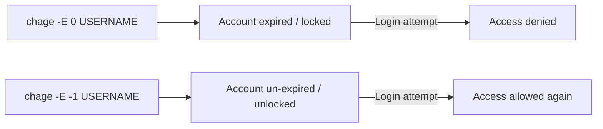

# Locking User Accounts and Writing a User Deletion Script

## Goal of This Lesson

Sometimes you don't want to **delete** a user account — you just want to **lock** it temporarily. In this lesson, we'll learn the correct way to disable an account using `chage`, look at some older (and flawed) locking methods, and finish by writing a simple shell script that deletes a user account safely.

---

## 1. Why Lock an Account Instead of Deleting It

Imagine someone is going on an extended vacation or leave of absence. You still want them to use their account when they return, but while they're away:

- The account still exists, so it's still a potential target for a break-in.
- Since the real owner isn't using it, nobody may notice if someone else starts using it without permission.

**Solution:** Lock (disable) the account temporarily, instead of deleting it, so it can be safely restored later.

---

## 2. The Correct Tool: `chage`

`chage` stands for **"change age"** (i.e., change the "age" settings of a password/account). It is the recommended way to expire and unexpire an account.

### Getting Help

```bash
man chage
```

### Key Option

| Option | Meaning |
|---|---|
| `-E DATE` or `-E DAYS` | Set the account's **expiration date**. You can specify either an actual date, or a number representing days since January 1, 1970 (Epoch time). |

> To **remove** an expiration (un-expire the account), use `-1` (negative one) as the argument to `-E`.

### Demonstration: Locking an Account

Let's say we have a user named `woz` (UID `1008`).

**Confirming the account works normally first:**

```bash
su - woz
```

Enter the password when prompted — login succeeds.

```bash
exit
```

### Expiring (Locking) the Account

#### Syntax

```bash
sudo chage -E DAYS USERNAME
```

#### Example: Expire Immediately

```bash
sudo chage -E 0 woz
```

Now try logging in as `woz`:

```bash
su - woz
```

Output:

```
Your account has expired; please contact your system administrator
```

The account is now effectively locked — login is refused.

### Unlocking the Account

```bash
sudo chage -E -1 woz
```

Try logging in again:

```bash
su - woz
```

Login succeeds. You may also see a message noting there was **one failed login attempt** since the account was locked — a helpful security detail.

```bash
exit
```



---

## 3. Older (Less Reliable) Locking Methods

These methods are shown so you can recognize them in older scripts or documentation — but `chage` is the recommended approach.

### Method A: `passwd -l` / `passwd -u`

#### Syntax

```bash
sudo passwd -l USERNAME     # Lock
sudo passwd -u USERNAME     # Unlock
```

#### Example

```bash
sudo passwd -l woz
```

```
passwd: password expiry information changed.
```

(In practice, it disables the password by prefixing it with an invalid character in `/etc/shadow`.)

```bash
sudo passwd -u woz
```

```
passwd: password expiry information changed.
```

#### ⚠️ Critical Limitation

> **`passwd -l` does NOT prevent SSH key-based authentication.** It only disables the account's **password**. If the user (or an attacker) has an SSH key already set up for that account, they can **still log in**, completely bypassing this "lock."

Since SSH keys are increasingly the primary method of authentication on modern systems, this method can give a **false sense of security**. **Avoid using `passwd -l` for real account locking — use `chage` instead.**

### Method B: Changing the User's Shell to `nologin`

#### Checking Available Shells

```bash
cat /etc/shells
```

Output typically includes something like:

```
/bin/bash
/bin/sh
/usr/sbin/nologin
```

`/usr/sbin/nologin` is a special "shell" whose only job is to immediately exit and (usually) print a message, rather than actually starting an interactive session.

#### Setting a User's Shell to `nologin`

```bash
sudo usermod -s /usr/sbin/nologin woz
```

| Option | Meaning |
|---|---|
| `-s SHELL` | Sets the user's login shell |

> For the full list of settings `usermod` can change on an existing account, see `man usermod` — it is a large and detailed command, worth exploring on your own.

#### ⚠️ Critical Limitation

At first glance, this seems like it should work — if someone tries to SSH in and their shell is `nologin`, they get logged out immediately. And it **does** work for **interactive logins**.

However, SSH can still be used for things that **don't require an interactive shell**, such as:

- **Port forwarding**
- Running specific pre-authorized remote commands

So a user with `nologin` as their shell could still potentially use SSH for these non-interactive purposes, even though they can't get an interactive terminal session.

### Summary: Why `chage -E 0` Is the Recommended Method

| Method | Blocks Password Login? | Blocks SSH Key Login? | Blocks Non-Interactive SSH (e.g. port forwarding)? |
|---|---|---|---|
| `passwd -l` | Yes | **No** | No |
| Shell set to `nologin` | Yes (interactive) | Yes (interactive) | **No** |
| `chage -E 0` | **Yes** | **Yes** | **Yes** |

`chage -E 0` disables the **account itself**, not just one authentication method — making it the most complete and reliable way to lock an account.

---

## 4. Writing a Simple User Deletion Script

Let's put together several concepts from this course into a small, practical script that deletes a user account.

### Requirements

1. Must be run with **root privileges** (since `userdel` requires it).
2. Takes the username to delete as the **first argument**.
3. Deletes the account and checks whether it succeeded.
4. Reports success or failure clearly.

### The Script

```bash
#!/bin/bash
# This script deletes a user account, given as the first argument.
# Must be run with root privileges.

if [[ "${UID}" -ne 0 ]]; then
  echo "Please run this script with root privileges" >&2
  exit 1
fi

USER="${1}"

userdel "${USER}"

if [[ "${?}" -ne 0 ]]; then
  echo "The account ${USER} was not deleted" >&2
  exit 1
fi

echo "The account ${USER} was deleted"
exit 0
```

### Explaining Each Part

- **Root check:**
  ```bash
  if [[ "${UID}" -ne 0 ]]; then
  ```
  `UID` is a built-in Bash variable holding the current user's numeric ID. Root always has UID `0`. If it's **not** `0`, the script prints an error to standard error and exits with a non-zero status.

- **Capturing the username:**
  ```bash
  USER="${1}"
  ```
  For simplicity, this script **assumes** the first argument is the username to delete. (In a real-world script, you'd want to validate this more carefully — for example, checking that an argument was actually supplied at all.) Using a descriptive variable name like `USER` instead of just `$1` throughout the script makes the code easier to read — though using `$1` directly everywhere would also work.

- **Deleting the account:**
  ```bash
  userdel "${USER}"
  ```

- **Checking the result:**
  ```bash
  if [[ "${?}" -ne 0 ]]; then
  ```
  `$?` holds the exit status of the most recently run command — in this case, `userdel`. A non-zero value means something went wrong (e.g., the user didn't exist).

- **Reporting success:**
  If the script reaches the final `echo`, it means `userdel` succeeded, so we tell the user which account was removed, and exit with status `0` (success).

---

## 5. Testing the Script

### Setup

```bash
chmod 755 luser-demo12.sh
```

### Test 1: Deleting an Existing User

```bash
tail /etc/passwd
```

Let's say the last user listed is `moore`.

```bash
sudo ./luser-demo12.sh moore
```

Output:

```
The account moore was deleted
```

```bash
id moore
```

```
id: 'moore': no such user
```

Confirms the deletion worked.

### Test 2: Deleting a Non-Existent User

```bash
sudo ./luser-demo12.sh jason
```

Output:

```
userdel: user 'jason' does not exist
The account jason was not deleted
```

**What happened:**

1. `userdel` itself printed its own error message (`user 'jason' does not exist`), since it couldn't find the account.
2. `userdel` returned a **non-zero exit status**.
3. Our script's `if` check caught that failure and printed its own error message too, then exited with status `1`.

This confirms the script correctly detects and reports failures, instead of blindly assuming success.

---

## Anti-Patterns to Avoid

- **Don't** use `passwd -l` as your only way to lock an account if SSH key authentication is in use — it does not block key-based logins at all.
- **Don't** rely solely on setting a user's shell to `nologin` if you need to fully block SSH access — it still allows non-interactive SSH usage like port forwarding.
- **Don't** assume a command like `userdel` always succeeds — always check its exit status (`$?`) before reporting success to the user.
- **Don't** skip the root-privilege check in scripts that perform administrative actions like deleting accounts — attempting them without proper privileges will fail, and the script should communicate this clearly rather than producing a confusing error partway through.

---

## Quick Reference Table

| Command | Purpose |
|---|---|
| `chage -E 0 USERNAME` | Expire (lock) an account immediately — the recommended way to disable an account |
| `chage -E -1 USERNAME` | Remove expiration (unlock) an account |
| `passwd -l USERNAME` | Lock only the password (does **not** block SSH key logins) |
| `passwd -u USERNAME` | Unlock a password-locked account |
| `cat /etc/shells` | List available login shells on the system |
| `usermod -s /usr/sbin/nologin USERNAME` | Set a user's shell to `nologin` (blocks interactive login, but not all SSH use) |
| `userdel USERNAME` | Delete a user account |
| `${UID}` | Built-in variable holding the current user's numeric user ID |
| `${?}` | Exit status of the most recently executed command |

---

## Practice Questions

**Q1: Why might you want to lock a user account instead of deleting it?**
A: To temporarily disable access (e.g., during an extended leave of absence) while preserving the account so the user can use it again when they return.

**Q2: What command is recommended for properly expiring (locking) a user account?**
A: `chage`, using the `-E` option (e.g., `chage -E 0 USERNAME` to lock, `chage -E -1 USERNAME` to unlock).

**Q3: Why is `passwd -l` not a reliable way to fully lock an account?**
A: Because it only disables password-based login. It does **not** prevent the user from logging in via SSH key authentication.

**Q4: Does setting a user's shell to `nologin` completely block all SSH access?**
A: No. It blocks interactive logins, but the user can still use SSH for non-interactive purposes, such as port forwarding.

**Q5: What does `chage -E 0` do, and why is it considered the most reliable locking method covered in this lesson?**
A: It sets the account's expiration to immediately expire, which disables the account itself — blocking password logins, SSH key logins, and non-interactive SSH usage alike.

**Q6: In the user deletion script, how does the script check if it's being run with root privileges?**
A: It checks whether the built-in `${UID}` variable equals `0` (root's UID); if not, it prints an error and exits.

**Q7: How does the script determine whether `userdel` succeeded or failed?**
A: It checks `${?}`, the exit status of the most recently run command (`userdel`), immediately after calling it.

**Q8: What happens in the script if you try to delete a username that doesn't exist?**
A: `userdel` itself prints an error and returns a non-zero exit status; the script detects this via `${?}`, prints its own failure message, and exits with a non-zero status.

**Q9: Why does the script use a variable named `USER` instead of just using `$1` throughout?**
A: For readability — a descriptive variable name makes the script's intent clearer, though using `$1` directly would technically work just the same.

**Q10: What exit status does the script return on success, and why does that matter?**
A: It returns `0` on success, following the standard Linux convention that an exit status of `0` means success and any non-zero value means failure — which allows other scripts or tools to reliably check whether this script worked.