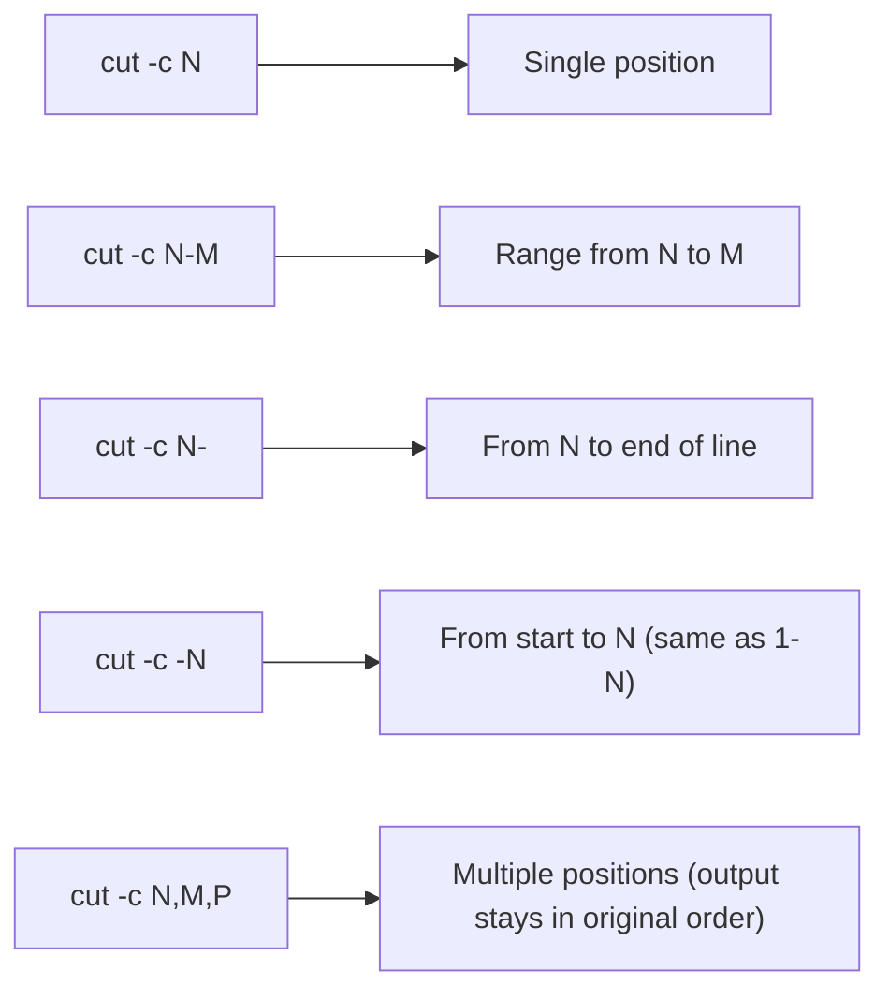

# Extracting and Rearranging Text With `cut` and `awk`

## Goal of This Lesson

In this lesson, we will learn how to extract specific sections of text from each line of input using the `cut` command, and then move on to `awk`, a more powerful tool for handling multi-character delimiters and irregular, whitespace-separated data.

---

## 1. What Is `cut`

`cut` extracts sections from each line of input and prints them to standard output. You can extract by:

- **Byte** position (`-b`)
- **Character** position (`-c`)
- **Field** / delimiter (`-f`)

This makes `cut` well-suited for pulling out columns from CSV-style files.

`cut` is **not** a shell built-in — it's a standalone program, so use its man page for full details:

```bash
man cut
```

### Syntax

```bash
cut OPTION RANGE [FILE]
```

| Option | Meaning |
|---|---|
| `-b RANGE` | Cut by byte position |
| `-c RANGE` | Cut by character position |
| `-f RANGE` | Cut by field (column), split using a delimiter |
| `-d DELIMITER` | Set the delimiter used with `-f` (default is tab) |
| `--output-delimiter=STRING` | Change the delimiter used in the output |

---

## 2. Cutting by Character: `-c`

We'll experiment using `/etc/passwd` as sample data.

```bash
cat /etc/passwd
```

### Printing a Single Character Position

```bash
cut -c 1 /etc/passwd
```

This prints the **first character** of every line. If the last two lines in the file belong to accounts like `vagrant` and `vboxadd`, you'd expect those lines to print `v` — and they do.

```bash
cut -c 7 /etc/passwd
```

Prints the 7th character of every line.

### Range: Start Position to End Position

Use a hyphen to connect a starting and ending position:

```bash
cut -c 4-7 /etc/passwd
```

Prints characters 4 through 7 of every line.

> **Important:** Do not put spaces around the hyphen in a range — `4-7`, not `4 - 7`.

### Range: From a Position to the End of the Line

```bash
cut -c 4- /etc/passwd
```

This prints from character 4 **to the end of the line**, no matter how long each line is. Useful when line lengths vary.

### Range: From the Beginning to a Position

```bash
cut -c -4 /etc/passwd
```

This prints from the **beginning of the line up through character 4**. It's equivalent to `1-4`.

### Range: Multiple Specific Positions

Separate individual positions with commas:

```bash
cut -c 1,3,5 /etc/passwd
```

This prints only the 1st, 3rd, and 5th characters.

> **Important:** `cut` always prints characters in their **original order**, regardless of the order you list them in the range. For example:
> ```bash
> cut -c 5,3,1 /etc/passwd
> ```
> produces the **exact same output** as `1,3,5` — `cut` does not rearrange data.

### A Range That Matches Nothing

```bash
cut -c 999 /etc/passwd
```

Since no line has a 999th character, each line produces a **blank line** in the output, rather than an error.



---

## 3. Cutting by Byte: `-b`

`-b` cuts by **byte** position instead of character position.

```bash
cut -b 1 /etc/passwd
```

For ordinary single-byte text, `-b 1` behaves the same as `-c 1`. But this is **not always true** — some characters are made of **multiple bytes** (called multi-byte characters), such as UTF-8 characters.

### Demonstration: Byte vs Character

```bash
echo "ñoño" | cut -c 1
```

```
ñ
```

Using `-c 1` correctly extracts the whole "ñ" character.

```bash
echo "ñoño" | cut -b 1
```

Output: an incomplete/garbled character — because `-b 1` only grabs the **first byte** of the multi-byte "ñ" character, not the whole thing.

> **Key takeaway:** In most cases, you want `-c` (character-based), not `-b` (byte-based), especially when working with any text that might contain non-ASCII characters.

> **Side note:** `cut` doesn't require a file — it can also read from **standard input** via a pipe, as shown above with `echo`.

---

## 4. Cutting by Field: `-f`

### Default Delimiter: Tab

By default, `-f` splits fields using a **tab character**. Anything before the first tab is field 1, anything between the first and second tab is field 2, and so on.

### Generating Tab-Separated Test Data

```bash
echo -e 'one\ttwo\tthree'
```

The `-e` option to `echo` enables backslash escape sequences, such as `\t` for a tab character.

### Extracting Fields

```bash
echo -e 'one\ttwo\tthree' | cut -f 1
```

```
one
```

```bash
echo -e 'one\ttwo\tthree' | cut -f 2
```

```
two
```

```bash
echo -e 'one\ttwo\tthree' | cut -f 3
```

```
three
```

---

## 5. Using a Custom Delimiter: `-d`

If your data isn't tab-separated — for example, a **CSV** (comma-separated) file — tell `cut` what delimiter to use with `-d`.

### Syntax

```bash
cut -d 'DELIMITER' -f FIELD_RANGE
```

### Example: Comma-Delimited Data

```bash
echo "first,second,third" | cut -d ',' -f 1
echo "first,second,third" | cut -d ',' -f 2
echo "first,second,third" | cut -d ',' -f 3
```

### A Note on Quoting the Delimiter

You may see people skip the quotes:

```bash
cut -d , -f 2
```

Or skip the space after `-d`:

```bash
cut -d, -f 2
```

Both work fine, **as long as the delimiter character has no special meaning to the shell**. However, some characters **do** need quoting to avoid shell interpretation problems.

### Example: A Delimiter That Needs Quoting

```bash
cut -d \ -f 2
```

This does **not** work as expected, because the shell interprets a trailing unquoted backslash as a **line continuation character**.

> **Recommendation:** Always quote your delimiter (e.g., `cut -d ':' -f 2`) to avoid these kinds of shell interpretation surprises.

---

## 6. Practical Example: Extracting Columns From `/etc/passwd`

`/etc/passwd` is a colon-separated file. Let's extract the **username** (field 1) and **UID** (field 3) from every line:

```bash
cut -d ':' -f 1,3 /etc/passwd
```

Output uses the **same delimiter** (`:`) between the extracted fields by default.

### Changing the Output Delimiter

```bash
cut -d ':' -f 1,3 --output-delimiter=' - ' /etc/passwd
```

Now the extracted fields are joined using ` - ` instead of the original `:` character.

---

## 7. Handling Header Rows

CSV files often start with a **header row** describing the columns. Cutting straight through the file includes the header in the output, mixed in with the data.

### Sample Data

```bash
cat sample.csv
```

```
first,last,age
Alice,Smith,34
Bob,Jones,29
Carol,Nguyen,41
```

Cutting this file directly also includes the header row in the results — which usually isn't what we want.

**Two options:**

1. Remove the header **before** sending data to `cut`.
2. Remove the header **after** `cut` has already processed the data.

> Option 1 is generally preferred — removing the header before cutting avoids any risk of `cut`'s altered output making the header harder to identify or match correctly.

---

## 8. A Quick Refresher on `grep`

### Syntax

```bash
grep PATTERN [FILE]
```

By default, `grep` prints only the lines that **match** a given pattern, discarding everything else.

```bash
grep first sample.csv
```

This might match more than intended — for example, any line containing the word "first" anywhere, not just the header.

### Two Essential Regular Expressions

**`^` — matches the beginning of a line** (a *position*, not a character):

```bash
grep '^first' sample.csv
```

Only matches lines that **start with** "first."

**`$` — matches the end of a line** (also a *position*, not a character):

```bash
grep 't$' sample.csv
```

Only matches lines that **end with** "t."

### Forcing an Exact Match

Combine both anchors to require the **entire line** to match exactly:

```bash
grep '^first,last,age$' sample.csv
```

This isolates just the header line.

### Inverting the Match: `-v`

To get **everything except** the header, use `grep -v` to invert the match:

```bash
grep -v '^first,last,age$' sample.csv
```

This prints every line **except** the one matching the header pattern — exactly the data rows we want to send to `cut`.

### Putting It Together

```bash
grep -v '^first,last,age$' sample.csv | cut -d ',' -f 1
```

This cleanly extracts just the "first" name column, with the header excluded.

---

## 9. A Limitation of `cut`: Single-Character Delimiters Only

`cut` can only split on a **single character**. This becomes a problem with delimiters made of multiple characters.

### Example Problem

Suppose your data looks like this:

```
key1DATA:value1
key2DATA:value2
```

Here, `DATA:` (5 characters) is really the delimiter — but `cut` can't split on it as a unit.

**Attempt with `cut` splitting only on `:`:**

```bash
echo "key1DATA:value1" | cut -d ':' -f 2
```

```
value1
```

That part works — but if you try to isolate just the `key1` portion cleanly (without the trailing `DATA`), `cut` can't do it, because `DATA` is stuck to `key1` with no single-character delimiter separating them cleanly the way we want.

**This is where `awk` becomes useful.**

---

## 10. Introducing `awk`

`awk` is a much more powerful text-processing tool. Every good shell scripter should be at least familiar with it.

### Solving the Multi-Character Delimiter Problem

```bash
echo "key1DATA:value1" | awk -F 'DATA:' '{ print $2 }'
```

```
value1
```

### Breaking This Down

| Part | Meaning |
|---|---|
| `-F 'DATA:'` | Sets the **field separator** to the multi-character string `DATA:` |
| `'{ ... }'` | Curly braces define an **action** — something `awk` should do |
| `print` | The action here: print something |
| `$1`, `$2`, ... | Refer to the contents of field 1, field 2, and so on |

Unlike `cut`, `awk`'s `-F` option **accepts a delimiter of any length**, solving exactly the problem `cut` couldn't handle.

---

## 11. Recreating a `cut` Example With `awk`

Recall this `cut` example:

```bash
cut -d ':' -f 1,3 /etc/passwd
```

The equivalent using `awk`:

```bash
awk -F ':' '{ print $1, $3 }' /etc/passwd
```

- `$1` — first field (username)
- `$3` — third field (UID)
- The **comma** between `$1` and `$3` in the `print` statement inserts `awk`'s **Output Field Separator (OFS)**, which defaults to a **single space**.

### Without the Comma

```bash
awk -F ':' '{ print $1 $3 }' /etc/passwd
```

Without a comma, the fields are printed **directly next to each other**, with no separator at all.

---

## 12. Changing the Output Field Separator: `OFS`

`awk` has a built-in variable called `OFS` (Output Field Separator), which controls what character(s) appear **between** fields in `print` output. It defaults to a single space.

### Changing `OFS` With `-v`

```bash
awk -F ':' -v OFS=',' '{ print $1, $3 }' /etc/passwd
```

Now fields are joined with a comma instead of a space.

> **Important detail:** It is the `OFS` variable — **not** the spacing you type inside the `print` statement itself — that actually controls the output separator. Adding extra spaces around the comma in your `print` statement (e.g., `print $1  ,   $3`) has **no effect** on the actual output; `awk` is very lenient about whitespace in its code and ignores extra spacing there.

### Alternative: Printing a Literal String Instead of Changing `OFS`

Instead of changing `OFS`, you can simply include a literal string directly in your `print` statement:

```bash
awk -F ':' '{ print $1 ", " $3 }' /etc/passwd
```

This prints field 1, then a literal `", "` string, then field 3 — giving you full control over exactly what appears between (or around) fields, including any spacing you want.

### Adding More Descriptive Text

```bash
awk -F ':' '{ print "Username: " $1 ", UID: " $3 }' /etc/passwd
```

This shows how you can freely mix literal text with field values in a single `print` statement.

---

## 13. Rearranging Field Order With `awk`

Unlike `cut`, which always preserves the original field order, `awk` lets you **print fields in any order you choose**.

```bash
awk -F ':' '{ print $3, $1 }' /etc/passwd
```

This prints the **UID first**, then the **username** — the reverse of their order in the file.

Combine with descriptive labels:

```bash
awk -F ':' '{ print $3 ";LOGIN;" $1 }' /etc/passwd
```

This prints something like `UID;LOGIN;username` for every line — a fully custom output format.

---

## 14. The Special Variable `$NF`

`awk` provides `$NF`, which represents the **value of the last field** on each line (`NF` itself is the **number of fields**).

### Printing the Last Field

```bash
awk -F ':' '{ print $NF }' /etc/passwd
```

For `/etc/passwd`, this prints the last field (typically the user's shell) on each line.

> **Why `$NF` is useful:** Even when a file has a consistent number of columns, using `$NF` saves you from manually counting how many fields there are. It becomes essential when working with data that has an **inconsistent** or very large number of fields — for example, a CSV with 47 columns, where counting to the exact last column number would be tedious and error-prone.

### Doing Math With `$NF`

You can perform arithmetic inside `awk` by wrapping it in parentheses:

```bash
awk -F ':' '{ print $(NF - 1) }' /etc/passwd
```

This prints the **second-to-last** field on each line. For example, if a line has 7 fields, `NF - 1` evaluates to `6`, so `awk` prints field 6.

---

## 15. Handling Irregular Whitespace-Separated Data

`cut` struggles with data separated by **inconsistent amounts of whitespace** (a mix of spaces and/or tabs, with varying counts).

### Example Data

```
apple      42
banana   17
cherry        8
date  99
```

Each line has two columns, but they're separated by a **different number of spaces**, and possibly tabs too.

### Why `cut` Fails Here

`cut` can only split on a **single, exact character**. Even splitting on a single space wouldn't work correctly, since the number of spaces varies line to line — and it wouldn't handle a mix of spaces and tabs at all.

### Why `awk` Succeeds

By default, `awk`'s field separator is **any amount of whitespace** — in other words, `awk` treats consecutive spaces and/or tabs as a single separator, and considers sequences of non-whitespace characters to be a "field."

```bash
awk '{ print $1, $2 }' irregular-data.txt
```

Output:

```
apple 42
banana 17
cherry 8
date 99
```

`awk` correctly extracts each column, no matter how many spaces or tabs separated them in the original data — including any extra spaces at the beginning or end of a line, which `awk` also handles gracefully.

---

## 16. When to Reach for `awk` Over `cut`

Based on everything covered, here are the two most common situations where `awk` is the better tool:

1. **The delimiter is more than one character** (e.g., `DATA:`), which `cut` cannot handle.
2. **Fields are separated by inconsistent whitespace** (varying numbers of spaces and/or tabs), which `cut` also cannot handle, but which `awk` manages by default.

For simple, single-character-delimited data in a fixed order, `cut` remains a fast and simple option.

---

## Anti-Patterns to Avoid

- **Don't** use `-b` (byte) when working with text that might contain multi-byte characters (like UTF-8 accented letters or symbols) — use `-c` (character) instead.
- **Don't** put spaces around the hyphen in a `cut` range (e.g., `4 - 7`) — write it as `4-7`.
- **Don't** expect `cut` to reorder fields based on the order you list them — it always preserves the original order found in the input.
- **Don't** leave a delimiter unquoted in `cut -d` if it has special meaning to the shell (like an unescaped backslash) — always quote it to avoid unexpected behavior.
- **Don't** try to use `cut` for multi-character delimiters or irregular whitespace-separated data — use `awk` instead.
- **Don't** confuse the spacing inside an `awk` `print` statement with the actual output separator — that's controlled by the `OFS` variable, not by how you space out your code.

---

## Quick Reference Table

| Command | Purpose |
|---|---|
| `cut -c N` | Print character at position N |
| `cut -c N-M` | Print characters from position N to M |
| `cut -c N-` | Print from position N to end of line |
| `cut -c -N` | Print from start of line to position N |
| `cut -c N,M,P` | Print multiple specific positions (original order preserved) |
| `cut -b N` | Same as `-c`, but by byte (can split multi-byte characters incorrectly) |
| `cut -f N -d 'DELIM'` | Print field N, using a custom single-character delimiter |
| `cut --output-delimiter='STR'` | Change the delimiter used in cut's output |
| `grep '^PATTERN'` | Match lines starting with `PATTERN` |
| `grep 'PATTERN$'` | Match lines ending with `PATTERN` |
| `grep -v 'PATTERN'` | Print lines that do **NOT** match `PATTERN` |
| `awk -F 'DELIM' '{ print $1 }'` | Print field 1, using any single- or multi-character delimiter |
| `$1`, `$2`, ... `$NF` | Field 1, field 2, ..., and the last field in `awk` |
| `awk -v OFS=',' '{ print $1, $2 }'` | Change `awk`'s output field separator |
| `awk` default field separator | Any amount of whitespace (spaces and/or tabs) |

---

## Practice Questions

**Q1: What is the difference between `cut -c` and `cut -b`?**
A: `-c` cuts by character position, while `-b` cuts by byte position. They behave the same for single-byte text, but differ for multi-byte characters (like many UTF-8 characters), where `-b` can split a character incorrectly.

**Q2: What does the range `4-` mean in a `cut -c` command?**
A: It means "from character 4 to the end of the line," regardless of how long the line is.

**Q3: Does `cut -c 5,3,1` print characters in the order 5, 3, 1?**
A: No. `cut` always preserves the original order found in the input line, so it would print them in the order 1, 3, 5.

**Q4: Why should you generally quote the delimiter passed to `cut -d`?**
A: Because some characters (like an unescaped backslash) have special meaning to the shell and can cause unexpected behavior if left unquoted.

**Q5: What two regular expressions were highlighted as especially useful with `grep`?**
A: `^` (matches the beginning of a line) and `$` (matches the end of a line).

**Q6: How do you get `grep` to display lines that do NOT match a pattern?**
A: Use the `-v` option, e.g., `grep -v 'pattern' file`.

**Q7: Why can't `cut` handle a delimiter like `DATA:`?**
A: Because `cut` only supports single-character delimiters, and `DATA:` is a multi-character string.

**Q8: What does `awk`'s `$NF` represent?**
A: The value of the last field on the current line (`NF` is the total number of fields).

**Q9: What controls the separator that appears between fields in an `awk` `print` statement using a comma (e.g., `print $1, $2`)?**
A: The `OFS` (Output Field Separator) variable, which defaults to a single space and can be changed with `-v OFS='...'`.

**Q10: Why does `awk` handle irregularly spaced columns (varying numbers of spaces/tabs) better than `cut`?**
A: Because `awk`'s default field separator is any amount of whitespace — it treats consecutive spaces and/or tabs as a single separator — while `cut` can only split on one exact, single character.