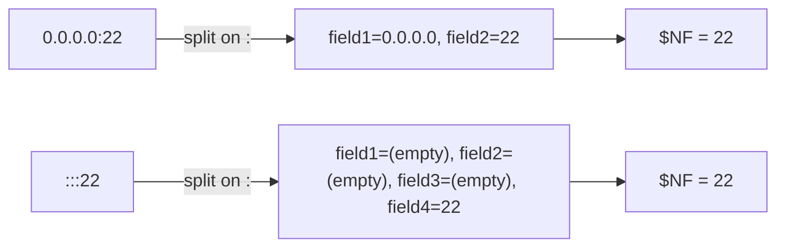

# Extracting Open Ports With `netstat`, `grep`, `cut`, and `awk`

## Goal of This Lesson

In this lesson, we'll solve a real, practical problem: getting a **clean list of open port numbers** on a system — just the numbers, with no extra clutter. Along the way, we'll combine `netstat`, `grep`, `cut`, and `awk`, and finally wrap the solution into a reusable script.

---

## 1. Viewing Open Ports With `netstat`

### Syntax and Options Used

```bash
netstat [OPTIONS]
```

| Option | Meaning |
|---|---|
| `-n` | Show numbers instead of resolved names (e.g., `22` instead of `ssh`) |
| `-u` | Show UDP connections |
| `-t` | Show TCP connections |
| `-l` | Show only listening ports |
| `-4` | Show only IPv4 connections |
| `-p` | Show the PID and program name using each port (requires root) |

### Example

```bash
netstat -ntul
```

This shows all listening TCP and UDP ports, using numbers instead of names.

### Sample Output Structure

```
Active Internet connections (only servers)
Proto Recv-Q Send-Q Local Address           Foreign Address         State
tcp        0      0 0.0.0.0:22              0.0.0.0:*               LISTEN
tcp        0      0 0.0.0.0:25              0.0.0.0:*               LISTEN
tcp6       0      0 :::22                   :::*                    LISTEN
udp        0      0 0.0.0.0:68              0.0.0.0:*
```

Notice there are **two header lines** ("Active Internet connections..." and "Proto Recv-Q Send-Q..."), followed by the actual data.

---

## 2. Removing the Header Lines With `grep`

### Method 1: Two `grep -v` Calls

```bash
netstat -ntul | grep -v '^Active' | grep -v '^Proto'
```

Each `grep -v` removes one header line, leaving just the data.

### Method 2: One `grep -Ev` Call Using Extended Regular Expressions

```bash
netstat -ntul | grep -Ev 'Active|Proto'
```

| Option | Meaning |
|---|---|
| `-E` | Enable **extended regular expressions** |
| `\|` (inside pattern) | Acts as **"or"** in extended regex — matches either side |

`'Active|Proto'` matches any line containing **either** "Active" **or** "Proto" — removing both header lines in a single command. This is a shorter way to achieve the same result as the two separate `grep -v` calls above.

### Method 3: Filtering By What the Data Has in Common

Instead of removing headers, you can also **keep only the lines that look like data**. Looking at the raw output, every data line contains a **colon** (`:`), while the header lines do not.

```bash
netstat -ntul | grep ':'
```

This keeps only lines containing a colon — effectively excluding the headers, since they have no colon in them.

> All three methods achieve the same goal: **strip out the headers, keep only the actual port data.** Which one you choose is mostly a matter of preference.

---

## 3. Why `cut` Doesn't Work Well Here (First Attempt)

Let's say we want to pull out just the port number — for example, `22` from `0.0.0.0:22`.

### First Instinct: Split on the Colon With `cut`

```bash
netstat -ntul | grep ':' | cut -d ':' -f 2
```

**Problem:** Some lines have **more than one colon** (for example, IPv6 addresses look like `:::22`, which contains three colons). When a line has extra colons, `cut -f 2` grabs the wrong segment — sometimes producing **blank output** instead of the port number, because field 2 in that line doesn't contain what we expect.

> **Lesson:** `cut`'s fixed field-position approach breaks down when the number of delimiter occurrences varies from line to line.

---

## 4. Narrowing Down With `awk`: Extracting the Right Column

Looking at the original `netstat` output again, the **port information lives in the 4th column** (the "Local Address" column, e.g., `0.0.0.0:22`).

However, the columns in `netstat` output are **not separated by a consistent number of spaces** — which rules out `cut` for column extraction too. This is exactly the kind of situation `awk` handles well, since its default field separator is **any amount of whitespace**.

```bash
netstat -ntul | grep ':' | awk '{ print $4 }'
```

This narrows the output down to just the "Local Address" column, e.g.:

```
0.0.0.0:22
0.0.0.0:25
:::22
0.0.0.0:68
```

We're closer, but we still have the IP address portion mixed in with the port number, and the extra colons in IPv6 addresses (`:::22`) still complicate a simple field split.

---

## 5. Solving the Colon Problem With `$NF`

Since **every line ends with a colon immediately before the port number** — no matter how many colons appear earlier in the line — we can use `awk`'s `$NF` (last field) after splitting on the colon.

```bash
netstat -ntul | grep ':' | awk '{ print $4 }' | awk -F ':' '{ print $NF }'
```

### Why This Works

- If a line is `0.0.0.0:22`, splitting on `:` gives 2 fields: `0.0.0.0` and `22`. `$NF` (the **last** field) is `22`.
- If a line is `:::22` (IPv6), splitting on `:` gives more fields (some empty), but the **last field** is still `22`.

Since `$NF` always refers to whatever the **last** field turns out to be — regardless of how many fields came before it — this approach works correctly, no matter how many colons appear in a given line.



---

## 6. Filtering Out IPv6 With `-4`

Looking at the full `netstat` output, we're seeing both **TCP (IPv4)** and **TCP6 (IPv6)** entries, as well as UDP and UDP6.

If you only care about IPv4:

```bash
netstat -ntul -4
```

The `-4` option limits results to IPv4 only, removing the `tcp6` / `udp6` lines from the output entirely.

### With `-4`, the Data Becomes Simpler

Once IPv6 is excluded, each remaining line typically has only **one colon** — meaning column 4 now looks like a clean `IP:PORT` pair, such as `0.0.0.0:22`. At this point, several tools become viable again:

```bash
netstat -ntul -4 | grep ':' | awk '{ print $4 }' | cut -d ':' -f 2
```

Since there's now reliably just one colon per line, `cut -d ':' -f 2` correctly grabs the port every time.

**Equivalent using `awk` instead of `cut`:**

```bash
netstat -ntul -4 | grep ':' | awk '{ print $4 }' | awk -F ':' '{ print $2 }'
```

**Or, still using `$NF` (works whether or not you use `-4`):**

```bash
netstat -ntul -4 | grep ':' | awk '{ print $4 }' | awk -F ':' '{ print $NF }'
```

> **Key insight:** The `$NF` version is the most **robust** solution — it works correctly whether you're looking at IPv4-only data (one colon) or mixed IPv4/IPv6 data (multiple colons), since it always grabs the last field regardless of how many fields exist.

---

## 7. Turning This Into a Reusable Script

Since we've solved this problem once, it makes sense to save the solution as a script for future use, instead of re-deriving the command each time.

```bash
#!/bin/bash
# This script displays the port numbers currently open (listening) on this system.
# Pass -4 to show only IPv4 ports.

netstat -ntul "${1}" | grep ':' | awk '{ print $4 }' | awk -F ':' '{ print $NF }'
```

### Explaining the Design Choice

The simplest possible way to support the `-4` option is to just **pass along whatever was given as the script's first argument** directly to `netstat`, without validating it first.

```bash
netstat -ntul "${1}"
```

- If `${1}` is `-4`, it becomes `netstat -ntul -4`.
- If `${1}` is empty (no argument given), it becomes `netstat -ntul` (since an empty variable contributes nothing).

> **Trade-off:** This approach is quick and convenient for a **personal script** you're not sharing with others. However, it has a downside: whatever the user types as the first argument gets passed **directly** to `netstat`, without any checking.

### Testing

```bash
chmod 755 open-ports.sh
./open-ports.sh
```

Shows all open ports (TCP and UDP, IPv4 and IPv6).

```bash
./open-ports.sh -4
```

Shows only IPv4 ports.

### What Happens With an Invalid Argument

```bash
./open-ports.sh -blah
```

Output:

```
netstat: invalid option -- 'blah'
```

Since we pass `${1}` straight through without checking it, **any** value the user supplies goes directly to `netstat` — including invalid or unintended options.

### Adding a Safeguard (Optional)

If you want to be stricter and only allow `-4` (or nothing) as valid input, you could add a check like:

```bash
if [[ "${1}" == "-4" ]]; then
  netstat -ntul "${1}" | grep ':' | awk '{ print $4 }' | awk -F ':' '{ print $NF }'
else
  netstat -ntul | grep ':' | awk '{ print $4 }' | awk -F ':' '{ print $NF }'
fi
```

> **Design decision:** For a quick personal utility script, skipping this extra validation is often perfectly reasonable. For a script you plan to share with others or use in a more sensitive environment, adding input validation like this is safer.

---

## 8. Bonus Tip: Finding Which Program Owns a Port

The `-p` option to `netstat` shows the **PID and program name** currently using each port. This requires **root privileges** to see full details.

```bash
sudo netstat -ntulp
```

Narrowing this down to just SSH-related entries, for example:

```bash
sudo netstat -ntulp | grep ssh
```

Example output:

```
tcp    0   0 0.0.0.0:22   0.0.0.0:*   LISTEN   909/sshd
```

This tells us that `sshd`, with **PID 909**, is the process listening on port `22`.

> **Practical use:** This is a handy diagnostic command whenever you need to identify exactly which running program is using a particular network port.

---

## Anti-Patterns to Avoid

- **Don't** assume `cut -d ':' -f 2` will work reliably on data where the number of delimiter occurrences (like colons) varies from line to line — it can silently return blank or wrong results.
- **Don't** rely on `cut` to extract columns separated by an inconsistent number of spaces — use `awk` instead, since its default field separator handles variable whitespace automatically.
- **Don't** forget that `$NF` in `awk` always refers to the **last** field, making it a robust choice when the exact number of fields varies between lines (e.g., due to varying numbers of colons).
- **Don't** pass unchecked user input directly into a system command like `netstat` in a script meant to be shared or used in sensitive environments — add basic validation for anything beyond quick personal scripts.
- **Don't** forget that `-p` (showing PID and program name) with `netstat` typically requires root privileges to show complete information.

---

## Quick Reference Table

| Command / Option | Purpose |
|---|---|
| `netstat -ntul` | Show listening TCP/UDP ports with numeric addresses |
| `netstat -4` | Limit results to IPv4 only |
| `netstat -p` | Show PID and program name for each connection (needs root) |
| `grep -v 'PATTERN'` | Remove lines matching a pattern (e.g., remove a header line) |
| `grep -E 'A\|B'` | Extended regex — match lines containing A **or** B |
| `grep -Ev 'A\|B'` | Remove lines matching A **or** B |
| `awk '{ print $4 }'` | Print the 4th whitespace-separated column |
| `awk -F ':' '{ print $NF }'` | Split on `:` and print the **last** field, regardless of how many colons exist |
| `cut -d ':' -f 2` | Reliable only when every line has exactly the same number of delimiter occurrences |

---

## Practice Questions

**Q1: Why did splitting `netstat` output on a colon and taking field 2 with `cut` fail for some lines?**
A: Because some lines (like IPv6 addresses) contain more than one colon, so field 2 doesn't consistently correspond to the port number — sometimes resulting in blank output.

**Q2: Why is `awk` used instead of `cut` to extract the 4th column of `netstat` output?**
A: Because the columns are separated by an inconsistent number of spaces, which `cut` cannot handle reliably, while `awk`'s default field separator (any amount of whitespace) handles this correctly.

**Q3: What does `$NF` represent in `awk`, and why is it useful in this lesson's problem?**
A: `$NF` represents the value of the **last** field on a line. It's useful here because it reliably extracts the port number regardless of how many colons appear earlier in the line.

**Q4: What is the difference between `grep -v 'A'` run twice versus `grep -Ev 'A|B'` run once?**
A: Both approaches remove lines matching pattern A and pattern B, but `grep -Ev 'A|B'` does it in a single command using extended regular expressions and the "or" operator (`|`), instead of chaining two separate `grep -v` calls.

**Q5: What does the `-4` option to `netstat` do?**
A: It limits the output to IPv4 connections only, excluding IPv6 (`tcp6`/`udp6`) entries.

**Q6: Once IPv6 entries are excluded with `-4`, why does `cut -d ':' -f 2` start working correctly?**
A: Because without IPv6 entries, each remaining line typically has only one colon, making field 2 consistently correspond to the port number.

**Q7: In the final script, how is the `-4` option passed through to `netstat`?**
A: The script's first argument (`${1}`) is passed directly to `netstat` (e.g., `netstat -ntul "${1}"`), without validating its content first.

**Q8: What is a downside of passing `${1}` directly to `netstat` without validation?**
A: Any value the user supplies — including invalid or unintended options — gets passed straight through to `netstat`, which could result in confusing errors or unintended behavior.

**Q9: What does the `-p` option to `netstat` show, and what privilege does it typically require?**
A: It shows the PID and program name associated with each network connection or listening port; it typically requires root privileges to display complete information.

**Q10: Why is the `$NF`-based solution considered more robust than a fixed `cut -f 2` or `awk '{ print $2 }'` approach for this particular problem?**
A: Because `$NF` always refers to whatever the last field turns out to be, so it works correctly whether a line has one colon (IPv4) or multiple colons (IPv6), without needing to know the exact field count in advance.