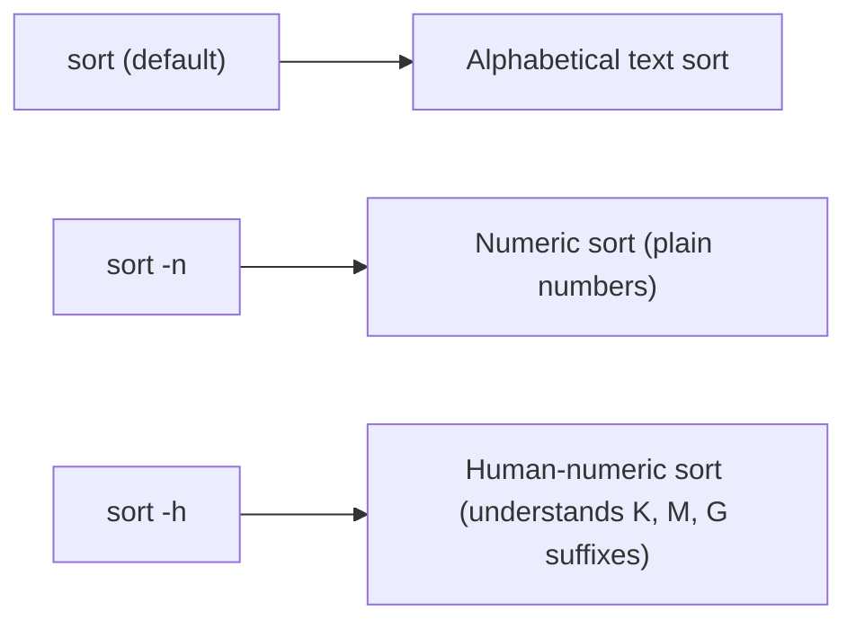

# Sorting and Counting Data With `sort`, `uniq`, `wc`, and `du`

## Goal of This Lesson

In this lesson, we will learn how to sort data using `sort`, remove or count duplicate lines using `uniq`, count lines/words/characters with `wc`, and check disk usage with `du`. We'll finish by applying all of these together to analyze a web server log file.

---

## 1. Basic Sorting: `sort`

### Syntax

```bash
sort [OPTION]... [FILE]
```

### Alphabetical Sort (Default)

```bash
sort /etc/passwd
```

This sorts lines **alphabetically**. Lines starting with letters near the beginning of the alphabet (like `adm`) appear first; lines starting with letters near the end (like `vboxadd`) appear last.

### Reversing the Order: `-r`

```bash
sort -r /etc/passwd
```

| Option | Meaning |
|---|---|
| `-r` | Reverse the sort order |

Now the same data is sorted in reverse — `adm` moves to the bottom instead of the top.

---

## 2. Numeric Sorting: `-n`

### The Problem With Sorting Numbers Alphabetically

Let's extract just the UID column (field 3) from `/etc/passwd`:

```bash
cut -d ':' -f 3 /etc/passwd
```

Now pipe that into `sort`:

```bash
cut -d ':' -f 3 /etc/passwd | sort
```

> **Note:** `sort` doesn't need a file — it accepts standard input just as easily, via a pipe.

**Problem:** The result is sorted **alphabetically**, not numerically. So you might see an order like `7, 74, 8, 81, ...` instead of `7, 8, 74, 81, ...` — because alphabetical sorting compares digit-by-digit as if they were text, not as whole numeric values.

### Fixing It With `-n`

```bash
cut -d ':' -f 3 /etc/passwd | sort -n
```

| Option | Meaning |
|---|---|
| `-n` | Sort numerically |

Now the smallest numbers come first, and the largest come last — the order most people expect when sorting numbers.

You can still combine this with `-r` for a numeric reverse sort:

```bash
cut -d ':' -f 3 /etc/passwd | sort -nr
```

---

## 3. Checking Disk Usage: `du`

### Syntax

```bash
du [OPTION]... [PATH]
```

`du` shows disk usage. By default, it prints two columns:

1. **Size** (in kilobytes by default)
2. **Directory** using that space

### Example

```bash
sudo du /var
```

> `sudo` is used here because some files under `/var` may not be readable by a regular user.

### Sorting by Size to Find the Biggest Directories

```bash
sudo du /var | sort -n
```

This shows the smallest directories first and the largest last. Naturally, `/var` itself appears at the very bottom, since it contains everything else within it. The directory listed just **above** it (e.g., `/var/lib`) is the single largest subdirectory, and so on.

```bash
sudo du /var | sort -n | tail
```

(A quick trick: piping to `tail` shows just the last few — i.e., the largest — entries.)

### Human-Readable Sizes: `-h`

```bash
sudo du -h /var
```

| Option | Meaning |
|---|---|
| `-h` | Human-readable sizes (e.g., `93M`, `4K`, `1.2G`) |

This is easier to read, but creates a **new problem** when sorting.

### The Problem With Sorting Human-Readable Sizes

```bash
sudo du -h /var | sort
```

or even:

```bash
sudo du -h /var | sort -n
```

The results come out **wrong** — for example, you might see `700K`, `800K`, `972K` sorted as if they're bigger than `93M`, simply because plain text or numeric sorting doesn't understand that "M" (megabytes) represents a larger unit than "K" (kilobytes).

### The Fix: `sort -h`

```bash
sudo du -h /var | sort -h
```

| Option | Meaning |
|---|---|
| `-h` (for `sort`) | **Human-numeric sort** — understands that values ending in `K`, `M`, `G`, etc. represent increasing units of size |

Now the sizes are sorted correctly, taking their units into account — smaller sizes at the top, larger sizes (like `93M`) properly appearing at the bottom.



---

## 4. Recap: Extracting Open Ports (From an Earlier Lesson)

To set up our next examples, let's revisit extracting port numbers from `netstat`:

```bash
netstat -ntul
```

| Option | Meaning |
|---|---|
| `-n` | Show numbers, not names |
| `-t` | TCP |
| `-u` | UDP |
| `-l` | Listening ports only |

```bash
netstat -ntul | grep ':'
```

Filters out header lines by keeping only lines that contain a colon.

```bash
netstat -ntul | grep ':' | awk '{ print $4 }'
```

Extracts the 4th column ("Local Address," which contains the IP and port, like `0.0.0.0:22`).

```bash
netstat -ntul | grep ':' | awk '{ print $4 }' | awk -F ':' '{ print $NF }'
```

Splits on the colon and prints the **last field** (`$NF`), giving us just the port numbers.

---

## 5. Sorting and Removing Duplicates

At this point, we have a list of ports, but it's **not sorted**, and it likely has **duplicates**.

### Sorting the Port List Numerically

```bash
netstat -ntul | grep ':' | awk '{ print $4 }' | awk -F ':' '{ print $NF }' | sort -n
```

Now the list is sorted, but duplicate values (like `22` appearing twice) are still present.

### Removing Duplicates With `sort -u`

```bash
... | sort -nu
```

| Option | Meaning |
|---|---|
| `-u` (for `sort`) | Only display **unique** lines — a line is skipped if it was already shown |

Now duplicate entries are removed, and the list is both sorted and unique. You don't have to combine `-u` with `-n` — `sort -u` works on its own too, producing a unique (but not necessarily numerically sorted) list.

---

## 6. The `uniq` Command

There's also a dedicated `uniq` command, which does something similar to `sort -u`, but with an important requirement:

### Syntax

```bash
uniq [OPTION]... [FILE]
```

> **Critical requirement:** `uniq` only removes duplicates that are **adjacent** to each other. It compares each line only to the line **immediately before it** — so the input must already be **sorted** for `uniq` to correctly remove all duplicates.

### Correct Usage: Sort First, Then `uniq`

```bash
netstat -ntul | grep ':' | awk '{ print $4 }' | awk -F ':' '{ print $NF }' | sort -n | uniq
```

This correctly produces a sorted, duplicate-free list of ports.

### What Happens Without Sorting First

```bash
netstat -ntul | grep ':' | awk '{ print $4 }' | awk -F ':' '{ print $NF }' | uniq
```

If the unsorted data looks like `22, 25, 22`, `uniq` will **not** catch the repeated `22`, because the two `22` entries aren't next to each other — `uniq` only compares neighboring lines. Since `25` sits between them, `uniq` sees `22 → 25` (different) and `25 → 22` (different), and no duplicates are removed.

> **Rule of thumb:** Always sort your data before piping it into `uniq`.

---

## 7. Why Use `uniq` If `sort -u` Already Exists?

At first glance, `uniq` might seem redundant, since `sort -u` can already remove duplicates on its own. The key reason to use `uniq` is its **counting** ability.

### Counting Occurrences: `uniq -c`

```bash
... | sort -n | uniq -c
```

| Option | Meaning |
|---|---|
| `-c` (for `uniq`) | Prefix each line with a **count** of how many times it occurred |

Output example:

```
   2 22
   2 25
   1 68
```

This tells us `22` appeared twice, `25` appeared twice, and `68` appeared once — information `sort -u` alone cannot provide.

---

## 8. Practical Example: Counting Syslog Messages by Program

Let's say you want to know how many syslog messages each program has generated.

```bash
cat /var/log/messages
```

Counting the columns, the **5th field** typically contains the program/application name writing to syslog.

```bash
awk '{ print $5 }' /var/log/messages
```

This gives a list like `systemd`, `su`, `systemd`, `systemd-logind`, and so on — one entry per log line.

### Sorting and Counting

```bash
awk '{ print $5 }' /var/log/messages | sort | uniq -c
```

This gives counts like:

```
   1 lvm
   8 network
  86 NetworkManager
```

### Sorting the Counts Themselves

To find out which program generated the **most** messages, sort the counted output again:

```bash
awk '{ print $5 }' /var/log/messages | sort | uniq -c | sort -n
```

This shows results like:

```
 310 systemd
 342 kernel
```

...with the highest counts appearing at the bottom (or top, if you use `-r` too).

> **General pattern:** `extract → sort → uniq -c → sort -n` is a powerful, reusable combination for answering "how many times did X occur?" questions — for example, finding which IP addresses hit your web server the most.

---

## 9. Counting With `wc` (Word Count)

### Syntax

```bash
wc [OPTION]... [FILE]
```

`wc` counts **lines**, **words**, and **bytes/characters** — despite its name suggesting only "word count."

### Default Output (No Options)

```bash
wc /etc/passwd
```

Output has three columns, in this order:

1. Number of **lines**
2. Number of **words**
3. Number of **characters**

> **Important:** `wc` doesn't understand language — it defines a "word" simply as any non-empty sequence of characters separated by whitespace.

### Specific Counts

| Option | Meaning |
|---|---|
| `-l` | Line count only |
| `-w` | Word count only |
| `-c` | Byte count only |

```bash
wc -l /etc/passwd
```

If this returns `25`, that means there are 25 accounts on the system, since each account occupies one line in `/etc/passwd`.

### Combining `wc` With `grep`

Suppose you want to know how many accounts use the Bash shell.

```bash
grep bash /etc/passwd
```

For a small file, you could just count the matching lines visually. But with hundreds or thousands of lines, that's impractical — so let `wc -l` count them for you:

```bash
grep bash /etc/passwd | wc -l
```

> **Shortcut:** Some commands, like `grep`, have their own **built-in counting option**. For `grep`, that's `-c`:
> ```bash
> grep -c bash /etc/passwd
> ```
> This achieves the same result directly, without needing to pipe to `wc`. However, not every command has a built-in count option — for those, piping to `wc -l` is the general-purpose solution.

---

## 10. Sorting by a Specific Field: `-t` and `-k`

By default, `sort` looks at the **entire line**, starting from the very beginning, to determine order. But often you want to sort based on a **specific column**, not the first character of the line.

### Syntax

```bash
sort -t DELIMITER -k FIELD_NUMBER [OPTIONS] [FILE]
```

| Option | Meaning |
|---|---|
| `-t DELIMITER` | Set the field separator (`sort`'s default separator is whitespace) |
| `-k N` | Sort based on field number `N` |

### Example: Sorting `/etc/passwd` by UID (3rd Field)

```bash
sort -t ':' -k 3 -n /etc/passwd
```

- `-t ':'` — tells `sort` that fields are separated by a colon.
- `-k 3` — sort using the 3rd field (the UID).
- `-n` — since UIDs are numbers, sort numerically.

Now the output correctly starts with `root` (UID `0`), followed by whichever account has UID `1` (e.g., `bin`), UID `2` (e.g., `daemon`), and so on — sorted purely by UID, not by the account name or any other part of the line.

You can combine this with `-r` for a reverse sort by UID, just like any other sort operation.

---

## 11. Full Walkthrough: Analyzing a Web Server Log File

**Goal:** Find the top 3 most-visited URLs in an access log file.

### Step 1: Look at the Raw Data

```bash
cat access_log
```

A typical Apache/Nginx-style log line looks something like:

```
192.168.1.5 - - [05/Sep/2026:10:15:32] "GET /wp-admin HTTP/1.1" 200 512 "-" "Mozilla/5.0"
```

### Step 2: Extract the URL

There are multiple valid ways to reach the same result — this is a good reminder that text processing often has more than one correct path.

**Approach A: Split by Quotation Marks**

The request (including the URL) is wrapped in a pair of double quotes.

```bash
cut -d '"' -f 2 access_log
```

This isolates the entire request line, e.g.:

```
GET /wp-admin HTTP/1.1
```

Note that `cut` can take a **file directly** as an argument — you don't have to `cat` the file into it via a pipe first, though both approaches work.

Since this leaves three space-separated columns (`GET`, `/wp-admin`, `HTTP/1.1`), extract just the URL portion (the 2nd word) using another `cut`:

```bash
cut -d '"' -f 2 access_log | cut -d ' ' -f 2
```

**Approach B: Count Columns From the Start of the Line**

Alternatively, you could count all the space-separated fields in the raw log line directly and discover the URL happens to be in, say, the 7th field:

```bash
awk '{ print $7 }' access_log
```

Both approaches produce the same result — the exact method you use is a matter of preference and how you visualize the data. The general strategy is: **keep extracting and transforming the data, step by step, until it looks like what you need.**

### Step 3: Count How Many Times Each URL Appears

```bash
cut -d '"' -f 2 access_log | cut -d ' ' -f 2 | sort | uniq -c
```

This produces a count next to each unique URL, e.g.:

```
1271 /wp-admin
1265 /explore
 842 /login
```

### Step 4: Sort the Counts Numerically

```bash
cut -d '"' -f 2 access_log | cut -d ' ' -f 2 | sort | uniq -c | sort -n
```

Now the counts themselves are sorted, with the highest visit counts appearing at the **bottom** of the list.

### Step 5: Show Only the Top 3

```bash
cut -d '"' -f 2 access_log | cut -d ' ' -f 2 | sort | uniq -c | sort -n | tail -3
```

`tail -3` shows just the last 3 lines — which, since the list is sorted from lowest to highest, are the **3 most-visited URLs**.

---

## 12. Turning This Into a Reusable Script

```bash
#!/bin/bash
# This script displays the top 3 most-visited URLs from an access log file.

LOG_FILE="${1}"

if [[ ! -e "${LOG_FILE}" ]]; then
  echo "The file ${LOG_FILE} does not exist" >&2
  exit 1
fi

cut -d '"' -f 2 "${LOG_FILE}" | cut -d ' ' -f 2 | sort | uniq -c | sort -n | tail -3
```

### Explaining the Script

- **`LOG_FILE="${1}"`** — captures the file path from the script's first argument.
- **`[[ ! -e "${LOG_FILE}" ]]`** — checks that the file **does not exist**, and reports an error if so, exiting before running the main command.
- The core logic is the exact same pipeline built up step by step earlier — just reused with `"${LOG_FILE}"` in place of the hardcoded filename.

### Testing

```bash
chmod 755 top-urls.sh
```

**Test 1: No file supplied / invalid path**

```bash
./top-urls.sh asdf
```

```
The file asdf does not exist
```

**Test 2: A valid log file**

```bash
./top-urls.sh /vagrant/access_log
```

Output shows the top 3 most-visited URLs from that file, exactly as built and tested manually earlier.

---

## Anti-Patterns to Avoid

- **Don't** use the default `sort` (alphabetical) on numeric data — use `sort -n`, or `sort -h` for human-readable sizes (like `93M`, `4K`).
- **Don't** pipe unsorted data directly into `uniq` expecting it to remove all duplicates — `uniq` only compares **adjacent** lines, so the input must be sorted first.
- **Don't** forget that `uniq -c` provides counting ability that `sort -u` alone does not — use `uniq -c` when you need to know **how many times** something occurred, not just whether it's unique.
- **Don't** forget `wc` doesn't understand language — it only counts based on whitespace-separated sequences, byte counts, and line breaks.
- **Don't** assume there's only one "correct" way to extract a piece of data from text — multiple combinations of `cut`, `awk`, and `grep` can often reach the same result.

---

## Quick Reference Table

| Command | Purpose |
|---|---|
| `sort` | Alphabetical sort (default) |
| `sort -n` | Numeric sort |
| `sort -r` | Reverse the sort order (combinable with `-n`, `-h`, etc.) |
| `sort -h` | Human-numeric sort (understands `K`, `M`, `G` suffixes) |
| `sort -u` | Remove duplicate lines while sorting |
| `sort -t DELIM -k N` | Sort using field `N`, with `DELIM` as the field separator |
| `uniq` | Remove **adjacent** duplicate lines (requires pre-sorted input) |
| `uniq -c` | Count occurrences of each unique (adjacent) line |
| `du` | Show disk usage |
| `du -h` | Show disk usage in human-readable format |
| `wc` | Count lines, words, and characters (in that column order) |
| `wc -l` | Count lines only |
| `wc -w` | Count words only |
| `wc -c` | Count bytes only |
| `grep -c PATTERN` | Count matching lines directly (built into `grep`) |

---

## Practice Questions

**Q1: Why does sorting numeric data with the default `sort` sometimes give unexpected results (like `7, 74, 8, 81`)?**
A: Because the default sort is alphabetical (text-based), comparing digit-by-digit as characters rather than as whole numeric values.

**Q2: What option makes `sort` understand suffixes like `K`, `M`, and `G` when sorting sizes?**
A: `-h` (human-numeric sort).

**Q3: What is the key requirement for `uniq` to correctly remove all duplicate lines?**
A: The input must already be **sorted**, since `uniq` only compares each line to the one immediately before it.

**Q4: If `sort -u` can already remove duplicates, why would you use `uniq -c` instead?**
A: Because `uniq -c` also tells you **how many times** each unique line occurred — information `sort -u` alone does not provide.

**Q5: What three things does `wc` count by default, and in what column order?**
A: Lines, words, and characters — displayed in that order (lines first, then words, then characters).

**Q6: Does `wc` understand the concept of a "word" the way a human would?**
A: No — it simply defines a word as any non-empty sequence of characters separated by whitespace, with no understanding of actual language.

**Q7: What do the `-t` and `-k` options do when used together with `sort`?**
A: `-t` specifies the field delimiter, and `-k` specifies which field number to sort by — together allowing you to sort based on a specific column rather than the whole line.

**Q8: In the syslog analysis example, what general pipeline pattern was used to count occurrences of something and rank them?**
A: Extract the relevant field → `sort` → `uniq -c` → `sort -n` (optionally followed by `tail` or `head` to isolate the top or bottom results).

**Q9: Why might `grep -c` be preferred over `grep | wc -l` in some cases?**
A: Because `grep -c` counts matching lines directly, without needing an extra command in the pipeline — though `wc -l` remains necessary for commands that don't have their own built-in counting option.

**Q10: In the log file analysis script, why does the script check `[[ ! -e "${LOG_FILE}" ]]` before running the main command?**
A: To verify the specified log file actually exists first, so the script can report a clear error and exit early instead of running the main pipeline against a file that isn't there.