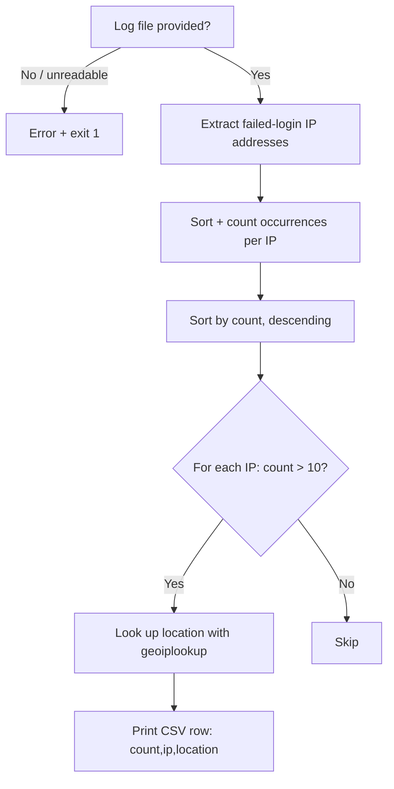

# Building `show-attackers.sh`: Analyzing Failed Login Attempts

## Goal of This Lesson

In this lesson, we build a complete, practical script called `show-attackers.sh` that analyzes a system log file, counts failed login attempts by IP address, and reports any IP address with a suspiciously high number of failures — along with its geographic location. This combines `grep`, `awk`, `cut`, `sort`, `uniq`, `while read`, and a new tool: `geoiplookup`.

---

## 1. Planning: The Requirements

- **Script name:** `show-attackers.sh`
- Requires a **log file** as an argument.
- If the file is missing, or can't be read, display an error and exit with status `1`.
- Count **failed login attempts by IP address**.
- For any IP address with **more than 10** failed attempts:
  - Display the number of attempts, the IP address, and its **geographic location** (using the `geoiplookup` command).
- Output should be in **CSV format**, with a header row: `count,ip,location`.



---

## 2. Step 1: Look at the Raw Data First

Before writing any code, always inspect the actual input.

```bash
cd /vagrant
cat syslog_sample
```

There's a lot of data here, but a recurring pattern jumps out: lines containing **"failed password for root"**.

```bash
grep Failed syslog_sample
```

This confirms many failed login attempts targeting the `root` account. Let's check if other usernames are being targeted too:

```bash
grep Failed syslog_sample | grep -v root
```

This reveals attempts against other accounts too, such as `ubuntu`, `admin`, `lp`, and even a user named `a`.

### An Inconsistency in the Data

Looking closely, the lines aren't all formatted the same way. Some contain the phrase **"invalid user"**, and some don't:

```
Failed password for invalid user admin from 182.100.67.59 port 12345 ssh2
Failed password for lp from 182.100.67.59 port 12346 ssh2
```

Because of this inconsistency, we can't rely on a fixed word count from the **start** of the line to always find the IP address — the IP's position shifts depending on whether "invalid user" appears.

---

## 3. Step 2: Extracting the IP Address

### Approach A: Split on the Word "from"

Every line — valid or invalid user — contains the word **"from "** immediately before the IP address. We can use that as an `awk` field separator.

```bash
grep Failed syslog_sample | awk -F 'from ' '{ print $2 }'
```

- `-F 'from '` — uses the literal string `"from "` (including the trailing space, to avoid an extra leading space in the result) as the field separator.
- `$2` — everything **after** "from " on the line.

This leaves output like:

```
182.100.67.59 port 12345 ssh2
```

Four space-separated columns remain: the **IP address**, the word `port`, the **port number**, and the **protocol** (`ssh2`).

### Extracting Just the IP Address

You can pull out the first column using either `awk` or `cut`:

**With `awk`:**

```bash
grep Failed syslog_sample | awk -F 'from ' '{ print $2 }' | awk '{ print $1 }'
```

**With `cut`:**

```bash
grep Failed syslog_sample | awk -F 'from ' '{ print $2 }' | cut -d ' ' -f 1
```

Both produce the same result — a clean list of IP addresses.

### Approach B: Counting Fields From the End of the Line

Here's an alternative approach that avoids the "invalid user" inconsistency entirely. While the IP address's position **from the start** of the line varies, its position **from the end** of the line is always the same — it's always the **4th field counting backward**.

We can use `awk`'s special variable `NF` (number of fields) combined with subtraction to reach it:

```bash
grep Failed syslog_sample | awk '{ print $(NF - 3) }'
```

- `NF` — the total number of fields on the line.
- `NF - 3` — counting backward, this lands exactly on the IP address column, regardless of whether "invalid user" appears earlier in the line.

> **Takeaway:** There is often more than one valid way to extract the same data. Both approaches shown here correctly extract the IP address — use whichever one makes the most sense to you. The `NF`-based approach is arguably simpler here since it sidesteps the inconsistent line format entirely.

---

## 4. Step 3: Counting Occurrences Per IP Address

We know `uniq` can count occurrences, but it **requires sorted input** first (since it only compares adjacent lines).

```bash
grep Failed syslog_sample | awk '{ print $(NF - 3) }' | sort | uniq -c
```

- `sort` — puts identical IP addresses next to each other (any sort order works here — `uniq` doesn't care whether it's alphabetical or numeric, only that duplicates are adjacent).
- `uniq -c` — counts each IP address's occurrences, producing output like:

```
   1 45.33.10.2
6749 182.100.67.59
   3 91.200.12.9
```

### Sorting the Results by Count (Highest First)

```bash
grep Failed syslog_sample | awk '{ print $(NF - 3) }' | sort | uniq -c | sort -nr
```

| Option | Meaning |
|---|---|
| `-n` (for `sort`) | Sort numerically |
| `-r` (for `sort`) | Reverse the order (highest values first) |

Now the IP address with the **most failed attempts** appears at the top.

---

## 5. Step 4: Investigating a Suspicious IP With `geoiplookup`

Looking at the sorted results (from a log covering just **one day**), one IP address stands out sharply:

```
6749 182.100.67.59
```

**6,749 failed login attempts in a single day** from one IP address is highly unusual. There are two likely explanations:

1. Someone is performing a **brute-force attack**.
2. A **misconfigured automated process** — for example, a server in another data center trying to SSH in with an outdated key or password.

### Checking the IP's Location

```bash
geoiplookup 182.100.67.59
```

Example output:

```
GeoIP Country Edition: CN, China
```

### Interpreting the Result

Suppose your organization only has employees in the United States, Canada, and Europe, with data centers in New York, London, and Amsterdam. Given that context, a huge volume of failed logins from **China** strongly suggests a **brute-force attack**, rather than an internal misconfiguration.

> **Key insight:** Knowing the geographic origin of suspicious traffic — combined with knowledge of where your legitimate users and systems are actually located — helps you judge whether unusual activity is likely malicious or just an internal mistake.

---

## 6. Step 5: Automating the Logic

The plan: loop through each counted IP address, and for any with **more than 10** failed attempts, look up its location and report it.

### Setting Up the Script

```bash
#!/bin/bash
# This script counts failed login attempts by IP address, from a given log file.
# Any IP address with more than the configured LIMIT of failed attempts is
# reported, along with its geographic location, in CSV format.

LIMIT=10

LOG_FILE="${1}"

if [[ ! -r "${LOG_FILE}" ]]; then
  echo "Cannot open ${LOG_FILE}" >&2
  exit 1
fi
```

### Explaining the Setup

- **`LIMIT=10`** — a variable defines the failure threshold at the top of the script. If this needs to change later, only one line needs editing.
  > You could instead make this a command-line **option** (using `getopts`) that the user can adjust each time they run the script — but for simplicity, this version keeps it as a fixed variable.
- **`LOG_FILE="${1}"`** — captures the log file path from the first argument.
- **`[[ ! -r "${LOG_FILE}" ]]`** — checks whether the file is **NOT readable**. This single test covers both cases: the file doesn't exist at all, **or** it exists but the current user lacks permission to read it. If either is true, the script reports the problem and exits with status `1`.

---

## 7. Looping Through the Counted Data With `while read`

```bash
grep Failed "${LOG_FILE}" | awk '{ print $(NF - 3) }' | sort | uniq -c | while read COUNT IP; do
  if [[ "${COUNT}" -gt "${LIMIT}" ]]; then
    LOCATION=$(geoiplookup "${IP}")
    echo "${COUNT},${IP},${LOCATION}"
  fi
done
```

### Explaining the Loop

- The full pipeline we built up earlier (`grep` → `awk` → `sort` → `uniq -c`) feeds its output into a `while read` loop.
- **`while read COUNT IP`** — reads each line of input, splitting it into two variables: `COUNT` (the number from `uniq -c`) and `IP` (the IP address).
- **`if [[ "${COUNT}" -gt "${LIMIT}" ]]`** — only proceeds if the count exceeds our configured threshold (`10`).
- **`geoiplookup "${IP}"`** — looks up the IP's location and stores it in `LOCATION`.
- **`echo "${COUNT},${IP},${LOCATION}"`** — prints the result.

### Testing the First Draft

```bash
chmod 755 show-attackers.sh
./show-attackers.sh syslog_sample
```

This is a good start, but the raw `geoiplookup` output includes some unwanted extra text, like:

```
6749,182.100.67.59,GeoIP Country Edition: CN, China
```

We only want the location itself (`China`), not the `"GeoIP Country Edition: CN, "` prefix.

---

## 8. Cleaning Up the Location Output

### The Problem With Using `cut`

You might think to use `cut` with a comma as the delimiter:

```bash
cut -d ',' -f 2
```

But this leaves an unwanted **leading space** before the country name (since there's a space after the comma in the original output, e.g., `..., China`).

### The Fix: `awk` With a Two-Character Field Separator

Since `awk` supports **multi-character** field separators (unlike `cut`), we can split on the comma **and** the space that follows it, in one step:

```bash
LOCATION=$(geoiplookup "${IP}" | awk -F ', ' '{ print $2 }')
```

- `-F ', '` — the field separator is the two characters `,` followed by a space.
- `$2` — everything after that separator, which is just the clean country name (e.g., `China`), with no leading space.

---

## 9. Adding CSV Formatting and a Header

### Final Script

```bash
#!/bin/bash
# This script counts failed login attempts by IP address, from a given log file.
# Any IP address with more than LIMIT failed attempts is reported, along with
# its geographic location, in CSV format.

LIMIT=10

LOG_FILE="${1}"

if [[ ! -r "${LOG_FILE}" ]]; then
  echo "Cannot open ${LOG_FILE}" >&2
  exit 1
fi

echo "count,ip,location"

grep Failed "${LOG_FILE}" | awk '{ print $(NF - 3) }' | sort | uniq -c | while read COUNT IP; do
  if [[ "${COUNT}" -gt "${LIMIT}" ]]; then
    LOCATION=$(geoiplookup "${IP}" | awk -F ', ' '{ print $2 }')
    echo "${COUNT},${IP},${LOCATION}"
  fi
done
```

### Explaining the Additions

- **`echo "count,ip,location"`** — prints the CSV header row before the loop begins.
- **`echo "${COUNT},${IP},${LOCATION}"`** — each data row is now separated by **commas**, matching proper CSV formatting.

> **A common typing mistake to watch for:** Placing a `$` **outside** quotation marks instead of inside (e.g., `$"{COUNT}"` instead of `"${COUNT}"`). A good code editor with syntax highlighting will usually make this kind of mistake visually obvious, since the highlighting will look different from the surrounding correct code.

---

## 10. Testing the Complete Script

```bash
chmod 755 show-attackers.sh
./show-attackers.sh syslog_sample
```

Output:

```
count,ip,location
6749,182.100.67.59,China
```

This is exactly the desired result: a clean CSV header, followed by any IP addresses exceeding the failure threshold, along with their location.

### Testing the Error Handling

**Test 1: A file that doesn't exist**

```bash
./show-attackers.sh does-not-exist.log
```

```
Cannot open does-not-exist.log
```

```bash
echo $?
```

```
1
```

**Test 2: No file supplied at all**

```bash
./show-attackers.sh
```

```
Cannot open
```

```bash
echo $?
```

```
1
```

Both error cases behave exactly as required — a clear message, and a non-zero exit status.

---

## Anti-Patterns to Avoid

- **Don't** assume a text field will always be in the same column position when the line format is inconsistent (e.g., "invalid user" appearing on some lines but not others) — consider counting fields from the **end** of the line (`NF`) instead, if that position is more consistent.
- **Don't** feed unsorted data into `uniq` expecting accurate counts — always `sort` first.
- **Don't** use `cut` when your delimiter is more than one character (like `", "`) — use `awk -F` instead, since it supports multi-character field separators.
- **Don't** skip checking whether a provided file is actually **readable** (`-r`), not just whether it exists (`-e`) — a file can exist but still be unreadable due to permissions.
- **Don't** jump to conclusions about suspicious activity without context — cross-reference an IP's geographic location against where your legitimate users and systems are actually located before deciding it's likely an attack.

---

## Quick Reference Table

| Command / Concept | Purpose |
|---|---|
| `grep Failed FILE` | Filter log lines related to failed logins |
| `awk -F 'from ' '{ print $2 }'` | Split on a literal string, extracting everything after it |
| `awk '{ print $(NF - 3) }'` | Extract a field counted from the **end** of the line |
| `sort \| uniq -c` | Count occurrences of each unique (sorted) line |
| `sort -nr` | Sort numerically, highest values first |
| `geoiplookup IP` | Look up the geographic location of an IP address |
| `awk -F ', ' '{ print $2 }'` | Split on a multi-character delimiter (comma + space) |
| `while read VAR1 VAR2; do ... done` | Read each line of piped input, splitting it into variables |
| `[[ ! -r FILE ]]` | Test whether a file is **not** readable (covers missing or permission-denied cases) |

---

## Practice Questions

**Q1: Why couldn't the IP address always be found at the same field position counting from the start of the line?**
A: Because some log lines included the phrase "invalid user" and others didn't, which shifted the position of the IP address relative to the beginning of the line.

**Q2: How did counting fields from the end of the line (`NF - 3`) solve this problem?**
A: Because regardless of whether "invalid user" appeared, the IP address was always located the same fixed number of fields from the **end** of the line.

**Q3: Why must data be sorted before being piped into `uniq -c`?**
A: Because `uniq` only compares each line to the one immediately before it, so duplicate values must be adjacent — which sorting guarantees.

**Q4: What does the `geoiplookup` command do?**
A: It returns the geographic location (such as country) associated with a given IP address.

**Q5: Why was `awk` used instead of `cut` to clean up the `geoiplookup` output?**
A: Because the desired delimiter was two characters (a comma followed by a space), and `cut` only supports single-character delimiters, while `awk`'s `-F` option supports multi-character delimiters.

**Q6: What does `[[ ! -r "${LOG_FILE}" ]]` check for, and why is it better than just checking `-e` (exists)?**
A: It checks whether the file is not readable, which covers both the case where the file doesn't exist and the case where it exists but the user lacks permission to read it — a broader and more useful check than existence alone.

**Q7: In the `while read COUNT IP` loop, where does the data being read come from?**
A: From the piped output of the `grep | awk | sort | uniq -c` pipeline that precedes the loop.

**Q8: Why is the failure threshold stored in a variable (`LIMIT=10`) instead of hardcoded directly in the `if` condition?**
A: So that the threshold can be easily changed later by editing a single line, rather than searching through the script for every place the number appears.

**Q9: Why might a very high number of failed login attempts from a single IP not automatically mean it's a malicious attack?**
A: It could also indicate a misconfigured automated process — for example, a legitimate server using an outdated SSH key or password to repeatedly (and unsuccessfully) attempt to connect.

**Q10: What does the script output when the file argument is missing entirely?**
A: It reports "Cannot open" (with an empty file name) and exits with a non-zero exit status, since `${1}` is empty and the readability check still fails.