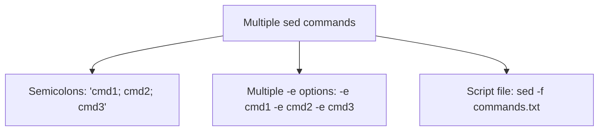
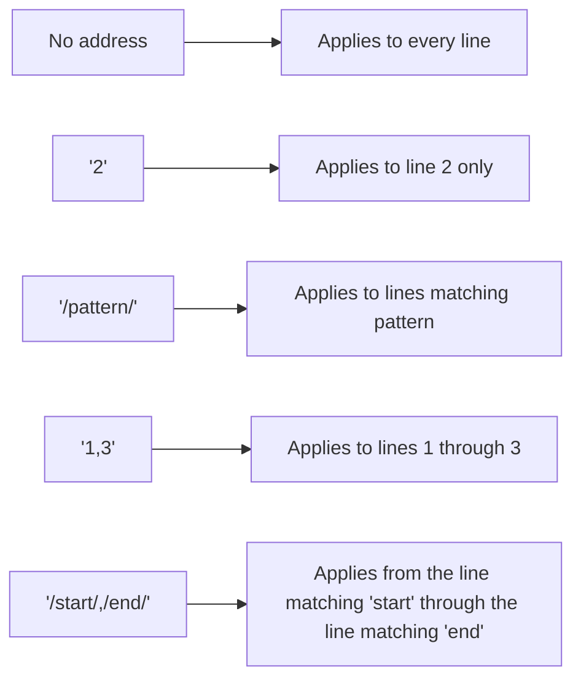

# Editing Text Streams With `sed`

## Goal of This Lesson

In this lesson, we will learn the most important features of `sed` — the **stream editor**. `sed` is used to perform text transformations like find-and-replace, deleting lines, and more, all **programmatically** (without human interaction), which makes it ideal for use in shell scripts.

---

## 1. What Is `sed`

`sed` stands for **stream editor**. A "stream" is data flowing from one place to another — through a pipe, a redirect, or between devices. Standard input, standard output, and standard error are all examples of data streams, and they're typically **textual** data.

### How `sed` Differs From Interactive Editors

Editors like Vim, Emacs, and nano require a **human** to interact with them — even macros need someone to launch the editor and trigger them. `sed`, on the other hand, performs edits **programmatically**, with no interaction needed. This makes it perfect for automation and shell scripts.

### Checking the Command Type

```bash
type -a sed
```

Output:

```
sed is /usr/bin/sed
```

`sed` is a **standalone program**, not a shell built-in — so use `man` for documentation:

```bash
man sed
```

The man page describes `sed` as a tool for **filtering and transforming text**.

### Syntax

```bash
sed [OPTION]... SCRIPT [INPUT-FILE]...
```

---

## 2. The Substitute Command: `s`

The most common use of `sed` is as a **command-line find-and-replace tool**, using the substitute command, represented by `s`.

### Setting Up Sample Data

```bash
echo "Dwight is the assistant regional manager." > manager.txt
cat manager.txt
```

### Syntax

```bash
sed 's/SEARCH-PATTERN/REPLACEMENT-STRING/[FLAGS]' [FILE]
```

- `s` — the substitute command.
- `/` — acts as a **delimiter** (you can change this character, covered later).
- `SEARCH-PATTERN` — the text to find. This is actually a **regular expression**, so advanced searches are possible.
- `REPLACEMENT-STRING` — the text to replace it with.

### Example

```bash
sed 's/assistant/assistant to the/' manager.txt
```

Output:

```
Dwight is the assistant to the regional manager.
```

> **Important:** This does **not** change the file itself — it only sends the transformed result to standard output (your terminal). The original file remains unchanged:
> ```bash
> cat manager.txt
> ```
> ```
> Dwight is the assistant regional manager.
> ```

### Another Example: Complete Replacement

```bash
echo "I love my wife." > love.txt
sed 's/my wife/sed/' love.txt
```

```
I love sed.
```

Here, the replacement text has nothing in common with the original search text — a full swap.

---

## 3. Case Sensitivity and Flags

By default, `sed` is **case-sensitive**.

```bash
echo "I love My Wife." > love.txt
sed 's/my wife/sed/' love.txt
```

Since `my wife` (lowercase) doesn't exactly match `My Wife` (mixed case) in the file, **nothing is changed** — `sed` returns the line unaltered when there's no match.

### Full Substitute Syntax With Flags

```bash
s/SEARCH-PATTERN/REPLACEMENT-STRING/FLAGS
```

### Case-Insensitive Matching: The `i` Flag

```bash
sed 's/my wife/sed/i' love.txt
```

Now the text is replaced, because the `i` flag tells `sed` to ignore case differences.

> A capital `I` also works the same way:
> ```bash
> sed 's/my wife/sed/I' love.txt
> ```

---

## 4. How `sed` Processes Multiple Lines

`sed` reads a file **one line at a time**, running the given command against each line in turn, until it reaches the end of the file.

### Building Up a Multi-Line File

```bash
echo "I love my wife." > love.txt
echo "This is line two." >> love.txt
echo "My wife loves me." >> love.txt
```

> Using **two** `>>` symbols **appends** to the file; a single `>` would overwrite it.

```bash
cat love.txt
```

```
I love my wife.
This is line two.
My wife loves me.
```

### Running the Substitution

```bash
sed 's/my wife/sed/i' love.txt
```

Output:

```
I love sed.
This is line two.
sed loves me.
```

- Lines 1 and 3 matched (case-insensitively) and were changed.
- Line 2 was left alone, since it didn't contain the search pattern at all.

---

## 5. Replacing Multiple Occurrences on a Single Line

### Adding a Line With Repeated Text

```bash
echo "I love my wife and my wife loves me. Also, my wife loves the cat." >> love.txt
```

### Default Behavior: Only the First Match Per Line

```bash
sed 's/my wife/sed/i' love.txt
```

On the new line, only the **first** occurrence of "my wife" gets replaced:

```
I love sed and my wife loves me. Also, my wife loves the cat.
```

### Replacing All Occurrences: The `g` Flag

```bash
sed 's/my wife/sed/gi' love.txt
```

| Flag | Meaning |
|---|---|
| `g` | Global — replace **every** occurrence on each line |
| `i` | Case-insensitive matching |

Now the line reads:

```
I love sed and sed loves me. Also, sed loves the cat.
```

### Replacing a Specific Occurrence: A Number Flag

```bash
sed 's/my wife/sed/2i' love.txt
```

| Flag | Meaning |
|---|---|
| `2` | Replace only the **2nd** occurrence on each line |
| `3`, `4`, ... | Replace only the 3rd, 4th, etc. occurrence |

With this flag, only the **second** occurrence of "my wife" on each line is replaced. A line with only one occurrence is left unchanged (since it has no second occurrence). On the line with three occurrences, only the middle one is changed.

> **Reminder:** None of these commands alter the actual file — they only change what's displayed to the screen, unless we explicitly tell `sed` to save the changes (covered next).

---

## 6. Saving `sed`'s Output

### Method 1: Redirecting Output to a New File

```bash
sed 's/my wife/sed/gi' love.txt > my-new-love.txt
```

The original `love.txt` remains untouched. The transformed text is saved into a **new** file, `my-new-love.txt`.

### Method 2: In-Place Editing With `-i`

```bash
sed -i 's/my wife/sed/gi' love.txt
```

| Option | Meaning |
|---|---|
| `-i` | Edit the file **in place** — the original file itself is modified |

### Making a Backup Before Editing In-Place

```bash
sed -i.bak 's/my wife/sed/gi' love.txt
```

This creates a backup file named `love.txt.bak` (containing the **original**, unmodified content) before applying the changes directly to `love.txt`.

> **Critical syntax rule:** Do **not** put a space between `-i` and the backup suffix.
> ```bash
> sed -i .bak 's/my wife/sed/gi' love.txt
> ```
> This produces an **error**, because the space causes `sed` to misinterpret `.bak` as something other than part of the `-i` option.

### Saving Only the Lines That Were Changed: The `w` Flag

```bash
sed 's/love/like/gw like.txt' love.txt
```

- The command still displays the **entire** file's contents (with substitutions applied) to the screen.
- But it **also** creates `like.txt`, containing **only the lines where a replacement was actually made**.

```bash
cat like.txt
```

Shows just those specific lines.

---

## 7. Using `sed` in a Pipeline

`sed` doesn't require a file — like many Linux commands, it can also read from **standard input**.

```bash
cat love.txt | sed 's/my wife/sed/gi'
```

This produces the exact same result as:

```bash
sed 's/my wife/sed/gi' love.txt
```

> This flexibility — accepting either a file argument or piped input — is a common pattern across many Linux commands, including `cat`, `awk`, `sort`, and `uniq`. It enables powerful command chains where data flows through several transformations in sequence.

---

## 8. Handling Forward Slashes in Your Data

### The Problem

Suppose you want to change `/home/jason` to `/export/users/jasonc`. Since `sed` normally uses `/` as the delimiter, having forward slashes **inside** your search pattern or replacement text creates a conflict.

### Solution 1: Escaping the Forward Slashes

```bash
echo "/home/jason" | sed 's/\/home\/jason/\/export\/users\/jasonc/'
```

Each forward slash that is **part of the actual text** (not acting as a delimiter) must be **escaped** with a backslash (`\`). This works, but it's easy to make a mistake, since there are so many slashes to keep track of.

### Solution 2 (Recommended): Use a Different Delimiter

A great feature of `sed` is that **you can use any character as the delimiter** — it doesn't have to be `/`. Whatever character immediately follows the `s` is treated as the delimiter for that command.

```bash
echo "/home/jason" | sed 's#/home/jason#/export/users/jasonc#'
```

Here, `#` is used as the delimiter instead of `/`, so the forward slashes inside the search pattern and replacement text no longer need any escaping.

### Any Character Works

```bash
echo "/home/jason" | sed 's:/home/jason:/export/users/jasonc:'
```

Using a colon (`:`) as the delimiter works just as well.

> **Rule of thumb:** If your search pattern or replacement text contains forward slashes, pick a **different delimiter character** (like `#` or `:`) instead of escaping every slash.

---

## 9. Real-World Use Cases for `sed` Substitution

- **Template files:** If you frequently deploy similar configurations (e.g., new websites) that only differ by a name or setting, keep a template file with placeholders, and use `sed` to substitute in the real values at deployment time.
- **Server migrations:** When creating a new server from a restore of an old one, you often need to replace the old hostname with the new one across multiple config files (like `/etc/hosts`, `/etc/hostname`, and possibly others).
- **Cluster configuration:** When copying a service's configuration from one host to a new one being added to a cluster, `sed` can quickly replace every occurrence of the old hostname with the new one — especially valuable if that hostname appears many times throughout the file.

---

## 10. Deleting Lines: The `d` Command

### Syntax

```bash
sed '/SEARCH-PATTERN/d' [FILE]
```

The `d` command **deletes** any line matching the given search pattern.

### Setting Up Sample Data

```bash
cat love.txt
```

```
I love sed.
This is line two.
sed loves me.
```

### Example: Deleting a Specific Line

```bash
sed '/This/d' love.txt
```

Since "This" only appears on the line we want to remove, this pattern works perfectly to target just that line. The output shows the file **without** that line.

### Example: Deleting All Matching Lines

```bash
sed '/love/d' love.txt
```

This removes **every** line containing "love" — potentially multiple lines, if more than one matches.

---

## 11. Compacting a Configuration File: Removing Comments and Blank Lines

A common, practical use of `sed` is stripping out comments and blank lines from a configuration file, to see just the "real" settings.

### Sample Configuration File

```
# This is a comment
User apache
Group apache

# Another comment
Run this program
```

### Removing Comment Lines

Recall that `^` (caret) matches the **beginning of a line** (a position, not a character).

```bash
sed '/^#/d' httpd.conf
```

This deletes only lines that **start with** `#`. Using `^#` (rather than just `#`) ensures we don't accidentally delete a configuration line that happens to contain a `#` symbol somewhere in the middle, rather than at the very start.

### Removing Blank Lines

Recall that `$` matches the **end of a line**.

```bash
sed '/^$/d' httpd.conf
```

`^$` means "the beginning of the line, immediately followed by the end of the line" — in other words, this pattern matches **blank lines**.

---

## 12. Combining Multiple `sed` Commands

### Method 1: Separating Commands With Semicolons

```bash
sed '/^#/d; /^$/d' httpd.conf
```

`sed` processes each line by running the **first** command (delete comment lines), then the **second** command (delete blank lines) on it — all in a single pass.

### Combining Different Command Types

You can mix deletions with substitutions in the same command:

```bash
sed '/^#/d; /^$/d; s/Apache/HTTPD/' httpd.conf
```

This single command:

1. Deletes lines starting with `#`.
2. Deletes blank lines.
3. Replaces "Apache" with "HTTPD" wherever it appears.

### Method 2: Multiple `-e` Options

Each `sed` command can also be supplied as a separate `-e` option:

```bash
sed -e '/^#/d' -e '/^$/d' -e 's/Apache/HTTPD/' httpd.conf
```

This produces the exact same result as the semicolon-separated version. You may see this style in other people's scripts.

### Method 3: A Script File of `sed` Commands

You can also store `sed` commands in a separate file, one command per line, and reference it with `-f`.

```bash
echo '/^#/d' > sed-commands.txt
echo '/^$/d' >> sed-commands.txt
echo 's/Apache/HTTPD/' >> sed-commands.txt
```

```bash
sed -f sed-commands.txt httpd.conf
```

| Option | Meaning |
|---|---|
| `-f FILE` | Read `sed` commands from `FILE`, one command per line |

This produces the same result as the other two methods.



---

## 13. Using Addresses to Target Specific Lines

An **address** tells `sed` **which lines** a command should apply to. Without an address, a command applies to **every** line.

### Syntax

```bash
sed 'ADDRESS COMMAND' [FILE]
```

### Address Type 1: A Line Number

```bash
sed '2s/Apache/HTTPD/' httpd.conf
```

This applies the substitution **only to line 2**. Even if "Apache" also appears on other lines (like the last line), those other lines are left untouched, since they don't match the address.

> Some people omit the space between the address and the command — `2s/Apache/HTTPD/` works exactly the same either way.

### Address Type 2: A Regular Expression

```bash
sed '/Group/s/Apache/HTTPD/' httpd.conf
```

This substitution only runs on lines that **contain** the word "Group" — so "Apache" is only replaced on that specific line, leaving other matches of "Apache" elsewhere in the file unchanged.

### Address Type 3: A Range of Line Numbers

```bash
sed '1,3s/run/execute/' httpd.conf
```

This applies the substitution only to **lines 1 through 3**. Any occurrence of "run" on line 4 or beyond is left unaffected.

Expanding the range:

```bash
sed '1,4s/run/execute/' httpd.conf
```

Now line 4 is included too.

### Address Type 4: A Range Defined by Regular Expressions

```bash
sed '/^#User/,/^$/s/run/execute/' httpd.conf
```

This applies the substitution to every line **starting from** the line matching `^#User`, **up to and including** the next blank line (`^$`). Everything **outside** that range is left completely untouched, even if it contains a matching word.

> **Powerful use case:** This kind of range-based addressing lets you target a specific **section** of a large file — for example, a block of configuration between two known markers — while leaving the rest of the file completely alone.



---

## Anti-Patterns to Avoid

- **Don't** forget that a plain `sed` command (without `-i`) only changes what's **displayed** — the original file is untouched unless you use `-i` or redirect the output.
- **Don't** put a space between `-i` and a backup suffix (e.g., `-i .bak` is wrong; `-i.bak` is correct) — this causes an error.
- **Don't** try to use forward slashes inside a search pattern or replacement string when `/` is your delimiter without escaping them — instead, pick a different delimiter character (like `#` or `:`) to avoid the hassle entirely.
- **Don't** assume `sed` replaces every match on a line by default — it only replaces the **first** match unless you add the `g` flag.
- **Don't** use a bare `#` pattern to delete comment lines if configuration values might legitimately contain a `#` character mid-line — use `^#` to match only lines that **start** with `#`.

---

## Quick Reference Table

| Command / Syntax | Purpose |
|---|---|
| `sed 's/OLD/NEW/' FILE` | Replace the first occurrence of OLD with NEW, per line |
| `sed 's/OLD/NEW/g' FILE` | Replace every occurrence of OLD with NEW, per line |
| `sed 's/OLD/NEW/i' FILE` | Case-insensitive substitution |
| `sed 's/OLD/NEW/2' FILE` | Replace only the 2nd occurrence on each line |
| `sed -i 's/OLD/NEW/' FILE` | Edit the file in place (overwrites original) |
| `sed -i.bak 's/OLD/NEW/' FILE` | Edit in place, keeping a `.bak` backup of the original |
| `sed 's/OLD/NEW/w OUT_FILE' FILE` | Save only the changed lines to `OUT_FILE` |
| `sed 's#OLD#NEW#' FILE` | Use `#` (or any character) as the delimiter instead of `/` |
| `sed '/PATTERN/d' FILE` | Delete lines matching PATTERN |
| `sed '/^#/d' FILE` | Delete lines starting with `#` (comments) |
| `sed '/^$/d' FILE` | Delete blank lines |
| `sed 'cmd1; cmd2' FILE` | Run multiple commands, separated by semicolons |
| `sed -e cmd1 -e cmd2 FILE` | Run multiple commands, each with its own `-e` |
| `sed -f commands.txt FILE` | Run commands listed in a script file |
| `sed 'N s/OLD/NEW/' FILE` | Apply only to line number N |
| `sed '/PATTERN/s/OLD/NEW/' FILE` | Apply only to lines matching PATTERN |
| `sed 'N,M s/OLD/NEW/' FILE` | Apply only to lines N through M |
| `sed '/START/,/END/s/OLD/NEW/' FILE` | Apply only between lines matching START and END |

---

## Practice Questions

**Q1: What does `sed` stand for, and what is it primarily used for?**
A: "Stream editor" — it's used for filtering and transforming text, especially for automated find-and-replace operations in scripts.

**Q2: Does running `sed 's/old/new/' file.txt` change the contents of `file.txt`?**
A: No — by default, `sed` only displays the transformed output to standard output; the original file is left unchanged unless you use `-i` or redirect the output.

**Q3: What flag makes a `sed` substitution case-insensitive?**
A: `i` (or `I`), added after the closing delimiter of the substitute command.

**Q4: By default, how many occurrences of the search pattern does `sed` replace on each line?**
A: Only the first occurrence, unless the `g` (global) flag is used to replace all occurrences.

**Q5: What is the critical spacing rule when using `sed -i` with a backup suffix?**
A: There must be **no space** between `-i` and the backup suffix (e.g., `-i.bak`, not `-i .bak`) — otherwise, an error occurs.

**Q6: Why might you want to use a delimiter other than `/` in a `sed` substitution?**
A: If your search pattern or replacement text contains forward slashes, using a different delimiter (like `#` or `:`) avoids the need to escape every slash.

**Q7: What does the `d` command do in `sed`?**
A: It deletes lines that match the specified pattern (or all lines, if no pattern/address is given).

**Q8: Why is `^#` used instead of just `#` when deleting comment lines?**
A: Because `^` anchors the match to the **beginning** of the line, ensuring only lines that actually **start with** `#` are deleted — not lines that merely contain a `#` character somewhere in the middle.

**Q9: What are the three ways shown to run multiple `sed` commands together?**
A: Separating commands with semicolons in a single script, using multiple `-e` options, or storing commands in a separate file and using `-f`.

**Q10: What does an address like `/START/,/END/` do when placed before a `sed` command?**
A: It restricts the command to apply only to the range of lines starting from the line matching `START`, through the line matching `END` — leaving everything outside that range untouched.