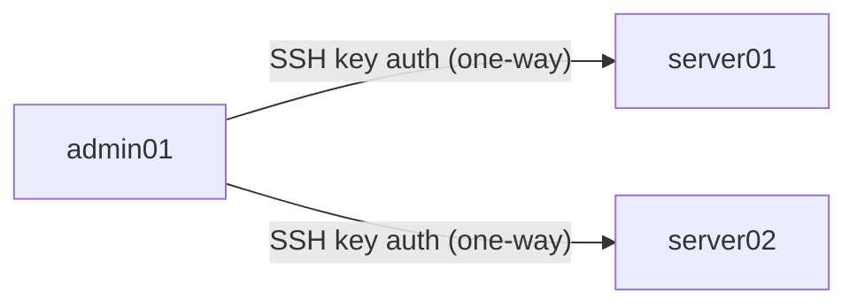
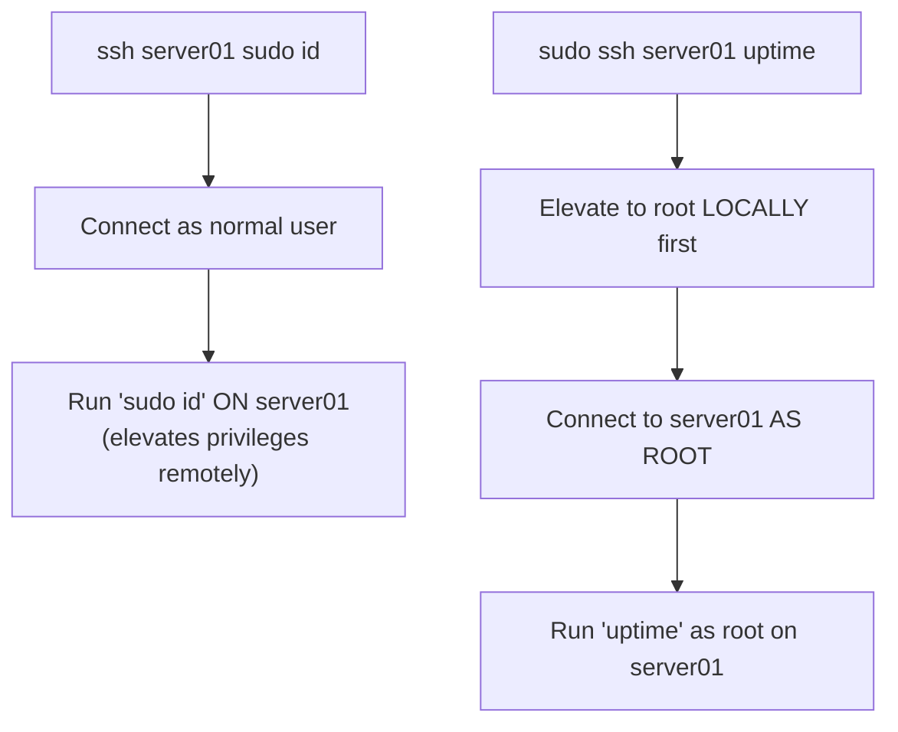

# Multi-Machine Networks, SSH Key Authentication, and Remote Command Execution

## Goal of This Lesson

In this lesson, we build a small simulated company network using three virtual machines — one administration server and two work servers — configure passwordless SSH authentication between them, and learn how to run commands remotely via SSH, including important details about exit statuses and `sudo`.

---

## 1. Planning the Network

We'll create three virtual machines:

| Name | Role |
|---|---|
| `admin01` | The main administration server — our "base of operations" |
| `server01` | A work server (web server, database server, etc.) |
| `server02` | Another work server |

This "one admin server, many work servers" pattern is very common in real infrastructure.

---

## 2. Setting Up the Vagrant Project

```bash
mkdir multinet
cd multinet
vagrant init BOX_NAME
```

### Editing the `Vagrantfile`

Below the `config.vm.box` line, define each machine as its own **stanza**:

```ruby
config.vm.define "admin01" do |admin01|
  admin01.vm.hostname = "admin01"
  admin01.vm.network "private_network", ip: "10.9.8.10"
end

config.vm.define "server01" do |server01|
  server01.vm.hostname = "server01"
  server01.vm.network "private_network", ip: "10.9.8.11"
end

config.vm.define "server02" do |server02|
  server02.vm.hostname = "server02"
  server02.vm.network "private_network", ip: "10.9.8.12"
end
```

Each stanza:

- Names the virtual machine (`admin01`, `server01`, `server02`).
- Sets its hostname.
- Assigns it a unique static IP address.

### Common Mistakes to Watch For

When copying and modifying stanzas like this, it's easy to introduce small errors:

- **Missing closing quote** on the IP address line.
- **Missing comma** between arguments.
- Using `IP` (capital) instead of `ip` (lowercase) — Ruby/Vagrant syntax is **exact**; nothing here is optional styling.
- **Forgetting to update the block variable name** (e.g., leaving `server01` inside the `server02` stanza after copy-pasting).
- **Missing the block variable prefix entirely** — writing `vm.hostname` instead of `server02.vm.hostname`.

> If `vagrant up` fails, or `vagrant status` shows machines not running, re-check the `Vagrantfile` carefully for these exact issues first.

---

## 3. Bringing Up the Network

### Syntax

```bash
vagrant up [MACHINE_NAME]
```

- With **no machine name**, Vagrant brings up **all** machines defined in the `Vagrantfile`.
- With a machine name, Vagrant brings up **only** that specific machine.

```bash
vagrant up
```

This starts all three machines (which takes a bit longer than starting just one).

### Checking Status

```bash
vagrant status
```

This should show all three machines as `running`.

---

## 4. Connecting to a Specific Machine

With only one VM, `vagrant ssh` connects automatically. With **multiple** machines, you must specify which one:

```bash
vagrant ssh admin01
```

---

## 5. Testing Network Connectivity

From inside `admin01`, check that the other machines respond:

```bash
ping -c 3 10.9.8.11
ping -c 3 10.9.8.12
```

| Option | Meaning |
|---|---|
| `-c N` | Send exactly `N` packets, then stop |

Both should report **0% packet loss**, confirming network connectivity between all three machines.

---

## 6. Resolving Hostnames With `/etc/hosts`

By default, name resolution checks `/etc/hosts` **first**, and only queries DNS if no matching entry is found there. Since setting up a full DNS server is outside the scope of this lesson, we'll just add entries directly to `/etc/hosts`.

### The File Format

```
IP_ADDRESS   HOSTNAME   [ALIAS...]
```

### Appending Entries as a Regular User: `tee -a`

Since we're a regular user (not root), we can't directly redirect into `/etc/hosts`. The `tee` command helps here.

#### Syntax

```bash
COMMAND | sudo tee -a FILE
```

`tee` reads from standard input and writes that data **both** to standard output **and** to a file.

| Option | Meaning |
|---|---|
| `-a` | Append to the file, instead of overwriting it |

### Example

```bash
echo "10.9.8.11 server01" | sudo tee -a /etc/hosts
echo "10.9.8.12 server02" | sudo tee -a /etc/hosts
```

```bash
cat /etc/hosts
```

Both new lines now appear at the bottom of the file.

### Why Not Just Use `sudo echo ... >> file`?

```bash
sudo echo test >> /etc/hosts
```

```
-bash: /etc/hosts: Permission denied
```

**Why this fails:** `sudo` only elevates privileges for the `echo` command itself. The **redirection** (`>>`) is still performed by your **regular shell**, running as your normal user — not as root. Since your regular user can't write to `/etc/hosts`, the redirection fails, even though `echo` itself technically ran as root.

> **This is exactly why `tee -a` combined with `sudo` is the standard workaround** — it lets you append to a protected file from the command line without opening an editor or switching to the root user entirely.

### Verifying Name Resolution Works

```bash
ping -c 3 server01
```

```bash
ping -c 1 server02
```

Both should resolve correctly to their respective IP addresses (`10.9.8.11` and `10.9.8.12`), confirming `/etc/hosts` is working.

---

## 7. Setting Up Passwordless SSH Authentication

We want to run commands on `server01` and `server02` from `admin01`, **without** being prompted for a password each time.

### Step 1: Generate an SSH Key Pair

```bash
ssh-keygen
```

Accept the default file location and press Enter without a passphrase (for this demo setup, where convenience matters more than extra security).

### Step 2: Copy the Public Key to Each Server

#### Syntax

```bash
ssh-copy-id HOSTNAME
```

```bash
ssh-copy-id server01
```

- You'll be asked to confirm the remote host's fingerprint (type `yes`).
- You'll be prompted for the account's password (in this practice environment, `vagrant`).
- Once done, your public key is installed on `server01`, enabling passwordless login.

Repeat for the second server:

```bash
ssh-copy-id server02
```

### Verifying Passwordless Login

```bash
ssh server01
```

Your shell prompt should change to reflect you're now on `server01`, with **no password prompt**.

```bash
exit
```

Returns you back to `admin01`.



> **Important:** This relationship is **one-way**. `admin01` can SSH into `server01` and `server02` without a password, but **not** the other way around — that would require its own separate key setup, in reverse. This one-way design is a common and deliberate practice, keeping a single designated admin server in control.

---

## 8. Running Commands Remotely via SSH

### Syntax

```bash
ssh HOSTNAME [COMMAND]
```

If you supply a command after the hostname, SSH connects, runs that command, displays its output, and then **disconnects** — without giving you an interactive shell.

### Example

```bash
ssh server01 hostname
```

Output:

```
server01
```

This confirms the command ran remotely, then the connection closed automatically.

### Looping Over Multiple Servers

```bash
for N in 1 2; do
  ssh server0${N} hostname
done
```

- On the first pass, `N` is `1`, so `server0${N}` expands to `server01`.
- On the second pass, `N` is `2`, so it expands to `server02`.
- Each time, the `hostname` command runs on the respective remote server.

### Using a File of Server Names

```bash
cd /vagrant
echo "server01" > servers
echo "server02" >> servers
cat servers
```

```bash
for SERVER in $(cat servers); do
  ssh "${SERVER}" hostname
  ssh "${SERVER}" uptime
done
```

- `$(cat servers)` uses **command substitution** — it takes the output of `cat servers` and substitutes it directly into the `for` loop's word list, effectively making the loop equivalent to `for SERVER in server01 server02`.
- For each server, this runs **two** separate remote commands: `hostname` and then `uptime`.

---

## 9. A Critical Gotcha: Quoting Multiple Commands

### The Problem

```bash
ssh server01 hostname ; hostname
```

You might expect **both** `hostname` commands to run on `server01`. But that's **not** what happens.

**What actually happens:**

- The **semicolon** (`;`) is interpreted by your **local shell** as a command separator, **before** SSH even runs.
- So `ssh server01 hostname` runs first (remotely, on `server01`).
- Then `; hostname` runs as a **completely separate command**, executed **locally** on `admin01`.

Testing this confirms it:

```
server01      <- from the remote ssh command
admin01       <- from the local hostname command
```

### The Fix: Wrap Everything in Quotes

```bash
ssh server01 "hostname ; hostname"
```

By putting the entire command string in quotes, the **whole thing** — semicolon and all — is passed to SSH as a **single argument**, which is then interpreted and executed entirely on the **remote** system.

> **Rule of thumb:** If you want everything on the command line (semicolons, pipes, etc.) to execute **remotely**, wrap it all in quotes.

### Using Variables in Remote Commands

Normal shell expansion rules apply — to have local variables expanded **before** being sent to the remote system, use **double quotes**:

```bash
CMD1="hostname"
CMD2="uptime"
ssh server01 "${CMD1} ; ${CMD2}"
```

Since double quotes allow variable expansion, `${CMD1}` and `${CMD2}` are replaced with their values (`hostname` and `uptime`) **before** the resulting string is sent to SSH and executed remotely.

---

## 10. Where a Piped Command Actually Runs

```bash
ssh server01 "ps -ef | head -3"
```

Because everything is inside quotes, **both** `ps -ef` **and** `head -3` run **remotely** on `server01`.

Compare this to:

```bash
ssh server01 ps -ef | head -3
```

Here, only `ps -ef` runs remotely on `server01`. The `head -3` command runs **locally** on `admin01`, processing the output *after* it's already been sent back over SSH. In this particular case, the visible result looks the same either way — but it's an important distinction to understand, especially for commands with side effects or heavier processing.

---

## 11. Understanding SSH Exit Statuses

### The Rule

> SSH exits with the exit status of the **last command executed remotely**, or **255** if an error occurred with SSH itself (e.g., the host couldn't be reached).

This is documented in the man page:

```bash
man ssh
```

### Demonstrating a Connection Error

```bash
ssh server03 uptime
```

```
ssh: Could not resolve hostname server03: Name or service not known
```

```bash
echo $?
```

```
255
```

**255 specifically signals an SSH-level failure** — like a hostname that can't be resolved — rather than an error from the remote command itself.

### Demonstrating a Successful Remote Command's Exit Status

```bash
ssh server02 uptime
echo $?
```

```
0
```

This `0` is the exit status **returned by `uptime`** on the remote system, passed back through SSH.

> **Practical use:** In a script, you can check specifically for exit status `255` to distinguish "SSH itself failed" from "the remote command failed" — two very different problems that call for different handling.

---

## 12. Exit Statuses With Multiple Remote Commands

Recall `true` (always returns `0`) and `false` (always returns `1`).

### Example: Piping Remotely

```bash
ssh server01 "false | true"
echo $?
```

```
0
```

Since `true` is the **last** command in the pipeline, and it always succeeds, the overall exit status is `0` — even though `false` (which "failed") ran earlier in the same pipeline.

### Example: Sequential Commands

```bash
ssh server01 "true ; false"
echo $?
```

```
1
```

Here, `false` is the last command executed, so its exit status (`1`) becomes the overall result.

### Capturing Failures Anywhere in a Pipeline: `pipefail`

If you want the exit status to reflect **any** failure in a pipeline — not just the last command — enable Bash's `pipefail` option:

```bash
help set
```

> With `pipefail` enabled, the exit status of a pipeline is the exit status of the **last command to exit with a non-zero status**, or `0` if every command in the pipeline succeeded.

```bash
ssh server01 "set -o pipefail; false | true"
echo $?
```

```
1
```

Now, even though `true` (the last command) succeeded, the pipeline's overall exit status correctly reflects that `false` failed somewhere along the way.

---

## 13. Writing a Script to Check Server Availability

**Goal:** Loop through a list of servers and report whether each one responds to a single ping.

```bash
#!/bin/bash
# This script checks whether each server listed in SERVER_FILE is reachable via ping.

SERVER_FILE="servers"

if [[ ! -e "${SERVER_FILE}" ]]; then
  echo "Cannot open ${SERVER_FILE}" >&2
  exit 1
fi

for SERVER in $(cat "${SERVER_FILE}"); do
  ping -c 1 "${SERVER}" &> /dev/null

  if [[ "${?}" -ne 0 ]]; then
    echo "${SERVER} is down"
  else
    echo "${SERVER} is up"
  fi
done
```

### Explaining the Script

- **`[[ ! -e "${SERVER_FILE}" ]]`** — verifies the server list file actually exists before trying to loop through it.
- **`ping -c 1 "${SERVER}" &> /dev/null`** — sends a single ping and discards **all** output (both standard output and standard error), since we only care about the **exit status**, not the ping's actual text output.
- **`if [[ "${?}" -ne 0 ]]`** — if the exit status is non-zero, the ping failed, and we report the server as "down"; otherwise, we report it as "up."

> **Important caveat:** In the real world, a failed ping does **not necessarily** mean a server is down. It could also mean a firewall is blocking ping traffic, among other possibilities. This script uses a simplified assumption for demonstration purposes — it reports what it *observes* via ping, which isn't always a perfectly accurate reflection of the server's true status.

> **Design note:** The script checks `-ne 0` (not equal to zero) to decide "down." You could just as easily flip the logic and check `-eq 0` to decide "up" first, with an `else` for "down" — both approaches work; pick whichever reads more naturally to you.

### Testing

```bash
chmod 755 multinet-demo01.sh
./multinet-demo01.sh
```

```
server01 is up
server02 is up
```

### Testing With a Server Down

From your **local physical machine** (not inside any VM):

```bash
vagrant halt server02
```

> **Note:** Running `vagrant halt` **without** specifying a machine name would halt **all** machines defined in the `Vagrantfile` — so it's important to specify `server02` here.

Reconnect and re-run the script:

```bash
vagrant ssh admin01
cd /vagrant
./multinet-demo01.sh
```

```
server01 is up
server02 is down
```

The script correctly detects that `server02` no longer responds (after a brief delay while the ping attempt times out).

---

## 14. A Critical `sudo` + SSH Distinction

### Scenario 1: `sudo` on the Remote System

```bash
ssh server01 sudo id
```

**What happens:**

1. SSH connects to `server01` as the **current local user** (e.g., `vagrant`).
2. Once connected, `sudo id` runs **on server01**, elevating privileges **there**.
3. The result reflects root's identity **on server01**.

### Scenario 2: `sudo` on the Local System (Before SSH Even Runs)

```bash
sudo ssh server01 uptime
```

**What happens:**

1. `sudo` elevates the **local** `ssh` command to run as **root**, on `admin01`.
2. SSH then connects to `server01` — but now, **as the root user**, not as `vagrant`.
3. This is effectively the same as running `ssh root@server01 uptime`.



### Why This Matters

- In Scenario 2, you'll be prompted for **`server01`'s root password**, since you're now trying to log in there **as root** — a completely different authentication path than logging in as `vagrant` and using `sudo` once connected.
- To make Scenario 2 passwordless, you'd need to generate **separate SSH keys for the root user** and copy them to the destination server, just like was done earlier for the `vagrant` user.
- **Some systems disable direct root SSH logins entirely** as a security measure. In those cases, you **must** connect as a regular user first, then use `sudo` **after** connecting (Scenario 1) — Scenario 2 simply won't work at all on such systems.

> **Key takeaway:** `ssh HOST sudo COMMAND` and `sudo ssh HOST COMMAND` look superficially similar, but they authenticate as **completely different users** and behave very differently depending on the remote system's SSH configuration.

---

## Anti-Patterns to Avoid

- **Don't** run `vagrant up` or `vagrant halt` without specifying a machine name if you only want to affect one machine in a multi-machine setup — without a name, the command applies to **all** defined machines.
- **Don't** use `sudo echo ... >> file` expecting it to bypass permission restrictions — the redirection itself still runs as your regular user. Use `... | sudo tee -a file` instead.
- **Don't** assume a multi-command SSH invocation like `ssh host cmd1 ; cmd2` runs both commands remotely — without quotes, only the first command runs remotely, and anything after an unquoted separator runs **locally**.
- **Don't** assume a failed ping definitively means a server is "down" — firewalls and other network configurations can also block ping traffic while the server itself is perfectly healthy.
- **Don't** confuse `ssh host sudo command` (elevates privileges remotely) with `sudo ssh host command` (elevates privileges locally, then connects as root) — they behave very differently and require different authentication setups.
- **Don't** forget that a pipeline's default exit status reflects only the **last** command — enable `pipefail` if you need to detect a failure anywhere in the pipeline.

---

## Quick Reference Table

| Command | Purpose |
|---|---|
| `vagrant up [NAME]` | Start all machines, or just the named one |
| `vagrant status` | Show the running/stopped status of all defined machines |
| `vagrant ssh NAME` | Connect to a specific machine in a multi-machine setup |
| `vagrant halt NAME` | Stop a specific machine (omit `NAME` to stop all) |
| `ssh-keygen` | Generate a new SSH key pair |
| `ssh-copy-id HOST` | Copy your public key to a remote host, enabling passwordless login |
| `ssh HOST COMMAND` | Run `COMMAND` on `HOST` remotely, then disconnect |
| `ssh HOST "cmd1 ; cmd2"` | Run multiple commands, all remotely (quotes are essential) |
| `echo DATA \| sudo tee -a FILE` | Append `DATA` to a protected file as root, from a normal user shell |
| `$(cat FILE)` | Command substitution — use a file's contents as a word list, e.g. in a `for` loop |
| SSH exit status `255` | Indicates an SSH-level error (e.g., host unreachable) |
| SSH exit status (other) | The exit status of the last command executed remotely |
| `set -o pipefail` | Makes a pipeline's exit status reflect any failing command, not just the last one |
| `ssh HOST sudo CMD` | Connect as normal user, elevate privileges remotely |
| `sudo ssh HOST CMD` | Elevate privileges locally first, connect to `HOST` as root |

---

## Practice Questions

**Q1: What happens if you run `vagrant up` without specifying a machine name in a multi-machine `Vagrantfile`?**
A: It starts **all** the virtual machines defined in the `Vagrantfile`, not just one.

**Q2: Why does `sudo echo "text" >> /etc/hosts` fail with "Permission denied," even though `sudo` was used?**
A: Because `sudo` only elevates the `echo` command itself — the output redirection (`>>`) is still performed by the regular (non-root) shell, which lacks write permission to `/etc/hosts`.

**Q3: What command correctly appends text to a protected file like `/etc/hosts` as a regular user?**
A: `echo "text" | sudo tee -a /etc/hosts` — this runs `tee` (which does the actual file writing) as root via `sudo`.

**Q4: What does `ssh-copy-id HOSTNAME` do?**
A: It copies your local public SSH key to the specified remote host, enabling passwordless SSH login to that host afterward.

**Q5: Why does `ssh server01 hostname ; hostname` NOT run both `hostname` commands remotely?**
A: Because the unquoted semicolon is interpreted by the **local** shell as a command separator before SSH even executes — so only the first `hostname` runs remotely; the second runs locally.

**Q6: What exit status does SSH return if it fails to resolve or connect to a remote host?**
A: `255`.

**Q7: If you run `ssh host "cmd1 | cmd2"`, and only `cmd2` fails, what exit status does SSH normally return, and why?**
A: `0`, the exit status of `cmd2` (the last command in the pipeline) — since by default, a pipeline's exit status reflects only its final command, not any earlier failures.

**Q8: How can you make a pipeline's exit status reflect a failure that happened anywhere in the pipeline, not just the last command?**
A: Enable the `pipefail` shell option with `set -o pipefail` before running the pipeline.

**Q9: What is the key difference between `ssh server01 sudo id` and `sudo ssh server01 id`?**
A: The first connects to `server01` as the normal user and then elevates privileges **remotely**. The second elevates privileges **locally** first, then connects to `server01` **as the root user** — a completely different authentication path, requiring root's own credentials or SSH keys on the remote system.

**Q10: Why might `sudo ssh HOST COMMAND` fail entirely on some systems, even with the correct root password?**
A: Because some systems are configured to disallow direct root SSH logins altogether, in which case you must connect as a regular user and use `sudo` after connecting instead.