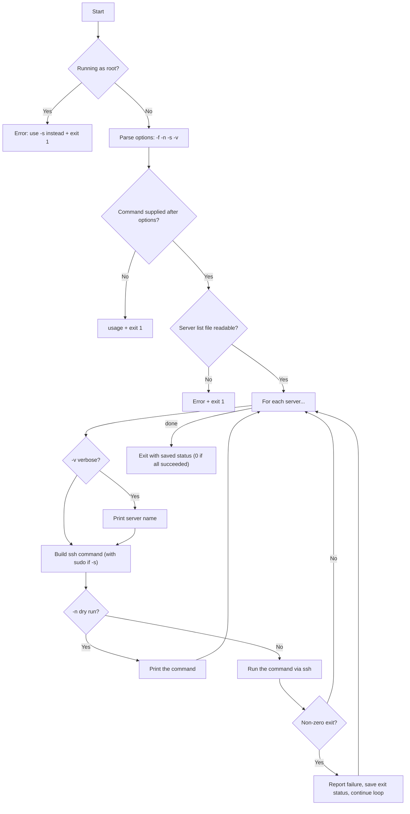

# Building `run-everywhere.sh`: Running Commands Across Multiple Servers

## Goal of This Lesson

In this lesson, we build `run-everywhere.sh` — a script that executes a single command across an entire list of servers via SSH. It supports a custom server list, a dry-run mode, sudo execution, and verbose output, and it's designed to be run as a **normal user**, not root.

---

## 1. Planning: The Requirements

- **Script name:** `run-everywhere.sh`
- Executes all arguments as a **single command** on every server listed in a file.
- The default server list is `/vagrant/servers`.
- The provided command runs **as the user executing the script** — never as root directly. If root privileges are needed remotely, that's handled through a dedicated option instead.
- Uses an SSH **connection timeout** so a single unreachable server doesn't stall the whole script for a minute or two.
- Supports these options:

  | Option | Meaning |
  |---|---|
  | `-f FILE` | Use `FILE` instead of the default server list |
  | `-n` | **Dry run** — display the commands that *would* run, without executing them |
  | `-s` | Run the remote command with **sudo** (superuser privileges) |
  | `-v` | **Verbose** — print which server a command is about to run on |

- If the script is run with **root privileges**, refuse and tell the user to use `-s` instead.
- Provide a **usage statement**, like a mini man page.
- If a command fails on any remote host, tell the user, but **keep going** — don't stop the whole run just because one server failed.
- Exit with status `0` if everything succeeded, or with the most recent **non-zero exit status** from `ssh` if something failed.



---

## 2. Setting Up the Network (Recap)

This script is built and tested on the same three-machine setup from the previous lesson: `admin01`, `server01`, and `server02`, created via a `Vagrantfile` with three `config.vm.define` stanzas.

```bash
cd shellclass
mkdir multinet
cd multinet
vagrant init BOX_NAME
```

After editing the `Vagrantfile` to define all three machines with their hostnames and IPs:

```bash
vagrant up
vagrant status
```

Confirm all three machines show as `running`, then connect to the admin server:

```bash
vagrant ssh admin01
cd /vagrant
```

All script development happens here, from `admin01`.

---

## 3. Setting Up Variables at the Top of the Script

```bash
#!/bin/bash
# This script executes a single command on every server listed in a file.

SERVER_LIST=/vagrant/servers
SSH_OPTIONS="-o ConnectTimeout=2"
```

### Explaining These Choices

- **`SERVER_LIST`** — the default path to the server list file, kept as a variable so it's easy to change in one place later.
- **`SSH_OPTIONS`** — configures SSH's **connection timeout**.

  ```bash
  ssh -o ConnectTimeout=SECONDS HOST COMMAND
  ```

  By default, if a server is down or unreachable, `ssh` can take a **minute or two** before giving up. Many network commands (`ping`, `ssh`, and similar tools) provide a way to control this timeout — for `ssh`, that's the `-o ConnectTimeout=` option. Here, it's set to **2 seconds**, which is reasonable for a quick internal network check; you could use a longer duration if your network conditions call for it.

  > **Why put this at the top of the script?** Settings like this may need adjusting over time as your network or requirements change. Keeping them as variables near the top — rather than buried in the middle of the script — makes future tuning much easier.

---

## 4. Refusing to Run as Root

```bash
if [[ "${UID}" -eq 0 ]]; then
  echo "Do not run this script with sudo or as root. Use the -s option instead." >&2
  usage
fi
```

This check ensures the script is run as a **normal user**, so that person's own SSH key setup and identity are used for the connection — with any need for elevated remote privileges handled explicitly through `-s`, not by running the whole script as root.

---

## 5. The `usage` Function

Since we'll need a usage/help message in more than one place in the script, it's built as a function early on.

```bash
usage() {
  echo "Usage: ${0} [-f FILE] [-n] [-s] [-v] COMMAND" >&2
  echo "  -f FILE   Use FILE instead of the default server list (${SERVER_LIST})"
  echo "  -n        Dry run — show commands without executing them"
  echo "  -s        Run the command with sudo on the remote server"
  echo "  -v        Verbose — display the server name before running the command"
  exit 1
}
```

> **Design note:** Whatever the user supplies **after** the options is treated as a **single command**. If they need to run multiple commands, they simply wrap them in quotation marks so the entire string is passed through as one argument — the script itself doesn't do anything fancier than that.

---

## 6. Parsing Options With `getopts`

```bash
while getopts f:nsv OPTION; do
  case "${OPTION}" in
    f)
      SERVER_LIST="${OPTARG}"
      ;;
    n)
      DRY_RUN=true
      ;;
    s)
      SUDO="sudo"
      ;;
    v)
      VERBOSE=true
      ;;
    ?)
      usage
      ;;
  esac
done

shift "$((OPTIND - 1))"
```

### Explaining Each Option

- **`f:nsv`** — the optstring. The colon after `f` means `-f` **requires** an argument; `n`, `s`, and `v` do not.
- **`-f`** — overrides `SERVER_LIST` with the user-supplied path (`${OPTARG}`).
- **`-n`** — sets `DRY_RUN=true`, checked later before actually executing anything.
- **`-s`** — sets `SUDO="sudo"` — a small but clever design choice explained below.
- **`-v`** — sets `VERBOSE=true`, checked later before printing extra status information.
- **`?`** — any unrecognized option triggers the `usage` function.

### Why `SUDO="sudo"` Instead of `SUDO=true`?

By storing the literal **word** `"sudo"` in the variable (rather than `true`/`false`), we can later just **drop the variable directly into the SSH command**:

```bash
ssh ... ${SUDO} COMMAND
```

- If `-s` was given, `${SUDO}` expands to `sudo`, so the remote command becomes `sudo COMMAND`.
- If `-s` was **not** given, `${SUDO}` is empty, so nothing is inserted, and the command runs normally.

> This avoids needing a separate `if` check to decide whether to add `sudo` at execution time — the empty-string behavior handles it automatically. (This is the same pattern used for the `-R` option in the earlier `disable-local-user.sh` script.) An alternative would be to set `SUDO=true` and check it explicitly later with an `if` statement — either approach works, as long as it functions correctly.

---

## 7. Requiring a Command After the Options

```bash
if [[ "${#}" -lt 1 ]]; then
  usage
fi

COMMAND="${@}"
```

After `shift` removes the processed options, whatever remains **is** the command to run. If nothing is left, the user didn't supply a command at all, so we show them the usage message and exit.

---

## 8. Validating the Server List File

```bash
if [[ ! -e "${SERVER_LIST}" ]]; then
  echo "Cannot open server list: ${SERVER_LIST}" >&2
  exit 1
fi
```

Since `-f` lets the user override the server list with **any** path they want, we can't assume it's valid — we need to confirm the file actually exists (and, by extension, can be read) before looping through it. The error message is sent to **standard error**, since it represents a failure condition, and the script exits with a non-zero status.

---

## 9. Setting Up the Exit Status Strategy

```bash
EXIT_STATUS=0
```

### The Strategy

> "Expect the best, but prepare for the worst."

- The script **assumes success** by default, starting with `EXIT_STATUS=0`.
- As the script runs commands on each server, **any** non-zero exit status from `ssh` will **overwrite** this variable.
- At the very end, the script exits using whatever `EXIT_STATUS` ends up holding — `0` if every single server succeeded, or the **most recent** failing exit status if one or more servers had a problem.

This satisfies the requirement that the script must not silently exit with `0` if something actually went wrong along the way.

---

## 10. Looping Through the Server List

```bash
for SERVER in $(cat "${SERVER_LIST}"); do

  if [[ "${VERBOSE}" == true ]]; then
    echo "Executing command on ${SERVER}"
  fi
```

- **`$(cat "${SERVER_LIST}")`** — command substitution reads the file's contents and feeds each line as a separate word into the `for` loop, so `SERVER` takes on each hostname in turn.
- **Verbose check** — if `-v` was supplied, print which server is about to receive the command, **before** actually running it. This is helpful for making sense of output when running commands that produce their own text, so you know which server each chunk of output belongs to.

---

## 11. Building the SSH Command

```bash
  SSH_COMMAND="ssh ${SSH_OPTIONS} ${SERVER} ${SUDO} ${COMMAND}"
```

### Why Build This as a Variable Instead of Running It Directly

This exact command string is needed in **two different situations**:

1. If it's a **dry run** (`-n`), we just want to **display** it.
2. Otherwise, we want to **execute** it.

Rather than writing the same long command out twice (once to `echo` and once to actually run), we build it **once** into `SSH_COMMAND`, and then decide what to do with that variable — a small but meaningful application of the **DRY principle** ("Don't Repeat Yourself").

### Breaking Down the Command

- `ssh` — the base command.
- `${SSH_OPTIONS}` — inserts our `-o ConnectTimeout=2` setting.
- `${SERVER}` — the current server from the loop.
- `${SUDO}` — either `sudo` or empty, depending on whether `-s` was used.
- `${COMMAND}` — the actual command the user wants to run remotely.

---

## 12. Executing (or Displaying) the Command

```bash
  if [[ "${DRY_RUN}" == true ]]; then
    echo "DRYRUN: ${SSH_COMMAND}"
  else
    ${SSH_COMMAND}
    SSH_EXIT_STATUS="${?}"

    if [[ "${SSH_EXIT_STATUS}" -ne 0 ]]; then
      EXIT_STATUS="${SSH_EXIT_STATUS}"
      echo "Execution failed on ${SERVER}" >&2
    fi
  fi

done

exit "${EXIT_STATUS}"
```

### Explaining Each Part

- **Dry run branch:** If `-n` was supplied, the built command is simply **printed** with a `DRYRUN:` prefix, so the user can review exactly what would happen without actually running anything.
- **Live execution branch:**
  - `${SSH_COMMAND}` — the command is actually run.
  - `SSH_EXIT_STATUS="${?}"` — its exit status is immediately captured.
  - If that status is **non-zero**, the script:
    - Overwrites `EXIT_STATUS` with this failing value (fulfilling the "prepare for the worst" strategy from earlier).
    - Reports which server the failure occurred on, sent to standard error.

### An Intentional Design Choice: Don't Stop on the First Failure

Notice that the script does **not** `exit` immediately when a server fails. This is deliberate.

> **Why keep going?** Imagine running this against a list of 100 servers, and server #3 fails. If the script stopped immediately, you'd be left wondering which of the remaining 97 servers the command *did* or *didn't* run on — forcing you to manually figure out where to resume, or build a new, adjusted server list to avoid re-running commands that already succeeded elsewhere. By continuing through the **entire** list regardless of individual failures, the script gives you a complete picture: exactly which servers succeeded and which ones failed, all in a single run.

> **Possible enhancement:** If you wanted the option to stop immediately on the first failure, you could add another flag — say, `-e` for "exit on error" — check for it here, and `exit` right away if it was set. This is left as a natural extension for anyone who wants that stricter behavior as an option.

---

## 13. Debugging Before First Execution

Before running a script this size for the first time, it helps to scan through it looking for common mistakes:

- **Mismatched quotes** — starting with a single quote (`'`) but accidentally closing with a double quote (`"`), or forgetting a closing quote entirely.
- **Unbalanced brackets** — every opening `[[` should have a matching closing `]]`.
- **Variable references not wrapped in quotes** — e.g., using `"${VARIABLE}"` (with double quotes) wherever expansion is needed, rather than leaving a variable unquoted and vulnerable to unexpected word-splitting.
- **Misplaced `$`** — a common typo is writing something like `$"{VAR}"` instead of the correct `"${VAR}"` — putting the dollar sign **outside** the quotes instead of right before the brace.
- **Spaces around `=` in variable assignments** — `VAR = value` is invalid; it must be `VAR=value`, with no spaces.

> **A practical mindset:** When working on a test/practice system (like these Vagrant VMs), it's perfectly fine to just run the script and fix errors as they appear — you're not going to break a production system or wake anyone up in the middle of the night. Still, taking an extra minute to scan through the script from top to bottom before the first run often catches several small mistakes — like missing closing quotes — before you even have to run it once.

---

## 14. The Complete Script

```bash
#!/bin/bash
# This script executes a single command on every server listed in a file.

SERVER_LIST=/vagrant/servers
SSH_OPTIONS="-o ConnectTimeout=2"

usage() {
  echo "Usage: ${0} [-f FILE] [-n] [-s] [-v] COMMAND" >&2
  echo "  -f FILE   Use FILE instead of the default server list (${SERVER_LIST})"
  echo "  -n        Dry run — show commands without executing them"
  echo "  -s        Run the command with sudo on the remote server"
  echo "  -v        Verbose — display the server name before running the command"
  exit 1
}

if [[ "${UID}" -eq 0 ]]; then
  echo "Do not run this script with sudo or as root. Use the -s option instead." >&2
  usage
fi

while getopts f:nsv OPTION; do
  case "${OPTION}" in
    f)
      SERVER_LIST="${OPTARG}"
      ;;
    n)
      DRY_RUN=true
      ;;
    s)
      SUDO="sudo"
      ;;
    v)
      VERBOSE=true
      ;;
    ?)
      usage
      ;;
  esac
done

shift "$((OPTIND - 1))"

if [[ "${#}" -lt 1 ]]; then
  usage
fi

COMMAND="${@}"

if [[ ! -e "${SERVER_LIST}" ]]; then
  echo "Cannot open server list: ${SERVER_LIST}" >&2
  exit 1
fi

EXIT_STATUS=0

for SERVER in $(cat "${SERVER_LIST}"); do

  if [[ "${VERBOSE}" == true ]]; then
    echo "Executing command on ${SERVER}"
  fi

  SSH_COMMAND="ssh ${SSH_OPTIONS} ${SERVER} ${SUDO} ${COMMAND}"

  if [[ "${DRY_RUN}" == true ]]; then
    echo "DRYRUN: ${SSH_COMMAND}"
  else
    ${SSH_COMMAND}
    SSH_EXIT_STATUS="${?}"

    if [[ "${SSH_EXIT_STATUS}" -ne 0 ]]; then
      EXIT_STATUS="${SSH_EXIT_STATUS}"
      echo "Execution failed on ${SERVER}" >&2
    fi
  fi

done

exit "${EXIT_STATUS}"
```

---

## 15. Example Usage (For Reference)

```bash
chmod 755 run-everywhere.sh
```

**Basic usage — run `hostname` on every server in the default list:**

```bash
./run-everywhere.sh hostname
```

**Dry run — see what would be executed, without running anything:**

```bash
./run-everywhere.sh -n uptime
```

**Verbose mode — see which server each result belongs to:**

```bash
./run-everywhere.sh -v uptime
```

**Using sudo on the remote systems:**

```bash
./run-everywhere.sh -s "cat /etc/shadow"
```

**Using a custom server list:**

```bash
./run-everywhere.sh -f /vagrant/webservers "systemctl status httpd"
```

**Combining multiple options:**

```bash
./run-everywhere.sh -v -s -f /vagrant/webservers "systemctl restart httpd"
```

**Running the script as root (should be refused):**

```bash
sudo ./run-everywhere.sh hostname
```

```
Do not run this script with sudo or as root. Use the -s option instead.
Usage: ./run-everywhere.sh [-f FILE] [-n] [-s] [-v] COMMAND
...
```

---

## Anti-Patterns to Avoid

- **Don't** run administrative automation scripts like this one as root by default — let the script use each user's own identity and SSH keys, and provide a dedicated `-s`-style option for cases that genuinely need elevated remote privileges.
- **Don't** rely on SSH's default connection timeout when scripting against many servers — an unreachable host can otherwise stall the whole script for a minute or more. Use `-o ConnectTimeout=` to bound this.
- **Don't** build the same long command string twice (once for a dry-run echo, once for actual execution) — store it in a variable once, and reuse it both ways.
- **Don't** immediately `exit` a multi-server loop the moment one server fails — unless that's specifically what you want. Continuing through the full list often gives a more useful, complete picture of what succeeded and what didn't.
- **Don't** hardcode timeout values or default file paths scattered throughout a script — define them once as variables near the top, so future adjustments are simple and low-risk.

---

## Quick Reference Table

| Concept | Purpose |
|---|---|
| `-o ConnectTimeout=N` | Limits how long `ssh` waits before giving up on an unreachable host |
| `${UID} -eq 0` | Detects if the script is being run as root |
| `getopts f:nsv OPTION` | Parses `-f FILE`, `-n`, `-s`, `-v` |
| `SUDO="sudo"` (or empty) | Conditionally inserts `sudo` into a command without a separate `if` check |
| `$(cat "${SERVER_LIST}")` | Reads server names from a file into a `for` loop |
| `SSH_COMMAND="..."` | Builds a command once, for reuse in both dry-run display and actual execution |
| `EXIT_STATUS=0` (then overwritten on failure) | "Expect the best, prepare for the worst" pattern for tracking overall success/failure across a loop |
| Continue instead of `exit` on a per-server failure | Ensures the script reports on **every** server, not just up to the first failure |

---

## Practice Questions

**Q1: Why does the script refuse to run if it's executed with root privileges?**
A: So that the person running it uses their own identity and SSH key setup for the connection, with elevated remote privileges handled explicitly and traceably through the `-s` option instead of running the entire script as root.

**Q2: What problem does `-o ConnectTimeout=2` solve?**
A: It prevents `ssh` from waiting a long time (potentially a minute or more) on an unreachable server before giving up, which would otherwise slow down the whole script significantly when scanning many servers.

**Q3: Why is `SUDO` set to the literal string `"sudo"` rather than `true`/`false`?**
A: So it can be dropped directly into the built SSH command string — if `-s` wasn't used, the variable is empty and contributes nothing, avoiding the need for a separate conditional check when constructing the command.

**Q4: Why is the SSH command built into a variable (`SSH_COMMAND`) instead of being written out twice in the script?**
A: Because the exact same command is needed in two situations — displaying it for a dry run, or actually executing it — so building it once avoids repeating the same logic twice (the DRY principle).

**Q5: What does the `-n` (dry run) option do?**
A: It causes the script to display the command that *would* be executed on each server, without actually running it.

**Q6: Why does the script continue looping through all servers even after one fails, instead of stopping immediately?**
A: So the user gets a complete picture of which servers succeeded and which failed across the entire list, rather than having to guess how far the script got before stopping partway through.

**Q7: How does the script determine its final exit status?**
A: It starts with `EXIT_STATUS=0`, assuming success, and overwrites that variable with any non-zero SSH exit status encountered along the way — so the final exit status reflects whether any server failed.

**Q8: What happens if the user runs the script without supplying a command at all?**
A: After processing options, the script checks if any arguments remain (`${#} -lt 1`); if none are left, it displays the usage message and exits.

**Q9: What does the `-f` option allow the user to do?**
A: Override the default server list file (`/vagrant/servers`) with a custom file path of their choosing.

**Q10: Why must a user wrap multiple remote commands in quotation marks when using this script (e.g., `"cmd1 ; cmd2"`)?**
A: Because the script treats everything after the parsed options as a single command argument passed to SSH; quoting ensures the entire multi-command string is sent to and interpreted on the remote system, rather than being split apart by the local shell.